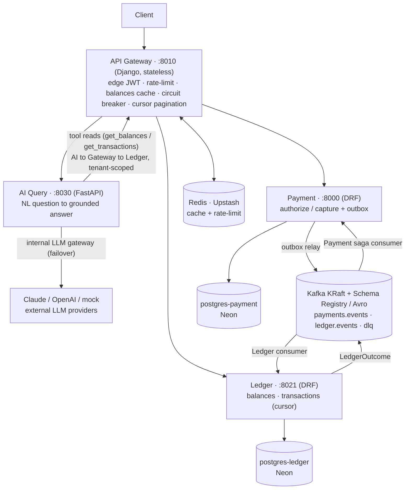

# Ledgerstream — Design Document

> A multi-tenant payment + double-entry ledger platform with an AI query layer,
> built as independently deployable services communicating over Kafka.
>
> This document is the single source of truth for **why** the system is shaped
> the way it is. It is updated at the end of every phase. Read it top-to-bottom
> to defend any decision in an interview.

**Status:** Phase 6 complete (AI Query service — the one **FastAPI** service: edge JWT +
a **multi-provider LLM gateway** (Claude / OpenAI / mock, with failover + per-provider
circuit breaker + token logging) that **grounds** answers via a provider-neutral
**tool-use loop** over two tenant-scoped read tools, with **guardrails** (tool allowlist,
server-side tenant scoping, prompt-injection defense, per-tenant LLM rate limit) and a
standalone **MCP server** exposing the same tools. 9 tests green, hermetic via the mock).

_(Prior — Phase 5: proof + seed + load — `seed` command, ledger-invariant property tests,
and a Locust load test through the gateway.)_

_(Prior — Phase 4: stateless API **gateway** fronting Payment/Ledger with edge JWT +
reverse proxy + four resilience patterns: token-bucket rate limiting, balances
cache-aside, per-service circuit breaker, cursor pagination. Gateway 12 tests; token
bucket verified live on Upstash.)_

_(Prior — Phase 3: saga hardening — Ledger emits `LedgerOutcome`(POSTED/REJECTED);
Payment saga consumer compensates a rejected payment to VOIDED, idempotent by state;
both consumers get retry+backoff → DLQ. Verified: GBP payment → rejected → VOIDED.)_

---

## Table of contents

1. [Requirements](#1-requirements)
2. [Back-of-envelope estimation](#2-back-of-envelope-estimation)
3. [Architecture overview](#3-architecture-overview)
4. [Per-service responsibilities](#4-per-service-responsibilities)
5. [Event contracts](#5-event-contracts)
6. [Data, consistency & CAP/PACELC](#6-data-consistency--cappacelc)
7. [Partitioning strategy](#7-partitioning-strategy)
8. [Necessity tiering (what's load-bearing vs demonstrative)](#8-necessity-tiering)
9. [Skills checklist](#9-skills-checklist)
10. [Trade-offs & what I'd change at 100× scale](#10-trade-offs--what-id-change-at-100x-scale)
11. [Deliberately left out](#11-deliberately-left-out)
12. [Phase log](#12-phase-log)

---

## 1. Requirements

### Functional
- Multiple tenants (merchants). A tenant owns accounts; every read/write is
  scoped to exactly one tenant.
- Accept a payment intent, **authorize** it, then **capture** it. Each step is
  idempotent under client retry.
- On capture, record the money movement in an **immutable double-entry ledger**
  (every transaction posts balanced debits and credits).
- Expose per-account **balances** and **transaction history** (paginated).
- Natural-language querying of a tenant's own transactions (later phase).

### Non-functional
- **Independent deployability**: each service owns its process, image, and
  database; no shared schema.
- **Event-driven**: services coordinate via Kafka events, not synchronous RPC,
  wherever a workflow tolerates asynchrony.
- **Correctness under failure**: at-least-once event delivery must not double-post
  the ledger; a failed post must not leave a captured-but-unrecorded payment.
- **Multi-tenant isolation**: tenant A can never read or write tenant B's data —
  enforced at the data layer and proven by test.
- **Observability from day one**: structured logs, metrics, and distributed
  traces correlated across services.
- **One-command local run**: `make up` brings up the whole system.

---

## 2. Back-of-envelope estimation

Numbers are illustrative targets that justify the architecture; they are not
what the local demo pushes.

**Assumptions**
- Target peak: **500 payments/sec**, average **200/sec**.
- Each captured payment emits **1 event** and produces **2 ledger rows**
  (one debit + one credit — double entry).
- Ledger row ≈ **256 bytes** (ids, amount, currency, timestamps, references).

**Throughput**
- Ledger write rate at peak: `500 pay/s × 2 rows = 1,000 rows/s`.
- Events on the payments topic at peak: `500 msg/s`.

**Storage growth (ledger, the append-only table)**
- Rows/day at average load: `200 × 2 × 86,400 ≈ 34.6M rows/day`.
- Bytes/day: `34.6M × 256B ≈ 8.85 GB/day` before indexes.
- Over a year: `~3.2 TB` of ledger rows.

**What the math tells us**
- A single Postgres table crossing the **billion-row** mark within a year is
  exactly the regime where table partitioning and archival start to matter →
  see §7. (At demo scale it does not — see §8, this is Tier 2.)
- 500 msg/s is trivial for one Kafka broker; partition count is driven by
  **consumer parallelism and ordering**, not raw throughput → see §7.

**Bandwidth**
- Peak event bandwidth ≈ `500 msg/s × ~1 KB ≈ 0.5 MB/s` — negligible; the
  interesting constraint is ordering/consistency, not pipe size.

---

## 3. Architecture overview

**Stateless (no DB):** the API Gateway and the AI Query service. **Two "gateways",
orthogonal:** the *API Gateway* fronts services; the *LLM gateway* (inside AI Query)
fronts LLM providers. **AI reads loop back through the API Gateway** (`AI → Gateway →
Ledger`), so they reuse its auth/rate-limit/cache/breaker. **Cross-cutting:** OTel
Collector → Jaeger + Prometheus, correlation-id across every hop. **Deferred:** the
Mongo read model (denormalized tx view) → its own future phase.

**The saga (Payment → Ledger), the heart of the MVP:**
1. Payment writes the business row **and** an outbox row in one DB transaction
   (`@transaction.atomic`) — this defeats the dual-write problem.
2. An **outbox relay worker** publishes `PaymentCaptured` to Kafka.
3. The **Ledger consumer** idempotently posts a balanced journal entry, then
   emits `LedgerPosted` / `LedgerRejected`.
4. Payment consumes that outcome; on rejection it runs a **compensating action**
   (void / mark-failed). That closes the saga.

---

## 4. Per-service responsibilities

| Service | Stack | Owns | Talks to |
|---|---|---|---|
| **API Gateway / BFF** | Django + DRF | AuthN (JWT), routing, per-key rate limiting, correlation-id origination | All services (REST) |
| **Payment** | Django + DRF | Payment lifecycle, idempotency keys, **outbox**, saga orchestration + compensation | own Postgres; Kafka (produce payments.events, consume ledger.events) |
| **Ledger** | Django + DRF | Immutable double-entry journal, balances, history, read-model projection | own Postgres; Mongo (read view); Kafka (consume payments.events, produce ledger.events) |
| **AI Query** | FastAPI | NL→query over a tenant's ledger, LLM gateway, guardrails | Ledger (scoped reads); LLM providers |

**Why FastAPI for AI Query only:** it is I/O-bound (LLM + retrieval), benefits
from native async/streaming and Pydantic-structured model output, and needs none
of Django's ORM/admin/migration machinery. The other three are transactional and
ORM-heavy, where Django + DRF (auth, throttling, cursor pagination, migrations,
`@transaction.atomic`) pays for itself. Polyglot-by-fit, not by fashion.

---

## 5. Event contracts

Defined in Phase 2 as **Avro** schemas registered in the Schema Registry with
**BACKWARD** compatibility (a new consumer can read old messages). Planned:

- `payments.events` → `PaymentAuthorized`, `PaymentCaptured`, `PaymentVoided`
- `ledger.events` → `LedgerPosted`, `LedgerRejected`

Each event carries: `event_id`, `event_version`, `tenant_id`, `occurred_at`,
`correlation_id`, and a typed payload. Schema evolution rules and the exact
records land here in Phase 2.

---

## 6. Data, consistency & CAP/PACELC

Consistency is chosen **per component**, not globally.

| Component | CAP stance | PACELC | Rationale |
|---|---|---|---|
| **Postgres — Ledger** | **CP** | **PC / EL** | Balances must be correct; under partition we refuse rather than serve a wrong balance. Absent a partition, we still favor consistency (single-primary, synchronous commit) and pay some latency. |
| **Postgres — Payment** | **CP** | **PC / EL** | Idempotency + outbox require the write and its event row to commit atomically; correctness over availability. |
| **Kafka** | **CP** (per partition, with ISR) | **EL** | A partition leader with in-sync replicas prefers consistency; it's the async buffer that lets *read paths* elsewhere be eventual. |
| **Mongo — read model** | **AP** | **EL** | It's a rebuildable projection; serving a slightly stale tenant feed is fine, availability wins. |
| **Redis — cache** | **AP** | **EL** | Cache-aside with a bounded staleness budget; a miss or stale hit is tolerable and cheap to correct. |

**The system-level statement:** *strong* consistency on balances (inside the
Ledger's Postgres), *eventual* consistency on cross-service read views (the Mongo
projection and any cached balance). The trade-off is that a freshly captured
payment may take a beat to appear in the denormalized feed — acceptable, and
called out to the client as read-your-writes-not-guaranteed on those endpoints.

---

## 7. Partitioning strategy

Two distinct things are called "partitioning"; keep them separate.

### 7a. Kafka topic partitioning — **load-bearing**
- **Key = `hash(tenant_id, account_id)`.** Kafka guarantees ordering *within a
  partition*. A ledger needs events for a single account applied in order, so the
  partition key must include the account. Keying on `tenant_id` alone would put a
  whale tenant entirely on one partition (hot partition) and cap its throughput
  at one consumer.
- **Consistent hashing vs naive `modulo`:** with `partition = hash(key) % N`,
  changing `N` (repartitioning to add consumer parallelism) remaps *almost every*
  key to a new partition — catastrophic for a system that relies on per-key
  ordering, because in-flight ordering guarantees break. Consistent hashing remaps
  only `~1/N` of keys when the ring changes, preserving ordering for the rest.
  Documented here because it's the correct mental model even though Kafka's
  default partitioner uses modulo — the lesson is *pick your partition count
  up front and avoid repartitioning*, and where we control the mapping (shard
  routing, cache nodes) we use consistent hashing.

### 7b. Postgres table partitioning — **demonstrative (Tier 2)**
- Ledger entries table partitioned by `HASH(tenant_id)` (or `RANGE` on time).
  Justified by §2's row-growth math **only at scale**. At demo volumes a plain
  indexed table is faster and simpler; partitioning on the wrong key (or too
  early) adds planner overhead and cross-partition query pain. Implemented to
  demonstrate the technique, tagged honestly.
- **Hot-partition risk:** hashing on `tenant_id` still concentrates a whale
  tenant in one partition. Mitigation noted: composite key or sub-partitioning if
  a tenant dominates.

---

## 8. Necessity tiering

Not every listed pattern is equally necessary at this scale. Each is tagged so
nothing in the repo is unexplained cargo-culting.

**Tier 1 — load-bearing (system is wrong/fake without it):**
outbox pattern · idempotent consumers · saga + compensation · double-entry
immutable ledger · multi-tenancy + proven isolation · JWT auth · database-per-service
· migrations · DLQ + retries/backoff · strong-vs-eventual consistency choices ·
health checks · graceful shutdown · structured logs + correlation IDs.

**Tier 2 — real patterns, demonstrative at this scale (built + tagged):**
Kafka partition-count/consistent-hashing reasoning · Postgres table partitioning ·
Mongo read model (a Postgres view would suffice here) · Redis cache-aside ·
token-bucket rate limiting · circuit breakers · Avro schema registry + evolution.
Each becomes load-bearing at a documented scale.

**Tier 3 — production-story showcase (doesn't run locally):**
k8s + Helm + Terraform · CI/CD · load test.

---

## 9. Skills checklist

Event-driven core · consistent hashing · outbox · idempotent consumers ·
rebalancing awareness · DLQ · retries/backoff · Avro schema registry + evolution ·
saga + compensation · double-entry immutable ledger · table partitioning +
hot-partition note · SQL-vs-NoSQL justification · migrations · indexing rationale ·
connection pooling · cursor pagination · consistency choices · Redis cache-aside +
invalidation · token-bucket rate limiting + backpressure · circuit breaker +
graceful degradation · health checks · graceful shutdown · LLM gateway (routing,
caching, cost metering, fallback) · RAG/MCP NL query · OWASP-LLM guardrails ·
JWT/OAuth2 · per-tenant data scoping · service-to-service auth · secrets mgmt ·
tenant-isolation proof · JSON logs · Prometheus metrics · distributed tracing ·
Langfuse AI tracing · docker-compose one-command · Makefile · k8s/Helm/Terraform ·
CI/CD · seed script · load test.

Each is checked off in the phase where it lands (§12).

---

## 10. Trade-offs & what I'd change at 100× scale

_(Grows each phase. Seeds:)_
- **Outbox polling relay → CDC (Debezium).** Polling is simple and correct but
  adds latency and DB load; at scale, stream the outbox via change-data-capture.
- **Single Kafka broker → 3+ brokers, RF=3.** Replication factors are 1 locally;
  production needs `min.insync.replicas=2`, RF=3 for durability.
- **Table partitioning + archival/tiering** once ledger rows pass ~1B (§2).
- **Read-model projector → CQRS with a dedicated stream processor** if read
  shapes multiply.
- **Cloud free tiers → production managed services.** Dev uses Neon/Upstash/Atlas
  free tiers; prod would be RDS/ElastiCache/Atlas paid tiers (or self-hosted on
  k8s) with proper sizing, backups, and multi-AZ. Kafka moves from local Docker to
  MSK/Confluent with SASL_SSL + RF=3/minISR=2/acks=all. All via config, not code.
- **Hand-rolled JWT issuance → managed IdP (Auth0/Cognito/Clerk).** We built token
  *issuance* (login, `core/tokens.py`, User/Membership) ONLY to run self-contained
  and to demonstrate the mechanism once. Production offloads issuance to a managed
  identity provider: password/MFA/social/SSO + user management. Crucially, the part
  that matters architecturally — **services validating the token statelessly and
  reading claims** (`StatelessJWTAuthentication`) — is unchanged; it just verifies
  against the IdP's **public key (RS256 via JWKS)** instead of a shared HS256
  secret, with `tenant_id` as a custom claim (Auth0 Organizations for multi-
  tenancy). Integration change, not an architecture change.
- **Load testing runs against full-local infra, not cloud free tiers** — cloud
  latency + throttling would swamp the architecture's own numbers, so Phase 5 uses
  `make full-up` (or is documented as methodology + expected figures).

## 11. Deliberately left out

- **Load balancer / CDN / API caching tier** — single-node local; would front the
  gateway in prod. Out of scope for demonstrating service internals.
- **Multi-region / geo-replication** — one region; multi-region consistency is a
  project of its own.
- **Consensus/Raft implementation** — we *use* consensus (Kafka KRaft, Postgres
  replication) but don't hand-roll it; re-implementing Raft demonstrates nothing
  the system needs.
- **Full CQRS** — we do a lightweight read model (Mongo) where it's natural, not a
  full command/query split, which would be over-engineering here.
- **PCI-DSS card-data handling** — payment provider is mocked; we never store PANs.

Each omission is a deliberate scope cut, not an oversight — that distinction is
the point.

---

## 12. Phase log

### Phase 0 — Foundation ✅
**Delivered:** monorepo layout; docker-compose infra stack (Kafka KRaft, Schema
Registry, Postgres ×2, Mongo, Redis, OTel Collector, Jaeger, Prometheus) with
health-gated `make up --wait`; shared observability library
(`ledgerstream-shared`: JSON logging, correlation-id contextvars, OTel tracing,
Prometheus helpers, typed config) with unit tests; this DESIGN.md; top-level
README.

**Skills checked off:** database-per-service topology · docker-compose one-command
· Makefile · structured JSON logs · correlation-id plumbing · Prometheus metrics
scaffolding · distributed tracing scaffolding · schema-registry provisioning.

**Decisions & trade-offs:** see §3, §6. Kafka in KRaft (no ZooKeeper) chosen for a
lighter single-node local cluster that is still *real* Kafka; Avro + Confluent
Schema Registry chosen over JSON Schema for a stronger evolution story at the cost
of two extra containers and binary (less eyeball-friendly) payloads.

**Local development & deployment topology (decided Phase 0):**
- **Services run as native processes**, not containers, during development — for
  a debuggable, instant-restart loop. Each service still ships a `Dockerfile`
  (the production artifact) from Phase 1.
- **Backing data stores run on free cloud tiers** by default (Neon = Postgres ×2,
  Upstash = Redis, MongoDB Atlas = read model). *Why:* makes real production
  concerns concrete — TLS, remote connection strings, credential handling,
  connection pooling, cold starts — instead of faking them against localhost.
- **Kafka + Schema Registry + observability stay in local Docker.** *Why:* Kafka
  has no reliable perpetual free tier (Confluent Cloud is credit-billed), and it's
  the component we iterate on most — local keeps it free and fully controllable.
  The production path (MSK / Confluent / Redpanda / Strimzi, with SASL_SSL and
  RF=3/minISR=2/acks=all) is documented in `docs/cloud-free-tiers.md §5`.
- **Config portability is the payoff:** every backing store is addressed via an
  env var, so cloud↔local↔production is a `.env` change, not a code change
  (12-factor). Compose **profiles** express the two local modes (default = cloud
  data stores + local Kafka; `--profile full` = everything local/offline).
- **Trade-off — database-per-service is *logical*, not *physical*, on Neon free
  tier:** the two databases live in one Neon project (separate DBs + roles, no
  cross-DB queries) rather than two instances. Production would use two separate
  instances/projects. Noted so it's defensible, not accidental.
- **Trade-off — load testing (Phase 5) can't run against cloud free tiers:**
  results would measure internet latency and free-tier throttling, not the
  architecture. Phase 5 runs against **full-local** infra (`make full-up`), or is
  reframed as methodology + expected numbers. Recorded in §10.

**Scaffolded — be ready to explain (may not fully grasp yet):**
- **KRaft mode**: the broker is its own controller via a Raft quorum; replaces
  ZooKeeper. You should be able to say *what* the controller does (metadata,
  leader election) even though we run a single node.
- **OTel Collector fan-out**: services push OTLP once; the collector routes traces
  to Jaeger and metrics to Prometheus. Know *why* a collector sits in the middle
  (decouples services from backends, central batching/sampling).
- **`contextvars` for correlation id**: understand why this (not thread-locals or
  globals) is correct across both Django threads and FastAPI coroutines.
- **Schema Registry BACKWARD compatibility**: know what "backward compatible"
  means (new schema can read data written by old schema) before Phase 2.

### Phase 1 — Payment Service ✅
**Delivered:** the Payment service as its own Django project + its own Postgres
(Neon), with: multi-tenant models (`Tenant`/`Membership`, `tenant` FK on every
row); **JWT auth** (DRF SimpleJWT) with a `tenant_id` claim; **idempotency**
(UNIQUE `(tenant, idempotency_key)` + race-safe create); authorize→capture
lifecycle; the **outbox** table with an atomic `PaymentCaptured` write on capture;
liveness/readiness probes; correlation-id middleware; connection pooling
(`conn_max_age`); a `create_tenant` command; a `Dockerfile` (non-root, gunicorn
graceful shutdown); and passing tests (tenant-isolation, idempotency-retry, atomic
outbox). **Verified end-to-end against Neon** (migrate + full curl flow: 401 →
create 201 → idempotent replay 200 → capture → outbox row PENDING).

**Skills checked off:** multi-tenancy + data-layer scoping + **proven isolation
test** · JWT/OAuth2 auth · idempotency · outbox pattern (dual-write solved) ·
`@transaction.atomic` · strong consistency on the capture (`SELECT FOR UPDATE`) ·
migrations · indexing (outbox `(status, created_at)`, payment `(tenant, created_at)`)
· connection pooling · UUID PKs · health checks (liveness/readiness) · graceful
shutdown · structured logs + correlation-id end-to-end · per-service Dockerfile.

**Concept docs written:** `outbox-pattern.md`, `idempotency.md`, `multi-tenancy.md`
(example-first, with the real code). Teaching walkthrough: `docs/phase1.md`.

**Decisions & trade-offs:**
- **Money as integer minor units** (never float) — floats can't represent 0.10
  exactly; a correctness requirement for money.
- **Idempotency enforced at the data layer** (UNIQUE constraint), not just an
  app-level check — the DB is the race referee. 201 on create, 200 on replay.
- **Tenant identity from the signed JWT only**, never a client header/param —
  a forgeable tenant is no isolation. 404 (not 403) on foreign ids (no enumeration).
- **Auth (Django User) kept separate from tenancy (Membership)** — avoids a custom
  user model for one field; smaller blast radius.
- **Outbox relay deferred to Phase 2** — Phase 1 writes PENDING rows; nothing ships
  to Kafka yet (correct: there's no consumer until Phase 2).

**Tests run against LOCAL Postgres, app runs against Neon** — per the §10 load-test
/ cloud-latency decision; `--reuse-db` avoids the test-DB teardown-drop conflict.

**Scaffolded — be ready to explain (may not fully grasp yet):**
- `@transaction.atomic` wrapping the status change **and** the outbox insert (why
  one transaction — the dual-write problem).
- `SELECT ... FOR UPDATE` in capture (row lock → no double emit under concurrency).
- The idempotency **race** and why the UNIQUE constraint is the backstop.
- Why the tenant claim must come from the signed token.
- `conn_max_age` pooling against a remote DB (avoid per-request TLS handshake).

### Phase 2 — Event Backbone + Ledger ✅
**Delivered:** Avro event contract (`schemas/avro/payment_captured.avsc`) governed
by **BACKWARD** compatibility; explicit **topic creation** (6 partitions,
auto-create off); the **outbox relay worker** (Payment) — standalone process,
idempotent producer (`acks=all`), Avro-serializes PENDING rows and publishes to
Kafka keyed by `partition_key`, marks PUBLISHED; the **Ledger service** — its own
Django project + own Neon Postgres, a **standalone consumer worker** (group
`ledger-service`) that decodes Avro (schema-by-id from the registry), posts an
**immutable double-entry journal** (DEBIT CASH / CREDIT MERCHANT_PAYABLE) in one
transaction with a `debits==credits` assertion, **idempotent** on a UNIQUE
`event_id`, committing offsets **after** the DB write (at-least-once); a
tenant-scoped **balances/history read API** with **stateless JWT** (service-to-
service trust via the shared signing key). **Verified end-to-end** against Neon +
real Kafka: capture → outbox → relay (schema auto-registered) → Kafka → consumer →
2 balanced journal entries → balances API (CASH +500 / PAYABLE −500). Tests:
Payment 7 + Ledger 4 (idempotency, balanced double-entry, derived balances, auth).

**Skills checked off:** Kafka topics/partitions/consumer-groups · partition key
`hash(tenant, account)` + hot-partition note · **Avro schema registry + auto-
registration** · outbox **relay** (dual-write fully solved end-to-end) · **idempotent
consumer** (UNIQUE event_id) · at-least-once + offset-commit-after-processing ·
**immutable double-entry ledger** (append-only, derived balances) · standalone
worker processes (relay + consumer, not the request cycle) · **service-to-service
auth** (stateless JWT via shared key) · second service with its own DB (database-
per-service made real) · graceful shutdown on workers · correlation-id propagated
across services via the event.

**Concept docs written:** `double-entry-ledger.md`, `partitioning-and-consistent-
hashing.md`. Teaching walkthrough: `docs/phase2.md`.

**Decisions & trade-offs:**
- **Avro chosen** (over JSON Schema) — compact wire format (5-byte header, schema
  fetched by id) + rich BACKWARD evolution. Consumer needs no local `.avsc` (reads
  writer schema from the registry); only the producer/relay loads the schema.
- **Consumer reads the writer schema from the registry** — so the Ledger doesn't
  ship schema files; the Payment relay does.
- **Stateless JWT on the Ledger** — validates the shared-key signature + reads
  `tenant_id`, no user table. Correct microservice pattern: verify, don't look up.
- **At-least-once, not exactly-once** — relay may re-publish, consumer may
  redeliver; correctness comes from the **idempotent consumer** (UNIQUE event_id),
  giving *effectively-once*. Honest: true end-to-end exactly-once across Kafka + an
  external DB isn't attempted.
- **Chose double-entry (DEBIT CASH / CREDIT MERCHANT_PAYABLE)** — a minimal but
  real chart of accounts; balances are **derived**, not stored.
- **Config bug fixed:** native workers must use host Kafka/SR addresses
  (`localhost:29092`, `localhost:8081`), not the in-cluster names — the EXTERNAL
  vs INTERNAL listener distinction, in practice.
- **Durability bug fixed — Kafka volume was silently unused.** The `apache/kafka`
  image defaults `log.dirs` to `/tmp/kafka-logs` (ephemeral), so our
  `kafka-data:/var/lib/kafka/data` volume held **nothing** — all topics, messages,
  offsets, and KRaft metadata lived in `/tmp` and would vanish on container
  recreation (`docker compose down && up`). Fix: set
  `KAFKA_LOG_DIRS=/var/lib/kafka/data` so the broker writes to the mounted volume.
  **Lesson:** a data volume does nothing unless it matches the process's actual
  data path — verified by force-recreating the container and confirming topics
  survive.
- **Batch capture** (`POST /api/payments/capture`, `{payment_ids:[...]}`) with
  **partial-success semantics** (207 Multi-Status + per-item results), reusing the
  idempotent per-payment `capture_payment` (each item its own transaction + event).
  One request → many events → demonstrates the pipeline and consumer-group
  partitioning. Batch capped at 100 (async for larger). Verified live end-to-end:
  batch of 3 → Kafka → ledger CASH 500→2600 (with eventual-consistency lag observed).
- **Consumer rebalance logging** (`on_assign`/`on_revoke`) added so running two
  consumers in one group visibly splits partitions (rebalancing awareness).
- **Relay HA gap closed:** `run_once` now claims PENDING rows inside a transaction
  with `SELECT ... FOR UPDATE SKIP LOCKED`, so **multiple relay instances run
  safely** — each locks a disjoint batch, others skip locked rows, no
  double-publishing; a crashed relay's rows roll back to PENDING and are reclaimed.
  Verified live: 12 concurrent workers coordinated with zero duplicate publishes.
  Consumers already scale via consumer groups; the relay was the only single-
  instance component. (Trade-off noted in relay.py: the lock is held across the
  Kafka produce; at huge scale, switch to a claim/PROCESSING state + stale-reclaim.)

**Scaffolded — be ready to explain (may not fully grasp yet):**
- The **Avro 5-byte wire header** (magic + schema id) and schema-by-id fetch.
- **Offset commit AFTER processing** = at-least-once (vs before = at-most-once).
- Why `hash % N` makes Kafka partition counts hard to change (→ pick generously).
- **Idempotent producer** (`enable.idempotence`) vs **idempotent consumer** (UNIQUE
  event_id) — two different dedupe mechanisms at two different hops.
- Stateless service-to-service JWT validation (no shared user store).

### Phase 3 — Saga Hardening (compensation + DLQ) ✅
**Delivered:** the **failure path** of the Payment→Ledger saga, end to end.
(1) A new Avro contract `LedgerOutcome` (`schemas/avro/ledger_outcome.avsc`) with a
`status` field (POSTED/REJECTED) + `reason`, published on `ledger.events`.
(2) The Ledger consumer now returns `(status, reason)` from `post_payment_captured`
— it **rejects** an unsupported settlement currency **before writing any journal**
(deterministic business rule) and otherwise posts as before — then **emits the
outcome inside the same consume-process-produce unit**, committing the offset
**last** (no outbox needed: the source is replayable Kafka, and both the journal
and the outcome are idempotent, so replay converges). The outcome's `event_id` is
deterministic (`"outcome:" + source event_id`) so the saga dedupes it.
(3) A **Payment saga consumer** (group `payment-saga`, new `consumer` app) reads
`ledger.events` and on REJECTED runs the **compensating action** `compensate_payment`
→ payment VOIDED, **idempotent by state** (already-VOIDED redelivery is a no-op; no
dedupe table). POSTED is a no-op (payment already CAPTURED).
(4) **DLQ + retry/backoff** on both consumers: a shared `run_with_retry`
(3 tries, exponential backoff from 0.5s) wraps processing; on exhaustion — or an
undeserializable (poison) message — the **raw bytes** are produced to a DLQ
(`payments.events.dlq` / `ledger.events.dlq`) and the offset is committed, so one
bad message can't block the partition. **Verified live** against Neon + real Kafka:
a **GBP** payment → captured → relay → Kafka → ledger **rejects** (no journal) →
`LedgerOutcome{REJECTED}` → saga → payment **VOIDED**. Tests: Payment 13 (+saga
compensation idempotency), Ledger 5 (+GBP rejection writes no journal), shared 3
(retry succeeds/retries/exhausts).

**Skills checked off:** **saga pattern** (choreography) with a real **compensating
transaction** · **state-based idempotent compensation** (no dedupe table) ·
**consume-process-produce** without an outbox (Kafka source is replayable) ·
deterministic business rejection + **reason propagation** · **DLQ** + **retry with
exponential backoff** · poison-message handling (deserialize failure → DLQ) ·
second consumer group in a second service · correlation-id carried through the
outcome event.

**Concept docs written:** `dlq-and-retries.md`; `saga-pattern.md` updated to the
real `LedgerOutcome{status}` shape. Teaching walkthrough: `docs/phase3.md`.

**Decisions & trade-offs:**
- **One `LedgerOutcome{status}` event, not two types** (`LedgerPosted` /
  `LedgerRejected`) — one contract, one topic, one schema to evolve; the saga
  branches on `status`. Simpler than two subjects for a binary outcome.
- **No outbox on the Ledger side** — the outbox exists to atomically publish an
  event that originated from a **non-replayable** source (an API write). The
  Ledger's source is Kafka (**replayable**): post journal → produce outcome →
  commit offset **last**; a crash before the commit redelivers, and both steps are
  idempotent, so replay converges. Adding an outbox here would be cargo-culting.
- **Compensation is idempotent by state, not by a dedupe table** — voiding a
  CAPTURED payment and no-oping if already VOIDED means redeliveries are free; the
  payment row itself is the dedupe key. Cheaper than an inbox table.
- **Rejection happens before any journal write** — so a REJECTED payment leaves the
  ledger untouched (no reversing entry needed). If a rejection could occur *after*
  posting, compensation would be a **reversing entry**, never a delete (ledger is
  immutable).
- **DLQ-on-exhaustion trades consistency for availability** — a valid event
  dead-lettered during a prolonged DB outage isn't posted until someone replays the
  DLQ. Accepted **with** the caveat that redrive tooling + DLQ-depth alerting are
  production follow-ups (Tier 2). The alternative (block the partition until the DB
  recovers) trades the other way; noted in `dlq-and-retries.md §4`.
- **`SUPPORTED_CURRENCIES = {USD, EUR}` is a demo business rule** (`# ponytail`) —
  a concrete, deterministic reason for the ledger to reject, so the failure path is
  demonstrable without contriving an infra fault.

**Scaffolded — be ready to explain (may not fully grasp yet):**
- Why the Ledger needs **no outbox** but the Payment API did (replayable vs not).
- **Exponential backoff + jitter** and why a tight retry loop is a retry storm.
- Why a **poison message head-of-line-blocks** a partition, and how DLQ+commit frees it.
- Retry safety depends on **idempotency** (at-least-once means a retried handler
  can run its side effect twice).

### Phase 4 — API Gateway + Resilience ✅
**Delivered:** a new **`gateway`** service (Django+DRF) — the single public entry
point — that is **stateless and DB-less** (`DATABASES = {}`; its only store is Redis).
It authenticates at the **edge** (stateless JWT, shared key — reject bad traffic before
a backend is touched) and **reverse-proxies** to Payment/Ledger over `httpx`
(transparent: method/path/query/body + correlation-id forwarded). Four resilience
patterns layer onto one `ProxyView`:
(1) **Rate limiting** — a **token bucket in Redis via an atomic Lua script** (no
read-modify-write race), keyed per-tenant (auth) / per-IP (login), over-budget →
`429 + Retry-After`.
(2) **Cache-aside** — balances cached per tenant (`SET … EX`, TTL bounded staleness) +
**invalidate-on-write** (a capture drops the tenant's balances key); `X-Cache: HIT/MISS`.
(3) **Circuit breaker** — hand-rolled, **per-service** (closed→open→half-open); 5xx /
timeouts trip it, **4xx does not**; open → **fail-fast `503`** (graceful degradation).
(4) **Cursor pagination** — the ledger history (`GET /api/transactions`) uses DRF
`CursorPagination` (keyset on `-created_at`) — flat cost + stable under head inserts.
Readiness checks **Redis, not downstreams** (a gateway stays ready when a backend is
down — the breaker's job). **Gateway 12 tests** (edge-auth gate, routing, 429 + real
token-bucket Lua via fakeredis, cache HIT/invalidate, breaker state machine + 503).
Token bucket additionally **verified live on Upstash** Redis.

**Skills checked off:** API **gateway / BFF** · **edge authentication** + defense in
depth · **token-bucket rate limiting** (atomic Redis Lua) + **backpressure** (`429`
Retry-After) · **cache-aside** + **TTL/invalidation** (per-tenant) · **circuit breaker**
+ **graceful degradation** (`503`) · **cursor/keyset pagination** · stateless service
(no DB) · correlation-id origination at the edge.

**Concept docs written:** `rate-limiting.md`, `caching-and-invalidation.md`,
`circuit-breakers.md`, `cursor-pagination.md`. Teaching walkthrough: `docs/phase4.md`.

**Decisions & trade-offs:**
- **Gateway owns no database** (`DATABASES = {}`) — a stateless router holds no business
  state; state lives in the services + Redis. Makes "stateless edge" explicit and keeps
  the image tiny (no psycopg).
- **Rate limit as a Lua script, not GET/SET** — the read-refill-spend must be atomic or
  concurrent requests both spend the last token; Lua runs it server-side in one step.
  Shared Redis state means the limit holds across gateway **replicas** (in-memory would
  give N× the limit).
- **Token bucket over fixed window** — allows a bounded burst + smooth sustained rate,
  no fixed-window edge-doubling.
- **Cache TTL *and* invalidate-on-write** — TTL bounds staleness with zero coordination;
  invalidation tightens freshness on known writes; together they cover missed paths.
  Honest: balances are eventually consistent (ledger consumer), so invalidation gives a
  fresh *read of the ledger*, not a guarantee the just-captured payment is posted.
- **4xx must not trip the breaker** — a client error isn't a backend fault; only
  5xx/timeouts/connection errors count, else bad input could take a backend offline.
- **In-process breaker state** — per-instance is the standard design (local health
  signal); a Redis-shared breaker adds coordination cost rarely worth it. (`# ponytail`)
- **Redis is TLS-only on Upstash** — `.env` `REDIS_URL` must be `rediss://` (double-s);
  plain `redis://` gets the connection closed by the server. (Same class as the earlier
  Kafka host-listener fix.)
- **Cursor pagination lives in the backend**, not the gateway (the gateway forwards
  `?cursor=`); the `next`/`previous` URLs point at the backend host — prod would rewrite
  them via forwarded-host headers.

**Scaffolded — be ready to explain (may not fully grasp yet):**
- Why the gateway needs **no DB** but the backends do (stateless router vs stateful svc).
- Why the rate-limit check must be **atomic** (Lua) and why shared state matters across
  replicas.
- Why **readiness excludes downstreams** (stay in the LB; the breaker handles a dead
  backend).
- Why a **4xx doesn't** trip the breaker but a **5xx/timeout does**.
- OFFSET vs **keyset** pagination (deep-page cost + insert stability).

### Phase 5 — Proof, Seed & Load ✅
**Delivered:** evidence that the platform is correct *and* holds up under load.
(1) **`seed`** management command (`payments/management/commands/seed.py`) — creates N
tenants + OWNER users and authorizes/optionally captures M payments each, through the
**real** `authorize_payment`/`capture_payment` path (idempotent via stable
Idempotency-Keys + `get_or_create`), so seeded data is indistinguishable from real
traffic (outbox events and all). Prints ready-to-use load-test creds. **Verified live on
Neon.**
(2) **Proof tests** (`services/ledger/tests/test_invariants.py`) — property tests over 50
random payments assert the double-entry invariants: every journal entry is internally
balanced, and the **trial balance** (total debits == total credits == money posted)
nets to zero — plus an idempotency proof (replaying events never double-posts). These
join the existing per-phase tests as whole-platform correctness evidence.
(3) **Load test** (`loadtest/locustfile.py`, Locust) — drives the **gateway** with a
realistic read-heavy mix and per-user login; **429s counted as expected** (the limiter
working); load **spread across tenants** so per-tenant rate buckets don't mask
throughput. Isolated in `loadtest/` with its own `requirements.txt` (no service
dependency on Locust).

**Skills checked off:** **load testing** (throughput + latency **percentiles**, the
saturation knee, open vs closed models, coordinated omission) · **bottleneck analysis**
(USE; DB **connection pooling** via `conn_max_age`; **consumer lag** for the async side)
· **property/invariant testing** (trial balance, idempotent replay) · realistic **data
seeding** through the real domain path · driving + observing the resilience stack under
load.

**Concept docs written:** `load-testing-and-performance.md`. Teaching walkthrough:
`docs/phase5.md`.

**Decisions & trade-offs:**
- **Locust over k6/JMeter** — Python (same stack, scriptable in the repo's language),
  live UI + latency percentiles out of the box, supports both closed and open models.
  Kept in `loadtest/` with its own requirements so no service pulls it in.
- **Seed uses the real service functions**, not raw `INSERT`s — seeded payments write
  outbox events and respect idempotency, so a load/demo run exercises the true pipeline.
- **Load spread across many tenants** — the gateway rate-limits per tenant, so a
  single-tenant test would cap at the bucket rate and hide real capacity; seed several
  and let Locust pick among them (or raise `RATE_LIMIT_CAPACITY` for raw-throughput runs).
- **429s are success, not failure, in the load test** — under load the token bucket
  *should* shed traffic; counting those as errors would misreport a working system.
- **Load-test full-local infra, not cloud free tiers** — free-tier throttles would swamp
  the architecture's own numbers (you'd measure Neon/Upstash, not the design). Seed +
  proof tests are fine anywhere; only the load step needs isolated infra.
- **Property test without a framework** — a plain random loop asserting invariants (no
  `hypothesis` dependency) is enough to catch double-entry regressions. (`# ponytail`)

**Scaffolded — be ready to explain (may not fully grasp yet):**
- Why **percentiles, never averages** (tail latency + fan-out).
- The **knee**/saturation point and **Little's Law** (`L = λW`).
- **Open vs closed** load models and **coordinated omission**.
- **Consumer lag** as the async-system health signal (vs HTTP latency alone).
- **Connection pooling** (`conn_max_age`) vs a new TCP+TLS handshake per request.

**Not run live this session:** the *load* run itself (needs the full-local stack up) and
the DB-backed proof tests (need the ledger test Postgres) were written + syntax/`check`-
verified but not executed here; the seed step was verified live against Neon.

### Phase 6 — AI Query Service ✅
**Delivered:** the natural-language layer over a tenant's ledger — the one **FastAPI**
service (`services/ai`, stateless), `POST /api/ai/query {question}` → grounded answer.
(1) **Edge auth** — stateless JWT (shared key, `pyjwt`); keeps the raw token so tools
re-present it to the Ledger. (2) **Multi-provider LLM gateway** (`app/llm/`) — a
provider-neutral interface (`generate → final|tools|refusal`) with **ClaudeProvider**
(Anthropic SDK, default `claude-opus-5`), **OpenAIProvider** (OpenAI SDK), and a
deterministic **MockProvider** (runs with no keys); chain from `LLM_PROVIDER_ORDER`
(only keyed providers built; mock is the always-available failover); **per-provider
circuit breaker** + failover; token usage logged per turn. (3) **Grounding via a
provider-neutral tool-use loop** — two read tools `get_balances`/`get_transactions`
(`app/tools.py`) executed **through the API Gateway** with the caller's JWT
(`AI → Gateway → Ledger`, tenant-scoped server-side; the reads reuse the gateway's
rate limit / cache / breaker); no SQL tool, bounded iterations. (4) **Guardrails** — tool
**allowlist**, **server-side tenant scoping**, a **prompt-injection** system prompt
(treat tool output as data, never invent figures), and a **per-tenant LLM rate limit**
(token bucket → 429). (5) A standalone **MCP server** (`app/mcp_server.py`, `FastMCP`)
publishing the same two tenant-scoped tools to any MCP client. **9 hermetic tests**
(mock provider + monkeypatched Ledger — no keys/network): auth, the grounded tool-use
loop, allowlist block, 429 rate limit, and provider failover.

**Skills checked off:** **LLM gateway** (multi-provider routing + **failover** + breaker
+ **token/cost** logging) · **tool use / function calling** with a **provider-neutral loop**
· **grounding** (no hallucinated figures; answer from real tool output) · **RAG/MCP**
awareness (tools vs retrieval; a real **MCP server**) · **AI guardrails** (allowlist,
server-side tenant isolation, **prompt-injection** defense, LLM rate limiting) · first
**FastAPI** service (ASGI, `pyjwt`, Starlette middleware) alongside the Django ones.

**Concept docs written:** `llm-gateway.md`, `rag-tools-mcp.md`, `ai-guardrails.md`.
Teaching walkthrough: `docs/phase6.md`.

**Decisions & trade-offs:**
- **Tool use, not NL→SQL.** The model gets two safe read tools, never a `run_sql` tool
  and never DB access — least privilege. Tenant isolation is enforced server-side (the
  tool call carries the caller's JWT), so a jailbroken model still can't cross tenants.
  Safety lives in *our* code, never in the model's cooperation.
- **AI reads go through the API Gateway, not the Ledger directly** (`AI → Gateway →
  Ledger`). The AI service is just another caller of the public gateway, so its ledger
  reads reuse edge auth + per-tenant rate limit + balances cache + circuit breaker
  instead of re-inventing them, and the topology stays "the gateway fronts every
  service." (`GATEWAY_BASE_URL`; the two gateways — API vs LLM — are orthogonal.)
- **Multi-provider with a neutral interface.** Claude + OpenAI behind one `Provider`
  contract so the tool-use loop is written once; real SDKs behind each adapter (no
  OpenAI-compatible shim for Claude, which would drop tool use / refusal handling).
- **Mock provider as first-class.** Deterministic, keyless — the service (and the whole
  test suite) runs offline, and it's the always-available failover at the end of the
  chain. `# ponytail`: keeps the demo runnable without spending tokens.
- **Both internal tool-use AND an MCP server.** The internal loop grounds the HTTP API;
  the MCP server republishes the same tools for external clients — same server-side
  tenant scoping via a supplied JWT.
- **Per-tenant LLM rate limit is in-memory** (`# ponytail`: per-process token bucket;
  a shared Redis bucket like the gateway's if the AI service runs multiple replicas).
- **Model default `claude-opus-5`**, no `temperature`/`budget_tokens` (rejected on Opus
  5), and `stop_reason == "refusal"` handled before reading content — per the API.

**Scaffolded — be ready to explain (may not fully grasp yet):**
- Why the LLM is **never the security boundary** (allowlist + server-side scoping in code).
- **Indirect prompt injection** (adversarial text arriving via fetched data, not just the
  user message) and why "treat tool output as data" matters.
- The **provider-neutral tool-use loop** and how two SDKs share it.
- **Tool use vs MCP** (pattern vs standard transport/schema) and **tool use vs RAG**.
- LLM **failover + breaker + token accounting** as the gateway's job.

**Not run live this session:** real Claude/OpenAI answers (need API keys + a running
Ledger) and the MCP server (needs the `mcp` package + an MCP client) were written +
compile/`pytest`-verified via the mock; the grounded tool-use loop, guardrails, and
failover are covered by the 9 hermetic tests.

### Phase 7 — Deployment: Containers, k8s/Helm, IaC & CI ✅
**Delivered:** the path from "code on my laptop" to "running in a cluster", and the
automation that guards it. (1) **CI** (`.github/workflows/ci.yml`, GitHub Actions) — the
one **load-bearing (Tier 1)** artifact: on every push/PR it runs the shared-lib tests,
the two Django services against real Postgres **service containers** (mirroring the
5433/5434 dev ports the conftests default to), the hermetic gateway/ai suites (fakeredis
+ mock LLM), then **builds all four images** and pushes them to **GHCR** on `main`.
(2) **One DRY Helm chart** (`deploy/helm/ledgerstream`) — a single parameterized chart
renders **all four services + their Kafka workers** by ranging over a `services:` map;
one Deployment per (service, workload), a Service per service's *web* pods, a shared
ConfigMap (non-secret env + release-computed cross-service URLs) and Secret (placeholders,
real values at install). `helm lint` + `helm template` clean (13 objects). (3) **Terraform**
(`deploy/terraform`) — the `kubernetes` + `helm` providers make `terraform apply` create
the namespace and install the chart, injecting secrets via `set_sensitive`; `terraform
validate` passes. Backing stores (Postgres/Redis/Mongo/Kafka/SR) stay **external inputs**
(managed services / the compose stack), passed in as URLs — the chart deploys only the
stateless app tier.

**Skills checked off:** **containerization** (multi-stage-ready Dockerfiles, non-root,
repo-root build context for the shared lib, one image → many run modes via `command`
override) · **Kubernetes** workloads (Deployments, Services, ConfigMap/Secret, probes,
one-image-many-Deployments for web vs workers) · **Helm** templating (a DRY chart over a
values map, `_helpers.tpl`, computed in-cluster DNS) · **CI/CD** (test matrix, service
containers, image build+push, GHCR) · **Infrastructure as Code** (Terraform providers,
`set_sensitive`, state hygiene / gitignore).

**Concept docs written:** `containers-and-images.md`, `kubernetes-and-helm.md`,
`ci-cd-pipelines.md`, `infrastructure-as-code.md`. Teaching walkthrough: `docs/phase7.md`.

**Decisions & trade-offs:**
- **One chart, not four.** The services are the same shape, so a single chart ranging
  over a `services:` map beats four near-identical copies — less to drift, and it *shows*
  the k8s model (one image, different `command` per Deployment) rather than hiding it.
  `# ponytail`: raw k8s manifests were skipped — `helm template` renders them on demand.
- **Backing stores are external inputs, not chart objects.** The chart owns only the
  stateless app tier; databases/broker are managed services (Neon/Upstash/Atlas/Kafka)
  referenced by URL. Keeps the deploy story honest (no stateful sets pretending to be
  production data stores) and matches how the app already runs.
- **Workers are their own Deployments.** `run_outbox_relay` / `consume_payments` /
  `consume_ledger_outcomes` scale and fail independently of the web tier — the same
  "consumers never run in the request cycle" rule, expressed in k8s.
- **CI is the real deliverable; Helm/Terraform are demonstrative (Tier 3).** CI runs on
  every commit and catches breakage; the cluster artifacts are portfolio-grade and
  validated (`helm lint`, `terraform validate`) but not applied to a live paid cluster.
- **Secrets never in the chart/state.** `secretEnv`/`tfvars` are placeholders; real values
  arrive via `--set-string` / `TF_VAR_secrets`; `deploy/terraform/.gitignore` blocks state
  + tfvars (state can contain secrets). Production would use SealedSecrets / External
  Secrets Operator — noted, not built.
- **TCP probes, not HTTP.** Readiness/liveness use a TCP check on the port (always correct
  for a listening gunicorn/uvicorn); upgrading to `httpGet /health/ready` is a one-line
  values change where the endpoint exists.

**Scaffolded — be ready to explain (may not fully grasp yet):**
- The **one-image / many-Deployments** pattern (default CMD = web; `command:` override =
  worker) and why workers get no Service.
- How Helm computes **in-cluster DNS** (`<release>-<service>`) so gateway/ai find their
  upstreams without hardcoding.
- Why **state hygiene** matters in Terraform (state holds resource attributes incl.
  secrets) and how `set_sensitive` keeps them out of plan output.
- The CI **service-container** trick (real Postgres on 5433/5434) vs hermetic suites, and
  why the build job is gated behind the test jobs (`needs:`).

**Not run live this session:** no live cluster was provisioned, so the Helm release and
`terraform apply` were **validated** (`helm lint`, `helm template` → 13 objects,
`terraform validate`) but not deployed; the CI workflow is committed and will run on the
next push (GHCR push only on `main`). Everything is portable — a `kind` cluster runs it
locally per `docs/phase7.md`.
