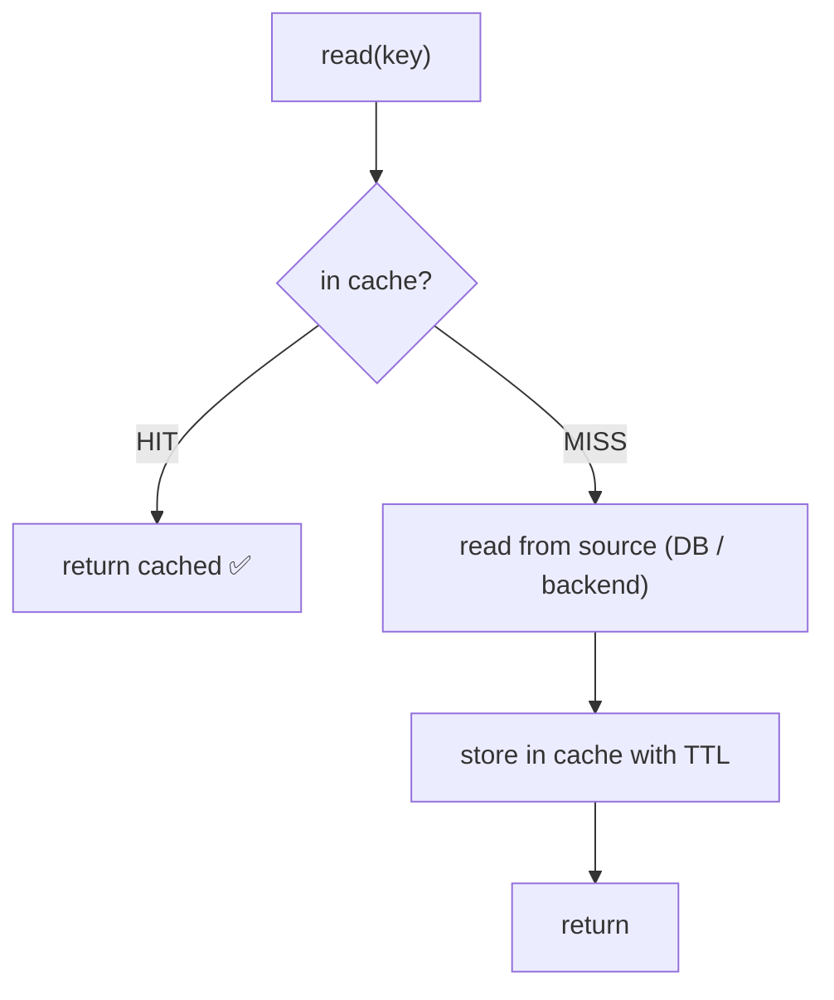

# Caching & Cache Invalidation

> **In one sentence:** keep a copy of an expensive-to-produce read close to the
> caller (in Redis/memory) so repeat reads are fast and cheap — and have a clear rule
> for when that copy is allowed to be wrong (TTL) and when you must throw it away
> (invalidation).

> 🧊 **In plain terms:** it's a whiteboard next to the filing cabinet. Instead of
> walking to the cabinet (the database) for every question, you jot the answer on the
> whiteboard. Next time, you read the board — instant. The hard part isn't writing on
> the board; it's **wiping it** the moment the filed record changes, so nobody reads a
> stale answer.

---

## 1. Why cache

Some reads are **hot** (requested constantly) and **expensive** (joins, aggregations,
a slow downstream). A cache trades a little **staleness** and **memory** for big wins
in **latency** and **load**: a Redis hit is sub-millisecond and never touches your
database or a downstream service.

You cache when: reads ≫ writes, the same keys are read repeatedly, and the data can
tolerate being a little stale. You *don't* cache data that must be exactly current
(a live balance a user is about to transact on) or that's rarely re-read.

---

## 2. Cache-aside (lazy caching) — the default pattern

The application manages the cache explicitly, *beside* the database:



```python
def get_balances(tenant):
    hit = cache.get(key)
    if hit is not None:
        return hit                      # HIT
    data = backend.fetch(tenant)        # MISS → source of truth
    cache.set(key, data, ttl=30)        # populate for next time
    return data
```

Other patterns to name: **read-through / write-through** (the cache library talks to
the DB for you), **write-behind** (buffer writes, flush later). Cache-aside is the
most common because it's simple and the app stays in control.

---

## 3. The hard part: invalidation

> *"There are only two hard things in computer science: cache invalidation and naming
> things."* — the joke is true. A cached copy is a **second source of truth**, and
> the moment the real data changes, the copy is a **lie**. Two ways to stop serving
> lies:

### (a) TTL (time-to-live) — bounded staleness

Every entry expires after `ttl` seconds. Simple, self-healing, no coordination — and
it gives you a **precise staleness bound**: "a cached balance is at most 30s old." The
cost is you *choose* to serve slightly stale data. Great when a little lag is fine.

### (b) Explicit invalidation — delete on write

When a write changes the underlying data, **delete** (or update) the cached key so the
next read re-fetches. Precise, but you must find *every* write path that affects the
key — miss one and you serve stale data forever (until TTL, if any).

**Best practice: use both.** Invalidate on the writes you know about (tight
freshness), and keep a TTL as a **safety net** for the writes you missed or races you
didn't foresee.

### The subtle failure modes (interview gold)

- **Thundering herd / cache stampede** — a hot key expires and 1,000 concurrent
  misses all hit the DB at once. Mitigations: a short lock so one request refills
  while others wait, or "stale-while-revalidate" (serve stale briefly, refresh in the
  background).
- **Invalidate vs update** — deleting is safer than writing the new value into the
  cache: two concurrent writes racing to *set* the cache can leave it holding the
  older value; a **delete** just forces a clean re-read.
- **Stale reads under eventual consistency** — if the "source" is itself catching up
  (e.g. a read model updated asynchronously), invalidation only guarantees you re-read
  the *source*, not that the source is fully current. Be honest about the end-to-end
  freshness.

---

## 4. Keys, scope & safety

- **Namespacing & tenancy:** key by everything that changes the answer —
  `cache:balances:<tenant>`. A tenant must **never** read another tenant's cached
  entry; the tenant id in the key is the isolation boundary.
- **TTL sizing:** shorter = fresher but more misses; longer = cheaper but staler.
  Match it to how fast the data changes and how much staleness the feature tolerates.
- **Never cache per-user secrets in a shared key**, and don't cache error responses.

---

## 5. Interview questions you should be able to answer

- *What is cache-aside?* → App checks cache; miss → fetch from source, store, return;
  hit → return cached.
- *TTL vs explicit invalidation — when each?* → TTL for bounded-staleness with no
  coordination; explicit delete-on-write for tight freshness. Use both (invalidate +
  TTL safety net).
- *Why delete rather than overwrite the cache on a write?* → Concurrent writes racing
  to set can leave a stale value; a delete forces a clean re-read.
- *What is a cache stampede and how do you prevent it?* → Many concurrent misses on a
  hot expired key hammer the DB; fix with a refill lock or stale-while-revalidate.
- *How do you keep a cache multi-tenant-safe?* → Put the tenant id in the key so
  entries can't leak across tenants.
- *When should you NOT cache?* → Data that must be exactly current, or that's rarely
  re-read (low hit rate → the cache is pure overhead).

---

## 6. How Ledgerstream uses it

The **gateway** cache-asides the **balances** read per tenant in Redis
(`gateway/cache.py`): key `cache:balances:<tenant>`, `SET … EX <ttl>` for bounded
staleness (`CACHE_TTL`, default 30s), and a `X-Cache: HIT|MISS` header for visibility.
On a **write to payments** (a capture, which changes balances), the gateway
**invalidates** that tenant's balances key so the next read re-fetches — TTL + delete
together. Honest caveat: balances are themselves eventually consistent (updated by the
ledger consumer off Kafka), so invalidation guarantees a fresh *read of the ledger*,
not that the ledger has already posted the just-captured payment. Built in **Phase 4**.
