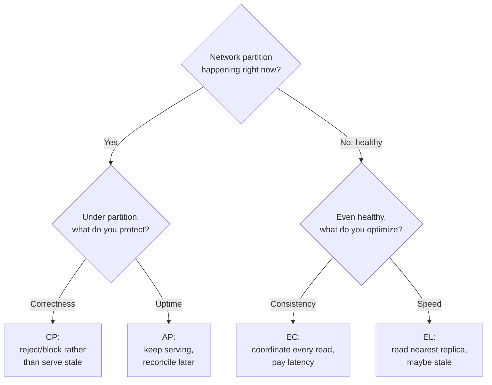

# CAP & PACELC

> **In one sentence:** in a distributed system, when the network breaks you must
> choose between staying consistent and staying available (CAP); and even when
> the network is fine, you trade latency against consistency (PACELC).

> 🧊 **In plain terms:** Two shopkeepers share one price list, one in each town,
> kept in sync by phone. One day the phone line goes down (a *partition*). A
> customer walks in. The shopkeeper has two choices: (A) **serve anyway** using
> possibly-outdated prices — stays *open* but might be *wrong* (that's **AP**); or
> (C) **refuse to sell** until the line is back and prices are confirmed — always
> *correct* but temporarily *closed* (that's **CP**). You can't be both open and
> guaranteed-correct while the line is down. PACELC adds: *even when the phone
> works*, insisting on double-checking every price with the other town makes each
> sale slower — so there's a speed-vs-correctness trade even on a good day.

---

## 1. Why this theorem exists

Any system whose data lives on more than one machine faces an unavoidable fact:
**networks fail.** Packets drop, links partition, nodes can't reach each other.
CAP is a statement about what's *possible* when that happens.

The three letters:

- **C — Consistency** (specifically *linearizability*): every read sees the most
  recent write. All nodes agree on the latest value. (Note: this is a *stronger*
  "C" than the ACID "C" in databases — don't conflate them.)
- **A — Availability:** every request to a non-failed node gets a (non-error)
  response. The system keeps serving.
- **P — Partition tolerance:** the system keeps working despite the network
  splitting into groups that can't talk to each other.

---

## 2. What CAP actually says (and the common misreading)

The pop version — "pick 2 of 3" — is misleading. Here's the accurate version:

**Network partitions are not optional.** In any real distributed system, `P`
*will* happen; you don't get to "choose" no partitions. So the real choice is:
**when a partition occurs, do you sacrifice C or A?**

- **CP system:** during a partition, refuse to serve requests that can't be made
  consistent (return errors / block) rather than risk returning stale or
  conflicting data. You keep **Consistency**, sacrifice **Availability**.
- **AP system:** during a partition, keep serving from whatever node you can
  reach, accepting that different nodes may temporarily disagree. You keep
  **Availability**, sacrifice **Consistency** (you'll reconcile later).

"CA" (consistent + available, no partition tolerance) only describes a
single-node system — not a distributed one. So in practice every distributed
system is **either CP or AP** *with respect to a given operation*.

### Key nuance: it's per-operation, not per-system
A real system isn't uniformly CP or AP. You choose **per data type / per
operation**. A bank might be CP for account balances (never show wrong money) but
AP for "recently viewed items" (stale is fine). Good design assigns the right
stance to each piece — which is exactly what the CAP/PACELC table in
`DESIGN.md §6` does.

---

## 3. Concrete examples

- **CP stores:** a single-primary SQL database with synchronous replication;
  ZooKeeper; etcd; HBase. They'd rather reject writes than diverge. *Choose CP
  when correctness is worth downtime* (money, inventory, locks).
- **AP stores:** Amazon Dynamo-style systems, Cassandra (tunable), DNS. They keep
  answering and reconcile conflicts afterward (e.g. "last write wins," or vector
  clocks / CRDTs). *Choose AP when availability is worth temporary disagreement*
  (shopping carts, social feeds, telemetry).

---

## 4. PACELC — the part CAP forgets

CAP only talks about the failure case (a partition). But partitions are rare;
your system spends most of its life *healthy*. **PACELC** extends CAP to the
normal case:

> **If** there is a **P**artition, trade **A**vailability vs **C**onsistency;
> **E**lse (no partition), trade **L**atency vs **C**onsistency.

The insight: even with a perfect network, **consistency costs latency.** To
guarantee every read sees the latest write, you must coordinate across nodes
(wait for replicas to acknowledge, reach a quorum, etc.) — and coordination takes
time. If you relax consistency, you can answer from the nearest replica instantly.

So each system gets a two-part label:

- **PC/EL** — consistent under partition, low-latency (relaxed) when healthy.
- **PC/EC** — consistent always (e.g. classic single-primary RDBMS): consistent
  under partition *and* willing to pay latency for consistency when healthy.
- **PA/EL** — available under partition, low-latency when healthy (e.g. Dynamo,
  Cassandra default): favors speed/availability throughout.
- **PA/EC** — rare/awkward combination.

### Why PACELC is the more useful lens
Most requests happen with no partition, so the **E**LSE branch (latency vs
consistency) is where your system *actually spends its time*. Two databases can
both be "CP" yet feel completely different day-to-day because one is EL (fast,
eventually consistent reads) and the other is EC (slower, always consistent).

---

## 5. How to reason about a component (the method)

For each stateful component, ask:

1. **What breaks if a reader sees stale data here?** If the answer is "money is
   wrong / a rule is violated" → lean **C** (CP, and often EC).
2. **What breaks if this component is briefly unavailable?** If "the whole
   product is down / users can't do anything" → lean **A** (AP/EL).
3. **How much latency can this path tolerate?** Tight latency budgets push you
   toward **EL** (relaxed consistency, read from nearest replica + cache).

Then write it down per component. That table *is* senior system design.

---

## 6. Interview questions you should be able to answer

- *State CAP correctly.* → Partitions are a given; under one you must choose C or
  A. Distributed systems are CP or AP per operation; "CA" = single node.
- *Is CAP "pick 2 of 3"?* → Not really — P isn't optional, so it's C-vs-A under
  partition.
- *What does PACELC add?* → The else-case: even without partitions, latency vs
  consistency. It captures the trade you make 99% of the time.
- *Give a CP and an AP example and justify.* → Balances = CP (never wrong);
  activity feed = AP (stale ok, must stay up).
- *Can one system be both?* → Yes — choose per data type/operation.

---

## 7. How Ledgerstream uses it

`DESIGN.md §6` labels every stateful component:
- **Postgres (Ledger & Payment): CP, PC/EL** — balances must be correct
  (consistency over availability under partition); single-primary synchronous
  commit favors consistency at some latency cost normally.
- **Kafka: CP per partition** with in-sync replicas — the consistent async spine
  that *lets* downstream reads be eventual.
- **Mongo read model & Redis cache: AP, EL** — rebuildable, staleness-tolerant,
  optimized for availability and low latency.

The system-level statement: **strong consistency on balances, eventual
consistency on cross-service read views** — a deliberate, per-component choice,
not an accident.
