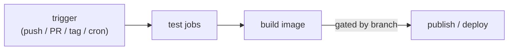

# CI/CD Pipelines

> **What this is:** the automation that runs on every code change — testing it, building the
> artifact, and (optionally) shipping it — so mistakes are caught by a robot before they reach
> `main` or production.

> 🧊 **Layman box.** **CI/CD** is a *quality-control conveyor belt* for code. Every time
> someone drops a change on the belt, machines automatically inspect it (run the tests), box
> it up (build the image), and — if it passes — send it toward the shop shelf (deploy). No
> human has to remember to run the checks; the belt won't let an unchecked box through.

---

## 1. The problem it solves

Without automation, "did you run the tests?" depends on human discipline, and "it built on my
machine" hides broken builds. Bugs merge, `main` breaks, and everyone downstream is blocked.
**Continuous Integration (CI)** runs the checks automatically on *every* push/PR, so breakage
is caught in minutes, on a clean machine, before merge. **Continuous Delivery/Deployment
(CD)** takes the vetted artifact and ships it — to a registry, a staging env, or production —
automatically or at the click of a button.

- **CI** = integrate + verify continuously (test, lint, build).
- **Continuous Delivery** = always have a deployable artifact; releasing is a manual gate.
- **Continuous Deployment** = every green build auto-deploys to prod (no manual gate).

---

## 2. Anatomy of a pipeline



- **Trigger** — what starts it (a push to a branch, a PR, a tag, a schedule).
- **Jobs** — units that run on a fresh **runner** (VM/container). Jobs can run in **parallel**
  and declare **dependencies** (`needs:`) so a build waits for tests.
- **Steps** — commands inside a job (checkout, set up language, install, test).
- **Matrix** — run the same job across variants (e.g. service = gateway, ai) in parallel.
- **Services / sidecars** — throwaway containers a job needs (a real Postgres for DB tests).
- **Artifacts / cache** — outputs to keep (test reports, images) and caches to speed reruns.
- **Secrets** — injected from the CI vault (registry tokens), never printed.

The golden rule: **make the pipeline mirror how the code is actually tested locally**, so it
needs zero special-casing. If your tests expect Postgres on port 5433, give the pipeline a
Postgres on 5433.

---

## 3. Test strategy in CI: hermetic vs integration

Not every test needs infra. Split them so CI is fast and reliable:

- **Hermetic/unit** — no network, no external services (in-memory fakes, mocked clients).
  Fast, parallel, flake-free. Run everywhere.
- **Integration** — need a real dependency (a database, a broker). CI provides it as a
  **service container**. Slower but catches real wiring bugs (migrations, SQL, drivers).

Ledgerstream does both: gateway/ai run **hermetic** (fakeredis, mock LLM); payment/ledger run
against **real Postgres service containers** on the same ports their test config expects.

---

## 4. Build & publish

After tests pass, build the deployable **image** (context = repo root here) and **push** to a
registry. Good practice:

- **Tag with an immutable id** (git SHA) *and* a moving one (`latest`) — deploys reference the
  SHA so you know exactly what's live.
- **Gate the push by branch** — build on every commit (proves it compiles) but only *publish*
  from `main` (or on a tag). Feature branches shouldn't pollute the registry.
- **Least-privilege auth** — the CI's built-in token (`GITHUB_TOKEN`) with `packages: write`,
  not a personal credential.
- **Layer caching** (`cache-from/to`) so builds reuse unchanged layers across runs.

---

## 5. Deploy stage (CD) — patterns you should name

- **Push-based**: the pipeline runs `helm upgrade` / `kubectl apply` / `terraform apply`
  against the cluster after publishing. Simple; the pipeline needs cluster credentials.
- **Pull-based / GitOps** (Argo CD, Flux): a controller in the cluster watches a git repo and
  reconciles the cluster to it. The pipeline just commits desired state; the cluster pulls.
  More secure (no cluster creds in CI) and auditable (git is the source of truth).
- **Progressive delivery**: **blue-green** (two envs, flip traffic), **canary** (shift a small
  % first, watch metrics, then ramp), **rolling** (k8s default: replace pods gradually).
  All aim to make rollout safe and rollback instant.

Ledgerstream's CD is **manual/showcase** (Helm/Terraform run by hand or a `kind` quickstart);
GitOps is the named upgrade path.

---

## 6. What makes a pipeline good

- **Fast** — parallelize (matrix, independent jobs); cache deps and layers. Slow CI gets
  bypassed.
- **Reliable** — no flaky tests; hermetic where possible; pinned versions.
- **Gated** — protect `main` with required status checks; build depends on tests (`needs:`).
- **Reproducible** — clean runner every time; no reliance on machine state.
- **Secure** — secrets from the vault, scoped tokens, publish only from trusted branches.
- **Observable** — clear logs, test reports, and a red/green signal per commit.

---

## 7. Interview questions you should be able to answer

- **CI vs CD (delivery vs deployment)?** CI = auto test/build every change; delivery = always
  have a deployable artifact (manual release gate); deployment = auto-release every green build.
- **Why gate the build behind tests / gate publish behind branch?** Don't ship a broken image;
  don't pollute the registry from feature branches — publish only from `main`/tags.
- **Hermetic vs integration tests in CI, and how to provide a DB?** Fakes/mocks for unit;
  service containers (a real Postgres sidecar) for integration — matched to local test config.
- **How do you tag images and why?** Immutable (git SHA/digest) so deploys are unambiguous,
  plus a moving `latest`; never deploy a floating tag to prod.
- **Push-based vs GitOps deploys?** Pipeline pushes to the cluster (needs creds) vs a cluster
  controller pulls desired state from git (no creds in CI, auditable).
- **Blue-green vs canary vs rolling?** Two-env flip / gradual %-shift with metric checks /
  in-place gradual replacement — all for safe rollout + fast rollback.
- **How do you keep secrets safe in CI?** Vault-injected, scoped tokens (`GITHUB_TOKEN` with
  minimal permissions), never echoed; publish only from protected branches.
- **Why should CI mirror local test setup?** So tests need no CI-specific changes — same ports,
  same fixtures — reducing "works locally, fails in CI" drift.

---

## 8. In Ledgerstream

[.github/workflows/ci.yml](../../.github/workflows/ci.yml) (GitHub Actions) runs on every push
to `main`/`phase*` and every PR: **shared-tests**, **django-db-tests** (payment + ledger vs
two real Postgres **service containers** on 5433/5434 — the exact ports the conftests default
to), **hermetic-tests** (gateway with fakeredis, ai with the mock LLM, in a matrix), then
**build-images** — which `needs:` all three, builds all four Dockerfiles on every commit, and
**pushes to GHCR only on `main`** (branch-gated login, lowercased owner, SHA + `latest` tags,
GHA layer cache). It's the one **Tier 1** artifact of Phase 7 — it runs for real on every
commit. The deploy step (Helm/Terraform) is manual/showcase; GitOps is the named next step.

---

## 9. The Ledgerstream code, explained simply

Here's [`.github/workflows/ci.yml`](../../.github/workflows/ci.yml) in plain English.

```yaml
on:
  push:
    branches: [main, "phase*"]
  pull_request:
    branches: [main]
```
**"Run this whenever someone pushes to `main` or a `phase*` branch, or opens a PR into
`main`."** That's the trigger.

Then a list of **jobs** (each runs on a fresh throwaway Ubuntu machine):

```yaml
shared-tests:
  steps:
    - uses: actions/checkout@v4          # grab the repo
    - uses: actions/setup-python@v5      # install Python 3.12
    - run: pip install "./libs/shared[dev,kafka]"
    - run: pytest libs/shared -q
```
**"Check out the code, install Python, install the shared library, run its tests."** `uses:` =
"borrow a ready-made action someone published"; `run:` = "run this shell command."

```yaml
django-db-tests:
  services:
    postgres-payment:
      image: postgres:16
      env: { POSTGRES_USER: payment, POSTGRES_PASSWORD: payment_dev_pw, POSTGRES_DB: payment }
      ports: ["5433:5432"]
```
**"For the payment/ledger tests, start a real throwaway Postgres alongside the job."** The
magic is `ports: ["5433:5432"]` — it exposes Postgres on **5433**, the *exact* port the
payment `conftest.py` already expects (`...@localhost:5433/payment`). So the tests find their
database with **no changes**. A second Postgres does the same on 5434 for ledger. Then the
steps install each service and run `pytest`.

```yaml
hermetic-tests:
  strategy:
    matrix:
      service: [gateway, ai]
```
**"Run this job twice in parallel — once for gateway, once for ai."** That's a **matrix**:
`${{ matrix.service }}` becomes `gateway` in one run and `ai` in the other. These two need no
database (gateway uses a fake Redis, ai uses the mock LLM), so it's fast.

```yaml
build-images:
  needs: [shared-tests, django-db-tests, hermetic-tests]
  strategy:
    matrix:
      service: [payment, ledger, gateway, ai]
```
**"Only after all three test jobs pass (`needs:`), build all four images (one matrix run
each)."** `needs:` is the gate — a broken test blocks the build. Inside:

```yaml
- run: echo "name=ghcr.io/${GITHUB_REPOSITORY_OWNER,,}/ledgerstream-${{ matrix.service }}" >> "$GITHUB_OUTPUT"
```
**"Build the image name, forcing the owner to lowercase"** (`,,` = lowercase in bash — GHCR
rejects capitals like `Amey-Mohite`).

```yaml
- if: github.event_name == 'push' && github.ref == 'refs/heads/main'
  uses: docker/login-action@v3          # log in to GHCR — ONLY on main
- uses: docker/build-push-action@v6
  with:
    push: ${{ github.event_name == 'push' && github.ref == 'refs/heads/main' }}
    tags: |
      ${{ steps.img.outputs.name }}:latest
      ${{ steps.img.outputs.name }}:${{ github.sha }}
```
**"Build the image always (to prove it compiles); only *publish* it when the push is to
`main`."** The `if:` and `push:` conditions both say "only on main." It tags two ways: a moving
`:latest` and an exact `:<git-sha>` so you always know precisely what's deployed.

**The whole story in one line:** *push → three test jobs run in parallel → if they all pass,
build four images → publish them only from `main`.* And the clever bit is the Postgres on
5433/5434 — CI mirrors your local test setup exactly, so nothing special is needed to make the
database tests pass.
