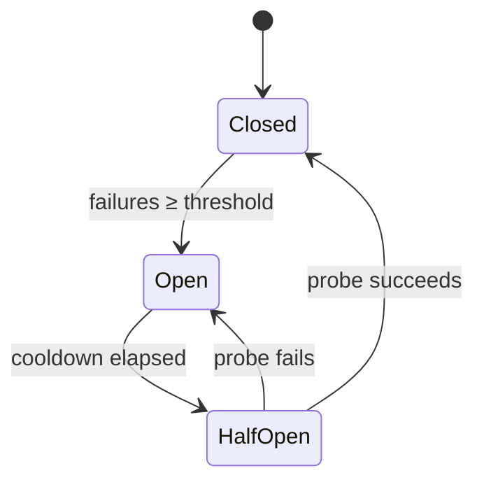
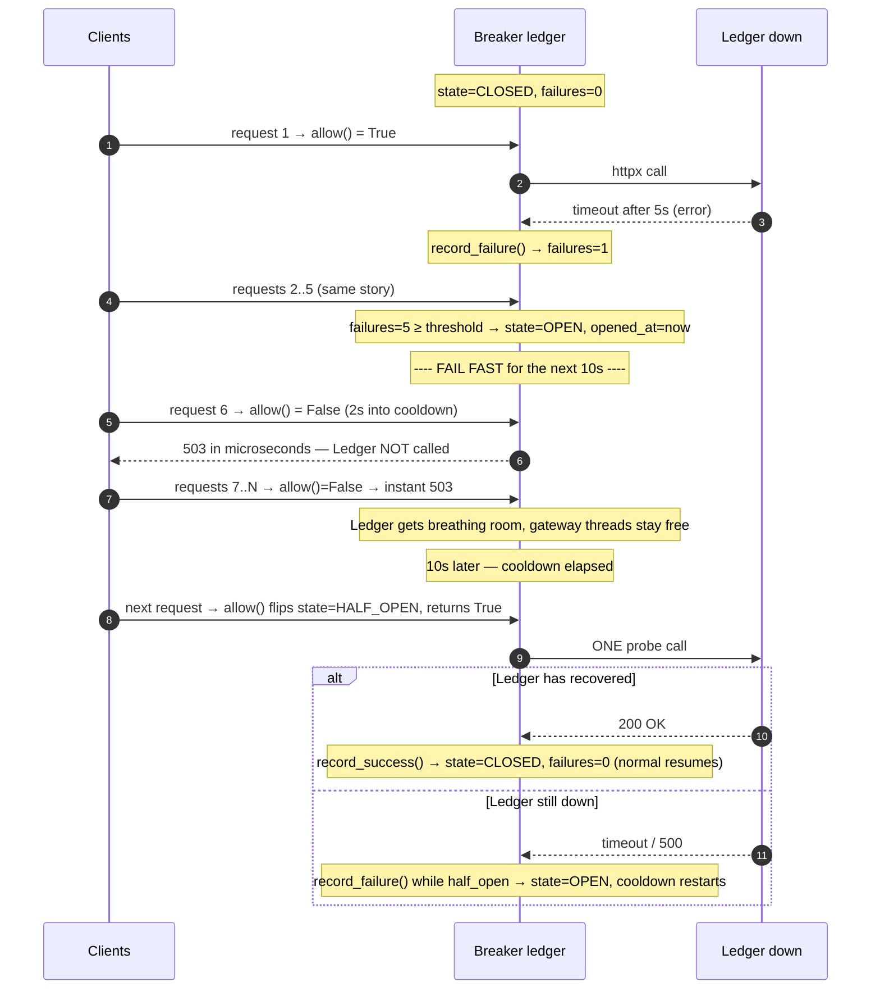

# Circuit Breakers & Graceful Degradation

> **In one sentence:** when a downstream dependency starts failing, stop calling it
> for a little while — "trip the breaker" — so you fail **fast** instead of piling up
> slow, doomed calls that exhaust threads and drag the whole caller down with it.

> 🧊 **In plain terms:** it's the electrical breaker in your house. When a circuit
> faults, the breaker pops and cuts power to *that* circuit — protecting the rest of
> the house from the fault (and from a fire). After a bit you flip it back on to test;
> if it faults again, it pops again. A software circuit breaker does the same around a
> failing service call.

---

## 1. The problem: one slow dependency sinks the caller

Say service A calls service B, and B goes slow (5s timeouts). Without a breaker:

- every request to A that needs B now blocks for 5s,
- A's worker threads/connections fill up waiting on B,
- A can no longer serve *even the requests that don't need B*,
- A's callers time out too → the failure **cascades** outward.

This is **retry storms + resource exhaustion**: the caller keeps throwing good
capacity at a dependency that's already down. The breaker's job is to **stop trying**
quickly and give the dependency room to recover.

---

## 2. The three states

- **CLOSED** — normal. Calls pass through; count consecutive failures. Cross the
  **threshold** → trip to OPEN.
- **OPEN** — **fail fast**: don't call the dependency at all; return an error (or a
  fallback) immediately for a **cooldown** period. This is the whole point — no thread
  sits waiting on a call you already expect to fail.
- **HALF-OPEN** — after the cooldown, let **one probe** through. Success → CLOSED
  (recovered). Failure → OPEN again (still sick), restart the cooldown.

What counts as a "failure"? Timeouts, connection errors, and **5xx** responses — a
*server/dependency* fault. A **4xx is the caller's fault**, not the dependency's, so it
must **not** trip the breaker (otherwise bad client input would take the backend
offline for everyone).

---

## 2.1 A worked scenario — the Ledger goes down

Config: `threshold = 5` (5 consecutive fails → open), `cooldown = 10s`. Each call to
the Ledger has a **5-second timeout**. At `t=0` the Ledger's database dies, so every
call to it now hangs for 5s and then errors.

### First, why you need this — WITHOUT a breaker

Every incoming request still calls the dead Ledger, waits the **full 5s timeout**, and
only then fails. Meanwhile each of those requests is **holding a gateway worker thread**
for 5s. At 100 requests/second that's ~500 threads stuck waiting on a corpse — the
gateway **runs out of workers** and can no longer serve *anything*, not even the Payment
routes that are perfectly healthy. One backend's outage became a **total** outage, and
the dying Ledger keeps getting hammered with traffic it can't answer. This is the
cascade the breaker prevents.

### WITH a breaker — step by step

### The same scenario as a timeline

| Time | Request | Breaker state | What the breaker does | Client sees |
|---|---|---|---|---|
| 0–5s | #1–#5 | CLOSED | calls Ledger, each times out; `failures` 1→5 → **OPEN** at #5 | `503` after 5s each |
| 5–15s | #6…#900 | **OPEN** | `allow()=False` → **fail fast**, Ledger never called | `503` **instantly** |
| 15s | #901 | OPEN → **HALF_OPEN** | cooldown elapsed → `allow()=True` → **one probe** to Ledger | depends on probe ↓ |
| 15s | probe **succeeds** | HALF_OPEN → **CLOSED** | `record_success()`, `failures=0` | `200` — service restored |
| 15s | probe **fails** | HALF_OPEN → **OPEN** | `record_failure()`, cooldown restarts (another 10s) | `503`, retry later |

**What changed:** only the first 5 requests paid the slow 5s timeout. Everything after
that is an **instant** `503` — no thread held, no load on the sick Ledger — and the
gateway stays healthy for every other route. Every 10s the breaker spends **exactly one**
request probing whether the Ledger is back; the moment a probe succeeds, normal service
resumes automatically. That's the whole value: **contain the failure, fail fast, and
self-heal** without a human flipping anything.

> Map back to the code (`gateway/breaker.py`): the "call 5 times then open" is
> `record_failure()` crossing `BREAKER_THRESHOLD`; "fail fast for 10s" is `allow()`
> returning `False` while `now - opened_at < BREAKER_COOLDOWN`; "one probe after the
> cooldown" is `allow()` flipping to `half_open`; "probe decides" is `record_success()`
> (→ closed) vs `record_failure()` while half-open (→ open again).

---

## 3. Graceful degradation: what to do when it's open

Tripping the breaker is only half the story — you still have to answer the caller.
Options, best first for the situation:

- **Serve a fallback / cached value** ("last known balances") — degrade to stale but
  useful.
- **Return a partial response** — drop the failing section, keep the rest (a
  dashboard renders every widget except the one whose service is down).
- **Return a clean `503` fast** — honest "temporarily unavailable" beats a 30s hang.

The principle: **degrade, don't collapse.** A fast, partial, or slightly-stale answer
is far better UX than a slow timeout or a stack trace.

---

## 4. Related knobs (name them)

- **Timeouts** — a breaker needs *bounded* calls to react to; an unbounded call hangs
  forever and never "fails". Always set a timeout on a network call.
- **Retries with backoff + jitter** — retry *transient* blips, but cap them; retries
  and breakers work together (retry a little, then trip).
- **Bulkheads** — isolate resources per dependency (separate thread/connection pools)
  so B's saturation can't consume the pool A needs for C.
- **Where state lives** — usually **in-process, per instance**: a breaker is a local
  latency guard reacting to *what this instance sees*. A shared (Redis-backed) breaker
  exists but is rarely worth the coordination; per-instance is the norm.

---

## 5. Interview questions you should be able to answer

- *What problem does a circuit breaker solve?* → It stops a caller from piling up slow
  calls to a failing dependency, which would exhaust its resources and cascade the
  outage; it fails fast and lets the dependency recover.
- *Walk through the three states.* → Closed (pass + count failures), Open (fail fast
  for a cooldown), Half-Open (one probe → close on success, reopen on failure).
- *Should a 4xx trip the breaker?* → No — 4xx is the client's fault, not the
  dependency's; only 5xx/timeouts/connection errors count.
- *Breaker vs retry — how do they relate?* → Retries handle transient blips (with
  backoff); the breaker handles *sustained* failure by stopping calls entirely. Use
  both, bounded.
- *What is graceful degradation?* → Returning a fallback, partial, or fast-error
  response when a dependency is down, instead of hanging or crashing.
- *Why do you need timeouts for a breaker to work?* → Without a timeout a failing call
  hangs forever and never registers as a failure; the breaker can't react.
- *In-process vs shared breaker state?* → In-process per instance is standard (local
  health signal); shared state adds coordination cost that's rarely justified.

---

## 6. How Ledgerstream uses it

The **gateway** wraps every downstream call (`gateway/client.py`) in a **per-service
circuit breaker** (`gateway/breaker.py`) — one for Payment, one for Ledger, so a dead
Ledger doesn't trip the Payment path. Threshold consecutive failures → **OPEN**
(`BREAKER_THRESHOLD`); OPEN fails fast for `BREAKER_COOLDOWN` seconds; then **HALF-OPEN**
lets one probe decide. Connection errors/timeouts and **5xx** count as failures; **4xx
does not**. When the breaker is open or a call fails, the gateway **degrades
gracefully** — a clean `503 {"detail": "… temporarily unavailable"}` instead of a hung
request. State is in-process per gateway instance (the standard design). Built in
**Phase 4**.
