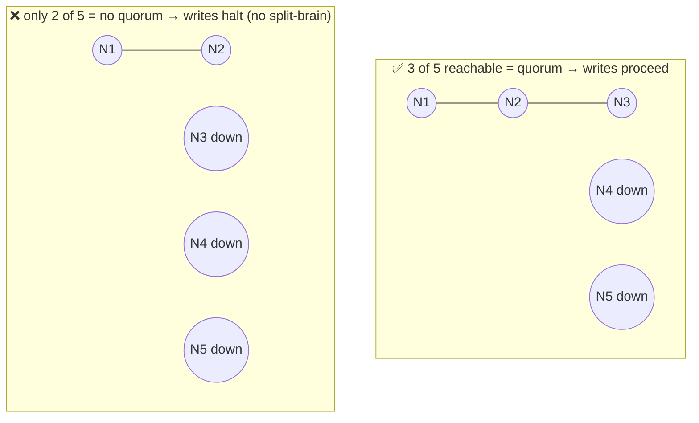
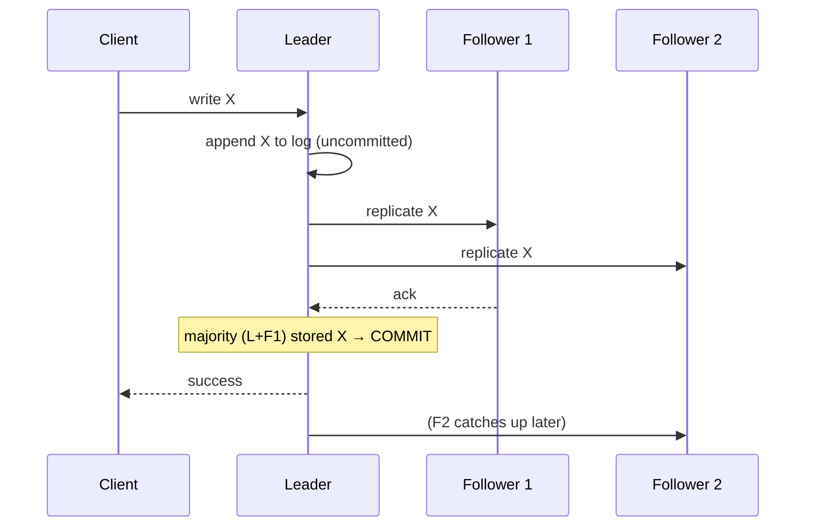

# Consensus & Coordination (Raft, quorums, leader election)

> **In one sentence:** consensus is how a group of machines agree on a single
> value or ordering *even though* some of them may crash or be unreachable — the
> foundation under leader election, replication, and "who's in charge?"

> 🧊 **In plain terms:** Imagine a group chat of five friends deciding on one
> restaurant, where messages sometimes arrive late and a phone or two dies
> mid-conversation. You need a rule that guarantees they *all* end up believing
> the same final choice — never two friends confidently telling others different
> answers. Consensus algorithms are that rule. The trick they use: nothing counts
> as "decided" until a **majority** has agreed, because any two majorities always
> share at least one person who remembers the truth.

---

## 1. Why distributed systems need consensus

The moment your data or decisions live on multiple machines, you face questions
that have no obvious answer:

- **Who is the leader?** (the one node allowed to accept writes right now)
- **What is the correct order of operations?** (did A happen before B?)
- **Is this value committed** (durable and agreed) **or not?**

If two nodes each *think* they're the leader — a **split brain** — they can accept
conflicting writes and corrupt the system. Consensus prevents exactly this.

The reason it's hard is the **FLP result** and real-world messiness: messages get
delayed, reordered, or dropped, and nodes crash at the worst moment. You can't
tell "crashed" apart from "just slow." Consensus algorithms are careful protocols
that still reach agreement despite all that — as long as a **majority** of nodes
are alive and can communicate.

---

## 2. The central mechanism: quorums (majority voting)

A **quorum** is the minimum number of nodes that must agree for a decision to
count. The standard choice is a **strict majority**: `floor(N/2) + 1`.

| Cluster size N | Majority quorum | Failures tolerated |
|---|---|---|
| 3 | 2 | 1 |
| 5 | 3 | 2 |
| 7 | 4 | 3 |

**Why majority?** Because any two majorities of the same set **must overlap in at
least one node**. That overlapping node "remembers" the last decision, so a new
decision can never contradict a committed one. This overlap property is the
mathematical heart of consensus.

Two consequences you should be able to state:
- **Odd numbers are better.** N=3 and N=4 both tolerate only 1 failure, but N=4
  needs a bigger quorum — so the extra node buys you nothing and costs latency.
  Clusters are almost always **3, 5, or 7**.
- **Lose the majority → the system stops accepting writes** (it becomes CP: it
  would rather halt than risk split-brain). This is by design.

---

## 3. Leader election & log replication (how Raft works)

**Raft** is the consensus algorithm most systems use today because it was
designed to be *understandable* (unlike its famously cryptic predecessor,
Paxos). The mental model:

### Roles
Every node is in one of three states: **Follower**, **Candidate**, or **Leader**.
At any time there is at most one leader.

### Terms
Time is divided into **terms** (numbered epochs). Each term has at most one
leader. Terms act as a logical clock so nodes can detect and reject stale
leaders.

### Election
1. Followers expect regular **heartbeats** from the leader.
2. If a follower hears nothing for a random timeout, it becomes a **Candidate**,
   increments the term, and **requests votes**.
3. Each node votes for at most one candidate per term. A candidate that collects a
   **majority** of votes becomes **Leader**.
4. Randomized timeouts make it unlikely two candidates tie repeatedly.

### Replicating the log
- All writes go to the **leader**. The leader appends the entry to its log and
  sends it to followers.
- Once a **majority** have stored the entry, the leader marks it **committed** and
  applies it (and tells followers to apply it). Committed = durable and agreed.
- A new leader always has all committed entries (the voting rules guarantee this),
  so no committed data is ever lost.

> 🧊 **In plain terms:** one person (the leader) writes the group's shared diary.
> Before an entry "counts," they read it aloud and wait until **most** of the
> group has copied it down. If the leader faints, the group notices the silence,
> holds a quick vote, and whoever most people trust becomes the new diary-keeper —
> and because the new keeper was among those who copied the last entries, nothing
> agreed-upon is ever forgotten.

---

## 4. Where you actually meet consensus (you rarely implement it)

You almost never write a consensus algorithm yourself — you *use* systems that
embed one:

- **Kafka (KRaft mode):** the **controller quorum** uses Raft to agree on cluster
  metadata — which topics/partitions exist and **who leads each partition**. This
  replaced ZooKeeper (which used its own consensus protocol, ZAB).
- **etcd / Consul:** Raft-based key-value stores that hold configuration, service
  discovery, and **distributed locks/leader election** for other apps.
- **ZooKeeper:** the classic coordination service (ZAB protocol).
- **Postgres/MySQL replication + failover** tools use consensus/quorum ideas to
  promote a new primary without split-brain.
- **Distributed databases** (CockroachDB, Spanner, TiKV) use Raft/Paxos per shard
  to keep replicas consistent.

> **Interview-critical framing:** "We *use* consensus (Kafka KRaft, etcd), we
> don't hand-roll it — reimplementing Raft demonstrates nothing the product
> needs." (This is exactly why `DESIGN.md §11` lists "consensus/Raft" as
> deliberately left out.)

---

## 5. Coordination beyond leader election

Consensus systems also provide:
- **Distributed locks / leases:** only one worker holds the lock at a time
  (e.g. "only one instance runs the nightly job").
- **Leader election for your app:** your own service can ask etcd "make me the
  leader" so exactly one instance does singleton work.
- **Configuration & service discovery:** a consistent place everyone reads
  current truth from.

---

## 6. Interview questions you should be able to answer

- *What problem does consensus solve?* → Getting multiple nodes to agree on one
  value/order despite crashes and unreliable networks; prevents split-brain.
- *What's a quorum and why a majority?* → Minimum agreeing nodes; majorities
  always overlap, so a new decision can't contradict a committed one.
- *How many failures does a 5-node cluster tolerate?* → 2 (quorum = 3).
- *Why odd-sized clusters?* → Adding an even-th node raises the quorum without
  raising fault tolerance.
- *Explain Raft leader election in 3 sentences.* → Followers become candidates on
  heartbeat timeout, bump the term, and request votes; a majority elects a leader;
  randomized timeouts avoid split votes.
- *What happens when a cluster loses quorum?* → It stops accepting writes
  (chooses consistency over availability) to avoid divergence.
- *What did KRaft replace and why does it matter?* → ZooKeeper; Kafka now manages
  its own metadata via a Raft quorum, simplifying ops.

---

## 7. How Ledgerstream uses it

Our Kafka broker runs in **KRaft mode**: it's both broker *and* controller, and
the controller role uses a Raft quorum to manage cluster metadata and partition
leadership. Locally we run a single node (quorum of 1 — fine for learning); in
production you'd run 3+ so the metadata quorum tolerates failures. We *consume*
consensus as a service; we don't implement it — and that's the correct
engineering choice to be able to defend.
