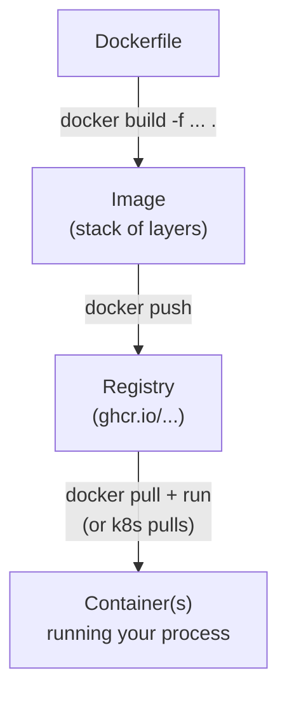

# Containers & Images

> **What this is:** how you package a service so it runs the same everywhere — on your
> laptop, in CI, and in a cluster — and the vocabulary (image, container, layer, registry)
> you need to talk about it.

> 🧊 **Layman box.** An **image** is like a *frozen, ready-to-cook meal*: everything needed
> is sealed in, in the right amounts. A **container** is that meal *heated up and being
> eaten* — a running copy. You can heat the same frozen meal a hundred times (a hundred
> containers from one image), and each is identical. A **registry** is the freezer aisle at
> the shop where these meals are stocked and picked up.

---

## 1. The problem it solves

"It works on my machine" is a bug, not a defence. Your code depends on a Python version, OS
libraries, environment variables, a specific `librdkafka`… Ship the *code* alone and the
target machine's versions differ, and it breaks. A **container image** bundles the code
**and** its entire userspace (interpreter, libraries, files) into one immutable artifact, so
the thing you tested is byte-for-byte the thing that runs in production.

Containers do this **without a full VM**: they share the host kernel and isolate via Linux
namespaces + cgroups. So they start in milliseconds and are cheap enough to run one process
each — which is exactly the microservice model.

---

## 2. Image vs container (the distinction interviewers probe)

| | Image | Container |
|---|---|---|
| What | A built, **immutable** filesystem + metadata (default command, env, exposed port) | A **running** (or stopped) instance of an image |
| Analogy | Class / template / frozen meal | Object / instance / the meal being eaten |
| Count | One | Many, all from the same image |
| Mutability | Read-only layers | A thin writable layer on top (lost when it's removed) |

You **build** an image (once), **push** it to a registry, then **run** containers from it
(many times, anywhere).

---

## 3. How an image is built — layers & caching

A `Dockerfile` is a recipe; each instruction adds a **layer** (a diff of the filesystem).
Layers are **cached and shared**: if a layer's inputs didn't change, the build reuses it.
That's why order matters — put what changes *rarely* first, what changes *often* last:

```dockerfile
FROM python:3.12-slim              # base layer (rarely changes)
COPY libs/shared /app/libs/shared  # shared lib — changes rarely → cached
RUN pip install /app/libs/shared
COPY services/x/requirements.txt . # deps — change occasionally
RUN pip install -r requirements.txt
COPY services/x /app/services/x    # your code — changes constantly → last
```

Change one line of app code and only the last layer rebuilds; the expensive
`pip install` layers are reused. Ledgerstream's Dockerfiles are ordered exactly this way.



### Build context
`docker build` sends a **context** (a directory) to the builder; `COPY` can only see files
inside it. Ledgerstream builds **from the repo root** (`docker build -f services/payment/
Dockerfile .`) precisely because each image needs `libs/shared`, which lives *outside* the
service folder. The `-f` picks the Dockerfile; the trailing `.` is the context.

---

## 4. The default command — and overriding it

An image carries a default **`CMD`** (what runs when you `docker run` it with no command).
But you can **override** it at run time. This is the key to Ledgerstream's worker model:

```dockerfile
# default = the web server
CMD ["gunicorn", "config.wsgi:application", "--bind", "0.0.0.0:8000", ...]
```

- `docker run ledgerstream-ledger` → runs gunicorn (the read API).
- `docker run ledgerstream-ledger python manage.py consume_payments` → **same image**, runs
  the Kafka consumer instead.

In Kubernetes, each Deployment sets its own `command:` — so **one image becomes several
different running roles**. Build four images, run seven Deployments (Part 3 of
[phase7.md](../phase7.md)). `CMD` vs `ENTRYPOINT`: `ENTRYPOINT` is the fixed executable,
`CMD` the default args; most apps just use `CMD` and override the whole thing per Deployment.

---

## 5. Image hygiene (what good ones do)

- **Small base** (`python:3.12-slim`, or `-alpine`/distroless) — less to download, smaller
  attack surface.
- **Non-root user** (`USER appuser`) — a compromised process isn't root inside the container.
- **No secrets baked in** — secrets arrive at *run* time (env/mounts), never in a layer (layers
  are cacheable and shippable; a baked secret leaks forever).
- **`.dockerignore`** — keep `.git`, `.venv`, tests out of the context (faster, smaller).
- **Multi-stage builds** — a "builder" stage compiles/install, a slim final stage copies only
  the artifacts. (Ledgerstream's images are single-stage but structured to add this trivially.)
- **Pin/lock versions** — reproducible builds; `latest` drifts.

---

## 6. Tags, digests & registries

- A **tag** (`:latest`, `:v1.2`, `:<git-sha>`) is a movable label. `latest` is *not* a
  version — it just points at whatever was pushed last. Prefer immutable tags (a git SHA) for
  deploys so you know exactly what's running. (Ledgerstream's CI pushes both `:latest` and
  `:<sha>`.)
- A **digest** (`@sha256:...`) is the content hash — truly immutable; the same digest is the
  same bytes forever.
- A **registry** stores images. Public: Docker Hub, GHCR (`ghcr.io`), ECR/GCR/ACR. Auth to
  push; often auth to pull private images (k8s uses an `imagePullSecret`).

---

## 7. Interview questions you should be able to answer

- **Image vs container?** Template vs running instance; one image → many containers.
- **Why do Dockerfile instruction order and layer caching matter?** Cached layers skip
  rebuilds; put rarely-changing steps first so a code edit only rebuilds the last layer.
- **Container vs VM?** Containers share the host kernel (namespaces/cgroups) — lightweight,
  fast start; VMs virtualize hardware and run a full OS — heavier, stronger isolation.
- **How does one image run as different processes?** Override the default `CMD`/`command`
  per run (Deployment) — web vs worker from the same image.
- **Why build from the repo root here?** The shared library lives outside each service dir;
  the build context must include it for `COPY` to see it.
- **Why not bake secrets or use `latest` in prod?** Layers are shippable/cacheable (secrets
  leak); `latest` is mutable (you can't tell what's deployed) — pin a digest or SHA tag.
- **What is `:latest` actually?** A tag that moves to the newest push — not a version.

---

## 8. In Ledgerstream

Four Dockerfiles ([services/*/Dockerfile](../../services/payment/Dockerfile)), each: slim
Python base, shared-lib-first layer ordering, non-root `appuser`, built from the repo root.
The **one-image-many-roles** pattern drives the Helm chart — payment's image runs as the web
API, the outbox relay, and the ledger-outcomes consumer (three Deployments, one image). CI
builds all four on every commit and publishes them to **GHCR** on `main`. See
[kubernetes-and-helm.md](kubernetes-and-helm.md) for where these images get scheduled.

---

## 9. The Ledgerstream code, explained simply

Here's the payment [`Dockerfile`](../../services/payment/Dockerfile) in plain English — a
recipe read top to bottom, each line adding a layer:

```dockerfile
FROM python:3.12-slim AS base
```
**"Start from a small, official Python 3.12 box."** `slim` = a stripped-down Linux with Python
already inside and not much else (smaller = faster to ship, fewer things to go wrong).

```dockerfile
ENV PYTHONUNBUFFERED=1 PYTHONDONTWRITEBYTECODE=1 PIP_NO_CACHE_DIR=1
```
**"Set three tidiness switches."** Print logs immediately (don't buffer), don't scatter `.pyc`
cache files, and don't keep pip's download cache (keeps the image smaller).

```dockerfile
WORKDIR /app
```
**"Work inside the `/app` folder."** Every command after this runs there.

```dockerfile
COPY libs/shared /app/libs/shared
RUN pip install /app/libs/shared
```
**"Copy in the shared library and install it."** This is *first* on purpose: it rarely changes,
so this expensive step gets **cached** and reused on later builds (see §3 — layer caching).

```dockerfile
COPY services/payment/requirements.txt /app/services/payment/requirements.txt
RUN pip install -r /app/services/payment/requirements.txt
```
**"Copy just the dependency list and install it."** Only the `requirements.txt`, not the whole
app — so editing your code later doesn't force a re-install of Django etc.

```dockerfile
COPY schemas /app/schemas
COPY services/payment /app/services/payment
WORKDIR /app/services/payment
```
**"Now copy the Avro schemas and the actual app code"** (last, because it changes most often),
**"then move into the service folder."**

```dockerfile
RUN useradd --create-home appuser && chown -R appuser /app
USER appuser
```
**"Create a normal user and switch to it."** From here the app runs as `appuser`, **not root** —
so if it's ever hacked, the attacker isn't all-powerful inside the container.

```dockerfile
EXPOSE 8000
CMD ["gunicorn", "config.wsgi:application", "--bind", "0.0.0.0:8000", ...]
```
**"This app listens on port 8000, and by default runs gunicorn (the web server)."** `EXPOSE`
is documentation; `CMD` is the default command. Remember: a Kubernetes worker Deployment
**replaces** that `CMD` with `python manage.py consume_payments` — same image, different job.

**The one thing to remember:** put rarely-changing steps (base, shared lib, deps) **early** and
fast-changing steps (your code) **late**, so a one-line code change rebuilds one small layer,
not the whole image.
