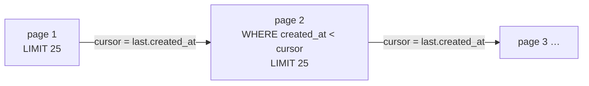

# Cursor (Keyset) Pagination

> **In one sentence:** page through a large, growing list by remembering **where you
> stopped** (a cursor pointing at the last row's sort value) instead of **how many
> rows to skip** (`OFFSET`), so each page is fast and stable even as new rows arrive.

> 🧊 **In plain terms:** it's a **bookmark** vs **counting pages**. Offset pagination
> is "skip the first 4,000 lines, then read 25" — every time, the reader counts past
> 4,000 lines again, and if someone inserts a paragraph at the top, your bookmark
> silently shifts and you re-read or skip a line. A cursor is a real bookmark placed
> *on a specific line*: "continue from here" — instant, and it doesn't move when the
> book grows.

---

## 1. Why `OFFSET` pagination hurts at scale

`GET /items?page=200&size=25` → `... LIMIT 25 OFFSET 4975`. Two problems:

- **Slow for deep pages.** `OFFSET 4975` makes the database **scan and discard** 4,975
  rows before returning 25. Cost grows with the page number — page 1 is instant, page
  2,000 crawls. It's O(offset), not O(page size).
- **Unstable under writes.** Offsets are positions in a result set that's *shifting*.
  If a new row is inserted at the top between page 1 and page 2, every row shuffles
  down one — so page 2 **repeats** a row you already saw (or a deletion makes it
  **skip** one). For a live feed (newest first, constant inserts) this is a real bug.

```
OFFSET view (newest first), reader on page 2 (rows 26–50):
   a new item arrives at the top → everything shifts down one →
   the row that was #25 is now #26 → you SEE IT AGAIN on page 2.  ❌
```

---

## 2. How cursor / keyset pagination works

Sort by a column (or columns) that's **ordered and (near-)unique** — a timestamp, an
auto-increment id, or a ULID. Instead of an offset, the client sends the sort value of
the **last row it saw** (the *cursor*). The next page is a `WHERE`, not an `OFFSET`:

```sql
-- newest first, continue after the last row the client received
SELECT * FROM entries
WHERE created_at < :last_seen_created_at    -- the cursor
ORDER BY created_at DESC
LIMIT 25;
```



- **Fast & flat:** `WHERE created_at < ?` is an **indexed seek** — the DB jumps
  straight to the position and reads 25 rows. Page 2,000 costs the same as page 1.
- **Stable:** the cursor is anchored to a **value**, not a count. New rows arriving at
  the head don't shift the rows below the cursor, so you never re-read or skip.

The cursor is usually returned as an **opaque token** (base64 of the sort value) so
clients treat it as "give this back to get the next page," not something to construct.

---

## 3. The catches (say these in an interview)

- **The sort key should be unique**, or ties at the boundary can drop/duplicate a row.
  Fix by making the cursor a **tuple**: `(created_at, id)` and compare
  lexicographically — `WHERE (created_at, id) < (:ts, :id)`. A unique tiebreaker (the
  pk) guarantees a total order.
- **No random access.** You can go next/previous, but not "jump to page 500" — there's
  no page number. That's the deliberate trade-off; it's fine for infinite-scroll feeds
  and API cursors, wrong for "numbered pages 1…N" UIs.
- **Consistent ordering required.** The `ORDER BY` must match the cursor comparison
  exactly, and the sort column should be indexed (otherwise you're back to a scan).
- **No total count.** Like offset, you typically don't get "10,000 results" cheaply;
  cursors are about *streaming through*, not *counting*.

---

## 4. Offset vs cursor — when to use which

| | Offset/limit | Cursor/keyset |
|---|---|---|
| Deep-page speed | degrades (O(offset)) | flat (indexed seek) |
| Stable under inserts | ❌ shifts | ✅ anchored to a value |
| Jump to arbitrary page | ✅ | ❌ next/prev only |
| Total count | easy-ish | not cheap |
| Best for | small, static lists; numbered-page UIs | large, growing feeds; APIs; infinite scroll |

---

## 5. Interview questions you should be able to answer

- *Why is `OFFSET` slow for deep pages?* → The DB scans and discards `OFFSET` rows
  before returning the page; cost grows with the offset.
- *Why is offset pagination unstable?* → Offsets index a shifting result set; inserts/
  deletes above your position make later pages repeat or skip rows.
- *How does keyset pagination fix both?* → It pages with `WHERE sort_col < cursor …
  LIMIT n` — an indexed seek (fast, flat) anchored to a value (stable under writes).
- *What breaks if the sort key isn't unique?* → Boundary ties can drop or duplicate
  rows; add a unique tiebreaker and compare the tuple `(sort_col, id)`.
- *What's the trade-off you accept?* → No random page jumps and no cheap total count —
  only next/previous.
- *When would you still use offset?* → Small/bounded lists and UIs that need numbered
  pages or "jump to page N".

---

## 6. How Ledgerstream uses it

The Ledger's **transaction history** (`GET /api/transactions`) uses DRF
**`CursorPagination`** ordered by `-created_at` (`ledger/views.py`,
`TransactionCursorPagination`, page size 25). The append-only journal is the ideal
case: it's large, grows constantly at the head, and is read newest-first — exactly
where offset pagination would re-serve rows as new entries post. The response is
`{next, previous, results}` with opaque cursors; the gateway forwards the `?cursor=`
param transparently. (Behind the gateway, the `next`/`previous` URLs point at the
backend's host — in production you'd rewrite them via forwarded-host headers.) Built in
**Phase 4**.
