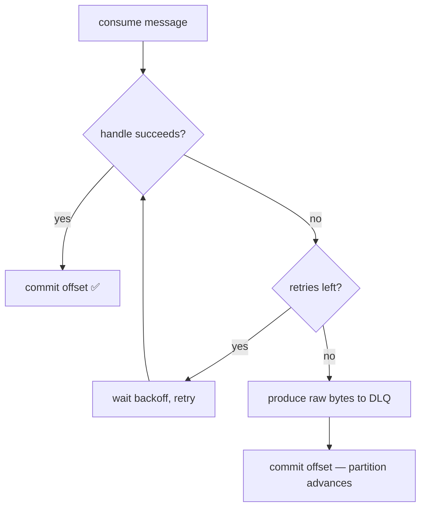

# Dead-Letter Queues, Retries & Backoff

> **In one sentence:** when a consumer can't process a message, you **retry** the
> ones that might just be having a bad moment (a DB blip), and **park** the ones
> that will never succeed (a corrupt message) on a **dead-letter queue** — so one
> bad message can't block everything behind it.

> 🧊 **In plain terms:** think of a mail sorter. Most letters they can deliver.
> One letter has a smudged address they can't read right now — they set it aside
> and try again in a minute (maybe the ink dries, maybe a colleague knows the
> street): that's a **retry**. One letter has no address at all and never will —
> putting it back on the pile just jams the line forever, so it goes into a
> special "undeliverable" bin for a human to look at later: that's the
> **dead-letter queue**. The whole point is: *don't let the one unreadable letter
> stop the mail.*

---

## 1. The problem: a poison message blocks the partition

A Kafka consumer reads a partition **in order** and commits its offset only after
it successfully handles a message (so it doesn't lose data — see
[Kafka §6](kafka.md) and [Idempotency](idempotency.md)). That ordering is a
feature — until a message it *cannot* handle arrives:

```
partition 3:  [ok][ok][💀 poison][msg][msg][msg] ...
                          ▲
        consumer is stuck here forever:
        handle() throws → don't commit → redeliver → handle() throws → ...
```

A **poison message** is one that fails *deterministically* — it will fail on
every redelivery. Classic causes:

- it can't be **deserialized** (truncated bytes, an incompatible schema, garbage
  from a misconfigured producer),
- it references data that will never exist, or
- it hits a real bug that always throws on that specific payload.

Because the consumer never commits past it, **every message behind it on that
partition is now blocked** — a head-of-line blocking outage caused by a single
row. This is the failure mode DLQs exist to prevent.

But you can't just skip *every* failure — most failures aren't poison.

---

## 2. Two kinds of failure — and why the distinction is everything

| | **Transient** | **Poison (permanent)** |
|---|---|---|
| Example | DB connection dropped, broker timeout, a downstream service is briefly down | undeserializable bytes, a bug that always throws on this payload |
| Will a retry help? | **Yes** — the cause usually clears in seconds | **No** — it fails identically every time |
| Right response | **retry** (a few times, with backoff) | **DLQ** it and move on |

The whole design is a decision tree: *try it → if it still fails after a few
retries, assume it's poison → DLQ it.* Retries turn transient blips into
non-events; the DLQ stops permanent failures from blocking the line.



---

## 3. Retries: do them *with backoff*, not in a tight loop

The naive retry is a tight `while` loop: hammer the operation as fast as possible.
That's actively harmful — if the DB is struggling, a thousand consumers retrying
1000×/sec is a **retry storm** that keeps it down (a self-inflicted DDoS). The fix
is **exponential backoff**: wait longer after each failure, giving the dependency
room to recover.

```
attempt 1 fails → wait 0.5s
attempt 2 fails → wait 1.0s
attempt 3 fails → wait 2.0s
attempt 4 fails → give up → DLQ
```

Each wait is `base_delay × 2^attempt`. A minimal, dependency-free helper:

```python
import time

def run_with_retry(fn, *, max_retries=3, base_delay=0.5):
    """Retry fn() on any exception with exponential backoff.
    Re-raises the last exception once retries are exhausted, so the
    caller can decide to dead-letter the message."""
    for attempt in range(max_retries + 1):     # +1: the first try isn't a "retry"
        try:
            return fn()
        except Exception:
            if attempt == max_retries:
                raise                            # exhausted → caller DLQs
            time.sleep(base_delay * (2 ** attempt))
```

Two refinements you should be able to name in an interview:

- **Jitter** — add a random fraction to each delay so a thousand consumers that
  failed at the same instant don't all retry at the *same* later instant (a
  "thundering herd"). `delay = base * 2**n * (1 + random())`. We skip it here
  (single consumer), but it's standard at scale.
- **Retry budget / cap** — cap the maximum delay (e.g. never wait more than 30s)
  and the total attempts, so a permanently-down dependency doesn't make one
  message take an hour before it's dead-lettered.

> **Where should the retry happen — in-process or via a retry topic?** Two schools:
> **in-process retry** (what we do: sleep-and-retry inside `handle()`) is simple
> but blocks the partition while it sleeps. **Retry topics** (Kafka's own pattern:
> `orders.retry.5s`, `orders.retry.30s`, …) republish the failed message to a
> delayed topic so the main partition keeps flowing; a separate consumer picks it
> up after the delay. Retry topics scale better and don't block, at the cost of
> more topics and losing strict ordering for retried messages. For short backoffs
> and low volume, in-process is the lazy-correct choice.

---

## 4. The dead-letter queue: park it, don't drop it

When retries are exhausted (or the message is un-deserializable so retrying is
pointless), you **don't** silently drop it — that's data loss. You **produce it to
a dead-letter topic** and *then* commit the original offset so the partition
advances.

Key design decisions:

1. **Send the raw original bytes**, not a decoded object. If the message couldn't
   be deserialized, you *can't* decode it — and even when you can, keeping the
   exact bytes means the message can be **replayed** verbatim after you fix the
   bug. The DLQ is a recovery tool, not a graveyard.
2. **Attach context** where you can — the error, the source topic/partition/offset,
   a timestamp — usually as Kafka headers, so whoever investigates isn't guessing.
3. **DLQ topics are low-volume**, so 1 partition is fine and ordering is
   irrelevant (unlike the main topic).
4. **Commit after DLQ-ing.** The message is now safely stored elsewhere, so it's
   correct to move past it on the main partition.

```python
def to_dlq(producer, dlq_topic, msg):
    # raw bytes → replayable later; nothing is lost
    producer.produce(dlq_topic, key=msg.key(), value=msg.value())
    producer.flush()

# in the consume loop:
try:
    run_with_retry(lambda: handle(msg))
    consumer.commit(msg)
except Exception:
    to_dlq(producer, "orders.events.dlq", msg)
    consumer.commit(msg)   # partition advances; poison no longer blocks it
```

### The DLQ is only half the pattern — you must *watch* it

A DLQ that nobody looks at is just a slow-motion outage: messages are silently
being skipped. A production DLQ **must** have:

- an **alert** on `dlq depth > 0` (or a rate), so a human knows immediately;
- a **redrive / replay** tool to re-inject fixed messages back onto the main topic
  after the bug is patched;
- a **retention** policy so it doesn't grow forever.

> ⚠️ **The honest trade-off (name it in interviews):** DLQ-on-failure trades
> *availability* (the partition keeps moving) for a *consistency risk* (that
> message's work hasn't happened yet). For a ledger, a valid event dead-lettered
> during a long DB outage means that payment isn't posted until someone replays
> the DLQ. That's acceptable **only with monitoring + redrive**. The alternative —
> block the partition until the DB recovers — trades the other way (no skipped
> work, but a total stall). Which you pick depends on whether head-of-line
> blocking or delayed processing is worse for that stream.

---

## 5. Ordering & idempotency interactions (the subtle bits)

- **Retries + at-least-once = you must be idempotent.** Retrying `handle()` means
  the side effect might run more than once (e.g. the DB write succeeded but the
  ack was lost). If `handle()` isn't [idempotent](idempotency.md), retries
  *create* the bug they're meant to survive. This is why retry and idempotency are
  always taught together.
- **DLQ breaks per-partition ordering** for the dead-lettered key. If message #3
  goes to the DLQ but #4 is processed, and later you replay #3, it arrives *after*
  #4. If ordering matters for that key, either block instead of DLQ, or account
  for out-of-order replay in the consumer.
- **Deserialize failures should skip retry.** Retrying a decode that can't succeed
  just wastes the backoff window — route straight to the DLQ.

---

## 6. Interview questions you should be able to answer

- *What is a poison message and what damage does it do?* → One that fails
  deterministically on every redelivery; because the consumer never commits past
  it, it **head-of-line-blocks** every message behind it on that partition.
- *How do you tell a transient failure from a permanent one?* → You can't, for
  sure — so you **assume transient, retry a bounded number of times with backoff**,
  and treat "still failing after N tries" (or "can't even deserialize") as
  permanent → DLQ.
- *Why exponential backoff and not a tight retry loop?* → A tight loop is a retry
  storm that keeps a struggling dependency down; backoff gives it room to recover.
- *What is jitter and why add it?* → Randomness in the delay so many clients that
  failed together don't retry in synchronized waves (thundering herd).
- *What do you put on the DLQ — the decoded object or the raw bytes? Why?* → Raw
  bytes: you may not be able to decode a poison message, and raw bytes are
  replayable verbatim after a fix.
- *After DLQ-ing, do you commit the offset?* → Yes — the message is safely stored
  elsewhere, so it's correct to advance past it. (If you didn't, you'd redeliver
  the poison forever.)
- *What must exist around a DLQ for it to be safe?* → Alerting on depth, a
  redrive/replay path, and retention — otherwise it's silent data loss.
- *In-process retry vs a retry topic — trade-offs?* → In-process is simple but
  blocks the partition while sleeping; retry topics don't block and scale, at the
  cost of extra topics and losing strict ordering for retried messages.
- *How do retries interact with idempotency?* → At-least-once + retries mean side
  effects can run twice; handlers **must** be idempotent or retries introduce
  duplicates.

---

## 7. How Ledgerstream uses it

Both Kafka consumers wrap their processing unit in `run_with_retry`
(`libs/shared/ledgerstream_shared/kafka.py`): 3 retries, exponential backoff from
0.5s. If processing still fails — or the Avro payload can't be deserialized — the
consumer produces the **raw message bytes** to a DLQ (`payments.events.dlq` for the
Ledger consumer, `ledger.events.dlq` for the Payment saga consumer) and commits the
offset, so a single poison message can't stall the partition. The DLQ topics are
declared with **1 partition** in `infra/kafka/create_topics.py` (low volume, order
irrelevant). Because retries re-run the whole unit, correctness depends on both
handlers being **idempotent** — the ledger dedupes on `event_id`, the saga
compensation is idempotent by payment state. Redrive tooling + DLQ-depth alerting
are noted as production follow-ups (Tier 2: the mechanism is real, the operational
wrapper is demonstrative). Built in **Phase 3**.
