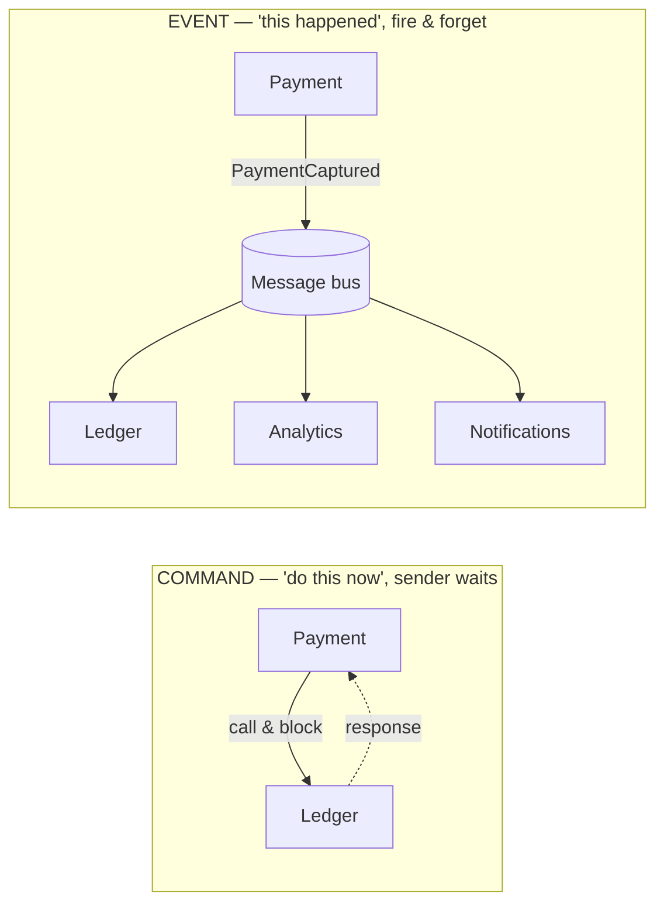
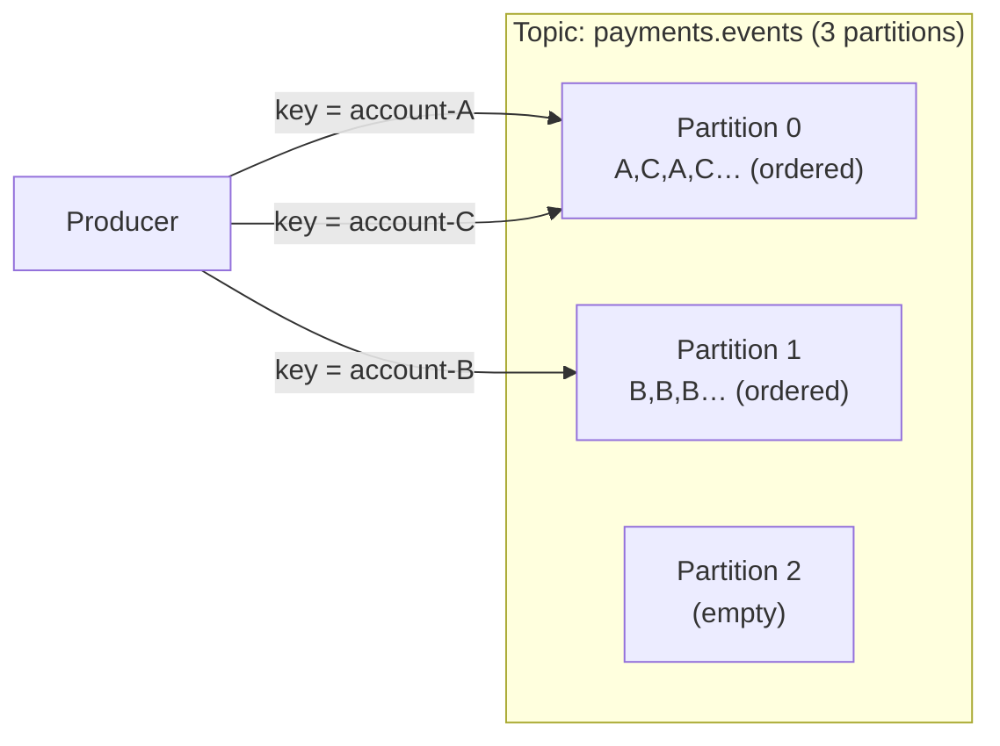
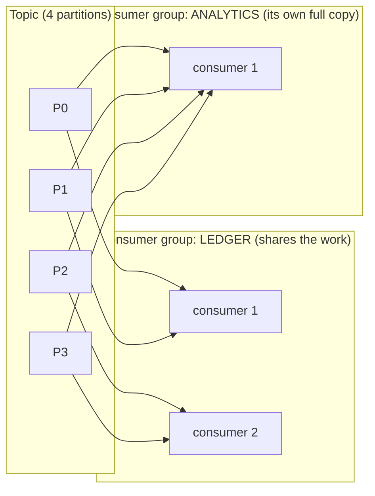

# Event-Driven Architecture & the Message Bus

> **In one sentence:** instead of services calling each other directly, they
> announce facts ("events") to a shared log, and any interested service reacts —
> decoupling *who* does what from *when* it happens.

> 🧊 **In plain terms:** Direct calls are like phoning someone and waiting on the
> line until they finish the task — if they don't pick up, you're stuck. Events
> are like posting on a community notice board: "Baby born! 🎉" You pin it once
> and walk away. The grandparents, the neighbors, the mailman each read it when
> they pass by and react in their own way. You didn't call anyone, you don't wait,
> and you don't even need to know who's reading. New people can start reading the
> board tomorrow without you changing anything.

---

## 1. The core idea: events, not commands

There are two ways to make something happen in a distributed system:

- **Command (imperative):** "Ledger, post this entry." The sender knows the
  receiver and expects it to act *now*. This is a direct call.
- **Event (declarative):** "A payment was captured." The sender states a **fact
  about the past** and doesn't care who listens. Zero, one, or ten services may
  react. The sender doesn't know or wait.

Event-driven architecture (EDA) is built on the second. An **event** is an
immutable record that *something already happened* — named in past tense
(`PaymentCaptured`, `OrderShipped`, `UserRegistered`). It is a fact, not a
request.

This flips the dependency direction. In a command world, Payment depends on
Ledger (it must know Ledger's address and API). In an event world, Ledger depends
on Payment's *events* — Payment doesn't even know Ledger exists. New consumers can
be added later without touching the producer.

---

## 2. What is a message bus / broker?

A **message broker** (a.k.a. message bus) is the middleman that receives events
from producers and delivers them to consumers. Examples: **Apache Kafka**,
RabbitMQ, AWS SQS/SNS, Google Pub/Sub, NATS.

It gives you:

- **Decoupling in identity** — producer and consumer only know the broker.
- **Decoupling in time** — the consumer can be offline; the broker holds the
  message until it's ready (buffering).
- **Fan-out** — many consumers can each get a copy of the same event.
- **Load leveling / backpressure absorption** — a burst of events queues up
  instead of overwhelming a slow consumer.

### Two broker families (important distinction)

1. **Queue / message-broker model (RabbitMQ, SQS):** a message is delivered and
   then **removed**. Good for task distribution ("work queue") where each job is
   handled once and then gone.
2. **Log-based model (Kafka):** events are **appended to an ordered, durable
   log** and **retained** (for days, or forever). Consumers track their own
   position ("offset") and can re-read from any point. This is the model
   Ledgerstream uses, and it's worth understanding deeply.

---

## 3. The log-based model (Kafka), explained properly

Think of a **commit log**: an append-only file where each new record goes at the
end and gets an increasing sequence number (an **offset**). Kafka is a
distributed version of that idea.

### Topics
A **topic** is a named log — a category of events (e.g. `payments.events`).
Producers append to it; consumers read from it.

### Partitions (the key to scale + ordering)
A topic is split into **partitions** — each partition is an independent ordered
log. Two crucial rules:

- **Ordering is guaranteed *within* a partition, never across partitions.** If
  message order matters for a given entity, all its events must go to the *same*
  partition.
- **Partitions are the unit of parallelism.** A topic with 6 partitions can be
  read by up to 6 consumers *in parallel* (one per partition). More partitions →
  more throughput.

How does an event pick a partition? By a **key**. Kafka hashes the key and maps
it to a partition: `partition = hash(key) % partition_count`. All events with the
same key land in the same partition → same ordering. (Choosing this key well is
the "partitioning strategy," and why `hash(tenant, account)` matters — that's a
Phase 2 deep-dive.)

> 🧊 **In plain terms:** a topic is a **highway** and partitions are its **lanes**.
> More lanes = more cars flowing at once (throughput). Cars *within* one lane stay
> in order; but a car in lane 1 and a car in lane 2 have no guaranteed order
> between them. The "key" is the rule that says "all of account A's cars must use
> lane 1" — so account A's events never overtake each other.

### Consumer groups
A **consumer group** is a set of consumer instances cooperating to read a topic.
Kafka assigns each partition to **exactly one** consumer in the group. So:

- Scale out by adding consumers (up to the partition count).
- If a consumer dies, its partitions are **reassigned** to the survivors — this
  is a **rebalance**. (Rebalancing awareness matters: during a rebalance,
  processing briefly pauses and partition ownership moves — your consumer must
  handle being handed a partition mid-stream.)
- Two *different* groups reading the same topic each get their **own full copy**
  of every event (fan-out). This is how the Ledger and, say, an analytics service
  can both consume `payments.events` independently.

> 🧊 **In plain terms:** a **consumer group** is a *team* splitting a pile of work
> so each item is handled once — add teammates to go faster (up to one per lane).
> *Different teams* (groups) each get the **whole pile** to themselves. So Ledger's
> team and Analytics' team both see every payment, but within Ledger's team the
> work is divided, not duplicated.

### Offsets & replay
Each consumer group tracks, per partition, the **offset** of the last event it
processed (it "commits" this). Because the log is retained, a consumer can:

- Resume where it left off after a crash.
- **Replay** history by resetting its offset backward — invaluable for rebuilding
  a read model or recovering from a bug. (Queues that delete on delivery can't do
  this.)

---

## 4. Delivery guarantees (this is where bugs live)

No distributed system gives perfect "exactly once" delivery for free. The three
levels:

- **At-most-once:** deliver, don't retry. Fast, but messages can be lost. Rarely
  acceptable for money.
- **At-least-once:** retry until acknowledged. **No message lost, but duplicates
  happen** (a consumer might process an event, crash before committing its
  offset, and get the same event again on restart). *This is the common default,
  including Kafka's.*
- **Exactly-once:** no loss, no duplicates. Achievable in narrow conditions
  (Kafka transactions within Kafka) but expensive and easy to get subtly wrong
  across external systems.

**The practical stance:** assume **at-least-once**, and make consumers
**idempotent** (processing the same event twice has the same effect as once).
Idempotency is how you get "effectively exactly once" without the cost. (Full
idempotency deep-dive lands with Phase 1.)

> 🧊 **In plain terms:** imagine a letter that must arrive. "At-most-once" = mail
> it and hope (might get lost). "At-least-once" = keep re-sending until you get a
> reply (never lost, but grandma might get three copies). "Exactly-once" = one
> copy, guaranteed — lovely, but very hard across separate systems. The realistic
> plan: accept that duplicates *will* arrive, and make the reader smart enough
> that reading the same letter twice does no extra harm — that's **idempotency**.

---

## 5. Benefits and costs

**Benefits**
- Loose coupling; add consumers without touching producers.
- Resilience: a slow/down consumer doesn't block the producer.
- Natural buffering and load leveling.
- Auditability & replay (log-based): the event log *is* a history.

**Costs / hard parts**
- **Eventual consistency:** consumers lag; the system is never perfectly
  "in sync" at an instant. You must design UIs and reads around this.
- **Harder to trace a flow:** a request becomes a chain of async reactions →
  observability (correlation IDs) is essential.
- **Duplicates & ordering** must be handled explicitly (idempotency, partition
  keys).
- **No global transaction** across producer + consumer → outbox + saga.
- **Schema evolution** matters: events outlive the code that wrote them, so their
  format is a long-lived contract (see [Schema Evolution](schema-evolution-and-contracts.md)).

---

## 6. Common patterns built on EDA

- **Event notification:** thin event ("payment X captured"); consumer calls back
  for details. Small messages, more coupling.
- **Event-carried state transfer:** the event carries all the data a consumer
  needs, so it never has to call back. More decoupled, bigger messages, some
  duplication. (Ledgerstream leans this way — events carry the amounts/ids the
  ledger needs.)
- **Event sourcing:** store *only* the sequence of events as the source of truth
  and derive current state by replaying them (the double-entry ledger is close to
  this in spirit — an append-only history).
- **CQRS (Command Query Responsibility Segregation):** separate the write model
  from one or more read-optimized models built by consuming events (our future
  Mongo read view is a light version).

---

## 7. Interview questions you should be able to answer

- *Difference between an event and a command?* → Event = fact about the past,
  fire-and-forget, many listeners; command = directed request to act now.
- *Why Kafka over a traditional queue?* → Durable, retained, ordered log;
  consumer-controlled offsets; replay; high throughput via partitions; multiple
  independent consumer groups.
- *How does Kafka scale and still keep order?* → Partitions: parallelism across
  partitions, ordering within a partition, key routes related events together.
- *What delivery guarantee does Kafka give and how do you handle it?* →
  At-least-once by default; make consumers idempotent.
- *What's a consumer group rebalance?* → Reassignment of partitions among group
  members when one joins/leaves; processing pauses briefly and ownership moves.
- *Downside of EDA?* → Eventual consistency, harder debugging, duplicate/ordering
  handling, no cross-service ACID.

---

## 8. How Ledgerstream uses it

Kafka (in KRaft mode) is the backbone. Payment produces `payments.events`; Ledger
consumes them in its own consumer group and produces `ledger.events`; Payment
consumes *those* to complete the saga. Topics are partitioned by
`hash(tenant, account)` for per-account ordering. We assume at-least-once delivery
and build **idempotent consumers** so a redelivered `PaymentCaptured` never posts
the ledger twice. The Schema Registry governs the event formats so producers and
consumers can evolve independently.
