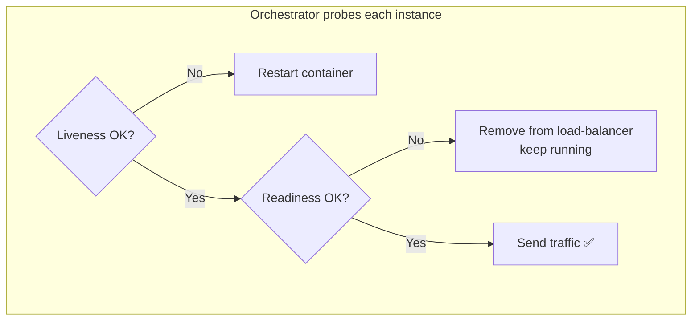
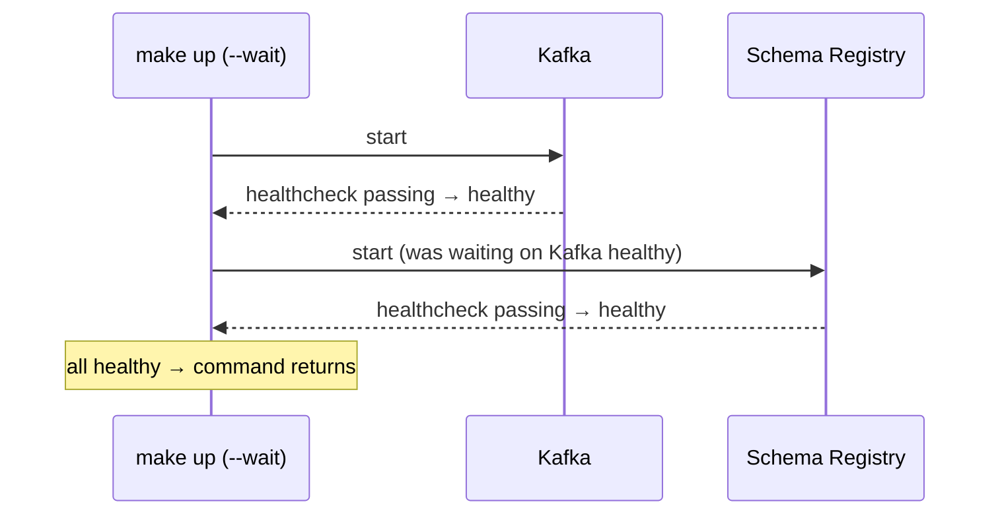

# Health Checks — Liveness & Readiness

> **In one sentence:** health checks are endpoints/commands a service exposes so
> an orchestrator can automatically answer two different questions — "is this
> process broken and should be **restarted**?" (liveness) and "is it ready to
> **receive traffic** right now?" (readiness).

> 🧊 **In plain terms:** Think of a new cashier. **Liveness** = "is the cashier
> conscious?" If they've fainted, call an ambulance (restart them). **Readiness**
> = "is the cashier ready to serve the next customer?" They might be conscious but
> still logging into the till or on their break — in that case, don't send
> customers to their lane *yet*, but don't fire them either. Confusing these two
> gets people fired for taking a coffee break.

---

## 1. Why two different checks

A naïve system has one "health" endpoint. That conflates two situations that need
**opposite** responses:

| Situation | Right action | Check |
|---|---|---|
| Process is deadlocked / out of memory / wedged | **Restart it** | **Liveness** |
| Process is fine but *temporarily* can't serve (starting up, lost its DB connection, overloaded) | **Stop sending traffic, keep it alive** | **Readiness** |

If you restart a service just because it's momentarily not ready (say its database
blipped), you can trigger a **restart storm** — every instance restarts at once,
nothing recovers, outage amplified. If instead you *route traffic away* until it
recovers, the system self-heals. That's why the two checks exist and must be
distinct.

---

## 2. Liveness

**Question:** "Is this process alive and making progress, or is it stuck in a way
only a restart can fix?"

- **On failure:** the orchestrator (Kubernetes, Docker, a supervisor) **kills and
  restarts** the container.
- **Keep it dumb and cheap.** A liveness check should test the process itself, not
  its dependencies. If liveness checks the database and the database is down,
  every service gets restarted repeatedly for a problem restarting won't fix —
  making things worse. Liveness answering "yes, my event loop is responsive" is
  usually enough.

**Typical implementation:** a trivial `GET /health/live` that returns `200` if the
process can respond at all.

---

## 3. Readiness

**Question:** "Right now, can this instance correctly serve requests?"

- **On failure:** the orchestrator/load-balancer **removes this instance from
  rotation** (stops sending it traffic) but **does not restart it**. When it
  passes again, traffic returns.
- **Check the dependencies you need to serve:** database reachable? migrations
  applied? cache/broker connection up? warm-up finished?

**Typical implementation:** `GET /health/ready` that verifies critical
dependencies and returns `200` only when the instance can actually do its job.

---

## 4. Startup & the roll-out payoff

- **Startup probe** (a third kind): for slow-booting apps, it gives extra grace
  *before* liveness kicks in, so a slow start isn't mistaken for a hang.
- **Zero-downtime deploys depend on readiness.** During a rolling update, a new
  version starts, and traffic is withheld until its **readiness** passes; only
  then is an old instance retired. Readiness is what makes "deploy without
  dropping requests" possible.

---

## 5. Health checks in `docker-compose` (what Phase 0 uses)

Compose has a `healthcheck:` per container — a command run on an interval. Until
it passes, the container is `starting`, then `healthy`/`unhealthy`. Combined with:

- **`depends_on: condition: service_healthy`** — don't start B until A is
  *healthy* (e.g. Schema Registry waits for Kafka).
- **`docker compose up --wait`** — the command blocks until everything is healthy,
  so "it returned" means "the system is genuinely ready."

This is the compose-level cousin of Kubernetes liveness/readiness: same idea
(ask each component "are you ready?"), simpler machinery.

---

## 6. Good-practice notes (interview color)

- **Don't make liveness depend on downstreams** → avoids cascading restarts.
- **Readiness *should* reflect downstreams** you can't serve without.
- **Fail fast at startup** for *missing config* (crash immediately — a restart
  won't help until config is fixed), but **degrade/retry** for *transient*
  dependency loss (report not-ready, keep trying).
- **Keep checks cheap** — they run every few seconds forever; a heavy check
  becomes its own load problem.

---

## 7. Interview questions you should be able to answer

- *Liveness vs readiness — difference and the action each triggers?* → Liveness:
  is it broken? → **restart**. Readiness: can it serve now? → **add/remove from
  load-balancer**, don't restart.
- *Why not one combined health check?* → The two failures need opposite responses;
  conflating them causes restart storms or serving traffic to a not-ready instance.
- *Should liveness check the database?* → No — a DB outage would restart every
  instance pointlessly and worsen the incident. Readiness checks dependencies.
- *How do health checks enable zero-downtime deploys?* → New instances receive
  traffic only after readiness passes; old ones retire after — no dropped
  requests.
- *What's a startup probe for?* → Slow-starting apps: grace period before liveness
  applies, so a slow boot isn't mistaken for a hang.

---

## 8. How Ledgerstream uses it

Every infra container in `docker-compose.yml` defines a `healthcheck`, and
`make up` uses `--wait` so the whole stack is confirmed healthy before you get
your prompt back. Dependent containers (e.g. Schema Registry) wait for their
prerequisites via `depends_on: service_healthy`. When the application services
arrive (Phase 1), each Django/FastAPI service will expose **`/health/live`** and
**`/health/ready`** endpoints and shut down gracefully — the service-level version
of the same idea.
