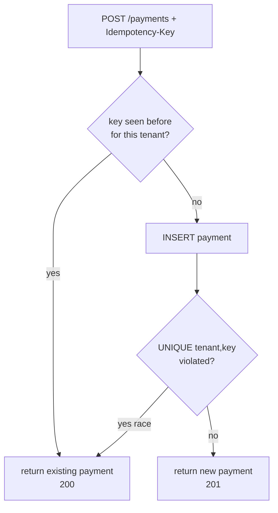

# Idempotency

> **In one sentence:** an operation is *idempotent* if doing it many times has the
> same effect as doing it once — so a retry (which is inevitable in distributed
> systems) can never cause a second charge, a duplicate order, or a double ledger
> entry.

> 🧊 **In plain terms:** an elevator "call" button is idempotent — press it once or
> five times, the elevator still comes exactly once. A "place order" button that
> charges you every time you click it is **not** idempotent, which is why you've
> nervously clicked "Pay" once and prayed. Idempotency is designing the second,
> third, and tenth press to be harmless.

---

## 1. Start with the bug it prevents

Networks are unreliable, so clients and message systems **retry**. Picture a
customer paying $5:

```
   Client ──POST /payments {$5}──►  Server charges $5, saves it... 
          ◄───(response lost! network blip)───
   Client: "no response? I'll retry."
   Client ──POST /payments {$5}──►  Server charges $5 AGAIN  💸💸
```

The client *had* to retry (it couldn't tell "request lost" from "response lost").
Without idempotency, the retry **double-charges**. The same thing happens with
Kafka: delivery is **at-least-once**, so a consumer will sometimes receive the same
event twice (see [Kafka §6b](kafka.md)). If processing it twice posts the ledger
twice, your books are wrong.

**Retries are not optional. So idempotency is not optional** — for anything that
moves money or creates records.

---

## 2. What "idempotent" means precisely

`f` is idempotent if `f(f(x)) == f(x)`. In practice: **running the operation again
with the same input produces the same result and no additional side effects.**

- "Set balance to 100" → idempotent (run it twice, still 100).
- "Add 100 to balance" → **not** idempotent (run twice, +200).
- "Read my payments" → idempotent (no side effects).

The goal is *effectively-once* behavior on top of *at-least-once* delivery.

---

## 3. Technique A — idempotency keys (for creating things)

For an operation that *creates* something (a payment), the client sends a unique
**Idempotency-Key** header. The server records that key with the result; a retry
with the same key returns the *existing* result instead of creating a second one.

```
   POST /payments   Idempotency-Key: abc-123   →  creates payment P1, remembers abc-123 → P1
   POST /payments   Idempotency-Key: abc-123   →  sees abc-123 already done → returns P1 (no new payment)
```

### The implementation that's actually safe under a race

A naïve "check if key exists, else create" has a race: two retries arriving at
once both pass the check and both create. The fix is to let the **database** be
the referee with a **UNIQUE constraint** — exactly one INSERT can win.

Our `Payment` model (`payments/models.py`):

```python
class Meta:
    constraints = [
        models.UniqueConstraint(
            fields=["tenant", "idempotency_key"],       # unique PER TENANT
            name="uniq_tenant_idempotency_key",
            condition=models.Q(idempotency_key__isnull=False),  # only when a key is given
        )
    ]
```

Our create logic (`payments/services.py`):

```python
def authorize_payment(*, tenant_id, amount_minor, currency, reference, idempotency_key):
    if idempotency_key:                                     # fast path
        existing = Payment.objects.for_tenant(tenant_id).filter(
            idempotency_key=idempotency_key).first()
        if existing:
            return existing, False                          # replay: return the same payment
    try:
        with transaction.atomic():
            payment = Payment.objects.create(..., idempotency_key=idempotency_key)
        return payment, True                                # created
    except IntegrityError:                                  # race: someone else won
        return Payment.objects.for_tenant(tenant_id).get(
            idempotency_key=idempotency_key), False          # return the winner
```

The view returns **201** on create and **200** on replay. We verified this against
Neon: two `POST`s with `Idempotency-Key: demo-1` returned the **same** payment id
(201 then 200), and the DB held exactly one row.

> **Note the key is scoped per tenant** — `(tenant, key)`, not global. Tenant A and
> tenant B can both use `"order-1"` without colliding (a tested case).



---

## 4. Technique B — idempotent consumers (for processing events)

On the Kafka side you can't add a client header — the *same event* just gets
redelivered. Make the **handler** idempotent instead, using the event's natural id:

- **Natural idempotency:** design the write so a repeat is harmless. Our
  `capture_payment` checks `if status == "CAPTURED": return` — capturing an
  already-captured payment does nothing and emits no second event. (Verified:
  capturing twice produced exactly one outbox event.)
- **Dedup table (inbox pattern):** record each processed `event_id`; skip if seen.
  The Ledger consumer will use this in Phase 2 so a redelivered `PaymentCaptured`
  never posts the ledger twice.
- **Upsert / conditional update:** `INSERT ... ON CONFLICT DO NOTHING`, or update
  only if in the expected state.

---

## 5. HTTP methods and idempotency (interview classic)

The HTTP spec already classifies methods:

| Method | Idempotent? | Why |
|---|---|---|
| GET, HEAD | ✅ | reads, no side effects |
| PUT | ✅ | "set resource to X" — same result every time |
| DELETE | ✅ | deleting twice → still deleted (same end state) |
| **POST** | ❌ | "create a new thing" — naturally makes a new one each time |

That's *why* `POST` (create a payment) is the one that needs an **Idempotency-Key**
to be made safe, while `PUT`/`GET` are already fine.

---

## 6. Interview questions you should be able to answer

- *Define idempotency and why it matters.* → Repeating an operation has the same
  effect as doing it once; matters because retries are unavoidable (lost responses,
  at-least-once delivery) and must not double-charge/duplicate.
- *How do idempotency keys work?* → Client sends a unique key; server records
  key→result and returns the existing result on a retry with the same key.
- *How do you make that race-safe?* → A UNIQUE constraint on the key so only one
  INSERT wins; the loser catches the conflict and returns the winner. The DB is the
  referee.
- *Consumer-side idempotency without a client key?* → Use the event id: natural
  idempotency (no-op if already applied), a dedup/inbox table, or an upsert.
- *Which HTTP methods are idempotent?* → GET/HEAD/PUT/DELETE yes; POST no — which is
  why POST needs an idempotency key.
- *Exactly-once vs idempotency?* → True exactly-once across systems is impractical;
  at-least-once delivery + idempotent handlers gives *effectively-once*.

---

## 7. How Ledgerstream uses it

Two layers, both Tier 1:
1. **API idempotency** — `POST /payments` honours an `Idempotency-Key`, enforced by
   a UNIQUE `(tenant, idempotency_key)` constraint, so client retries never create
   two payments (verified: 201 then 200, one row).
2. **Operation idempotency** — `capture_payment` is a no-op if already captured, so
   a retried capture emits no duplicate outbox event.
3. **Consumer idempotency (Phase 2)** — the Ledger consumer will dedupe redelivered
   `PaymentCaptured` events (at-least-once → effectively-once) before posting the
   immutable ledger.

Together these are what make the money movements correct under the retries that
distributed systems guarantee will happen.

---

*Related: [Outbox](outbox-pattern.md) (why at-least-once → duplicates) ·
[Kafka §6–7](kafka.md) (delivery semantics) ·
[Event-Driven Architecture §4](event-driven-architecture.md).*
