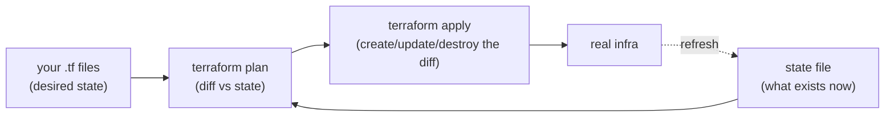

# Infrastructure as Code (Terraform)

> **What this is:** describing your infrastructure — clusters, namespaces, databases, DNS,
> the app release — as **code** in version control, so `apply` creates or updates it
> reproducibly, instead of clicking around a cloud console.

> 🧊 **Layman box.** **Infrastructure as Code (IaC)** is the difference between *assembling
> furniture from a written plan* and *improvising with a screwdriver each time*. Write the
> plan once (a file), and anyone can build the exact same thing, tear it down, or rebuild it
> identically. **Terraform** reads your plan, compares it to what already exists, and does
> only the difference — add the missing shelf, don't rebuild the whole cabinet.

---

## 1. The problem it solves

Clicking in a cloud console ("ClickOps") is unrepeatable, undocumented, and drifts: nobody
remembers exactly which settings produced the working environment, staging ≠ prod, and there's
no review or rollback. **IaC** makes infrastructure a **declarative, versioned artifact**:

- **Reproducible** — the same code builds the same environment every time (dev = staging = prod).
- **Reviewable** — changes go through PRs; `plan` shows the diff before you touch anything.
- **Auditable / recoverable** — git history is the record; rebuild after a disaster from code.
- **Composable** — modules and variables parameterize per-environment differences.

---

## 2. Declarative + desired state + the plan/apply loop

Like Kubernetes, Terraform is **declarative**: you write the **desired state** (the resources
you want), and Terraform figures out the actions to get there.



- **`plan`** — dry run: compares your code to the **state** and prints what it *would* change.
  You read it before applying. This preview is IaC's superpower.
- **`apply`** — makes reality match: creates, updates, or destroys only the diff.
- **`destroy`** — tears down everything the code manages.

---

## 3. State — the concept people underestimate

Terraform keeps a **state file** mapping your code's resources to real-world ids/attributes.
It's how `plan` knows what already exists. Two things to internalize:

- **State can contain secrets** (resource attributes, generated passwords). Never commit it;
  in teams, store it in a **remote backend** (S3 + DynamoDB lock, Terraform Cloud) with
  encryption and **locking** (so two people don't `apply` at once and corrupt it).
- **Drift**: if someone changes infra by hand, state and reality diverge; the next `plan`
  shows the drift so you can reconcile. Don't mutate managed infra out-of-band.

Ledgerstream's `deploy/terraform/.gitignore` blocks `*.tfstate` and `*.tfvars` for exactly the
"state/vars hold secrets" reason; only `terraform.tfvars.example` is committed.

---

## 4. The building blocks

- **Providers** — plugins that talk to one API (AWS, `kubernetes`, `helm`, Cloudflare…). You
  configure them (credentials/endpoint) and they expose resources. Ledgerstream uses the
  `kubernetes` + `helm` providers, both reading your kubeconfig.
- **Resources** — a thing to manage (`kubernetes_namespace`, `helm_release`). Terraform creates
  and tracks each.
- **Variables** — inputs (`var.image_tag`, `var.secrets`); set via `-var`, `*.tfvars`, or
  `TF_VAR_*` env. Mark sensitive ones `sensitive = true`.
- **Outputs** — values to surface after apply (the namespace, release status).
- **Modules** — reusable bundles of resources (a "vpc" module, an "app" module) — the function
  abstraction of IaC.
- **Data sources** — read existing/external values (e.g. a secret from a manager) without
  managing them.

```hcl
resource "helm_release" "ledgerstream" {
  name      = var.release_name
  namespace = kubernetes_namespace.ledgerstream.metadata[0].name
  chart     = "${path.module}/../helm/ledgerstream"
  dynamic "set_sensitive" {              # inject each secret without logging it
    for_each = var.secrets
    content { name = "secretEnv.${set_sensitive.key}", value = set_sensitive.value }
  }
}
```

`set_sensitive` (vs `set`) keeps the value out of plan output and console logs — the IaC way to
pass a secret into a Helm release.

---

## 5. Idempotency & dependency ordering

- **Idempotent**: running `apply` twice with unchanged code changes nothing the second time —
  Terraform converges to desired state, it doesn't blindly re-run steps.
- **Dependency graph**: Terraform infers order from references. `helm_release.namespace =
  kubernetes_namespace.ledgerstream.metadata[0].name` makes the release depend on the namespace,
  so the namespace is created first — no manual ordering.

---

## 6. Terraform vs the alternatives

- **Terraform / OpenTofu** — cloud-agnostic, declarative, huge provider ecosystem; state-based.
  The lingua franca of multi-cloud IaC.
- **Pulumi** — same model, but infra in a real language (TS/Python/Go) instead of HCL.
- **CloudFormation / ARM / Deployment Manager** — cloud-native, single-vendor.
- **Ansible** — more configuration *management* (procedural, agentless SSH); overlaps but is
  imperative-leaning.
- **Helm** — packages **k8s** objects specifically; Terraform can *invoke* Helm (as here) but
  also manages non-k8s infra (DNS, databases, buckets). They compose: Terraform for the
  platform, Helm for the app on it.

---

## 7. Interview questions you should be able to answer

- **What problem does IaC solve over ClickOps?** Reproducibility, review (plan diff), audit
  (git), disaster recovery, no drift — infra becomes a versioned artifact.
- **plan vs apply?** `plan` previews the diff vs state; `apply` makes reality match. Reviewing
  the plan before applying is the safety gate.
- **What is state and why guard it?** The map from code to real resources; it can hold secrets
  and must be locked in a shared remote backend so concurrent applies don't corrupt it.
- **How does Terraform order operations?** A dependency graph inferred from references — no
  manual sequencing.
- **What does idempotent mean here?** Re-applying unchanged code is a no-op; Terraform converges
  to desired state rather than re-running steps.
- **How do you handle secrets in Terraform?** `sensitive` variables, `set_sensitive`, values
  from `TF_VAR_*`/a secrets manager (data source), never in committed tfvars or state in git.
- **Terraform vs Helm vs Ansible?** Provision infra (declarative, multi-API) vs package k8s
  objects vs configure machines (procedural); they compose — Terraform installs the Helm chart.
- **What is drift and how do you detect it?** Out-of-band changes make state ≠ reality; the next
  `plan` reveals it. Fix by re-applying or importing.

---

## 8. In Ledgerstream

[deploy/terraform](../../deploy/terraform) is deliberately small and honest: the `kubernetes`
provider creates the **namespace**, the `helm` provider installs the **chart** from Part 3 of
[phase7.md](../phase7.md), and secrets are injected via `set_sensitive` (kept out of logs).
Backing data stores (Neon/Upstash/Atlas/Kafka) stay **external inputs** — Terraform manages the
app release, not managed databases. Validated with `terraform fmt` / `init` / `validate`;
`.gitignore` keeps state and real tfvars out of git. Remote state + a real cloud provider (and
GitOps) are the named production upgrades — this phase demonstrates the pattern without renting
a cluster.

---

## 9. The Ledgerstream code, explained simply

The config lives in [`deploy/terraform/`](../../deploy/terraform/), split across small files by
role. In plain English:

### `versions.tf` — "which tools and plugins"
```hcl
required_version = ">= 1.5"
required_providers {
  kubernetes = { source = "hashicorp/kubernetes", version = "~> 2.30" }
  helm       = { source = "hashicorp/helm",       version = "~> 2.14" }
}
```
**"Use Terraform 1.5+, and download two plugins: one that can talk to Kubernetes, one that can
run Helm."** A **provider** is just a plugin for one system; `~> 2.30` means "any 2.x from 2.30
up, but not 3.0" (safe minor updates).

### `variables.tf` — "the inputs you can set"
Each `variable` block is a knob:
```hcl
variable "image_registry" { type = string }              # no default → you MUST provide it
variable "image_tag"      { type = string, default = "latest" }
variable "secrets"        { type = map(string), sensitive = true, default = {} }
```
**"`image_registry` is required; `image_tag` defaults to `latest`; `secrets` is a bag of
key→value pairs that Terraform will keep hidden (`sensitive = true`) from its output."**

### `main.tf` — "what to actually build"
First it tells both plugins how to reach your cluster (your kubeconfig):
```hcl
provider "kubernetes" { config_path = var.kubeconfig, config_context = ... }
provider "helm"       { kubernetes { config_path = var.kubeconfig, ... } }
```
Then two **resources** — the things Terraform creates and remembers:
```hcl
resource "kubernetes_namespace" "ledgerstream" {   # 1) make a namespace
  metadata { name = var.namespace }
}
resource "helm_release" "ledgerstream" {           # 2) install the Helm chart into it
  name      = var.release_name
  namespace = kubernetes_namespace.ledgerstream.metadata[0].name   # ← reference = "do this second"
  chart     = "${path.module}/../helm/ledgerstream"
  ...
}
```
**"Create a namespace, then install our Helm chart into it."** Because the release *references*
the namespace, Terraform automatically knows to make the namespace **first** — you never write
ordering by hand; it reads the references and figures it out.

Passing values into the chart:
```hcl
set { name = "image.tag", value = var.image_tag }       # a normal value
dynamic "set_sensitive" {                               # one hidden value per secret
  for_each = var.secrets
  content { name = "secretEnv.${set_sensitive.key}", value = set_sensitive.value }
}
```
**"Pass the image tag as a plain value, and pass each secret with `set_sensitive` so it never
shows up in logs."** `dynamic` = "repeat this block once per item in the map" (so 5 secrets →
5 `--set-string secretEnv.X=...` under the hood).

### `outputs.tf` — "what to print when done"
```hcl
output "release_status" { value = helm_release.ledgerstream.status }
```
**"After installing, print the release status (e.g. `deployed`)."** Outputs are the values
Terraform hands back so you (or a script) can use them.

### `.gitignore` — "never commit these"
State files (`*.tfstate`) and real value files (`*.tfvars`) can contain secrets, so they're
excluded — only the safe `terraform.tfvars.example` template is committed.

### The mental model
You *describe* the end result (a namespace + an installed chart); `terraform plan` shows what
it'll change, `terraform apply` makes it real, and it remembers everything in **state** so next
time it only does the difference.
