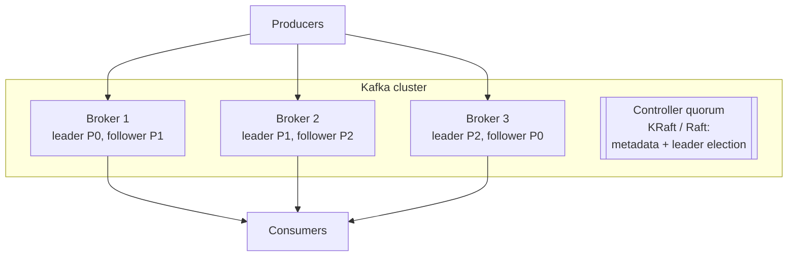
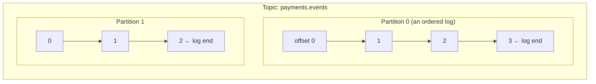
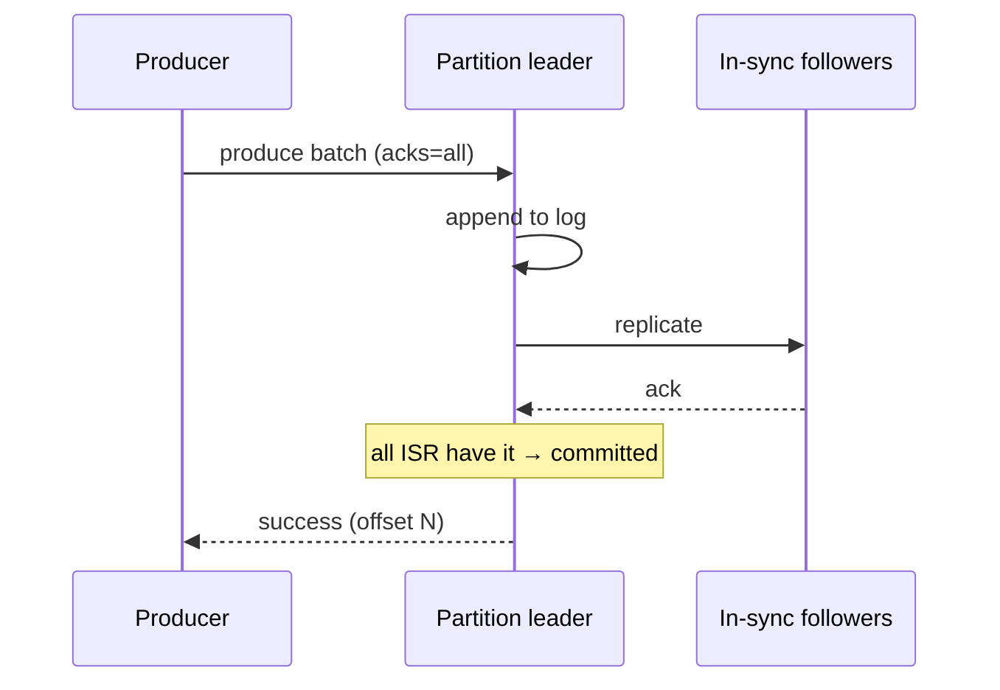
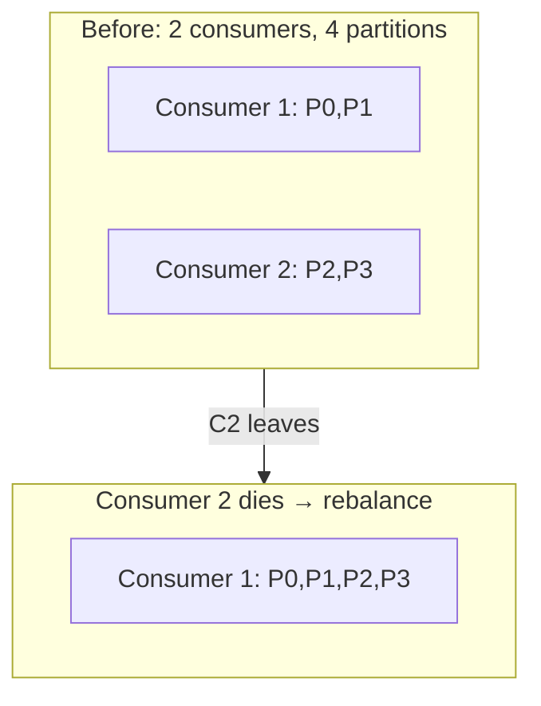
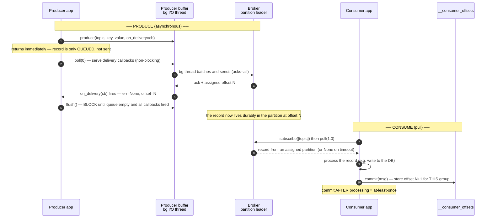
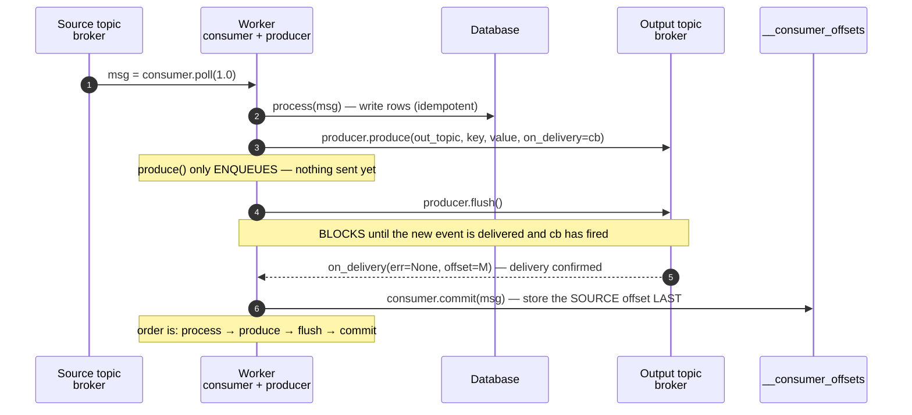
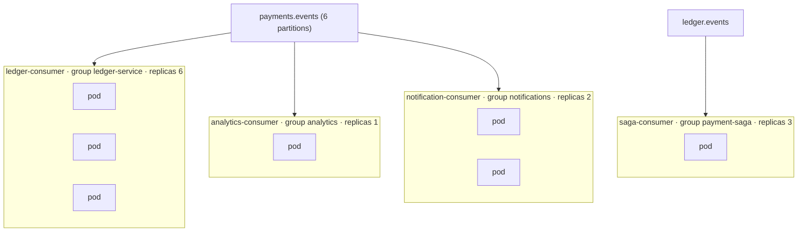

# Apache Kafka — a deep dive

> **In one sentence:** Kafka is a distributed, durable, replicated **commit log**
> — an append-only sequence of records, split into partitions across a cluster,
> that lets many producers write and many consumer groups read *independently* and
> *in order*, retaining data so consumers can replay it.

> 🧊 **In plain terms:** Kafka is a **shared, tamper-proof notebook** that many
> people write into and many people read from. New notes only ever go at the
> *end* (append-only), each note gets a line number (offset), and the notebook is
> photocopied to several people (replication) so it survives if one is lost. Each
> reader keeps their *own* bookmark, so a slow reader never holds up a fast one,
> and anyone can flip back to re-read old notes. The notebook is split into
> several volumes (partitions) so many people can read and write at once.

> This doc goes into **Kafka internals**. For the *general* messaging ideas
> (events vs commands, why a bus at all) read
> [Event-Driven Architecture](event-driven-architecture.md) first; this file
> assumes it.

---

## 1. The core abstraction: the distributed commit log

A **commit log** is the simplest durable data structure: an append-only file
where every new record goes at the end and gets a monotonically increasing
number. Databases use one internally (the write-ahead log). Kafka's insight:
**expose that log itself as the product**, and distribute it.

Everything else in Kafka is a consequence of this. Because it's a log (not a
queue that deletes on read):
- reads don't destroy data → **many independent consumers**;
- position is just a number → **replay** by moving your bookmark;
- appends are sequential → **very fast** (see §9).

---

## 2. Cluster architecture: brokers, controller, KRaft



- **Broker** — one Kafka server. It stores partition data on disk and serves
  produce/fetch requests. A **cluster** is several brokers sharing the load.
- **Controller** — a special role that manages **cluster metadata**: which topics
  and partitions exist, and **which broker is the leader** for each partition. If
  a broker dies, the controller elects new partition leaders.
- **KRaft vs ZooKeeper** — historically Kafka stored metadata in a separate
  **ZooKeeper** ensemble. Modern Kafka (our setup) uses **KRaft**: the controller
  role runs *inside* Kafka using the **Raft** consensus algorithm on a controller
  quorum. Fewer moving parts, faster failover, one system to operate. (See
  [Consensus & Coordination](consensus-and-coordination.md) for how Raft/quorums
  work.)

> Locally we run **one** broker that is *both* broker and controller. Production
> runs **3+** brokers so both the data (replication) and the metadata (controller
> quorum) survive failures.

---

## 3. The data model: topic → partition → segment → offset



- **Topic** — a named category/stream (e.g. `payments.events`). Purely logical.
- **Partition** — the physical unit: **one ordered, append-only log**. A topic is
  split into N partitions. **This is where all of Kafka's scaling and ordering
  behavior lives.**
- **Offset** — the position of a record within its partition (0, 1, 2, …).
  Unique per partition, never reused. A consumer's progress is just "the next
  offset I need in partition P."
- **Segment** — on disk, a partition is chunked into **segment files** (plus
  index files). Old segments are deleted or compacted as a whole — that's how
  retention is enforced efficiently (delete a file, don't scan rows).

### The two iron laws of partitions (memorize these)
1. **Order is guaranteed only *within* a partition** — never across partitions.
2. **A partition is the unit of parallelism** — for one consumer group, each
   partition is consumed by exactly one consumer, so max parallelism = partition
   count.

Everything about choosing keys and partition counts flows from these two laws.

### Broker config vs topic config (why there's no "partitions" env var)

A common point of confusion: our `docker-compose.yml` sets lots of `KAFKA_*`
environment variables, but **none for partitions**. That's not an omission —
**partition count is a per-*topic* property, set at topic creation, not a *broker*
setting.**

- **Broker-level config** (the `KAFKA_*` env vars): listeners, node id,
  internal-topic replication factors — cluster-wide server settings.
- **Topic-level config** (partitions, a topic's replication factor, retention,
  cleanup policy): chosen **per topic**, when the topic is created. Different
  topics on the same broker have different partition counts:

```
   payments.events  -> 6 partitions      ledger.events -> 6 partitions
   payments.dlq     -> 1 partition        (all on the same broker)
```

There *is* a broker setting called `num.partitions` (`KAFKA_NUM_PARTITIONS`), but
it **only** supplies the default partition count for **auto-created** topics — and
we deliberately set `KAFKA_AUTO_CREATE_TOPICS_ENABLE=false`. With auto-create off,
that default never fires, so setting it would be dead, misleading config. Instead
every topic is created **explicitly** (Phase 2) with an intentional partition
count, via the CLI or the AdminClient API:

```bash
kafka-topics --create --topic payments.events \
  --partitions 6 --replication-factor 1 --bootstrap-server localhost:29092
```

> **Interview line:** "Partition count is a per-topic property set at topic
> creation, not a broker config. `num.partitions` is only a default for
> auto-created topics — and we disable auto-create so every topic is declared
> explicitly with an intentional partition count." (See §10 for *how many* to
> choose and why you can't easily reduce it later.)

---

## 4. Producers

A **producer** writes records `(key, value, headers)` to a topic. Three producer
decisions matter deeply.

### 4a. Partitioning — which partition does a record go to?
- **Key present:** `partition = hash(key) % num_partitions`. **All records with
  the same key land on the same partition** → same relative order. This is how you
  keep "all of account A's events in order": key by account.
- **No key:** records are spread across partitions (sticky-batched round-robin)
  for even load, but you lose per-entity ordering.

> **Choosing the key is a design decision, not a detail.** Key too coarse (e.g.
> by `tenant`) → a big tenant floods one partition (**hot partition**, capped at
> one consumer). Key too fine → you lose the ordering you needed. Ledgerstream
> keys by `hash(tenant, account)` — fine enough to spread load, coarse enough to
> keep per-account order. (Full partitioning/consistent-hashing deep-dive: Phase 2.)

#### Partitioning vs "partition leader" — don't confuse them

Two *different* jobs share confusing names:

- **Partitioning** = choosing **which partition** a record goes to. Done by the
  **producer, client-side**, *before* the record reaches any broker
  (`partition = hash(key) % num_partitions`). The broker plays no part in it.
- **Partition leader** = **which broker owns a given partition's data**. Each
  partition has several replicas across brokers; one is elected **leader** and
  handles that partition's reads/writes, the rest are **followers** that copy it.
  The leader does **not** do the partitioning — it just owns the partition the
  producer already chose.

There is **no "partitioning within a broker"**: a partition is an atomic unit; a
broker holds a partition's leader replica, a follower replica, or nothing.

**Full flow** — topic with 3 partitions, RF=3, across 3 brokers:

```
  Leadership map (assigned by the KRaft controller, stored in cluster metadata):
    P0  leader = Broker 1    followers = Broker 2, Broker 3
    P1  leader = Broker 2    followers = Broker 1, Broker 3
    P2  leader = Broker 3    followers = Broker 1, Broker 2

  Producer sends a record with key = "account-A":

  STEP 1 (client-side) PARTITIONING:
     hash("account-A") % 3  =  P2          <- producer decides the partition

  STEP 2 (client-side) LEADER LOOKUP:
     from metadata, P2's leader = Broker 3

  STEP 3  send the record to Broker 3 (P2's leader) ONLY:
     Producer ───────────────► Broker 3  (writes P2)
                                   ├──► Broker 1 (P2 follower) copies
                                   └──► Broker 2 (P2 follower) copies
```

Step 1 is *partitioning* (producer's job). The *partition leader* only matters in
steps 2–3: once the producer knows it wants P2, it needs to know *which broker to
send to* — the one leading P2.

**Why leadership is spread out:** each broker leads a *different* partition, so
write/read load is balanced — if one broker led every partition, all traffic would
hit it. Every broker is a leader for some partitions and a follower for others.

> **Three "leaders" not to confuse:** the **producer** decides partitioning; a
> **partition leader** (per partition) owns that partition's I/O; the **KRaft
> controller leader** (cluster-wide) tracks metadata and *elects* the partition
> leaders. See §2 and [Consensus & Coordination](consensus-and-coordination.md).

> **Interview line:** "The producer decides the partition, client-side, by key
> hash. The partition leader is just the broker that owns that partition's reads
> and writes — it doesn't do the partitioning. Leadership is spread across brokers
> to balance load."

### 4b. `acks` — the durability vs latency dial
When does the producer consider a write "successful"?

| `acks` | Producer waits for… | Guarantee | Trade-off |
|---|---|---|---|
| `0` | nothing (fire and forget) | may **lose** data | fastest |
| `1` | the **leader** to write it | lost if leader dies before replicas copy it | balanced |
| `all` (`-1`) | leader **+ all in-sync replicas** | **no loss** while ≥1 in-sync replica survives | slowest, safest |

For money you use **`acks=all`** together with replication + `min.insync.replicas`
(see §5). That combination is the durability story.

### 4c. The idempotent producer (avoids duplicates *from retries*)
Producers retry on transient errors — which could write the same record twice.
The **idempotent producer** (`enable.idempotence=true`, now default) tags each
batch with a producer ID + sequence number so the broker **deduplicates retries**,
giving **exactly-once *delivery to a partition*** even across retries. (This is
producer-side; consumer-side idempotency is still your job — §7.)

Producers also **batch** records (`linger.ms`, `batch.size`) and **compress**
them for throughput — many small records become few big sequential writes.



---

## 5. Replication — how Kafka doesn't lose your data

Each partition has a **replication factor** (RF). With RF=3, the partition exists
on three brokers: one **leader** (handles all reads/writes) and two **followers**
(passively copy the leader).

- **ISR (In-Sync Replicas):** the set of replicas currently caught up to the
  leader. A follower that falls behind drops out of the ISR until it catches up.
- **`min.insync.replicas`:** the minimum ISR size required for an `acks=all` write
  to succeed. With RF=3 and `min.insync.replicas=2`, a write needs the leader + at
  least one follower to have it — so you can lose **one** broker with **zero data
  loss** and stay available.
- **Leader failure:** the controller promotes an in-sync follower to leader.
  Because only in-sync replicas are eligible, no committed data is lost.

> **The durability recipe (interview-ready):** `RF=3` + `min.insync.replicas=2` +
> producer `acks=all`. Any one weaker (RF=1, or acks=1) and a single broker
> failure can lose data. This is *the* Kafka durability answer.

> Locally we run **RF=1** (one broker) — no redundancy, fine for learning, called
> out explicitly in DESIGN.md §10 as "would be 3 in production."

---

## 6. Consumers, groups, offsets & rebalancing

### 6a. Consumer groups (parallelism + fan-out)
A **consumer group** is consumers cooperating under a shared `group.id`. Kafka
assigns each partition to **exactly one** consumer in the group.

- More consumers → more parallelism, **up to the partition count** (extra
  consumers sit idle). Want more parallelism? Add partitions.
- **Different groups each get the full stream** independently (fan-out) — Ledger
  and Analytics can both consume every payment.

> **⚠️ Common misconception — partitions are the *ceiling* on parallelism, not
> parallelism itself.** A **single** consumer assigned to 6 partitions does NOT
> process 6 messages in parallel — it's one process with one poll loop, handling
> messages **sequentially**. Parallelism comes from the number of **consumers**
> (each a separate process owning a subset of partitions), capped by the partition
> count:
>
> | Partitions | Consumers | Actual parallelism | Each owns |
> |---|---|---|---|
> | 6 | 1 | **1×** (sequential) | all 6 |
> | 6 | 2 | **2×** | 3 each |
> | 6 | 6 | **6×** (max) | 1 each |
> | 6 | 7 | **6×** (7th idle) | 6 own 1 |
>
> So it's `min(consumers, partitions)`, never "consumers × partitions." Partitions =
> how many parallel lanes exist; consumers = how many drivers you actually put on
> the road (one driver covers several lanes but drives one car at a time). For low
> volume (say 6–7 msg/s), a *single* consumer is usually plenty — the extra
> partitions are just headroom to add consumers later without repartitioning.

### 6b. Offsets & commits (where at-least-once bugs come from)
Each group tracks, per partition, the offset of the last record it processed, and
**commits** it (stored in the internal `__consumer_offsets` topic). On restart or
rebalance, it resumes from the committed offset.

**The critical ordering question — do you commit before or after processing?**
- **Commit *before* processing** → if you crash mid-process, the offset already
  moved → **message skipped (data loss)** = *at-most-once*.
- **Commit *after* processing** → if you crash after processing but before
  committing, you'll **reprocess it** on restart → **duplicate** = *at-least-once*.

Kafka's safe default is **commit after → at-least-once → duplicates possible** →
which is exactly why **consumers must be idempotent** (§7). Prefer **manual
commits** after successful processing over auto-commit for correctness-critical
work.

### 6c. Rebalancing (and why your consumer must expect it)
When a consumer joins/leaves/dies (or partitions change), Kafka **rebalances** —
reassigns partitions among the surviving members.

- During a **stop-the-world (eager)** rebalance, *all* consumers pause and
  reassign — brief processing halt.
- **Cooperative (incremental) rebalancing** moves only the affected partitions,
  minimizing the pause (modern default).
- **Assignment strategies:** Range, RoundRobin, **Sticky** (tries to keep existing
  assignments to reduce churn).

**What this means for your code:** a partition can be taken from you at any time
(commit your offsets before it's revoked, via the rebalance listener), and you can
be handed a partition mid-stream (you'll start from its last committed offset).
Never assume you "own" a partition forever. This is the **rebalancing awareness**
the project calls out.



### 6d. Consumer lag (the metric you watch)
**Lag** = (latest offset produced) − (offset the consumer has committed) per
partition. Growing lag = consumers can't keep up with producers → add consumers
(up to partition count), speed up processing, or add partitions. It's the #1
health signal of a consuming service.

### 6e. Worked example — two groups, a commit, and a rebalance

Topic `payments.events` has **4 partitions** (P0–P3). Two consumer groups read it:
`ledger` (2 consumers) and `analytics` (1 consumer).

**Assignment + fan-out** — each partition goes to exactly one consumer *within* a
group; *different* groups each get the whole stream:

```
   Topic payments.events:   P0   P1   P2   P3

   Group "ledger" (2 consumers)         Group "analytics" (1 consumer)
     L1  <- P0, P1                        A1  <- P0, P1, P2, P3
     L2  <- P2, P3

   within a group: 1 partition -> 1 consumer   (work is SPLIT)
   across groups:  each group gets EVERY record (fan-out / independent copies)
```

**Offsets are per-group, per-partition** — each group tracks its *own* progress in
Kafka's internal `__consumer_offsets` topic. Here `ledger` is further along than
`analytics` on the very same partitions:

```
   __consumer_offsets:
     group=ledger     P0->105   P1->88   P2->210  P3->60
     group=analytics  P0->40    P1->12   P2->55   P3->9
                       ^ two groups, same partitions, independent bookmarks
```

**The poll → process → commit loop** (and where duplicates come from):

```
   L1: poll()          -> gets P0 records at offsets 105,106,107,108,109
       process them     -> write ledger entries to Postgres
       commit(P0=110)   -> AFTER processing  = at-least-once

   If L1 crashes AFTER processing 105..109 but BEFORE the commit lands:
       on restart it resumes P0 from the last COMMITTED offset = 105
       -> it reprocesses 105..109  == DUPLICATES
       -> therefore the consumer MUST be idempotent (posting the same
          payment twice must not double the ledger)
```

**A rebalance** — consumer `L2` dies; its partitions are reassigned to `L1`:

```
   before:   L1[P0,P1]     L2[P2,P3]
                 (L2 crashes)
   after:    L1[P0,P1,P2,P3]

   L1 picks up P2,P3 starting from THEIR last committed offsets (P2=210, P3=60),
   so no committed work is lost or skipped.
   The "analytics" group is untouched — rebalances are per-group.
```

Everything the consumer sections cover shows up here at once: **groups split work,
different groups fan out, offsets are independent per group, commit-after-process
gives at-least-once (hence idempotency), and a rebalance reassigns partitions
resuming from committed offsets.**

> **Interview line:** "Within a group each partition has exactly one consumer, so
> parallelism caps at the partition count; different groups each get the full
> stream. Offsets are committed per group per partition — commit after processing,
> which is at-least-once, so consumers must be idempotent. If a consumer dies, a
> rebalance reassigns its partitions and the new owner resumes from the last
> committed offset."

---

## 6.5 End-to-end: a record's life, function by function

Sections 4 and 6 covered the producer and consumer separately. This section wires
them together and names the **actual client calls** — `produce()`, `poll()`,
`flush()`, `commit()` — so you can trace a record from one app to another and know
*what each call does and what happens if you crash between them*.

### The calls you actually make (confluent-kafka / librdkafka)

| Side | Call | What it does | Blocking? |
|---|---|---|---|
| Producer | `produce(topic, key, value, on_delivery=cb)` | **Enqueues** the record in an in-memory buffer. A background I/O thread batches and sends it. | **No** — returns instantly |
| Producer | `poll(0)` | Serves delivery callbacks for records already acked. Call it in your loop so `cb`s fire promptly. | No |
| Producer | `flush()` | **Blocks** until the buffer is empty *and* every `on_delivery` callback has fired. | **Yes** |
| Consumer | `subscribe([topic])` | Joins a group; triggers a rebalance to get partition assignments. | No |
| Consumer | `poll(timeout)` | Returns the next record from an assigned partition, or `None` after `timeout`. | Up to `timeout` |
| Consumer | `commit(msg)` | Stores "processed up to this offset" for **this group** in `__consumer_offsets`. | Yes (sync) / No (async) |
| Consumer | `close()` | Commits final offsets and leaves the group cleanly (triggers a rebalance). | Yes |

> **The one thing beginners miss:** `produce()` does **not** send anything. It only
> drops the record into a buffer and returns. The record reaches the broker later,
> on a background thread. That's why you need `flush()` (or a delivery callback) to
> *know* it actually landed — and why "did my produce succeed?" is answered by the
> **callback**, never by `produce()`'s return.

### Flow A — producer → broker → consumer (two separate processes)

The classic decoupled path: one app produces, another (later, elsewhere) consumes.



Producer and consumer never talk directly — the broker's log is the buffer between
them. The producer can be long gone by the time the consumer reads; the record sits
in the partition until retention (§8) expires.

> **`poll(0)` vs `flush()` (a common confusion):** in a produce loop you call
> `poll(0)` each iteration to let already-acked callbacks fire *without blocking*;
> you call `flush()` **once at the end** (or before shutdown) to *block* until
> everything drains. `poll(0)` = "serve whatever's ready now"; `flush()` = "wait for
> everything."

### Flow B — consume-process-produce (one worker that is both)

This is the pattern Ledgerstream's Ledger consumer uses: read an event, do work,
**produce a new event**, then commit — all in one worker. The call **order** is the
whole correctness argument.



**Why this exact order?** Commit is **last**, only after the downstream event is
*confirmed delivered* by `flush()`. That single ordering rule is what makes the
whole step safe to replay:

| Crash point | Source offset committed? | On restart | Net effect |
|---|---|---|---|
| after `poll`, before `process` | no | redeliver → process again | fine (idempotent) |
| after `process`, before `produce` | no | redeliver → process + produce again | fine (idempotent write, re-emit) |
| after `produce`, before `flush` returns | no | redeliver → maybe the event *was* sent, maybe not | fine — re-emit with the same **deterministic key/id**, downstream dedupes |
| after `flush`, before `commit` | no | redeliver → reprocess + re-emit | fine — both idempotent, so replay converges |
| after `commit` | **yes** | resume past it | done, exactly the intended once |

There is **no crash point that loses the event or skips the work** — the cost is
possible *duplicates*, which idempotency absorbs. That's at-least-once, made correct.
(If `flush()` reports the delivery **failed**, the worker raises *before* committing,
so the source offset stays put and the whole step is retried on redelivery.)

> **Interview line:** "`produce()` is async — it only buffers; the delivery callback
> (or `flush()`) tells you it landed. In a consume-process-produce worker you order
> the calls process → produce → flush → commit, committing the source offset last, so
> a crash anywhere redelivers and — because the steps are idempotent — replay
> converges. Commit-first would be at-most-once and could drop the event."

---

## 7. Delivery semantics & exactly-once

| Semantic | Meaning | How |
|---|---|---|
| At-most-once | may lose, never duplicate | commit before processing |
| **At-least-once** | never lose, may duplicate | commit after processing (**default**) |
| Exactly-once | never lose, never duplicate | narrow support (below) |

**Exactly-once** in Kafka is real but bounded:
- **Idempotent producer** (dedupes retries to a partition).
- **Kafka transactions** — a producer can atomically write to multiple partitions
  *and* commit consumer offsets in one transaction, giving exactly-once for
  **read-process-write pipelines that stay *within* Kafka** (e.g. Kafka Streams).
- **But** the moment you write to an *external* system (a database, a payment
  provider), Kafka can't make that atomic with the offset commit. There, the
  honest answer is **at-least-once + idempotent consumer** (make reprocessing
  harmless), often via the **outbox pattern** on the write side.

> **Interview line:** "Exactly-once end-to-end across external systems is
> generally a myth; you engineer *effectively-once* with at-least-once delivery +
> idempotent consumers + (outbox/dedup keys)." (Idempotency + outbox deep-dives:
> Phase 1–2.)

---

## 8. Retention & log compaction

Kafka keeps data even after it's read. Two cleanup policies:

- **Delete (time/size retention):** keep records for `retention.ms` (e.g. 7 days)
  or up to `retention.bytes`, then delete whole old **segments**. Good for event
  streams — a rolling window of history + replay.
- **Compaction:** keep **at least the latest value per key**, garbage-collecting
  older values for the same key. Turns a topic into a "latest state per key"
  store (e.g. current config, current balance snapshot). A record with a `null`
  value is a **tombstone** = "delete this key."

> Mental model: delete-retention = "a diary you keep for a week"; compaction = "a
> phone book that only keeps each person's current number." Event-sourcing systems
> often use both (raw events with retention; compacted snapshots).

---

## 9. Why Kafka is fast (the performance story)

Worth knowing for interviews — Kafka gets huge throughput from *simple* tricks:
- **Sequential disk I/O.** Appending to a log is sequential; sequential disk
  writes rival random RAM access and destroy random I/O. The append-only design
  is a performance choice, not just a modeling one.
- **OS page cache.** Kafka doesn't maintain its own cache; it writes to files and
  lets the OS page cache serve hot reads from memory. Recently produced data is
  usually still in cache when consumers read it.
- **Zero-copy (`sendfile`).** Data goes from disk/page-cache straight to the
  network socket without being copied through the application — no serialize/
  deserialize on the broker.
- **Batching + compression.** Producers and consumers work in batches, amortizing
  per-message overhead; compression shrinks network and disk.
- **Partitioning = horizontal scale.** Add partitions/brokers to scale linearly.

---

## 10. Operational realities (senior signal)

- **Choosing partition count:** driven by target throughput and desired consumer
  parallelism, *not* by data size. More partitions = more parallelism but more
  open files, more rebalance cost, more end-to-end latency, and more controller
  metadata. **You can add partitions but not remove them — and adding them changes
  key→partition mapping** (breaking existing ordering for `hash % N`), so **pick a
  generous count up front.** This is precisely why naive `modulo` hashing is
  fragile and why we reason about consistent hashing (Phase 2).
- **Hot partitions:** a skewed key (one whale tenant/account) overloads one
  partition/consumer. Mitigate with a better composite key or sub-keying.
- **Dead-letter queue (DLQ):** a "poison" message that always fails processing
  would block its partition forever. Route it (after N retries with backoff) to a
  separate DLQ topic and move on. (DLQ/retry deep-dive: Phase 3.)
- **Backpressure:** if consumers lag, Kafka's retention *is* the buffer — it
  absorbs bursts rather than dropping them, up to the retention window.

---

## 10.5 Running & scaling consumers in production (deployment reference)

> This is the part you'll reuse in any project: **how do consumers actually run
> and scale in production?** Short answer — each consumer is a long-running worker
> deployed as its **own Kubernetes Deployment**, scaled by **replicas**.

### Local → production mapping
Running `my-consumer` in two terminals locally = a Deployment with `replicas: 2`.
Same code; only *how the process is launched* changes.

```
   LOCAL: run the consumer command N times   ⇄   PROD: Deployment replicas: N
   (same group.id → they form one consumer group → Kafka splits partitions)
```

### The Deployment (the unit of deployment)
```yaml
apiVersion: apps/v1
kind: Deployment
metadata: { name: ledger-consumer }
spec:
  replicas: 3                          # 3 pods = 3 consumers in ONE group
  template:
    spec:
      containers:
        - name: consumer
          image: myapp/ledger:v1        # often the SAME image as the web API...
          command: ["python", "manage.py", "consume_payments"]  # ...different command
          env:
            - { name: KAFKA_BOOTSTRAP_SERVERS, value: "kafka:9092" }
```
All 3 pods use the same `group.id` → Kafka assigns each a share of the partitions.

### One Deployment per consumer JOB (this is the rule)

> **Number of Deployments = number of distinct consumer jobs (groups).**
> **Replicas per Deployment = how much you scale THAT job (independently).**

Different consumers that react to events — even to the *same* topic — each get
their **own Deployment with a different `group.id`** (fan-out). You do NOT put them
in one deployment, and you do NOT give them all the same replica count.

| Deployment | reads | group.id | replicas | why |
|---|---|---|---|---|
| `ledger-consumer` | `payments.events` | `ledger-service` | 6 | heavy DB writes |
| `analytics-consumer` | `payments.events` | `analytics` | 1 | lightweight counting |
| `notification-consumer` | `payments.events` | `notifications` | 2 | sends emails |
| `saga-consumer` | `ledger.events` | `payment-saga` | 3 | handles outcomes |


One topic (`payments.events`) feeds **three groups** — each gets every event
independently (fan-out); each Deployment scales on its own.

### Scaling each Deployment
- **Manual:** `kubectl scale deployment ledger-consumer --replicas=6`.
- **Autoscale on lag:** a HorizontalPodAutoscaler (commonly **KEDA**, which reads
  Kafka **consumer lag**) adds pods when lag rises, removes them when it drops. Each
  group autoscales on **its own** lag.
- **The ceiling:** useful replicas per group ≤ the **partition count** of the
  topic(s) it reads. 6 partitions → at most 6 working pods; extras sit idle. Add
  partitions to raise the ceiling (choose a generous count up front — §10).

### Fault tolerance you get for free
- A pod **crashes** → Kafka sees it leave the group (session timeout) →
  **rebalances** its partitions to surviving pods → events keep flowing.
  Kubernetes **restarts** the pod → it rejoins → another rebalance. No lost events
  (offsets commit after processing; at-least-once + idempotent consumer covers the
  overlap).
- **Rolling deploys** replace pods one at a time → brief rebalances, no downtime.

### Two nuances
- **Same image, different command:** the web API and the consumer are usually the
  *same* Docker image run as *different* Deployments (web: `gunicorn`; consumer:
  the consume command). One artifact, two roles.
- **A consumer can read multiple topics** (`subscribe(["a","b"])`) if one service
  genuinely handles several event types — one Deployment, one group, both topics.
  But usually one service = one bounded job = one group.

### The decision checklist (for your own projects)
1. **A new *kind* of reaction to events?** → new Deployment + new `group.id`.
2. **Need that reaction faster?** → raise *that* Deployment's `replicas` (≤ partition count), or autoscale on its lag.
3. **Reading a different topic / different job?** → separate Deployment.
4. **Pods scale/crash/deploy?** → Kafka rebalances automatically; make consumers idempotent so the overlap is safe.

---

## 11. Kafka vs the alternatives (one-liners)

- **RabbitMQ / classic queues:** smart broker, dumb consumer; messages deleted on
  ack; great for task queues and complex routing; **not** built for replay or
  massive retained streams.
- **AWS SQS/SNS:** fully managed, simple, at-least-once; SQS is a queue (no
  replay), SNS is pub/sub fan-out; less control, no ordered partitioned log
  (except FIFO queues, limited throughput).
- **Apache Pulsar:** log-based like Kafka with a different storage split
  (BookKeeper) and built-in multi-tenancy/tiered storage; smaller ecosystem.
- **When Kafka wins:** high-throughput, ordered, **replayable** event streams with
  many independent consumers — event sourcing, stream processing, log aggregation,
  service backbones. **When it's overkill:** a simple background job queue for one
  app (a queue or even a DB table is simpler).

---

## 12. Interview questions you should be able to answer

- *What is Kafka, fundamentally?* → A distributed, replicated, append-only commit
  log exposed as a service; topics split into ordered partitions, retained for
  replay.
- *Topic vs partition vs offset?* → Topic = logical stream; partition = one ordered
  log (unit of order + parallelism); offset = position in a partition.
- *How does Kafka scale while preserving order?* → Parallelism across partitions;
  ordering only within a partition; key routes related records to one partition.
- *Explain `acks` 0/1/all.* → Wait for nothing / leader / leader+ISR; durability
  vs latency dial. For no-loss use `acks=all`.
- *What's the ISR and `min.insync.replicas`?* → In-sync replica set; the minimum
  that must have a write for `acks=all` to succeed; `RF=3 + minISR=2 + acks=all`
  tolerates one broker loss with no data loss.
- *At-least-once vs exactly-once — which does Kafka give and why?* → Default
  at-least-once (commit after processing → possible duplicates); exactly-once only
  within Kafka via idempotent producer + transactions; across external systems use
  idempotent consumers.
- *What is a consumer group rebalance and what must your consumer handle?* →
  Reassignment of partitions on membership/partition change; commit on revoke, be
  ready to start mid-stream, don't assume permanent ownership.
- *Delete retention vs compaction?* → Time/size window with replay vs keep latest
  value per key (with tombstones) as a state store.
- *Why is Kafka so fast?* → Sequential I/O, OS page cache, zero-copy `sendfile`,
  batching/compression, partition-level horizontal scaling.
- *KRaft vs ZooKeeper?* → KRaft moves metadata/controller into Kafka via a Raft
  quorum, removing the ZooKeeper dependency.
- *How do you pick partition count and why is it hard to change?* → From
  throughput/parallelism needs; adding partitions rewrites `hash % N` key routing
  and breaks existing per-key ordering, so choose generously up front.
- *How do consumers run and scale in production?* → As long-running workers, one
  **Deployment per consumer group**; scale by **replicas** (or autoscale on
  **consumer lag** via KEDA), capped by partition count. "Run it twice locally" =
  `replicas: 2`.
- *You need a new reaction to the same events — what do you deploy?* → A **new
  Deployment with a new `group.id`** (fan-out); it scales independently. Not more
  replicas of an existing consumer.
- *A consumer pod crashes mid-batch — what happens?* → Kafka rebalances its
  partitions to survivors (events keep flowing), k8s restarts it, it rejoins;
  no loss because offsets commit after processing + the consumer is idempotent.

---

## 13. How Ledgerstream uses it

- **KRaft, single node** locally (broker + controller); RF=1, `min.insync=1` —
  called out as "3 in prod" (DESIGN.md §10).
- **Topics:** `payments.events`, `ledger.events`, plus `*.dlq` (Phase 3);
  auto-create is **off** so partition counts are intentional (Phase 2).
- **Partition key = `hash(tenant, account)`** for per-account ordering without hot
  partitions.
- **Delivery: at-least-once**, so every consumer (Ledger, Payment's saga listener)
  is **idempotent**; failures go to a **DLQ** with retries + backoff (Phase 3).
- **Producer side uses the outbox pattern** so an event is published atomically
  with the DB write (Phase 1–2).
- **Consumers run as standalone worker processes** (management commands /
  entrypoints), never in the Django request cycle — a hard requirement, because a
  consumer is a long-lived poll loop, not a request handler.
- **Metrics:** consumer **lag** and events-consumed counters feed Prometheus so we
  can *see* whether Ledger keeps up with Payment.

---

*Related: [Event-Driven Architecture](event-driven-architecture.md) ·
[Consensus & Coordination](consensus-and-coordination.md) (KRaft) ·
[Schema Evolution](schema-evolution-and-contracts.md) (Avro on Kafka) ·
[`docs/docker-compose-explained.md`](../docker-compose-explained.md) (Kafka
listener config in our stack).*
