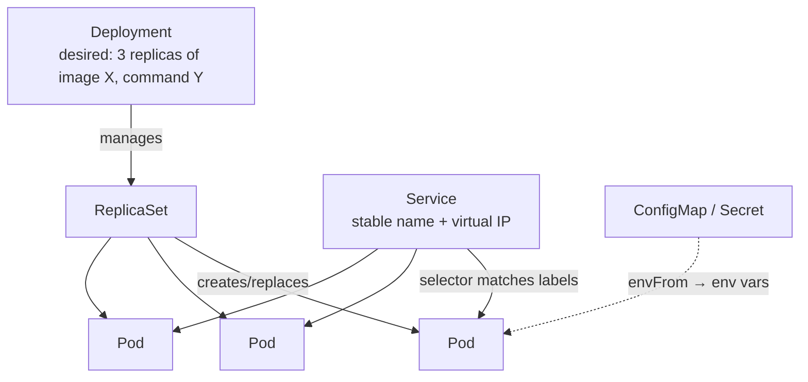

# Kubernetes & Helm

> **What this is:** how a cluster runs your containers for you (scheduling, self-healing,
> service discovery, config) — and how Helm packages a set of k8s objects so you install
> them with one command instead of hand-writing dozens of YAML files.

> 🧊 **Layman box.** **Kubernetes (k8s)** is a *restaurant manager for containers*. You don't
> tell it "start this process on that machine"; you tell it "I want **3 copies** of the
> payment service running, reachable at this name, with this config" — and it places them,
> restarts any that die, and reroutes around failures. **Helm** is the *recipe book*: instead
> of writing every instruction each time, you fill in a short form (`values.yaml`) and Helm
> stamps out all the detailed instructions for you.

---

## 1. The problem it solves

You have containers. Now: which machine runs each one? What restarts a crashed one? How does
gateway *find* payment when payment has 3 replicas on random IPs that change on redeploy? How
do you roll out a new version without downtime, and roll back if it's bad? Doing this by hand
across a fleet is untenable. **Kubernetes** is the control loop that does it declaratively:
you describe the **desired state**; k8s continuously makes reality match.

**Declarative, not imperative** is the whole mindset: you don't run steps, you submit
objects ("I want this"), and controllers reconcile. Delete a pod and k8s makes a new one —
because you said you wanted N.

---

## 2. The core objects (the ones you must know)



- **Pod** — the smallest unit: one (usually) container plus its shared network/volumes. Pods
  are **cattle, not pets**: disposable, get a new IP each time. You rarely create them
  directly.
- **Deployment** — declares "*N* replicas of this pod template" and keeps them running:
  rolling updates, rollback, self-heal. This is what you actually write for a stateless
  service.
- **Service** — a **stable** name + virtual IP that load-balances to whatever pods match its
  **label selector**. Solves service discovery: gateway talks to `payment` (the Service),
  not to pod IPs. In-cluster DNS resolves `payment.<namespace>.svc` (short: `payment`).
- **ConfigMap / Secret** — key–value config injected into pods (as env via `envFrom`, or
  files). Secret is the same idea for sensitive values (base64 at rest; enable encryption/
  RBAC in real clusters).
- **Namespace** — a scope to group a release's objects (e.g. `ledgerstream`).
- **Ingress** — routes external HTTP into Services (an ingress controller does the work).
- **StatefulSet / PVC / Job / CronJob / DaemonSet** — stateful apps, storage, one-off and
  scheduled and per-node workloads (know they exist).

---

## 3. Probes: readiness vs liveness (a classic question)

k8s health-checks each pod. Two distinct probes with **different jobs**:

- **Readiness** — "can this pod serve traffic *right now*?" If it fails, k8s **removes the pod
  from the Service's endpoints** (stops sending it requests) but leaves it running. Used for
  warm-up, or a dependency being temporarily down.
- **Liveness** — "is this pod wedged and unrecoverable?" If it fails, k8s **restarts** the
  container.

Getting them backwards is a real outage: a liveness probe that fails during a slow dependency
will **restart-loop** a healthy pod. Probe types: `httpGet` (hit `/health/ready`), `tcpSocket`
(is the port open?), `exec` (run a command). Ledgerstream uses **TCP** probes (always correct
for a listening gunicorn/uvicorn); `httpGet /health/ready` is the upgrade where the endpoint
exists. See [health-checks-liveness-readiness.md](health-checks-liveness-readiness.md).

---

## 4. One image, many Deployments

A Deployment's pod template can **override the image's default command**. So the *same* image
runs as different roles — this is how a web service and its background workers share one image:

```yaml
# web Deployment: uses the image's default CMD (gunicorn)
# worker Deployment: same image, command overridden
containers:
  - name: ledger
    image: ledgerstream-ledger:latest
    command: ["python", "manage.py", "consume_payments"]   # ← worker
```

A **worker gets no Service** — nothing connects *to* it; it pulls from Kafka. Only web pods
sit behind a Service. This keeps the Phase 1 rule ("consumers never run in the request cycle")
true in k8s: workers scale and restart independently of the API.

---

## 5. Why Helm — and how it templates

Hand-writing k8s YAML means copy-pasting near-identical Deployments and juggling shared values
(image tag, labels, env) across many files. **Helm** is k8s's package manager:

- A **chart** is the templated package (`Chart.yaml` + `templates/` + `values.yaml`).
- **`values.yaml`** is the input surface; templates render final YAML with Go templating.
- A **release** is one install of a chart (`helm install <release> <chart>`), tracked so you
  can `upgrade`/`rollback`/`uninstall` atomically.

The power move is **DRY templating** — render N services from one loop instead of N files:

```yaml
{{- range $svcName, $svc := .Values.services }}
{{- range $wl := $svc.workloads }}
kind: Deployment
metadata: { name: {{ $svcName }}-{{ $wl.name }} }
spec:
  replicas: {{ $wl.replicas | default 1 }}
  ...
{{- end }}
{{- end }}
```

Add a service → add a map entry, not a file. Validate before shipping:
`helm lint` (static checks) and `helm template` (render locally without a cluster).

### Helm vs Kustomize vs raw YAML
- **Raw YAML** — simplest, but no variables/reuse; fine for tiny/static setups.
- **Kustomize** — overlays/patches over base YAML (no templating language); built into
  `kubectl`.
- **Helm** — full templating + packaging + release lifecycle (install/upgrade/rollback) +
  a values interface; best when you have parameters, many similar objects, or you distribute
  the chart. Ledgerstream uses Helm for exactly the "many similar services" reason.

---

## 6. Service discovery & config flow (Ledgerstream specifics)

- **In-cluster DNS**: gateway reaches payment at `http://ledgerstream-payment:8000`. Helm
  **computes** that URL from the release name in the ConfigMap, so no hardcoding — and it
  overrides the `localhost:...` defaults in each `settings.py`. Same code, new environment.
- **Config**: non-secret env → ConfigMap; secrets → Secret; both `envFrom` into every pod.
  (Ledgerstream uses one shared ConfigMap + Secret for simplicity; per-service scoping is the
  least-privilege hardening step.)

---

## 7. Interview questions you should be able to answer

- **Declarative vs imperative orchestration?** You submit desired state; controllers
  reconcile reality to it continuously (self-healing) — vs scripting explicit steps.
- **Pod vs Deployment vs Service?** Pod = running unit; Deployment = keeps N replicas of a pod
  template; Service = stable name/VIP load-balancing to matching pods.
- **Readiness vs liveness — and the classic mistake?** Readiness gates traffic; liveness
  restarts. A liveness probe tied to a slow dependency restart-loops healthy pods.
- **How does one service find another?** A Service + cluster DNS (`name.namespace.svc`) — not
  pod IPs, which change.
- **How does one image run as web and worker?** Override the default command per Deployment;
  workers get no Service.
- **Why Helm over raw YAML?** Templating + values + release lifecycle (upgrade/rollback);
  render many similar objects from one chart. When would you pick Kustomize? Overlay-style
  patching without a templating language.
- **How do secrets reach a pod without living in git?** Provided at install (`--set-string`)
  → k8s Secret → `envFrom`; real clusters add SealedSecrets/External Secrets + encryption.
- **What makes a Deployment rollout safe?** Rolling update (surge/unavailable), readiness
  gating new pods, and `rollback` to the previous ReplicaSet.

---

## 8. In Ledgerstream

One chart, [deploy/helm/ledgerstream](../../deploy/helm/ledgerstream), renders **all four
services + their workers** by ranging over a `services:` map — 7 Deployments, 4 Services, 1
ConfigMap, 1 Secret (13 objects, `helm lint`/`template` clean). Web workloads get TCP probes +
a Service; workers get a `command:` override and no Service. Cross-service URLs are computed
from the release name. Backing stores (Postgres/Redis/Kafka) are **external inputs** (URLs in
the Secret/ConfigMap), so the chart deploys only the stateless app tier. Installed by hand
(`helm upgrade --install`) or via Terraform ([infrastructure-as-code.md](infrastructure-as-code.md)).

---

## 9. The Ledgerstream code, explained simply

The chart lives in [`deploy/helm/ledgerstream/`](../../deploy/helm/ledgerstream/). Here's each
piece in plain English. (The trickiest file, `_helpers.tpl`, gets its own from-zero walkthrough
in [phase7.md Part 3.5](../phase7.md) — read that for the naming/label functions.)

### `values.yaml` — the fill-in-the-blanks form
Everything that differs between services sits in one `services:` map. Reading it:
```yaml
services:
  payment:
    port: 8000
    workloads:
      - name: web                                             # no "command" → the web server
        replicas: 2
      - name: outbox-relay
        command: ["python", "manage.py", "run_outbox_relay"]  # has "command" → a worker
```
**"payment listens on 8000; run 2 copies of its web server, plus 1 copy of the outbox-relay
worker."** A workload with a `command` is a worker; without one, it's the web server. That's
the whole idea — the form lists *what to run*, the templates turn it into Kubernetes YAML.

### `templates/deployment.yaml` — the stamping machine
This loops over the form and stamps out one Deployment per workload. In words:
```
for each service (payment, ledger, gateway, ai):
  for each workload (web, outbox-relay, ...):
    make a Deployment that:
      • runs image  ghcr.io/you/ledgerstream-<service>:<tag>
      • if the workload has a command → use it (worker); else open the port + add health checks (web)
      • loads all its settings from the shared ConfigMap + Secret
```
So payment produces 3 Deployments, ledger 2, gateway 1, ai 1 — **7 total from ~40 lines**. The
key `if`: only web workloads get a port and probes; workers get neither (nothing calls a
worker — it pulls from Kafka).

### `templates/service.yaml` — the stable front door
One Service per service. The single most important line is the **selector**:
```yaml
selector:
  app.kubernetes.io/name: ledgerstream
  app.kubernetes.io/instance: ledgerstream
  app.kubernetes.io/component: payment-web      # ← only WEB pods
```
**"Send traffic to pods wearing the `payment-web` badge."** Because it says `-web`, the Service
routes to payment's web pods only — never its workers. That's why `http://ledgerstream-payment`
always reaches a healthy API pod, no matter how many there are or what IPs they have.

### `templates/configmap.yaml` and `secret.yaml` — the settings
Two buckets of environment variables handed to every pod:
- **ConfigMap** = non-secret settings (log level, Kafka address) **plus** the computed neighbour
  URLs, e.g. `PAYMENT_BASE_URL: http://ledgerstream-payment:8000`. These are worked out from the
  release name, so gateway/ai find their neighbours with nothing hardcoded — and they *override*
  the `localhost` defaults in each `settings.py`, so the same code works in the cluster.
- **Secret** = the sensitive ones (JWT key, database URLs, Redis URL). Same idea, but for values
  you don't want in plain sight. Placeholders in `values.yaml`; real values supplied at install.

### The mental model
`values.yaml` is the short form you fill in; the `templates/` are a machine that stamps the full
Kubernetes paperwork from it. Add a service → add a few lines to the form, not a new file.
