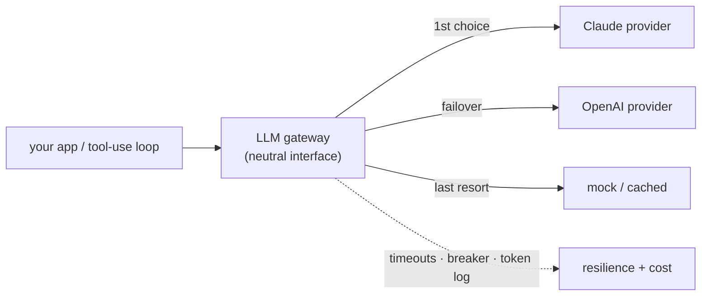

# The LLM Gateway (multi-provider routing, failover & cost control)

> **In one sentence:** put a thin layer between your app and the LLM providers so
> your code talks to *one* interface while the gateway picks a model, retries or
> **fails over** to another provider when one is down, enforces timeouts and a
> circuit breaker, and tracks tokens/cost — the same "front door" idea as an API
> gateway, applied to LLMs.

> 🧊 **In plain terms:** it's a **universal remote** for language models. Your app
> presses "answer this question"; the remote decides whether to send that to Claude
> or GPT, tries the backup if the first is unplugged, and keeps a tally of what each
> button press cost — so the app never has to know which TV it's driving.

---

## 1. Why not just call the SDK directly?

A one-off script can call `anthropic` or `openai` directly. A *product* that depends
on an LLM needs the same operational concerns every network dependency needs — and a
couple unique to LLMs:

- **Provider outages & rate limits.** Providers have downtime and 429s. If your only
  code path is "call provider X", an X outage is your outage. A gateway **fails over**
  to another provider (or a cheaper model, or a cached/canned response).
- **Cost & token accounting.** LLM calls cost real money per token. You want one place
  that logs input/output tokens per request, per tenant, to attribute and cap spend.
- **One interface, many models.** Providers differ in wire format (Claude uses content
  blocks + `tool_use`; OpenAI uses `tool_calls` + `role:"tool"`). A gateway hides that
  behind a neutral interface so the rest of your app — and your **tool-use loop** — is
  written once.
- **Resilience.** Timeouts (LLM calls can hang), retries with backoff, and a **circuit
  breaker** so a failing provider fails fast instead of stalling every request.
- **Guardrails & policy.** A choke point to enforce rate limits, redact PII, block
  disallowed content, and pin model versions.

---

## 2. Anatomy



The gateway holds an **ordered list of providers**, each wrapping one SDK behind a
common method (here: `generate(system, history, tools) -> result`). To answer a
request it walks the list: skip a provider whose **breaker is open**, try the next;
if one **raises or times out**, trip its breaker and fail over; the last provider is
an always-available fallback (a mock, a cheaper model, or a cached answer). The
neutral interface is what makes the failover transparent — the caller gets an answer
and the name of whoever produced it, and never branches on provider.

---

## 3. Provider abstraction — the key design

The trick to multi-provider is a **provider-neutral message + tool representation**
that every provider translates to and from. Your loop speaks the neutral form; each
provider adapts it:

```python
class Provider(Protocol):
    name: str
    def generate(self, system, history, tools) -> LLMResult: ...   # final | tools | refusal
```

- **Claude adapter** → Anthropic Messages API: `system` param + `messages` with
  `text`/`tool_use`/`tool_result` content blocks; reads `resp.stop_reason` (incl.
  `"refusal"`) and `resp.content` blocks.
- **OpenAI adapter** → Chat Completions: a leading `system` message, assistant
  `tool_calls`, and `role:"tool"` result messages; function arguments are a JSON
  *string*.

Because both map to the same `LLMResult`, the **tool-use loop is written once** and
drives either provider (see [rag-tools-mcp.md](rag-tools-mcp.md)).

> **Don't build this on an "OpenAI-compatible" shim for Claude.** Use each provider's
> real SDK behind the adapter; a lowest-common-denominator shim drops features (tool
> use, thinking, refusal handling) and diverges from each provider's actual contract.

---

## 4. Resilience: timeouts, breaker, failover

- **Timeout every call.** An LLM call with no timeout can hang for minutes and tie up
  a worker. Bound it (and for very long outputs, stream so you don't hit an HTTP idle
  timeout).
- **Circuit breaker per provider.** Repeated failures trip the breaker → the gateway
  *skips* that provider (fail fast) and cools down before probing again (see
  [circuit-breakers.md](circuit-breakers.md)). One provider's outage doesn't slow
  every request while it times out.
- **Failover order.** Primary → secondary → fallback. The fallback should never fail
  (a deterministic mock, a canned "try later", or a cached prior answer), so the user
  always gets *something*.
- **Retries with backoff + jitter** for transient blips *within* a provider (429s,
  5xx) — bounded, before you fail over.

---

## 5. Cost & token accounting

Every provider response reports token usage (`usage.input_tokens` /
`output_tokens`). Log it **per request and per tenant** so you can:

- attribute spend (which tenant/feature costs what),
- enforce **per-tenant rate/budget limits** (LLM calls are expensive — cap them; see
  [ai-guardrails.md](ai-guardrails.md)),
- watch for prompt bloat (a jump in input tokens usually means a prompt-assembly bug),
- pick models by cost/quality per route (a cheap model for classification, a strong
  one for analysis).

Model choice is a first-class gateway concern: route simple calls to a cheaper/faster
model and hard ones to the strongest, rather than paying top-tier rates for
everything.

---

## 6. Interview questions you should be able to answer

- *Why put a gateway in front of LLM providers?* → One interface, provider failover,
  timeouts/breaker/retries, token-cost accounting, model routing, and a policy choke
  point — the operational layer a product needs around a paid, sometimes-down
  dependency.
- *How do you support multiple providers cleanly?* → A neutral message/tool
  representation each provider adapts to its own wire format, so the loop and app are
  written once.
- *What does failover look like?* → Ordered providers; skip open breakers, try the
  next on error/timeout, end on an always-available fallback.
- *Why is a circuit breaker important here specifically?* → LLM calls are slow; without
  fail-fast, a provider outage makes every request wait out a timeout and exhausts
  workers.
- *How do you control LLM cost?* → Per-tenant token logging + rate/budget limits, model
  routing by task, prompt-size monitoring, caching.
- *Why not an OpenAI-compatible shim for Claude?* → It drops provider-specific
  capabilities (tool use, refusal handling) and misrepresents the contract; use each
  real SDK behind the adapter.

---

## 7. How Ledgerstream uses it

The AI Query service's gateway (`services/ai/app/llm/gateway.py`) holds an ordered
provider chain from `LLM_PROVIDER_ORDER` (`claude,openai,mock`), building only the
providers whose key is set — **`ClaudeProvider`** (Anthropic SDK, default model
`claude-opus-5`), **`OpenAIProvider`** (OpenAI SDK), and a deterministic
**`MockProvider`** that always works so the service runs with no keys. Each provider
adapts the same neutral history + tool spec, so the **tool-use loop is written once**.
Each provider is wrapped in a **per-provider circuit breaker**; `answer()` skips open
breakers and fails over on error, ending on the mock. Every provider turn logs token
usage; a per-tenant token bucket caps LLM spend. Built in **Phase 6**.
