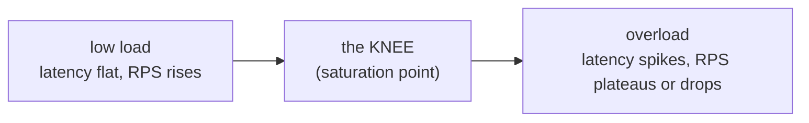

# Load Testing & Performance

> **In one sentence:** push synthetic traffic at the system on purpose so you learn its
> limits *before* real users do — how many requests/sec it sustains, how latency
> behaves as load climbs, and *what breaks first* — measured in **percentiles**, not
> averages.

> 🧊 **In plain terms:** it's a **stress test for a bridge**. You don't wait for rush
> hour to discover the weight limit — you drive heavier and heavier trucks across in a
> controlled test and watch where it starts to sag. Load testing drives controlled
> "traffic trucks" at your API and watches where it sags.

---

## 1. Why load test

You want answers to questions production will otherwise answer for you at 3am:

- **Capacity:** how many requests/sec can we serve within an acceptable latency?
- **Behaviour under stress:** does latency degrade gracefully, or fall off a cliff?
- **The bottleneck:** what saturates first — CPU, the DB connection pool, Kafka
  consumers, a downstream? (You can't fix what you can't find.)
- **Does the resilience work:** do rate limits shed load, does the cache absorb reads,
  does the circuit breaker trip instead of cascading?
- **Regression:** did this release make p99 worse?

---

## 2. The metrics that matter (and the one trap)

| Metric | What it tells you |
|---|---|
| **Throughput** (RPS/QPS) | how much work per second the system completes |
| **Latency** | how long each request takes — reported as **percentiles** |
| **Error rate** | % of failed / non-2xx responses (incl. deliberate `429`s) |
| **Saturation** | how "full" a resource is (CPU %, pool usage, queue depth, consumer lag) |

**The trap: never report the average latency.** An average hides the tail. If 99% of
requests are 10ms and 1% are 5s, the average looks fine (~60ms) while 1 in 100 users has
an awful experience — and at scale that 1% is thousands of people, and a single slow
page often makes *many* backend calls, so the chance a user hits the tail compounds.

**Use percentiles:** p50 (median — the typical case), **p95 / p99 / p99.9** (the tail —
the worst case a meaningful fraction of users actually feel). Tail latency is the real
UX metric. "p99 = 250ms" means 99% of requests finished within 250ms.

```
requests sorted by latency:  ▁▁▁▁▁▁▁▁▁▁▁▁▁▁▁▁▂▂▃▅█   ← the tail
                             p50        p95  p99 ↑ this is what you optimize
```

---

## 3. The shape of the curve — throughput, latency, and the "knee"

As you add load, the system moves through three regions:



- **Below the knee:** throughput rises with offered load; latency stays flat. Happy.
- **The knee (saturation):** a resource hits 100% (CPU, pool, disk, a consumer). This is
  your **capacity** — the max useful throughput.
- **Beyond the knee:** offered load exceeds capacity → queues grow → **latency spikes**
  while throughput flatlines or *drops* (thrashing, retry storms). Past here, more load
  makes things *worse*.

The goal of a load test is to **find the knee** and make sure it's above your expected
peak — with headroom.

> **Little's Law** (worth knowing): `L = λ × W` — the average number of requests *in the
> system* (`L`) equals arrival rate (`λ`) × average time in system (`W`). It's why, when
> `W` (latency) blows up past the knee, in-flight requests `L` pile up and exhaust
> threads/connections. Concurrency, throughput, and latency are not independent.

---

## 4. Open vs closed load models (name this in interviews)

- **Closed model** (most tools' default, incl. Locust `HttpUser`): a fixed number of
  virtual users, each doing request → wait for response → think → repeat. If the system
  slows, users *naturally send less* (they're blocked waiting) — this **hides** overload
  because the load backs off with the server. Good for "N concurrent users" scenarios.
- **Open model:** requests arrive at a fixed **rate** regardless of how the server is
  coping (like real internet traffic). This is harsher and more realistic for public
  APIs — if the server slows, the backlog **grows**, exposing the cliff. Tools like `k6`
  and Locust's constant-arrival modes do this.

Know which you're running: a closed test can make an overloaded system *look* okay
because the load generator quietly slowed down with it (this is "coordinated omission").

---

## 5. Finding the bottleneck

A load test tells you *that* it's slow; finding *why* is resource analysis. A simple,
effective method (**USE**): for every resource, check **U**tilization, **S**aturation,
**E**rrors.

Common bottlenecks and their tells:

| Bottleneck | Tell | Fix |
|---|---|---|
| **DB connection pool** | requests queue for a connection; DB CPU low but latency high | bigger pool / **connection pooling** (reuse conns — opening TCP+TLS per request is expensive) |
| CPU-bound service | one service pegged at 100% CPU | scale out (more replicas), optimize hot path |
| **Consumer lag** (async) | Kafka lag grows; the read side trails writes | add consumers (up to partition count), speed up processing |
| Slow downstream | one span dominates traces | cache it, or circuit-break + degrade |
| Lock contention | throughput flat despite spare CPU | reduce critical section, shard the hot key |

**Connection pooling** deserves a call-out: reopening a DB connection (TCP handshake +
TLS + auth) per request costs milliseconds and caps throughput. A pool keeps a set of
warm connections and hands them out — the difference between "new call every request"
and "borrow from a ready set." (Ledgerstream sets `conn_max_age` so Django reuses
connections instead of reconnecting per request.)

---

## 6. How to run a *good* load test

- **Warm up** first (JIT, caches, pools) — discard the cold-start numbers.
- **Ramp** load gradually (a "stepped" or "spike" profile) and watch where the knee is,
  rather than one giant blast.
- **Realistic mix:** reads ≫ writes, real think-time between actions, real payload sizes.
- **Test the real path** end to end (through the gateway), not a single endpoint in a
  vacuum — resilience (rate limits, cache, breaker) only shows up on the real path.
- **Isolate the target:** load-test dedicated infra, not shared/free-tier services whose
  own throttles you'd end up measuring instead of your architecture.
- **Measure the whole picture:** RPS + p50/p95/p99 + error rate + resource saturation +
  (for async) consumer lag — a single number lies.

**Tools:** *Locust* (Python, scriptable, live UI, percentiles), *k6* (JS, open-model,
CI-friendly), *wrk* / *hey* (tiny CLI, max RPS), *JMeter* (heavyweight, GUI). Pick by
scripting language + open vs closed model + CI needs.

---

## 7. Interview questions you should be able to answer

- *Why percentiles instead of the average latency?* → Averages hide the tail; p95/p99 are
  what a meaningful fraction of users actually experience, and one slow request often
  fans out across many backend calls.
- *What is the "knee" / saturation point?* → The load at which a resource hits 100%;
  beyond it latency spikes while throughput flatlines — your real capacity.
- *Open vs closed load model?* → Closed = fixed users looping (load backs off when the
  server slows, can hide overload); open = fixed arrival rate (harsher, exposes the
  cliff, more like real traffic).
- *What's coordinated omission?* → When the load generator waits on slow responses and so
  under-sends during the exact moments the server is struggling, making results look
  better than reality.
- *How do you find a bottleneck?* → Resource analysis (USE: utilization/saturation/errors)
  + tracing; find what saturates first (pool, CPU, consumer lag, downstream).
- *State Little's Law and why it matters.* → `L = λW`; when latency `W` grows past the
  knee, in-flight count `L` explodes and exhausts threads/connections.
- *Why not load-test against cloud free tiers?* → You'd measure the tier's throttles, not
  your system; use dedicated/full-local infra.
- *For an event-driven system, what extra signal do you watch?* → Consumer **lag** — the
  read side trailing the write load — not just HTTP latency.

---

## 8. How Ledgerstream uses it

`loadtest/locustfile.py` drives traffic **through the gateway** (reads ≫ writes, real
think-time) so the whole path is exercised — edge auth, per-tenant rate limiting, the
balances cache, and the circuit breaker. `429`s are counted as **expected** (the token
bucket shedding load, not an error). The `seed` command populates tenants + captured
payments first, and load is **spread across tenants** (each has its own rate-limit
bucket) so you can measure throughput rather than one tenant's deliberate cap. What we
watch: **RPS**, **p95/p99** latency (find the knee), the `429` rate, the gateway
`X-Cache` hit ratio, and **consumer lag** (how far the ledger trails the write load).
Run against **full-local** infra, not the cloud free tiers (whose throttles would swamp
the architecture's own numbers). Built in **Phase 5**.
