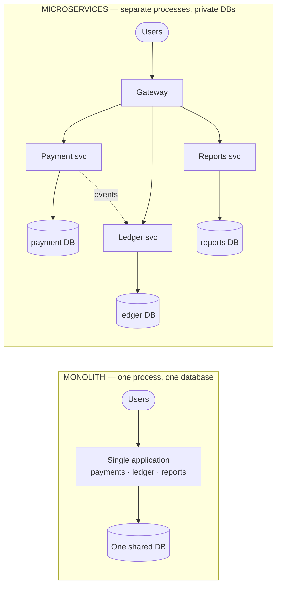
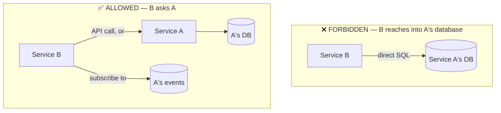

# Microservices & Database-per-Service

> **In one sentence:** split a large application into small, independently
> deployable services, each owning its own data, so teams and components can
> evolve and fail independently.

> 🧊 **In plain terms:** A monolith is one big restaurant where the same person
> cooks, serves, and takes payment — if any one of those jobs gets overwhelmed,
> the whole restaurant stalls. Microservices are a food court: separate stalls,
> each with its own kitchen (database) and staff. A pizza stall can get busy,
> upgrade its oven, or close for cleaning without shutting down the burger stall.
> The catch: the stalls now have to *talk* to coordinate a combined order, and
> there's no single cash register that rings up everything at once.

### Monolith vs microservices

---

## 1. The problem it solves

Start with the alternative: the **monolith**. A monolith is one codebase, one
deployable unit, usually one database. This is *great* early — simple to build,
test, deploy, and reason about. Most systems should start here.

Problems appear as the system and team grow:

- **Deployment coupling.** A one-line change to the billing code means
  redeploying the *entire* application, including unrelated modules.
- **Scaling coupling.** If image-processing is CPU-hungry but everything lives in
  one process, you must scale the whole monolith to give image-processing more
  CPU — wasteful.
- **Failure coupling.** A memory leak in one module can crash the whole process,
  taking down unrelated features (a "blast radius" problem).
- **Technology lock-in.** The whole app is stuck on one language/framework/DB
  version; you can't adopt a better tool for one piece.
- **Team coupling.** 50 engineers committing to one codebase step on each other;
  merge conflicts and coordination overhead grow super-linearly.

**Microservices** attack these by drawing boundaries: each service is a separate
process, separately deployed, owning a slice of the domain.

---

## 2. What defines a microservice

Three properties matter far more than "small":

1. **Independently deployable.** You can ship service A without touching or
   redeploying service B. *This is the single most important property.* If you
   can't deploy them independently, you have a "distributed monolith" — all the
   pain of distribution with none of the benefit.
2. **Owns its data.** Each service has its **own database** that no other service
   touches directly. This is the **database-per-service** rule.
3. **Aligned to a business capability (bounded context).** A service is
   organized around *what the business does* ("Payments," "Ledger," "Shipping"),
   not around a technical layer ("the database service," "the API service").
   This idea comes from **Domain-Driven Design**'s "bounded context": a boundary
   within which a model and its terms have one precise meaning.

---

## 3. Database-per-service — the crucial rule

The rule: **a service's database is private. No other service may read or write
it directly.** If service B needs data owned by A, it must ask A (via API or
event) — never reach into A's tables.

### Why this rule is non-negotiable
- **Independent schema evolution.** If two services share a table, neither can
  change that table without coordinating with the other — you're back to a
  monolith's coupling, just with more network calls.
- **Encapsulation of business logic.** A's invariants (e.g. "a ledger entry is
  immutable") are enforced by A's code. If B writes directly to A's tables, it
  can violate those rules and A can't stop it.
- **Independent scaling & tech choice.** A can use Postgres, B can use MongoDB,
  each tuned for its access pattern.

### The hard part it creates: distributed data
Once each service has its own database, you **lose the two things a single
database gave you for free**:

- **No cross-service transactions.** In a monolith you could update `payments`
  and `ledger` tables in one ACID transaction — all or nothing. Across two
  databases there is no such transaction. This is *the* central problem of
  microservices data, and the reason patterns like **Saga** and the **Outbox**
  exist (they simulate all-or-nothing across services).
- **No cross-service joins.** You can't `JOIN` payment rows against ledger rows;
  they're in different databases. You solve this with **data replication via
  events** (each service keeps a local copy of what it needs, updated by
  listening to the other's events) or an API composition at read time.

> This trade — you *gain* independence but *lose* easy transactions and joins —
> is the essence of microservice data design. Almost every pattern in this
> handbook (saga, outbox, event-driven, CAP choices, read models) is a tool for
> paying that price well.

> 🧊 **In plain terms:** your neighbor's fridge (another service's database) is
> off-limits. If you want eggs, you *ask them* (call their API) or you *watch for
> them to announce* "just restocked eggs" (subscribe to their events) and keep
> your own carton. You never walk into their kitchen and grab from their fridge —
> because then they can never rearrange it without breaking your habits.

---

## 4. How services communicate

Two broad styles, often mixed:

- **Synchronous (request/response):** service A calls service B's API and waits
  (HTTP/REST, gRPC). Simple and immediate, but creates **temporal coupling** —
  if B is down or slow, A is blocked. Chains of sync calls multiply latency and
  failure probability.
- **Asynchronous (events/messages):** A publishes an event to a message bus; B
  consumes it whenever it can. A doesn't wait and doesn't even need to know B
  exists. This decouples services in *time* and *identity* but introduces
  **eventual consistency** (B's view lags A's by some delay). See
  [Event-Driven Architecture](event-driven-architecture.md).

A common rule of thumb: use **sync** for a query you need answered *right now* to
serve the current request; use **async events** for propagating "something
happened" so other services can react in their own time.

---

## 5. Costs of microservices (be honest about these)

Microservices are **not** automatically better. They trade in-process simplicity
for distributed complexity:

- **Operational overhead:** many services to deploy, monitor, secure, and debug.
- **Network is unreliable & slow** compared to a function call; you must design
  for partial failure (timeouts, retries, circuit breakers).
- **Distributed debugging is hard** → this is *why* observability (correlation
  IDs, tracing) is mandatory, not optional.
- **Data consistency is now your problem**, not the database's.
- **Testing** requires spinning up or mocking multiple services.

The mature take: **start monolith, extract services when a real force demands it**
(independent scaling, team autonomy, differing availability needs). "Microservices
because it's modern" is a red flag in an interview; "microservices because these
two capabilities have different scaling and deployment needs" is the right answer.

---

## 6. Interview questions you should be able to answer

- *What's the difference between a monolith and microservices, and when would you
  choose each?* → Start monolith; extract for independent deploy/scale/team
  boundaries; don't distribute prematurely.
- *What is database-per-service and why?* → Private DB per service for
  independent schema evolution + encapsulation; the cost is no cross-service
  transactions/joins.
- *If services can't share a database, how does service B get A's data?* → Ask A
  via API (sync) or subscribe to A's events and keep a local replica/read model
  (async).
- *How do you keep two services' data consistent without a distributed
  transaction?* → Sagas + the outbox pattern + eventual consistency; embrace
  compensating actions instead of rollbacks.
- *What's a "distributed monolith" and why is it the worst of both worlds?* →
  Services that must be deployed together (shared DB or tight sync coupling) — you
  pay distribution's cost without gaining independence.

---

## 7. How Ledgerstream uses it

Payment, Ledger, Gateway, and AI Query are separate services; Payment and Ledger
each own a **separate Postgres instance** (`postgres-payment`, `postgres-ledger`).
They never touch each other's DB — Payment tells Ledger what happened by
publishing a Kafka event, and Ledger reacts. That's precisely the "gain
independence, lose cross-service transactions" trade, which is why we need the
**outbox** (Phase 1–2) and the **saga** (Phase 3) to keep money movements correct
across the boundary.
