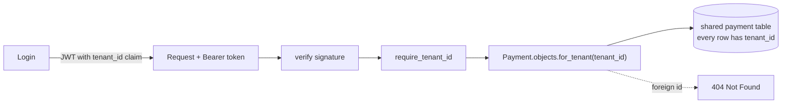

# Multi-Tenancy & Tenant Isolation

> **In one sentence:** one running system serves many customers ("tenants"), and
> the non-negotiable rule is that tenant A can never read or affect tenant B's data
> — enforced at the data layer and *proven by test*.

> 🧊 **In plain terms:** an apartment building (one system) houses many families
> (tenants). They share the plumbing and the front door, but each family's flat is
> locked and private — no one can wander into another's kitchen. Multi-tenancy is
> building that shared-but-isolated structure; the master key that opens the *wrong*
> flat is the catastrophe you design against.

---

## 1. Why multi-tenancy (and the isolation models)

A SaaS/fintech platform serves thousands of merchants from **one deployment** —
far cheaper and simpler than running a separate copy per customer. But sharing
infrastructure raises the central risk: **data leaking across tenants.** There are
three isolation models, trading isolation against cost:

| Model | Isolation | Cost | 
|---|---|---|
| **Silo — DB per tenant** | strongest (physical) | expensive; thousands of DBs |
| **Bridge — schema per tenant** | strong | medium |
| **Pool — shared tables + `tenant_id` column** | logical (enforced by code) | cheapest, most scalable |

Most large SaaS uses the **pool model** (shared tables, a `tenant_id` on every
row), because it scales to millions of tenants cheaply — at the price of making
isolation a **discipline in code**, not a database boundary. That's the model here,
and getting the discipline right is the whole game.

---

## 2. The two halves: *identify* the tenant, then *scope* every query

### Half 1 — establish who the tenant is (trusted, not forgeable)
The tenant identity must come from something the client **can't tamper with**. We
put a `tenant_id` claim inside the **signed JWT** at login. The client can't change
it without breaking the signature.

`core/tokens.py` — stamp the tenant into the token at login:

```python
class TenantTokenObtainPairSerializer(TokenObtainPairSerializer):
    @classmethod
    def get_token(cls, user):
        token = super().get_token(user)
        token["tenant_id"] = str(user.membership.tenant_id)   # ← baked into the JWT
        return token
```

`core/tenancy.py` — read it back from the *validated* token (never a header/param):

```python
def require_tenant_id(request) -> str:
    token = getattr(request, "auth", None)          # the verified JWT
    tenant_id = token["tenant_id"] if token else None
    if not tenant_id:
        raise PermissionDenied("Token is not scoped to a tenant.")   # fail CLOSED
    return tenant_id
```

### Half 2 — scope every data access to that tenant
Every query goes through **one choke point** so nobody can forget the filter.
`payments/models.py`:

```python
class PaymentQuerySet(models.QuerySet):
    def for_tenant(self, tenant_id):
        return self.filter(tenant_id=tenant_id)     # THE isolation filter
```

`payments/views.py` — every endpoint uses it:

```python
def get(self, request, payment_id):
    tenant_id = require_tenant_id(request)
    payment = get_object_or_404(
        Payment.objects.for_tenant(tenant_id), id=payment_id   # 404 if it's not YOURS
    )
    return Response(PaymentSerializer(payment).data)
```

Note it returns **404, not 403**, for another tenant's id — we don't even reveal
that the record exists.



---

## 3. Prove it — the isolation test

A rule you don't test is a rule you don't have. Our `tests/test_tenant_isolation.py`
(passing, run against Postgres):

```python
def test_tenant_cannot_read_another_tenants_payment(make_tenant):
    _a, client_a = make_tenant("Tenant A")
    _b, client_b = make_tenant("Tenant B")

    payment_id = client_a.post("/api/payments", {...}).data["id"]   # A creates

    assert client_b.get(f"/api/payments/{payment_id}").status_code == 404  # B: not found
    assert client_b.get("/api/payments").data == []                        # B sees nothing
    assert client_a.get(f"/api/payments/{payment_id}").status_code == 200  # A: fine
```

We also test that B can't **capture** A's payment (404, and A's payment stays
`AUTHORIZED`), and that unauthenticated requests get 401. This is the
"explicit test proving tenant A cannot read tenant B's data" deliverable.

---

## 4. The pitfalls (this is where breaches happen)

- **A forgotten filter.** One query written as `Payment.objects.all()` instead of
  `.for_tenant(...)` leaks everything. Mitigation: funnel all access through
  `for_tenant`; some teams go further with row-level security or a default manager
  that *requires* a tenant.
- **IDOR (Insecure Direct Object Reference).** Trusting an id in the URL without
  re-checking ownership. We always filter by tenant *and* id, so a foreign id 404s.
- **Trusting client-supplied tenant.** Never read `tenant_id` from a header/body/
  query — only from the signed token. A forgeable tenant is no isolation at all.
- **Leaky error messages / enumeration.** 403 vs 404 can reveal existence; we 404.
- **Cross-tenant joins / cached data / logs.** Aggregations, caches, and even log
  lines must stay tenant-scoped.

### Defense in depth (beyond Phase 1)
- **Postgres Row-Level Security (RLS):** the database itself enforces
  `tenant_id = current_setting('app.tenant')`, so even a buggy query can't leak.
- **A tenant-aware base manager** that raises if no tenant is set.

---

## 5. Interview questions you should be able to answer

- *What is multi-tenancy and what's the core risk?* → One system serving many
  customers; the risk is cross-tenant data leakage.
- *Isolation models?* → Silo (DB per tenant), bridge (schema per tenant), pool
  (shared tables + tenant_id). Pool scales cheapest but makes isolation a code
  discipline.
- *How do you identify the tenant securely?* → From a signed token claim, never a
  client-supplied header/param the user could forge.
- *How do you enforce isolation at the data layer?* → Filter every query by
  tenant_id through a single choke point; return 404 (not 403) for foreign ids.
- *What is IDOR and how do you prevent it?* → Accessing an object by id without an
  ownership check; prevent by always filtering by tenant + id.
- *How would you make isolation bulletproof beyond app code?* → Postgres
  Row-Level Security so the DB enforces the tenant predicate regardless of the query.
- *How do you prove isolation?* → An automated test where tenant B is denied
  access to tenant A's data (404 + empty list).

---

## 6. How Ledgerstream uses it

The **pool model**: shared tables with a `tenant` FK on every tenant-owned row.
Tenant identity rides in the **JWT `tenant_id` claim** (stamped at login), read only
from the validated token. Every query funnels through `Payment.objects.for_tenant()`
and views 404 on foreign ids. A passing **isolation test** proves A can't read or
capture B's payments. This is Tier 1 — for a payments platform, a cross-tenant leak
is the worst possible bug. `DESIGN.md` notes Postgres RLS as the defense-in-depth
step at higher stakes/scale.

---

*Related: [Microservices & Database-per-Service](microservices-and-database-per-service.md)
(service-level isolation) · [Idempotency](idempotency.md) (keys are tenant-scoped) ·
the JWT/auth flow in `services/payment/core/`.*
