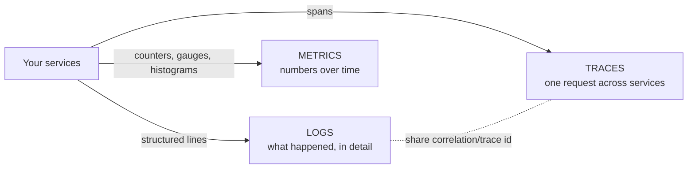
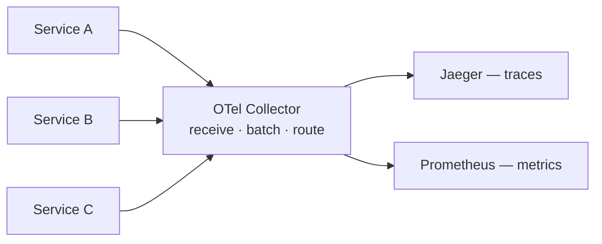

# Observability — Logs, Metrics & Traces

> **In one sentence:** observability is the ability to understand what's happening
> *inside* a running system from the outside, so you can answer questions you
> didn't know to ask in advance — built on three pillars: **logs, metrics, and
> traces**, tied together by **correlation/trace IDs**.

> 🧊 **In plain terms:** Your car's dashboard is observability. The **speedometer
> and fuel gauge** are *metrics* (numbers over time — how fast, how full). The
> **check-engine light with a diagnostic code** is a *log* (a specific event with
> detail: "sensor #3 failed at 2:04pm"). A mechanic tracing the fuel from tank →
> pump → injector → cylinder to find where it's blocked is a *trace* (following
> one thing through every stage). Metrics tell you *something* is wrong; logs and
> traces tell you *what* and *where*.

---

## 0. The three tools in plain terms (OTLP/Collector · Prometheus · Jaeger)

Our stack has three observability tools. The clearest way in is one analogy —
**you run a huge, busy kitchen 🍳 and can't watch every cook**. Each tool answers a
*different* question.

### OTel Collector + OTLP — the intercom & mailroom
Every cook reports what they're doing into **one intercom**, in a **shared
language**, and a **mailroom** forwards each report to the right department.
- **OTLP** = the shared language ("OpenTelemetry Protocol", gRPC :4317 / HTTP :4318).
- **Collector** = the mailroom: receives all telemetry in one place, routes it.
- **Helpful because:** cooks only need "report to the intercom." Swap a backend →
  change the *mailroom*, not all 500 cooks. Central batching/filtering/redaction.

### Prometheus — the wall of dials & gauges
Gauges on the wall are read every few seconds and **charted over time**: "50
orders/min", "kitchen 80% full", "avg cook time 4 min". Cross a line → an **alarm**.
- **What:** collects **numbers over time** (metrics); graphs + alerts on them.
- **Answers:** *"How much? how many? how fast? is something wrong right now?"*
- **Helpful because:** it's how you *notice* trouble — error spike, latency creeping up.

### Jaeger — the single-order tracking timeline
A customer's *one order* was 20 min late. Jaeger shows **that order's journey**
through every station — prep 2m, grill 3m, **plating stuck 14m**, delivery 1m — as
a timeline, so you see *where* the time went.
- **What:** shows the **path of one request** across all services (a "trace") with
  a timing bar per step.
- **Answers:** *"What happened to THIS request, and where did it get stuck?"*
- **Helpful because:** it pinpoints *which* service caused slowness — invisible
  from one service's logs.

### How they work together (a real incident)

```
   1. Prometheus alarm:  "p99 latency spiked + errors climbing"   ->  SOMETHING is wrong
   2. Open a slow request in Jaeger:                              ->  WHERE it's wrong
        gateway 5ms -> payment 8ms -> ledger DB call 900ms  (!)         (the ledger DB call)
   3. Logs for that request (tied by correlation id):            ->  WHY it's wrong
        "ledger: connection pool exhausted"
```

- **Prometheus** = the *numbers* → tells you **something** is wrong.
- **Jaeger** = the *timeline* → tells you **where**.
- **Logs** = the *detail* → tell you **why**.
- **OTLP + Collector** = the *plumbing* that carried all of it to those tools.

> For the component internals, see the dedicated deep-dives:
> [OpenTelemetry & Collector](opentelemetry-collector.md) ·
> [Prometheus](prometheus.md) · [Jaeger](jaeger.md).

---

## 1. Monitoring vs observability

- **Monitoring** answers **known** questions: "is CPU above 80%?", "is the error
  rate high?" You set these dashboards/alerts up in advance.
- **Observability** lets you answer **unknown** questions after the fact: "why are
  requests from *this one tenant* to *this one endpoint* slow, but only since the
  last deploy?" — a question nobody predefined.

In a **monolith**, a stack trace often tells you everything. In
**microservices**, one user action fans out across many services, so a single
stack trace is useless on its own — you need to reconstruct the *distributed*
story. That's why observability is **mandatory** for microservices, not a nice-to-have.

---

## 2. The three pillars



### Pillar 1 — Logs
**What:** timestamped records of discrete events ("payment authorized",
"DB timeout"). Rich detail, one line per thing that happened.

**Structured logging (critical idea):** emit each line as **JSON with fields**
(`{"level":"ERROR","service":"payment","tenant_id":"t1","correlation_id":"abc"}`),
not a free-text sentence. Why: you ship all logs to a central store (ELK, Loki,
Datadog) and **query by field** — "all ERROR logs for tenant t1 in the last
hour." Free-text forces brittle regex parsing and doesn't aggregate.

**Levels:** DEBUG < INFO < WARN < ERROR. Use them deliberately so you can turn up
detail without drowning.

**Cost:** logs are the most detailed but the most **voluminous/expensive** pillar
— you can't log everything at high volume forever. Sample or summarize the noisy
parts.

### Pillar 2 — Metrics
**What:** numeric measurements aggregated over time — cheap to store, perfect for
dashboards and alerts. Three main types:

- **Counter** — only goes up (total requests, total errors). You look at its
  *rate* (requests/sec).
- **Gauge** — goes up and down (current memory, active connections, queue depth).
- **Histogram** — distribution of values in buckets (request latency), letting you
  compute **percentiles**.

**Percentiles > averages (interview favorite):** the *average* latency hides pain.
If 99% of requests take 10ms but 1% take 5s, the average looks fine while 1 in 100
users suffers. You watch **p50/p95/p99** (the value below which 50/95/99% of
requests fall). "p99 latency" = the experience of your unluckiest 1%.

**The RED method** for a service: **R**ate (req/s), **E**rrors (failed/s),
**D**uration (latency distribution). The **USE method** for a resource:
**U**tilization, **S**aturation, **E**rrors.

### Pillar 3 — Traces
**What:** the end-to-end path of **one request** as it crosses services. A trace
is a tree of **spans**; each span is one unit of work (an HTTP handler, a DB
query, a Kafka publish) with a start time, duration, and parent.

**Why it's the microservices superpower:** it shows you *which service* in a chain
of ten added the latency, and the exact order of calls — impossible to see from
per-service logs alone.

```mermaid
gantt
  title One trace = a tree of timed spans
  dateFormat X
  axisFormat %s
  section Gateway
  handle request       :0, 9
  section Payment
  authorize            :1, 3
  publish event        :3, 1
  section Ledger
  consume + post entry :5, 3
```



---

## 3. The glue: correlation IDs / trace context

None of the pillars is useful in isolation across services unless you can line
them up. The mechanism: a **correlation ID** (a.k.a. request ID / trace ID) — a
unique tag generated when a request first enters the system and **propagated to
every service, log line, and span** it touches.

- Incoming request has no ID → the edge (gateway) **mints one**.
- It's passed downstream in a **header** (`X-Correlation-ID`, or W3C
  `traceparent`).
- Every log line includes it; every span carries it.

Now you can jump from a metric spike → find an example trace → pull every log line
with that correlation ID across all services → see the whole story of that one
request. **This is the single most important habit in distributed debugging.**

> 🧊 **In plain terms:** it's the tracking number on a parcel. Every depot it
> passes scans the *same* number, so later you can pull up the parcel's entire
> journey — where it is, where it got delayed — instead of asking each depot
> separately "did you maybe see a brown box?"

### 3.5 Implementation: `contextvars` and the set/reset pattern

The idea above (§3) is simple; making it *actually* attach to every log line without
threading a `correlation_id` argument through every function is the interesting part.
The answer is a **`contextvars.ContextVar`** — a variable whose value is **isolated
per thread and per async task**, so a Django worker thread and a FastAPI coroutine
each see their own id with no bleed-through, and the logging formatter can just read
"the current context's id" whenever it emits a line.

```python
# ledgerstream_shared/correlation.py (the core)
_correlation_id: ContextVar[str] = ContextVar("correlation_id", default="")

def set_correlation_id(value) -> Token:   # returns a Token capturing the PREVIOUS value
    return _correlation_id.set(value)

def reset_correlation_id(token) -> None:  # restores whatever it was before that set
    _correlation_id.reset(token)
```

**Why `reset` exists — and why it's not optional.** A `ContextVar` is *not*
per-request; it lives on as long as the thread/task does. Web servers **reuse worker
threads** and Kafka **consumers loop on one thread** across many messages. `set()`
returns a `Token` that remembers the value *before* the set; `reset(token)` restores
it. Wrap the work in `set … try … finally: reset`:

```python
token = set_correlation_id(cid)     # bind THIS unit's id
try:
    ... process (every log line now carries cid) ...
finally:
    reset_correlation_id(token)     # restore prior state, ALWAYS
```

Without the reset, one unit's id **leaks into the next** on the same reused
thread/worker — the exact failure a correlation id is meant to prevent:

```
msg A (id=aaa) → set → process → [no reset]     contextvar still = aaa
msg B (id="")  → process                         ← B's logs WRONGLY show aaa
msg C          → crash before set → ...           ← C's logs WRONGLY show aaa
```

It's in `finally` so the restore happens even when processing throws — otherwise an
exception would strand a stale id for the next iteration. This is the same reason the
edge **middleware** resets after each HTTP request: same primitive, same leak, same
fix.

### 3.6 Propagating the id across a process boundary

Inside one process, the `ContextVar` carries the id for free. To cross a boundary you
must **put it on the wire** and **rebind it on the other side**:

| Hop | How the id travels | Where it's rebound |
|---|---|---|
| HTTP → service | `X-Correlation-ID` header (edge mints one if absent) | that service's middleware calls `set_correlation_id` |
| service → service via Kafka | a **`correlation_id` field inside the event** (part of the Avro contract) | the consumer reads `event["correlation_id"]` and calls `set_correlation_id` |

That second row is why Ledgerstream's event schemas carry a `correlation_id` field and
why each consumer opens with `set_correlation_id(event.get("correlation_id"))` and
closes with `reset_correlation_id(...)` in a `finally`: a payment that flows
API → Kafka → Ledger → Kafka → saga keeps **one** id across all four processes, so a
single log query reconstructs the whole cross-service journey. The `ContextVar` is the
*in-process* carrier; the header and the event field are the *cross-process* carriers.

> **Interview line:** "The correlation id lives in a `contextvars.ContextVar` so it's
> isolated per thread/task and auto-injected into every log line without plumbing it
> through signatures. `set` returns a token; you `reset` in a `finally` so a reused
> worker thread can't leak one request's id into the next. Across process boundaries
> it rides an `X-Correlation-ID` header (HTTP) or a `correlation_id` event field
> (Kafka), and each side rebinds it."

---

## 4. OpenTelemetry & the collector pattern

**OpenTelemetry (OTel)** is the vendor-neutral standard for generating and
shipping traces and metrics (and increasingly logs). It matters because you
instrument your code **once** against OTel and can send the data to *any*
backend (Jaeger, Prometheus, Datadog…) without changing app code.

**The Collector** is a separate process that sits between your services and the
backends:



Why route through a collector instead of services talking to backends directly:
- **Decoupling:** services know only "send to the collector"; swap Jaeger for
  another tool by changing one config, not every service.
- **Central processing:** batching, sampling, redaction, and adding common
  attributes happen in one place.

---

## 5. Sampling (you can't keep every trace)

At high volume, storing 100% of traces is too expensive. **Sampling** keeps a
representative subset:
- **Head-based:** decide at the start (e.g. keep 5% randomly). Simple, but may
  miss the rare error trace.
- **Tail-based:** decide after the request finishes, so you can **keep all the
  errors and slow ones** and sample the boring successes. Smarter, more resource-
  intensive; done in the collector.

---

## 6. Interview questions you should be able to answer

- *Monitoring vs observability?* → Monitoring answers predefined questions;
  observability lets you investigate novel ones after the fact.
- *Name the three pillars and what each is best at.* → Logs = detailed discrete
  events; metrics = cheap numbers/trends for alerting; traces = one request's path
  across services.
- *Why structured (JSON) logs?* → Queryable by field, aggregatable centrally; no
  fragile regex parsing.
- *Why percentiles instead of averages?* → Averages hide tail latency; p95/p99
  reflect the worst-case user experience.
- *What's a correlation/trace ID and why is it essential?* → A propagated unique
  request tag that stitches logs/traces/metrics across services into one story;
  the backbone of distributed debugging.
- *What is a span vs a trace?* → A span is one timed unit of work; a trace is the
  tree of spans for one request.
- *Why an OTel collector?* → Decouple services from backends + centralize
  batching/sampling/redaction.
- *Why sample traces, and head vs tail?* → Cost; head decides upfront (cheap,
  may miss errors), tail decides after (keeps errors/slow ones).

---

## 7. How Ledgerstream uses it

Observability is wired in **Phase 0, before any feature**, so it's real from line
one:
- **Logs:** the shared `logging.py` emits **JSON** and auto-injects the
  correlation ID (`correlation.py`, stored in a `contextvars` variable so it's
  isolated per request across Django threads and FastAPI coroutines).
- **Metrics:** the shared `metrics.py` defines standard counters/histograms
  (requests, latency, events consumed) reported via Prometheus.
- **Traces:** the shared `tracing.py` sends spans over OTLP to the **OTel
  Collector**, which fans traces to **Jaeger** and metrics to **Prometheus**.

The payoff arrives in later phases: when a payment flows Gateway → Payment →
Kafka → Ledger, one correlation ID will tie the whole cross-service journey
together in the logs, and one trace will show it in Jaeger.
