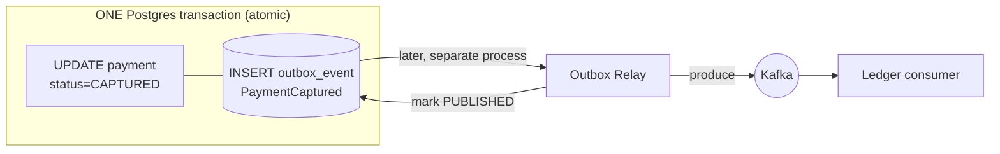

# The Outbox Pattern

> **In one sentence:** to change your database AND publish an event without them
> ever getting out of sync, write the event into a table in your *own* database in
> the **same transaction** as the business change, then let a separate relay ship
> it to the message bus.

> 🧊 **In plain terms:** you need to (1) update your ledger and (2) post a letter
> announcing it. If you do them separately, you might update the ledger and then
> drop dead before posting the letter (or vice versa) — now they disagree. The
> outbox trick: instead of walking to the postbox yourself, you drop the letter in
> your **own out-tray** *at the same moment* you update the ledger (one atomic
> action). Later, a mail carrier empties the out-tray and posts everything. If you
> die after the atomic action, the letter is still safely in the out-tray waiting.

---

## 1. Start with the bug it prevents (the dual-write problem)

A payment service must do two things when a payment is captured:
1. update its **database** (`status = CAPTURED`)
2. publish a **`PaymentCaptured` event** to Kafka (so the Ledger service reacts)

The naive code:

```python
payment.status = "CAPTURED"
payment.save()                      # (1) write to Postgres
kafka.produce("payments.events", event)   # (2) publish to Kafka
```

These are **two separate systems** with **no shared transaction**. Whatever order
you pick, a crash in the gap breaks you:

```
   save() succeeds ──✅──► CRASH before produce()  =>  DB says CAPTURED, but NO event
                                                       → ledger never learns → money lost in limbo

   produce() succeeds ──✅──► CRASH before save()  =>  event sent, but DB NOT updated
                                                       → ledger posts a payment that "didn't happen"
```

You cannot make two systems commit atomically without distributed transactions
(2PC), which are slow and fragile (see [Saga](saga-pattern.md) §1). This is the
**dual-write problem**, and it's everywhere in event-driven systems.

---

## 2. The fix: write the event to your own DB, in the same transaction

The insight: you *can* do two writes atomically if they're **in the same
database**. So instead of publishing to Kafka directly, insert the event as a row
in an **outbox table** in your service's own Postgres — in the **same
transaction** as the business change:

```python
with transaction.atomic():          # ONE local transaction — all or nothing
    payment.status = "CAPTURED"
    payment.save()                  # (1) business change
    OutboxEvent.objects.create(     # (2) the event, as a row in MY database
        event_type="PaymentCaptured",
        topic="payments.events",
        payload={...},
    )
```

Now (1) and (2) **commit together or not at all** — Postgres guarantees it. There
is no gap to crash in. The event is safely persisted the instant the payment is
captured.

Then a **separate relay process** reads unpublished outbox rows and sends them to
Kafka:

```
   relay loop:
     rows = OutboxEvent.objects.filter(status="PENDING").order_by("created_at")
     for row in rows:
         kafka.produce(row.topic, row.payload)   # publish
         row.status = "PUBLISHED"; row.save()     # mark done
```

If the relay crashes mid-way, the row stays `PENDING` and gets retried next loop —
so the event is **never lost**. (It might be sent **twice** if the relay crashes
after producing but before marking PUBLISHED — which is why consumers must be
**idempotent**; see [Idempotency](idempotency.md).)



---

## 3. The real code in this project

**The outbox table** (`outbox/models.py`) — an event is just a row:

```python
class OutboxEvent(UUIDModel, TimestampedModel):
    class Status(models.TextChoices):
        PENDING = "PENDING"      # written, not yet published
        PUBLISHED = "PUBLISHED"  # relay pushed it to Kafka
        FAILED = "FAILED"        # relay gave up → DLQ (Phase 3)

    aggregate_type = models.CharField(max_length=64)   # "Payment"
    aggregate_id = models.UUIDField()                  # the payment id
    event_type = models.CharField(max_length=64)       # "PaymentCaptured"
    topic = models.CharField(max_length=128)           # "payments.events"
    partition_key = models.CharField(max_length=256)   # hash(tenant, account) (Phase 2)
    payload = models.JSONField()
    status = models.CharField(default=Status.PENDING)
    # + an index on (status, created_at) so the relay finds PENDING rows fast
```

**The atomic write** (`payments/services.py`, `capture_payment`):

```python
@transaction.atomic                              # ← the whole function is one tx
def capture_payment(*, tenant_id, payment_id, correlation_id=""):
    payment = Payment.objects.select_for_update().for_tenant(tenant_id).get(id=payment_id)
    if payment.status == "CAPTURED":
        return payment, False                    # idempotent: already done
    payment.status = "CAPTURED"
    payment.save(update_fields=["status", "updated_at"])
    OutboxEvent.objects.create(                  # SAME transaction → no dual-write
        aggregate_type="Payment", aggregate_id=payment.id,
        event_type="PaymentCaptured", topic="payments.events",
        partition_key=f"{tenant_id}:{payment.id}",
        payload={"payment_id": str(payment.id), "amount_minor": payment.amount_minor, ...},
    )
    return payment, True
```

We *verified* this end-to-end: after capturing a payment against Neon, the
`outbox_event` table contained exactly one `PaymentCaptured` row with status
`PENDING`. The **relay** that ships those rows to Kafka is built in **Phase 2**.

---

## 4. Delivering the event: polling relay vs CDC

Two ways to build the relay:

- **Polling publisher (ours, Phase 2):** a worker `SELECT`s `PENDING` rows on an
  interval and publishes them. Simple, works anywhere. Costs a little latency and
  DB load (mitigated by the `(status, created_at)` index).
- **Change Data Capture (CDC):** a tool like **Debezium** tails Postgres's
  write-ahead log and streams new outbox rows to Kafka automatically — lower
  latency, no polling load, but more infrastructure. The scale-up path noted in
  DESIGN.md §10.

Either way the *table* design is identical; only who-reads-it changes.

---

## 4.5 Running the relay as multiple instances (HA) + failure semantics

The relay is a worker; for **high availability** you run **2+ instances**. But two
relays naively reading the same PENDING rows would **double-publish**. Two ways to
make concurrent relays safe — and both keep the guarantee **no event lost
(at-least-once)**:

### Approach A — `SELECT ... FOR UPDATE SKIP LOCKED` (Ledgerstream's choice)

```python
with transaction.atomic():
    rows = (OutboxEvent.objects
            .select_for_update(skip_locked=True)   # lock a batch; others skip it
            .filter(status="PENDING").order_by("created_at")[:batch_size])
    ... produce to Kafka ...
    ... mark those rows PUBLISHED ...
    # commit releases the locks
```

Each relay **locks a disjoint batch**; other relays **skip** the locked rows and
grab different ones → no double-publish.

**Failure semantics — the elegant part.** The lock is tied to the **transaction**,
not the process. If the relay crashes (or errors) before the commit:
- Postgres **rolls back** the transaction → **releases the locks** *and* **undoes
  the PUBLISHED marking** (even a crashed process's broken connection triggers this).
- The rows revert to **PENDING, unlocked** → the loop's **next cycle** (this
  instance, a restart, or another relay) re-fetches and **re-publishes** them.

> **Key advantage: locks auto-release on crash → no stuck rows, no cleanup.**
> **Trade-off:** the lock is held **across the Kafka produce** (network I/O) — fine
> for a bounded batch.

### Approach B — claim with a `PROCESSING` state + stale-reclaim

Avoids holding a lock during I/O — better at very high scale / slow produce:

```python
# tx1 (short): claim a batch, DON'T hold a lock during publishing
OutboxEvent.objects.filter(status="PENDING")[:n].update(
    status="PROCESSING", claimed_at=now())      # SKIP LOCKED here too, to pick disjoint rows
# ... produce to Kafka (no DB lock held) ...
# tx2: mark them done
OutboxEvent.objects.filter(id__in=published).update(status="PUBLISHED")
```

**Failure semantics — the catch.** If the relay crashes **after** marking
`PROCESSING` but **before** `PUBLISHED`, those rows are **stuck in PROCESSING
forever** — nothing rolls them back (they were committed as PROCESSING). So you
need a **reclaimer**: a periodic job that resets rows `PROCESSING` for longer than
a timeout back to `PENDING`:
```python
OutboxEvent.objects.filter(status="PROCESSING",
                           claimed_at__lt=now()-timeout).update(status="PENDING")
```

> **Advantage:** no DB lock held during the Kafka produce (scales to slow/large
> publishes). **Cost:** an extra `claimed_at` column + a background reclaimer + a
> timeout to tune — more moving parts, and a crash adds *reclaim-timeout* latency
> before retry.

### Failure points (both approaches — no loss, possible duplicate)

| Crash happens… | Rows revert to | Re-published? | Duplicate? |
|---|---|---|---|
| during produce (before flush) | PENDING (A: rollback · B: reclaim) | yes, next cycle | maybe (msgs that reached Kafka) |
| after flush, before the "done" commit | PENDING | yes | **yes** (Kafka already had them) |
| after commit (PUBLISHED) | — (stays PUBLISHED) | no | no — clean |

A mid-flight crash may re-publish → **duplicate**, absorbed by the **idempotent
consumer** (dedupe on `event_id`). Nothing is ever lost.

### Which to pick
- **SKIP LOCKED (A)** — simpler, self-recovering (locks auto-release), great for
  bounded batches. **Ledgerstream uses this.**
- **PROCESSING + reclaim (B)** — when the publish step is slow/large and you don't
  want DB locks held across it; accept the extra reclaimer.

---

## 5. Related patterns (don't confuse them)

- **Inbox pattern** — the mirror image on the *consumer* side: record processed
  event ids in an "inbox" table to dedupe redeliveries (an idempotency technique).
- **Listen-to-yourself** — the service consumes its own events to update its state,
  instead of a relay. Different trade-offs.
- **Event sourcing** — the outbox stores events *to publish*; event sourcing makes
  events the *source of truth*. The outbox is not event sourcing.

---

## 6. Interview questions you should be able to answer

- *What's the dual-write problem?* → Updating a DB and publishing an event are two
  systems with no shared transaction; a crash between them leaves them
  inconsistent (event without state, or state without event).
- *How does the outbox solve it?* → Write the event as a row in the same DB, in the
  same transaction as the business change (atomic), then relay the row to the bus
  separately. No gap to crash in.
- *Why not just use a distributed transaction (2PC)?* → Blocking, holds locks,
  coordinator is a SPOF, poor availability, unsupported by Kafka+DB combos.
- *Does the outbox give exactly-once?* → No — the relay can publish a row twice if
  it crashes before marking it published (at-least-once). Consumers must be
  idempotent.
- *Polling relay vs CDC?* → Polling is simple but adds latency/DB load; CDC
  (Debezium) tails the WAL for low-latency publishing at the cost of more infra.
- *How do you keep the polling relay efficient?* → Index on (status, created_at);
  batch; mark/prune published rows.

---

## 7. How Ledgerstream uses it

The **Payment service** owns the outbox. `capture_payment` writes the payment
status change and the `PaymentCaptured` outbox row in **one `@transaction.atomic`**
— solving the dual-write problem for the Payment → Ledger saga. Rows carry the
target `topic` and a `partition_key` so the **relay** (Phase 2) stays dumb: it just
reads `PENDING` rows and publishes them to Kafka (serialized as Avro), then marks
them `PUBLISHED`. Because delivery is at-least-once, the Ledger consumer is built
**idempotent** (Phase 2). This is Tier 1, load-bearing — without it the whole
event-driven flow can silently lose or invent money movements.

---

*Related: [Idempotency](idempotency.md) (why consumers must dedupe) ·
[Event-Driven Architecture](event-driven-architecture.md) ·
[Saga](saga-pattern.md) (the outbox is how each saga step publishes reliably) ·
[Kafka](kafka.md).*
