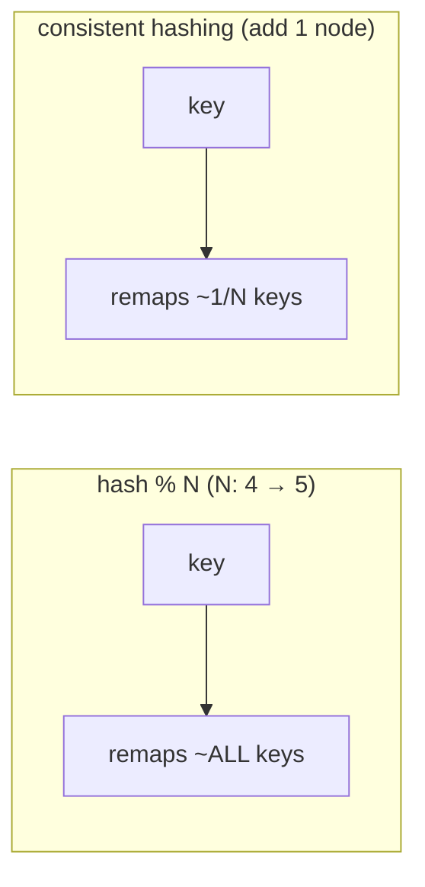

# Partitioning & Consistent Hashing

> **In one sentence:** to spread data/work across N nodes (Kafka partitions, DB
> shards, cache servers) you map each key to a node with a hash — but *how* you
> map determines your **ordering guarantees, hot-spot risk, and what happens when N
> changes**, and **consistent hashing** is the mapping that survives N changing.

> 🧊 **In plain terms:** you're sorting mail into pigeonholes by the first letter of
> the surname. Choose the rule badly — "everyone A–M in box 1" — and box 1
> overflows while box 2 sits empty (a *hot spot*). And if you ever *add* a
> pigeonhole, the naive rule forces you to re-sort **all** the mail. Consistent
> hashing is a smarter rule where adding a box only moves a *little* mail.

---

## 1. Two decisions, often confused

Partitioning involves two separate choices:

1. **The partition KEY** — *what* you group by (tenant? account? user?). This
   decides **ordering** and **hot spots**.
2. **The mapping function** — *how* a key becomes a partition number
   (`hash % N` vs consistent hashing). This decides **what happens when N changes**.

Get both right; they solve different problems.

---

## 2. Choosing the key (ordering + hot spots)

Recall Kafka's iron law: **order is guaranteed only within a partition**, and all
records with the same key go to the same partition. So the key determines *what
stays ordered*.

For a ledger, we need **per-account** ordering (an account's events must apply in
order). Options:

```
   key = tenant_id
     → all of a tenant's events on ONE partition
     → a whale tenant floods that partition (HOT PARTITION), capped at 1 consumer

   key = account_id
     → good spread, per-account order... but loses tenant locality

   key = hash(tenant_id, account_id)   ← Ledgerstream's choice
     → per-ACCOUNT ordering (what the ledger needs)
     → spreads a big tenant's accounts ACROSS partitions (no hot spot)
```

**Hot partition** = one partition getting a disproportionate share of traffic
because the key is too coarse (e.g. keying by `country` when 80% of users are in
one country). The fix is a **finer / composite key** — exactly why we key by
`hash(tenant, account)`, not `tenant` alone. It's noted as a risk in DESIGN.md §7.

> **The trade-off:** finer keys spread load but shrink your ordering scope. Key too
> coarse → hot spots; too fine → you lose the ordering you needed. Pick the
> *smallest* scope that still gives the ordering the domain requires (here:
> per-account).

---

## 3. The mapping: naive modulo and why it breaks

The obvious mapping is **`partition = hash(key) % N`**. It's what Kafka's default
partitioner does, and it's fine — *until N changes.*

**Worked example** — 4 partitions, then you add a 5th (`N: 4 → 5`):

```
   key "acct-A": hash=1007  → 1007 % 4 = 3   ... then 1007 % 5 = 2   MOVED
   key "acct-B": hash=1008  → 1008 % 4 = 0   ... then 1008 % 5 = 3   MOVED
   key "acct-C": hash=1009  → 1009 % 4 = 1   ... then 1009 % 5 = 4   MOVED
```

**Almost every key maps to a different partition.** For a cache, that means a
near-total **cache miss storm** (every key looks in the wrong server). For a
partitioned log that relies on per-key ordering, in-flight ordering guarantees
**break** during the remap. `hash % N` is cheap but **catastrophic to resize**.

---

## 4. Consistent hashing (resize without chaos)

Consistent hashing changes the mapping so that adding/removing a node moves only
**~1/N of the keys**, not all of them.

**The idea — a ring:** imagine a circle of positions `0 … 2³²`. Place each **node**
at several points on the ring (hash the node id). Place each **key** on the ring
(hash the key). A key belongs to the **first node clockwise** from it.

```
        (ring, clockwise)
     Node-A ● ......... key1 ...... ● Node-B
        .                              .
     key3 ......                  ..... key2
        .          ● Node-C           .
         ' ....... ....... ....... .'
   key1 → next node clockwise = Node-B
   key2 → Node-C ,  key3 → Node-A
```

**Add Node-D** on the ring: only the keys in the arc *just before* D move (to D).
Every other key keeps its node. So resizing disturbs a **small slice**, not
everything.

**Virtual nodes (vnodes):** to avoid uneven arcs (one node owning a huge slice),
each physical node is placed at **many** ring positions. This smooths the
distribution and makes rebalancing even when nodes join/leave.



---

## 5. Where each is actually used (important nuance)

- **Kafka partitions:** the *default* partitioner uses **`hash % N`**. So the real
  lesson for Kafka is: **you can't cheaply change partition count** without
  breaking key→partition stability — therefore **choose the partition count
  generously up front** and avoid resizing. (You *can* add partitions, but existing
  keys remap — bad for ordering.) Consistent hashing is the *mental model* for why
  that's dangerous.
- **Consistent hashing shines where nodes join/leave routinely:** distributed
  **caches** (memcached/Redis client-side sharding), **Dynamo-style databases**
  (Cassandra, DynamoDB, Riak), CDNs, and shard routers. There, nodes are added and
  removed all the time, and moving only 1/N of keys is essential.

So: **Kafka → pick partition count carefully (modulo is fragile);
caches/DB-shards → consistent hashing (resize gracefully).**

---

## 6. Interview questions you should be able to answer

- *What does the partition key decide?* → Ordering scope (same key = same
  partition = ordered) and hot-spot risk.
- *What's a hot partition and how do you fix it?* → One partition overloaded due to
  a too-coarse key; fix with a finer/composite key (e.g. `hash(tenant, account)`).
- *Why is `hash % N` bad when N changes?* → Almost every key remaps → cache-miss
  storm / broken per-key ordering.
- *How does consistent hashing help?* → Ring mapping so adding/removing a node
  moves only ~1/N of keys; vnodes even out the distribution.
- *What are virtual nodes for?* → Many ring positions per physical node → balanced
  load and smooth rebalancing.
- *Does Kafka use consistent hashing?* → No, its default partitioner uses modulo —
  so choose partition count up front; consistent hashing is used in caches and
  Dynamo-style stores where membership changes often.
- *Trade-off of a very fine key?* → Loses ordering scope; too coarse → hot spots.

---

## 7. How Ledgerstream uses it

Kafka topics (`payments.events`, `ledger.events`) are keyed by
**`hash(tenant_id, account_id)`** (built into the outbox `partition_key`) for
**per-account ordering without hot partitions** — a whale tenant's accounts spread
across partitions. Topics are created with a **deliberate partition count (6)**
because modulo mapping makes resizing costly. We *document* consistent hashing as
the correct approach for the components where membership changes routinely (the
Redis cache in Phase 4, and any future DB sharding), and note the hot-partition
risk + mitigation in DESIGN.md §7. (Phase 1's `partition_key` is a placeholder
`tenant:payment`; keying by account lands with the real ledger accounts.)

---

*Related: [Kafka §3–4](kafka.md) (partitions & the partitioner) · [Event-Driven
Architecture](event-driven-architecture.md) · [CAP/PACELC](cap-and-pacelc.md).*
