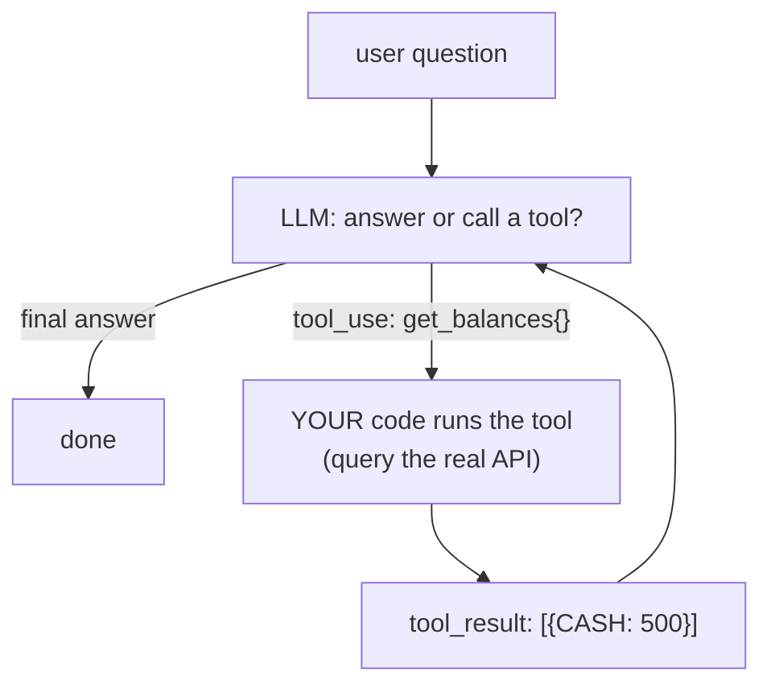
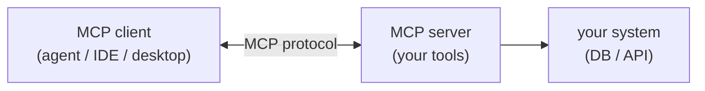

# Grounding an LLM: Tool Use, RAG & MCP

> **In one sentence:** an LLM only knows its training data and what you put in the
> prompt, so to answer questions about *your* live data you **ground** it — give it
> **tools** it can call (or retrieved documents) to fetch real facts, and let it
> reason over those facts instead of hallucinating.

> 🧊 **In plain terms:** the model is a brilliant intern who has read the whole
> internet but has never seen your company's books. Ask "what's my cash balance?" and
> an ungrounded intern will *guess*. Grounding is handing them a phone with two
> buttons — "get balances", "get transactions" — and saying "look it up, don't
> invent." Tool use is those buttons; RAG is handing them the relevant files; MCP is
> a standard shape for those buttons so any intern can use them.

---

## 1. The problem: LLMs don't know your data (and will guess)

Two hard limits of a raw LLM:

- **Knowledge cutoff & no live data** — it can't know today's balance; that's not in
  its weights.
- **Hallucination** — asked for a number it doesn't have, a fluent model will produce
  a *plausible-looking* one. For anything factual (money!) that's dangerous.

**Grounding** fixes both: connect the model to a source of truth for the current
request, and instruct it to answer only from what it fetched.

Two main grounding techniques:

| Technique | You give the model… | Best for |
|---|---|---|
| **Tool use** (function calling) | a set of **actions/queries** it can invoke; it decides which to call | structured/live data, APIs, "do X and use the result" |
| **RAG** (retrieval-augmented generation) | **retrieved documents/passages** relevant to the query, in the prompt | large unstructured corpora (docs, wikis, support tickets) |

They compose (a tool can *be* a retriever). For a ledger, **tool use** is the natural
fit — the truth lives behind a structured read API, not in prose.

---

## 2. Tool use / function calling — how the loop works

You describe tools (name + description + JSON-schema inputs). The model, instead of
answering, may **request a tool call**; your code executes it and feeds the result
back; the model then answers (or calls another tool). It's a loop:



```python
history = [{"role": "user", "text": question}]
while True:
    result = llm.generate(system, history, tools)
    if result.kind == "final":
        return result.text
    # model asked for tools → execute them, append results, loop
    history.append({"role": "tool_use", "calls": result.tool_calls})
    history.append({"role": "tool_result",
                    "results": [(c.id, run_tool(c.name, c.input)) for c in result.tool_calls]})
```

Critical properties:

- **The model proposes; your code disposes.** The LLM only emits a *request* to call
  `get_balances`; **your** code decides whether and how to run it. That boundary is
  where you enforce safety (allowlist, auth, tenant scoping) — see
  [ai-guardrails.md](ai-guardrails.md).
- **No SQL from the model.** Expose *safe, specific* tools (`get_balances`), not a
  `run_sql(query)` tool. The model never touches the database directly.
- **Bounded loop.** Cap iterations so a confused model can't loop forever.
- **The answer is grounded** — it's built from real tool output, and you instruct the
  model to never state a figure it didn't fetch.

---

## 3. RAG in one paragraph (the other grounding path)

For large **unstructured** corpora you can't enumerate as tools, **RAG** retrieves the
few relevant chunks and pastes them into the prompt: embed your documents into a
vector store; at query time, embed the question, find the nearest chunks (semantic
search), and prepend them as context ("answer using these passages, and cite them").
It's grounding by **retrieval** rather than by **action**. Key concerns: chunking,
embedding model, the vector index, and citing sources so answers are verifiable. A
retriever can also be exposed *as a tool*, so RAG and tool use aren't rivals.

---

## 4. MCP — a standard protocol for tools

**MCP (Model Context Protocol)** is an open standard for exposing tools (and
resources/prompts) to LLM applications over a defined wire protocol. Instead of each
app hard-coding each integration, a tool provider runs an **MCP server** exposing
tools, and any **MCP client** (an IDE, Claude Desktop, an agent) can discover and call
them.



- **Why it matters:** decoupling. Write your `get_balances` tool once as an MCP server;
  any MCP-speaking client can use it — you're not rebuilding the integration per app.
- **Tool use vs MCP:** tool use is the *pattern* (model calls functions); MCP is a
  *standard transport + schema* for offering those functions across process/vendor
  boundaries. You can do tool use **without** MCP (in-process, as the loop above), and
  you can expose the very same tools **over** MCP for external clients.
- **Security still applies:** an MCP server needs auth and scoping just like any API —
  exposing tools over a standard protocol doesn't remove the need to authorize each
  call.

---

## 5. Interview questions you should be able to answer

- *Why does an LLM need grounding?* → It has a knowledge cutoff, no live data, and will
  hallucinate a plausible answer when it lacks facts; grounding connects it to a source
  of truth for the request.
- *Tool use vs RAG?* → Tool use gives the model callable actions/queries (structured,
  live); RAG retrieves relevant documents into the prompt (unstructured corpora). They
  compose.
- *Walk through the tool-use loop.* → Model returns a tool_use request → your code
  executes it → feed the result back → model answers or calls again → bounded loop.
- *Why expose `get_balances` instead of a `run_sql` tool?* → Safety: specific read tools
  can't be abused; a SQL tool lets a jailbroken model read/modify anything. The model
  proposes, your code disposes.
- *What is MCP and how does it relate to tool use?* → A standard protocol for offering
  tools to any MCP client; tool use is the pattern, MCP is a standard transport/schema
  for it across process/vendor boundaries.
- *How do you stop hallucinated numbers?* → Force tool use for facts, instruct "never
  state a figure you didn't fetch", and ground the answer in real tool output.

---

## 6. How Ledgerstream uses it

The AI Query service grounds every answer with **tool use** (no RAG needed — the truth
is a structured read API). The model is offered exactly two safe, tenant-scoped read
tools — `get_balances` and `get_transactions` (`services/ai/app/tools.py`) — executed
**through the API Gateway using the caller's JWT** (`AI → Gateway → Ledger`), so it can
only ever see its own tenant's data (and those reads reuse the gateway's rate limit,
cache, and breaker). The provider-neutral **tool-use loop** (`llm/gateway.py`) runs the model
→ execute tool → feed result → repeat (bounded), and the system prompt forbids inventing
figures and treats tool output as data, not instructions. The **same two tools are also
published over MCP** (`app/mcp_server.py`, via `FastMCP`) so any MCP client can use them
with a tenant-scoped token. Built in **Phase 6**.
