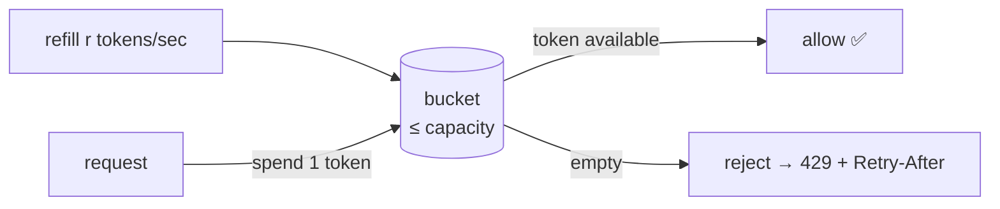

# Rate Limiting & Backpressure

> **In one sentence:** cap how many requests an identity (a tenant, a user, an IP)
> can make per unit time, so one noisy client can't exhaust the system for everyone —
> and callers get a clear `429 Too Many Requests` instead of a slow, half-broken API.

> 🧊 **In plain terms:** it's the bouncer with a clicker at a club door. The club
> holds N people; the bouncer lets them in at a steady rate and, when it's full,
> says "wait a moment" instead of letting everyone pile in and crushing the place.
> Rate limiting is that clicker for your API.

---

## 1. Why you need it

An API without a limiter is a shared resource with no fairness rule. Consequences:

- **One tenant starves the rest** — a buggy loop or a batch job hammers the API and
  everyone else's latency spikes (the "noisy neighbour").
- **Cost / abuse** — scrapers, credential-stuffing on login, accidental retries.
- **Cascading overload** — traffic beyond capacity doesn't just slow the edge; it
  pushes the DB and downstreams over too.

Rate limiting is the **fairness + protection** control. It belongs at the **edge**
(the gateway) so bad traffic is rejected *before* it reaches any backend.

---

## 2. The classic algorithms (know the trade-offs)

| Algorithm | How it works | Weakness |
|---|---|---|
| **Fixed window** | count requests per calendar window (e.g. per minute); reset at the boundary | **burst at the edge**: 100 at 0:59 + 100 at 1:00 = 200 in 2s, double the limit |
| **Sliding window log** | store timestamps, count those within the last 60s | accurate but **memory-heavy** (one entry per request) |
| **Sliding window counter** | weighted blend of current + previous fixed window | good approximation, cheap |
| **Token bucket** | a bucket of `capacity` tokens refills at `r`/sec; each request spends one; empty → reject | allows a **controlled burst** up to capacity, caps the **sustained** rate at `r` — usually the best default |
| **Leaky bucket** | requests queue and drain at a fixed rate | smooths output but adds queueing latency |

**Token bucket** is the common production choice: it permits short bursts (good UX —
a user clicking quickly isn't punished) while bounding the long-run rate, and it has
no fixed-window edge-doubling problem.



---

## 3. Token bucket, precisely

State per identity: `tokens` (current count) and `ts` (last update time). On each
request:

```
elapsed = now - ts
tokens  = min(capacity, tokens + elapsed * refill_rate)   # refill for the gap
if tokens >= 1:
    tokens -= 1;  allow
else:
    reject;  retry_after = (1 - tokens) / refill_rate      # when the next token lands
ts = now
```

- **`capacity`** = the biggest burst you tolerate.
- **`refill_rate`** = the sustained requests/sec. (60 + 1/s ≈ 60/min sustained,
  burstable to 60.)

### Why it must be atomic (the interview trap)

Read-modify-write across concurrent requests is a race: two requests both read
`tokens=1`, both think they can spend it, both allow → the limit is breached. So the
whole check must be **atomic**. Options:

- **Redis + Lua** — run the read-refill-spend as one server-side script (what we do);
  one round-trip, no race.
- **Redis `INCR` + `EXPIRE`** — trivial fixed-window counter, atomic via `INCR`, but
  has the edge-burst weakness.
- **A single-node in-memory limiter** with a lock — fine until you have >1 instance,
  then each instance has its own bucket and the real limit is `N × configured`.

**Distributed enforcement needs shared state** (Redis), because the limit must hold
across all gateway replicas, not per-instance.

### 3.1 A worked example, in plain terms

> 🧊 Picture a **bucket that holds at most 60 marbles**. A machine drops **1 new
> marble in every second**, but the bucket never overflows past 60. Every API request
> must **take one marble** to proceed. If the bucket is empty, the request is turned
> away — "come back in about a second, a marble is about to drop." That's the token
> bucket: the 60 is your **burst**, the 1/second is your **sustained rate**.

Timeline for one tenant (`capacity = 60`, `refill = 1/sec`), starting with a full
bucket:

| Time | What happens | Tokens before | Allowed? | Tokens after |
|---|---|---|---|---|
| 0.0s | tenant fires 60 requests in a blink (a burst) | 60 → … | ✅ all 60 | 0 |
| 0.1s | the 61st request, same second | 0 | ❌ **429**, `Retry-After: 1` | 0 |
| 0.1s | …keeps hammering | 0 | ❌ all denied | 0 |
| 3.0s | goes quiet for ~3s, then 1 request | refilled +3 → 3 | ✅ | 2 |
| 63s  | one request per second, steadily | ~1 | ✅ every time | ~0 |

So a client **can** burst (good UX — a quick flurry of clicks is fine), but **cannot**
sustain more than 1/second on average. A fixed-window limiter would instead allow 60
at 0:59 and *another* 60 at 1:00 — 120 in two seconds. The token bucket smooths that.

### 3.2 The actual Lua script, line by line

This is exactly `gateway/ratelimit.py`'s script. Redis runs it **atomically** — the
whole read-refill-spend happens as one indivisible step, so two concurrent requests
can't both spend the last token.

```lua
local key      = KEYS[1]           -- e.g. "rl:tenant:tenant-123"
local capacity = tonumber(ARGV[1]) -- 60   (bucket size / max burst)
local refill   = tonumber(ARGV[2]) -- 1.0  (marbles added per second)
local now      = tonumber(ARGV[3]) -- current unix time (passed in from Python)
local want     = tonumber(ARGV[4]) -- 1    (this request costs 1 token)

-- Read the two fields we stored last time for this bucket.
local state  = redis.call('HMGET', key, 'tokens', 'ts')
local tokens = tonumber(state[1])  -- tokens left as of...
local ts     = tonumber(state[2])  -- ...this timestamp
if tokens == nil then              -- brand-new bucket → start FULL
  tokens = capacity
  ts     = now
end

-- REFILL: add (elapsed seconds × rate) marbles, capped at capacity.
-- e.g. 3s elapsed × 1/s = +3 tokens; math.max(0,...) guards clock weirdness.
tokens = math.min(capacity, tokens + math.max(0, now - ts) * refill)

local allowed = 0
local retry_after = 0
if tokens >= want then             -- enough marbles?
  tokens = tokens - want           -- spend one → allow
  allowed = 1
else
  retry_after = (want - tokens) / refill   -- seconds until the next marble drops
end

-- Write the new state back and let an idle bucket expire (no key leak).
redis.call('HMSET', key, 'tokens', tokens, 'ts', now)
redis.call('EXPIRE', key, math.ceil(capacity / refill) + 1)
return {allowed, tostring(retry_after)}   -- e.g. {1, "0"} allowed, or {0, "1.8"} denied
```

### 3.3 A numeric trace (watch the variables change)

Small bucket so it's easy to follow: **`capacity = 3`, `refill = 1 token/sec`**, one
tenant (`key = "rl:tenant:tenant-123"`), each request costs `want = 1`.

| # | `now` | reads `(tokens, ts)` | elapsed | after refill (cap 3) | `≥ want`? | writes `(tokens, ts)` | returns | client |
|---|---|---|---|---|---|---|---|---|
| 1 | 100.0 | `(nil,nil)` → start full | 0 | 3 | ✅ spend | `(2, 100.0)` | `{1,"0"}` | 200 |
| 2 | 100.2 | `(2, 100.0)` | 0.2 | 2.2 | ✅ spend | `(1.2, 100.2)` | `{1,"0"}` | 200 |
| 3 | 100.3 | `(1.2, 100.2)` | 0.1 | 1.3 | ✅ spend | `(0.3, 100.3)` | `{1,"0"}` | 200 |
| 4 | 100.4 | `(0.3, 100.3)` | 0.1 | 0.4 | ❌ deny | `(0.4, 100.4)` | `{0,"0.6"}` | **429** |
| 5 | 102.0 | `(0.4, 100.4)` | 1.6 | 2.0 | ✅ spend | `(1.0, 102.0)` | `{1,"0"}` | 200 |
| 6 | 110.0 | `(1.0, 102.0)` | 8.0 | **3.0 (capped)** | ✅ spend | `(2.0, 110.0)` | `{1,"0"}` | 200 |

Walking the interesting rows:

- **#1** — no bucket yet → `tokens=nil` → start **full** (3), spend 1 → 2 left.
- **#4** — three quick calls drained it; refill only adds `0.1×1 = 0.1` → `0.4` tokens,
  which is `< 1` → **deny**, `retry_after = (1 − 0.4)/1 = 0.6s`. Nothing is spent; only
  `ts` moves forward.
- **#5** — the client waited ~1.6s → refill adds `1.6` → `2.0` tokens → **allowed again**.
  The wait *healed* the bucket. This is the self-recovery a fixed window doesn't give.
- **#6** — idle 8s would add 8 tokens, but `math.min(…, 3)` **caps** it at 3. Idling
  can't buy you an unlimited burst — that's the cap doing its job.

Four things this shows: refill is **computed from elapsed time** (no background job),
tokens are **fractional** (smooth, not lumpy), the **cap** stops hoarding, and
`retry_after` is the **exact** time until the next token. And because it's one **Lua
script**, all six steps are atomic — two of the tenant's requests in the same
millisecond can't both read `0.4` and both decide to spend; the second sees the first's
write.

The Python side (`check()`) just passes the config + `time.time()` in and turns the
result into `(allowed: bool, retry_after: float)`:

```python
check("tenant:tenant-123")  # → (True, 0.0)    had a token
check("tenant:tenant-123")  # → (False, 1.8)   empty → wait ~1.8s → the view raises 429
```

Storing only `(tokens, ts)` and **computing** the refill from elapsed time (rather than
running a background job that tops up every bucket) is the trick that makes this cheap:
one tiny hash per identity, updated lazily on each request.

---

## 4. What to return

- **HTTP `429 Too Many Requests`.**
- A **`Retry-After`** header (seconds) so a well-behaved client backs off exactly long
  enough — this is *backpressure*: telling the caller to slow down instead of
  silently dropping or hanging.
- Optionally `X-RateLimit-Limit` / `-Remaining` / `-Reset` for observability.

**Backpressure** is the broader idea: a system under load should *signal* upstream to
slow down (429s, bounded queues, `503`s) rather than accept work it can't handle and
collapse. A rate limiter is backpressure applied at the front door.

---

## 5. What to key on

The **identity** you bucket by defines fairness:

- **Per API key / tenant** — fairness between customers (the usual SaaS choice).
- **Per user** — fairness within a tenant.
- **Per IP** — for *unauthenticated* endpoints (login, signup) where there's no
  tenant yet; the main defense against credential stuffing. (IPs are coarse — NAT
  shares one — so combine with other signals for real abuse.)
- **Per endpoint class** — cheap reads vs expensive writes can have different budgets.

---

## 6. Interview questions you should be able to answer

- *Fixed window vs token bucket?* → Fixed window is simple but allows ~2× the limit
  across a boundary; token bucket allows a bounded burst and a smooth sustained rate.
- *Why does the check have to be atomic?* → Read-modify-write races let concurrent
  requests both spend the "last" token; atomicity (Redis Lua / INCR) prevents it.
- *Where do you enforce it and why?* → At the edge/gateway, so abusive traffic is
  rejected before consuming backend resources.
- *How do you enforce one limit across many gateway instances?* → Shared state in
  Redis; per-instance memory limiters multiply the real limit by the replica count.
- *What do you return?* → `429` + `Retry-After`; that's cooperative backpressure.
- *What do you key on for a login endpoint?* → Client IP (no tenant yet), to blunt
  credential stuffing.
- *What is backpressure?* → Signalling upstream to slow down (429/503/bounded queues)
  instead of accepting more work than you can handle and falling over.

---

## 7. How Ledgerstream uses it

The **gateway** enforces a **token bucket in Redis** (`gateway/ratelimit.py`) via an
**atomic Lua script** (read-refill-spend in one server-side step — correct under
concurrency, one round-trip). Authenticated traffic is keyed **per tenant**
(`tenant:<id>`), anonymous login traffic **per client IP** (`ip:<addr>`). Over budget
→ DRF raises `Throttled` → **`429 + Retry-After`**. Shared Redis state means the limit
holds across gateway replicas. Config: `RATE_LIMIT_CAPACITY` (burst) +
`RATE_LIMIT_REFILL_PER_SEC` (sustained). Built in **Phase 4**.
