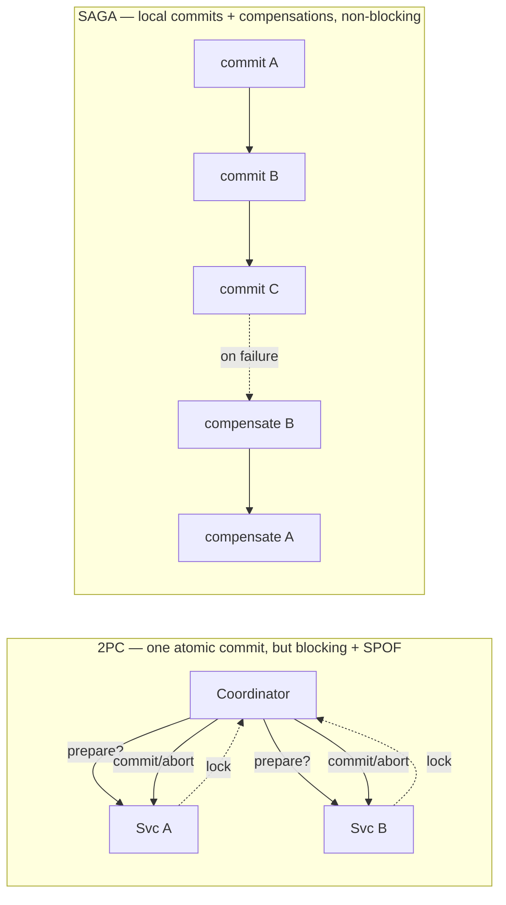
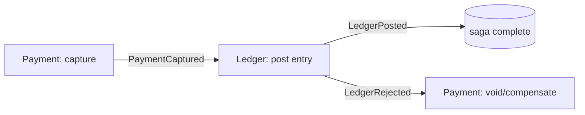
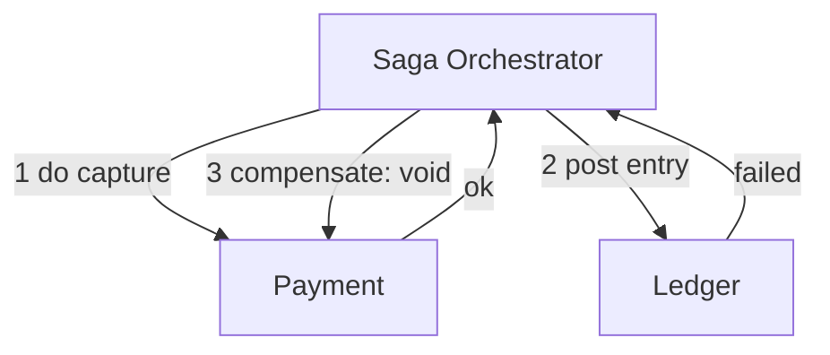
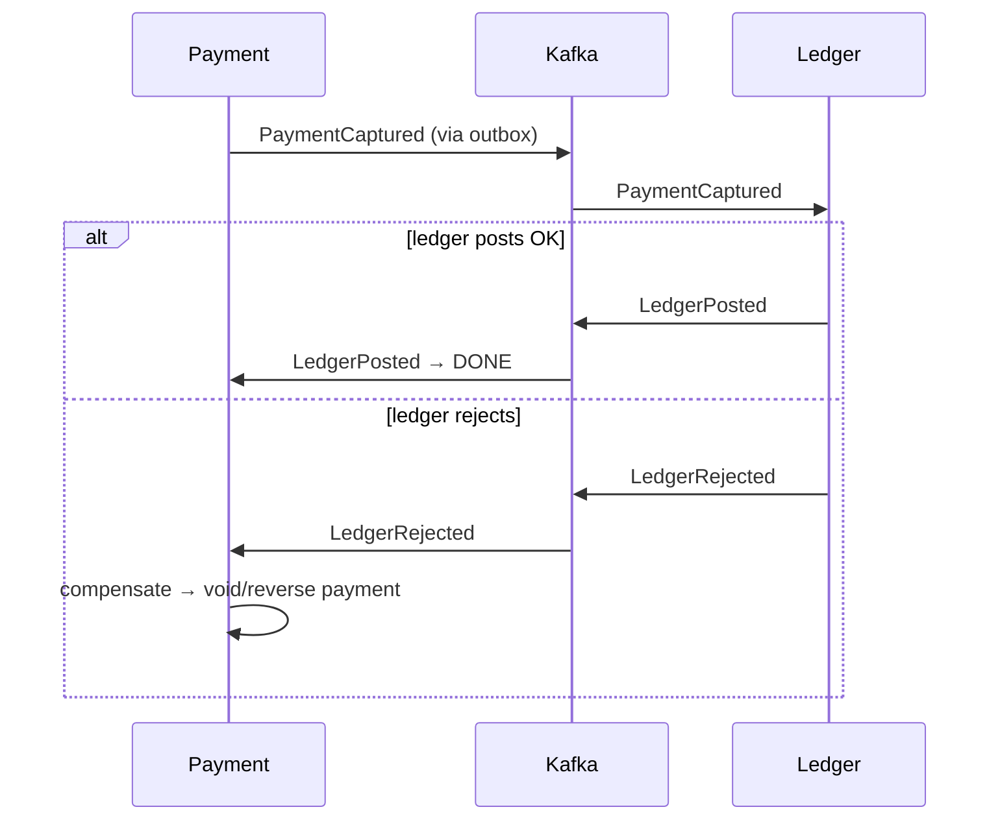

# The Saga Pattern

> **In one sentence:** a saga carries out a business transaction that spans
> multiple services as a **sequence of local transactions**, where each step has a
> matching **compensating action** that semantically undoes it — so if a later
> step fails, the earlier steps are cancelled and the system is brought back to a
> consistent state **without** a distributed transaction.

> 🧊 **In plain terms:** Booking a holiday means booking a flight, *then* a hotel,
> *then* a car — three separate companies, no single "undo everything" button. A
> saga is your personal plan: do them one at a time, and **remember how to cancel
> each**. If the car rental fails, you don't get a magic rollback — you *actively*
> cancel the hotel and cancel the flight (compensations). The end state is "as if
> nothing happened," achieved by deliberate undo steps, not by a database
> rewinding time.

---

## 1. The problem sagas solve

In a monolith, "authorize payment **and** post to the ledger" is one **ACID
transaction**: both happen or neither does, guaranteed by the database. Across
**microservices with a database each**, that single transaction is *impossible* —
Payment's DB and Ledger's DB can't participate in one atomic commit (see
[Microservices & Database-per-Service](microservices-and-database-per-service.md)).

So how do you keep a multi-step, multi-service business operation consistent?

Two options exist. One is largely rejected; the other is the saga.

### Why not 2PC (two-phase commit / distributed transactions)?
**2PC** uses a coordinator: phase 1 asks every participant "can you commit?"
(they *prepare* and lock), phase 2 tells them all "commit" (or "abort"). It gives
true atomicity, **but**:

- **It's blocking / holds locks** across services for the whole protocol — kills
  throughput and availability.
- **The coordinator is a single point of failure**; if it dies after "prepare,"
  participants are stuck holding locks ("in-doubt").
- **It's effectively CP and fragile under partitions**, and many modern
  datastores/brokers (Kafka across external systems, most NoSQL) don't support it.

The industry consensus: **avoid 2PC for cross-service business workflows.** Use a
saga and embrace **eventual consistency** + **compensation** instead.

---

## 2. Anatomy of a saga

A saga is:
- **A series of steps `T1, T2, … Tn`** — each `Ti` is a **local ACID transaction**
  in one service (fully committed there before the next step).
- **Each `Ti` has a compensating transaction `Ci`** that semantically undoes its
  effect.
- **Rule:** if `T1…Tk` succeed but `Tk+1` fails, run `Ck, Ck-1, …, C1` (compensate
  the completed steps, in reverse) to unwind.

### Compensation is *not* rollback
A database rollback erases a transaction that never committed — as if it never
happened, no trace. A **compensating transaction is a new, committed transaction
that counters a *previously committed* one**. The original effect *did* happen and
is visible in history; the compensation is a second fact that offsets it.

- Reserve credit → **compensate:** release the reservation.
- Post a ledger debit → **compensate:** post an equal-and-opposite reversing
  entry (in an immutable ledger you *never* delete — you add a reversal).
- Send an email → **compensate:** … you can't un-send. (Some actions are
  **non-compensatable**; put those *last*, after everything that can still fail.)

> **Key mental shift:** sagas trade *atomic isolation* for *eventual consistency
> with a documented undo path*. There's a window where step 1 is done and step 2
> isn't — the system is temporarily "inconsistent" and must tolerate that.

---

## 3. Two ways to coordinate a saga

### (a) Choreography — services react to each other's events
No central brain. Each service does its local step and **emits an event**; the
next service **listens** and reacts. Compensation is triggered by "failure"
events flowing backward.

- ✅ **Pros:** simple, decentralized, no extra component, great for **few steps**.
  Naturally fits event-driven systems.
- ❌ **Cons:** the workflow logic is **smeared across services** — no one place
  shows "the whole saga." Hard to follow and debug as steps grow; risk of cyclic
  event dependencies.

### (b) Orchestration — a coordinator directs the steps
A dedicated **orchestrator** (a saga component/state machine) tells each service
what to do next and reacts to results, issuing compensations on failure.

- ✅ **Pros:** the whole workflow lives in **one place** (readable, testable,
  centrally observable); easier to manage **many steps** and complex logic.
- ❌ **Cons:** an extra component to build/run; risk of the orchestrator becoming a
  "god service" if you push business logic into it that belongs in the services.

**Rule of thumb:** few steps / simple → **choreography**; many steps / complex
branching → **orchestration**.

---

## 4. The hard parts (and the interview gold)

### Lack of isolation (the ACID "I" is gone)
Because each step commits immediately, other transactions can **see intermediate
states** — anomalies classic to sagas:
- **Dirty reads:** someone reads data a not-yet-compensated step wrote.
- **Lost updates:** a concurrent write clobbers a saga's write.

Countermeasures you should be able to name:
- **Semantic lock:** mark a record as "pending" (e.g. payment status =
  `PROCESSING`) so others know it's in-flight and treat it accordingly. The
  compensation clears the flag.
- **Commutative updates:** design operations so order doesn't matter (e.g.
  add/subtract balance deltas rather than set-absolute), so concurrent steps don't
  conflict.
- **Reread / version check (optimistic locking):** re-read and verify a version
  number before writing to detect concurrent changes.
- **By value / pessimistic view:** route or reorder risky steps to minimize
  exposure.

### Idempotency & reliable messaging
Steps and compensations run over an at-least-once bus, so they **will** sometimes
be delivered twice, and may be retried after a crash. Every step **and** every
compensation must be **idempotent** (running it again has no additional effect).
Sagas lean on the **outbox pattern** to publish their events atomically with the
local commit (no lost or phantom events). (Idempotency + outbox get their own
deep-dives in Phase 1–2.)

### Compensations can fail too
Your undo step can itself fail (service down). So compensations must be
**retried until they succeed** (with backoff), and truly stuck ones parked in a
**dead-letter queue** for human intervention. A saga isn't "done" until it has
either fully completed or fully compensated.

### Ordering of non-compensatable steps
Put **non-retriable/non-compensatable** actions (send money externally, send an
email) **as late as possible** — ideally after every step that could still fail —
so you rarely have to "undo the un-undoable."

---

## 5. A worked example (Payment → Ledger)

**Happy path:**
1. `T1` Payment: mark payment `CAPTURED`, write outbox event `PaymentCaptured`.
2. `T2` Ledger: consume it, post a **balanced double-entry** (debit + credit),
   emit `LedgerPosted`.
3. Payment consumes `LedgerPosted` → saga **complete**.

**Failure path (ledger rejects — e.g. account closed):**
1. `T1` succeeds (payment CAPTURED).
2. `T2` fails → Ledger emits `LedgerRejected`.
3. Payment runs **`C1`**: compensate by voiding/refunding — move the payment to
   `FAILED`/`REVERSED`. (If the ledger had partially posted, its compensation is a
   **reversing entry**, never a delete — the ledger is immutable.)

End state is consistent: no captured-but-unrecorded money. It passed through a
temporary in-between state, which the design explicitly tolerates.

---

## 6. Interview questions you should be able to answer

- *What is a saga and what problem does it solve?* → A sequence of local
  transactions with compensations, replacing an impossible cross-service ACID
  transaction; keeps a multi-service workflow eventually consistent.
- *Compensation vs rollback?* → Rollback erases an uncommitted tx (no trace);
  compensation is a *new committed* tx that offsets an *already-committed* one.
- *Choreography vs orchestration — trade-offs and when to use each?* →
  Choreography: event-driven, decentralized, simple, good for few steps, but logic
  is scattered. Orchestration: central coordinator, readable/observable, good for
  many steps, but extra component + god-service risk.
- *Why not 2PC?* → Blocking, holds locks, coordinator is a SPOF, poor availability
  under partitions, unsupported by many datastores.
- *What consistency guarantee does a saga give?* → Eventual consistency (with a
  temporary inconsistent window), not isolation.
- *How do you handle the loss of isolation?* → Semantic locks (pending flags),
  commutative updates, optimistic version checks.
- *What if a compensation fails?* → Retry with backoff (it must be idempotent);
  dead-letter and alert if permanently stuck.
- *Why must saga steps be idempotent?* → At-least-once delivery + crash retries
  mean steps/compensations are re-executed; idempotency prevents double effects.
- *Where do you place non-compensatable actions?* → As late as possible, after all
  steps that could still fail.

---

## 7. How Ledgerstream uses it

The Payment → Ledger flow is a **choreography-based saga** (few steps, naturally
event-driven): Payment publishes `PaymentCaptured` (atomically via the **outbox**),
Ledger posts the immutable double-entry and replies with `LedgerPosted` /
`LedgerRejected`, and Payment runs a **compensating action** on rejection. Every
step is an **idempotent** consumer (at-least-once delivery), failed events go to a
**DLQ** with retries/backoff, and the ledger compensation is a **reversing entry**,
never a delete. We choose choreography over orchestration deliberately because the
flow is short; `DESIGN.md` notes we'd move to an orchestrator if the workflow grew
more steps. Built in **Phase 3**.
