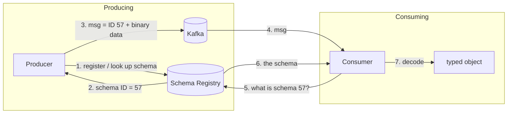
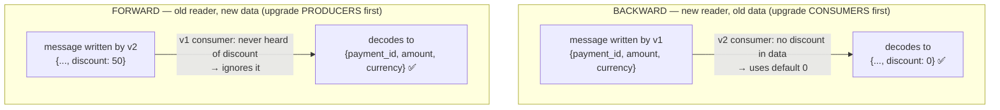

# Schema Evolution & Contracts

> **In one sentence:** in a distributed system your data formats (event schemas,
> API payloads) are long-lived contracts between independently deployed programs,
> and schema evolution is the discipline of changing them **without breaking**
> the programs that were written against the old version.

> 🧊 **In plain terms:** Two people mail forms back and forth. If one of them
> suddenly redesigns the form — renames a box, removes a field — the other's
> letters stop making sense. Schema evolution is a set of etiquette rules for
> redesigning the form so that old letters still get read correctly and new
> letters don't confuse old readers. In a system where you can only upgrade one
> side at a time, this etiquette is what keeps everything working during the
> in-between period.

---

## 1. Why this is a big deal in event systems

Two forces make schemas hard in distributed systems:

1. **You deploy services independently.** At any moment a *new* producer might be
   sending events that an *old* consumer (not yet upgraded) has to read — or vice
   versa. There is always a window where old and new coexist.
2. **Events are durable and replayed.** In a log-based bus like Kafka, an event
   written a year ago (under an old schema) may be re-read *today* by new code.
   The old data doesn't disappear when you change the schema.

So a schema isn't a momentary detail — it's a **contract that outlives the code
that produced it**. Break it carelessly and you get crashes, dropped fields, or
silent data corruption across service boundaries.

---

## 2. What a schema is, and the formats

A **schema** declares the structure of a message: field names, types, which are
required/optional, defaults. Common choices:

- **Avro** — compact **binary**; schema is separate from the data. Great
  evolution rules. Needs a **schema registry** so readers can find the schema.
- **Protobuf** — compact binary; schema in `.proto` files; field **numbers** drive
  compatibility.
- **JSON Schema** — human-readable text; easy to eyeball/debug; larger on the
  wire; looser evolution guarantees.

**Why binary + registry (Avro) for high-volume events:** messages are tiny (no
repeated field names in every message — the schema is stored once in the
registry, and each message just references a schema ID). The trade-off is you
can't read the bytes by eye; you need the schema to decode them.



### The same flow, in code

You don't write steps 1–7 yourself — the **serializer** (producing) and
**deserializer** (consuming) libraries do them. You just deal with normal objects.

**The schema** is an Avro `.avsc` file (JSON describing the fields):

```json
{
  "type": "record",
  "name": "PaymentCaptured",
  "namespace": "com.ledgerstream.payments",
  "fields": [
    { "name": "payment_id", "type": "string" },
    { "name": "amount",     "type": "long" },
    { "name": "currency",   "type": "string" }
  ]
}
```

**Producer** — steps 1–3 happen *inside* `AvroSerializer`:

```python
from confluent_kafka import SerializingProducer
from confluent_kafka.schema_registry import SchemaRegistryClient
from confluent_kafka.schema_registry.avro import AvroSerializer

sr = SchemaRegistryClient({"url": "http://localhost:8081"})              # the registry
serializer = AvroSerializer(sr, schema_str=PAYMENT_CAPTURED_SCHEMA)      # steps 1–2: register / get ID

producer = SerializingProducer({
    "bootstrap.servers": "localhost:29092",
    "value.serializer": serializer,
})
producer.produce(                                                       # step 3: prepend ID + encode + send
    topic="payments.events",
    value={"payment_id": "p1", "amount": 500, "currency": "USD"},       # <- you just pass a dict
)
producer.flush()
```

**Consumer** — steps 4–7 happen *inside* `AvroDeserializer`:

```python
from confluent_kafka import DeserializingConsumer
from confluent_kafka.schema_registry import SchemaRegistryClient
from confluent_kafka.schema_registry.avro import AvroDeserializer

sr = SchemaRegistryClient({"url": "http://localhost:8081"})
deserializer = AvroDeserializer(sr)                    # steps 5–6: read ID, fetch schema

consumer = DeserializingConsumer({
    "bootstrap.servers": "localhost:29092",
    "group.id": "ledger-service",
    "value.deserializer": deserializer,
})
consumer.subscribe(["payments.events"])

while True:
    msg = consumer.poll(1.0)
    if msg is None:
        continue
    payment = msg.value()          # step 7: already decoded to a dict
    # -> {'payment_id': 'p1', 'amount': 500, 'currency': 'USD'}
    post_ledger_entry(payment)     # your business logic
```

Notice you write `value={...}` and read `msg.value()` as plain dicts — the entire
7-step schema dance (register, get ID, prepend, fetch, decode) is hidden inside
the serializer/deserializer.

---

## 3. The four compatibility modes (the core knowledge)

"Compatibility" always asks: *can a reader using schema version X read data
written with version Y?* Direction matters. Define:

- **Backward compatible** — a **new** consumer can read data written by the **old**
  schema. (Upgrade *consumers* first.)
- **Forward compatible** — an **old** consumer can read data written by the **new**
  schema. (Upgrade *producers* first; old readers ignore what they don't know.)
- **Full** — both backward *and* forward. (Upgrade either side in any order.)
- **None** — no guarantees (don't).

**Start with the concrete change.** The `PaymentCaptured` schema gains a
`discount` field. In Avro that's a new entry in `fields`, crucially **with a
`default`**:

```json
// v1                                    // v2  (added discount, WITH a default)
{                                        {
  "name": "PaymentCaptured",               "name": "PaymentCaptured",
  "fields": [                              "fields": [
    {"name":"payment_id","type":"string"},   {"name":"payment_id","type":"string"},
    {"name":"amount","type":"long"},          {"name":"amount","type":"long"},
    {"name":"currency","type":"string"}       {"name":"currency","type":"string"},
  ]                                            {"name":"discount","type":"long","default":0}
}                                            ]
                                         }
```

Now the two directions — *who reads whose data*:



**In code — what actually comes out of `msg.value()`:**

```python
# BACKWARD: a v2 consumer reads a message that was written with v1
#   on the wire there is NO discount field; v2's schema says default = 0
payment = msg.value()
# -> {'payment_id': 'p1', 'amount': 500, 'currency': 'USD', 'discount': 0}
#                                                            ^^^^^^^^^^^ filled from the default

# FORWARD: a v1 consumer reads a message that was written with v2
#   the message HAS "discount": 50, but v1's schema has no such field
payment = msg.value()
# -> {'payment_id': 'p1', 'amount': 500, 'currency': 'USD'}
#     "discount" is simply dropped — the old code never knew it existed
```

- **Backward** — the *new* code (v2) reads *old* messages (v1) already in Kafka and
  still arriving from not-yet-upgraded producers; the missing field is filled from
  its default.
- **Forward** — the *old* code (v1) reads *new* messages (v2) by ignoring fields it
  doesn't know about.

Because *adding a field with a default* works **both** ways, it's the safe change.
"Full" = both must hold; "None" = no guarantee.

### What each mode lets you change safely

| Change | Backward-safe? | Forward-safe? |
|---|---|---|
| **Add** a field **with a default** | ✅ (reader uses default for old data) | ✅ (old reader ignores it) |
| **Add** a field **without a default** | ❌ | ✅ |
| **Remove** a field **that had a default** | ✅ | ✅ |
| **Remove** a required field | ❌ (new reader misses it) | ❌ |
| **Rename** a field | ❌ (treated as remove+add) | ❌ |
| Change a field's **type** | usually ❌ | usually ❌ |

**The golden rules that fall out of this table:**
- **Always give new fields a default.** It's the single habit that keeps you
  compatible.
- **Never rename or repurpose a field.** Add a new one and deprecate the old.
- **Don't remove required fields.** Make them optional first, let readers
  upgrade, then remove.

> **Why BACKWARD is the common default (and Ledgerstream's choice):** the typical
> upgrade order is "roll out new consumers, then new producers." Backward
> compatibility guarantees the new consumers can still read the flood of old
> messages already in the log and still arriving from not-yet-upgraded producers.

---

## 4. What a Schema Registry does

A **Schema Registry** (e.g. Confluent Schema Registry, Apicurio) is a service that:

1. **Stores** every schema version, grouped under a **subject** (usually one per
   topic).
2. **Assigns an ID** to each schema; producers embed just the ID in each message,
   keeping messages tiny.
3. **Enforces the compatibility rule** on registration: if you try to register a
   schema that violates the configured mode (e.g. BACKWARD), the registry
   **rejects it** — turning "you broke the contract" from a 3am production
   incident into a deploy-time error. This is the real value: **compatibility is
   checked automatically, before bad schemas reach production.**

---

## 5. Versioning APIs vs versioning events (related idea)

The same discipline applies to REST/gRPC APIs:
- **Additive changes** (new optional field, new endpoint) are safe.
- **Breaking changes** (remove/rename field, change type) require a **new version**
  (`/v2/…`) run **side-by-side** with `/v1` until clients migrate — the
  "expand/contract" (a.k.a. parallel-change) pattern: add the new, support both,
  migrate callers, remove the old.

Events and APIs share the principle: **evolve by adding and deprecating, never by
mutating in place.**

---

## 6. Interview questions you should be able to answer

- *Why is schema evolution hard in event systems specifically?* → Independent
  deploys create old/new coexistence windows, and retained events mean old-format
  data is read by new code long after.
- *Define backward vs forward compatibility.* → Backward: new reader reads old
  data (upgrade consumers first). Forward: old reader reads new data (upgrade
  producers first). Full: both.
- *How do you add a field safely?* → With a default value → backward *and* forward
  compatible.
- *Why can't you just rename a field?* → It reads as remove+add; old data has no
  new name, new readers don't see the old name → both break. Add new, deprecate
  old.
- *What does a schema registry give you beyond storage?* → Automatic
  compatibility enforcement at registration + tiny messages via schema IDs.
- *Avro vs JSON Schema trade-off?* → Avro: compact binary, strong evolution rules,
  needs a registry, not human-readable. JSON Schema: readable, simpler tooling,
  bigger, weaker guarantees.

---

## 7. How Ledgerstream uses it

Event contracts (`PaymentCaptured`, `LedgerPosted`, …) are **Avro** schemas
registered in the **Confluent Schema Registry** with **BACKWARD** compatibility
(set in `docker-compose.yml`). New event fields will always ship with defaults;
we never rename in place. This lets the Payment and Ledger services deploy
independently without a "big bang" coordinated release — the whole point of an
event-driven, database-per-service design. Full event definitions land in
Phase 2.
