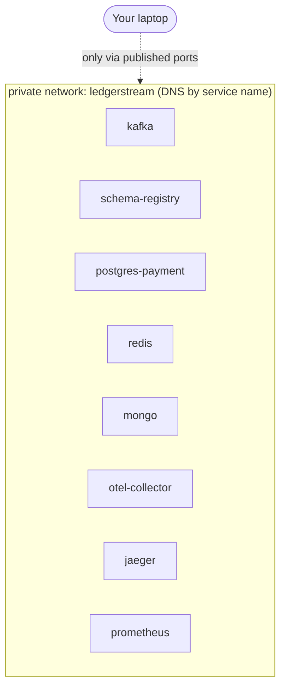
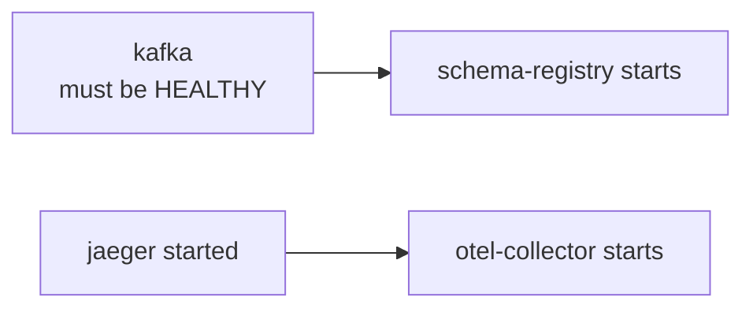
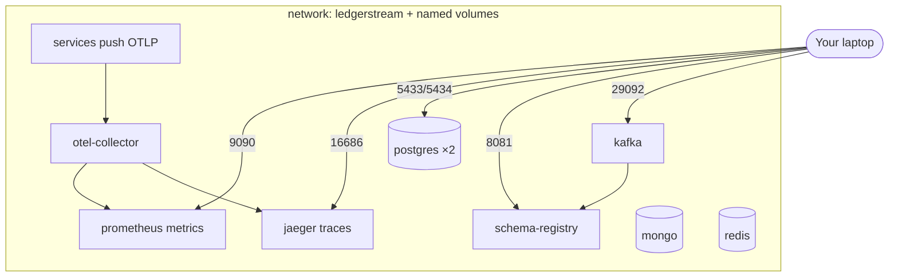

# `docker-compose.yml`, explained line by line

> **Who this is for:** you, wanting to understand *exactly* what our
> `docker-compose.yml` does and why — every key, every service, and the genuinely
> confusing bits (Kafka listeners, health checks, volumes). Read alongside the
> actual file open in another window.

> 🧊 **In plain terms:** `docker-compose.yml` is a **recipe for a whole meal**,
> not one dish. It lists every dish (container), what ingredients each needs
> (image, settings), which must be cooked before others (`depends_on`), how to
> tell when each is "done" (`healthcheck`), and how they share the kitchen
> (network) and pantry (volumes). `docker compose up` cooks the entire meal from
> that one recipe with one command.

---

## 1. What Compose is and how it reads the file

**Docker Compose** turns *many* containers into *one* declarative file. Instead of
running `docker run …` eight times with long flag lists, you describe the desired
end-state and let Compose reconcile reality to it.

The file is **YAML**. Two YAML rules that matter:
- **Indentation is structure** (spaces, never tabs). Nesting = "belongs to."
- `key: value` is a mapping; a leading `- ` is a list item.

Our file has four top-level keys:

```yaml
name: ledgerstream        # names the whole project (prefixes containers/volumes)
networks: { ... }         # the private network(s) containers share
volumes:  { ... }         # named persistent disks
services: { ... }         # the containers themselves (the bulk of the file)
```

### Profiles — the two run modes (important for this project)

Some services carry `profiles: [full]`. A **profile** tags a service so it starts
**only** when that profile is requested:

- `docker compose up` (**default**) → starts services with **no profile**: Kafka,
  Schema Registry, and the observability stack. The tagged data stores stay off.
- `docker compose --profile full up` → *also* starts the `full`-tagged services:
  local Postgres ×2, Mongo, Redis.

Why: in **daily dev** the data stores live on **cloud free tiers** (Neon/Upstash/
Atlas — see [`cloud-free-tiers.md`](cloud-free-tiers.md)), so we don't want local
copies running. The `full` profile exists for a **fully-offline demo** that needs
no cloud accounts. Same file, two modes — driven by which `.env` values you use.

> 🧊 **In plain terms:** profiles are like "scenes" on a stage. The default scene
> puts out only the props you always need (Kafka, dashboards). The `full` scene
> also rolls out the local databases — for when you want to perform without the
> internet.

### How Compose processes this file internally

When you run `docker compose up -d --wait`, Compose doesn't "execute" YAML — it
runs an in-memory **pipeline**, then radios instructions to the Docker daemon.
Profiles are just one filtering stage:

```
   docker compose up -d --wait
             |
             v
 1. LOAD         read this YAML as text
 2. INTERPOLATE  substitute ${VARS} from .env / shell
 3. PARSE        build an in-memory model: a list of Service objects,
                 each with a `profiles` field  (kafka -> []  /  postgres -> ["full"])
 4. PROFILES     active set = --profile flags + COMPOSE_PROFILES
                 (plain `up` with no --profile  ->  active set is EMPTY)
 5. FILTER       keep a service IF  profiles list is empty
                                OR  one of its profiles is in the active set
                 +--------------------------------------------------------------+
                 | kafka, schema-registry, otel-collector, jaeger, prometheus   |
                 |     profiles = []            -> KEPT (always run)             |
                 | postgres-payment/ledger, mongo, redis                        |
                 |     profiles = ["full"]      -> DROPPED (unless --profile full)|
                 +--------------------------------------------------------------+
 6. PLAN         pull in depends_on dependencies; order by health
                 (schema-registry waits for kafka healthy, etc.)
 7. EXECUTE      send REST calls to the Docker daemon over its socket:
                 create network -> create volumes -> create containers -> start
                 (each object labelled com.docker.compose.project=ledgerstream)
 8. --wait       poll each container's health status until healthy/exited,
                 THEN the command returns
```

**Stage by stage:**

1–3. **Load / interpolate / parse.** The `compose-go` library reads the file,
substitutes `${VARS}` from `.env`, and turns it into a `Project` object holding a
list of `Service` structs. Each struct has typed fields — `image`, `ports`,
`healthcheck`, `depends_on`, and a **`profiles`** field. After this, the YAML is
gone; Compose works with objects.

4–5. **Profile filter (the "condition" you asked about).** Compose builds the
**active profile set** from `--profile` flags + `COMPOSE_PROFILES` (empty for a
plain `up`). Then, for every service, it keeps it if `profiles` is empty **or**
intersects the active set. There is no `if`-block in the file — this set check is
the entire mechanism. Survivors become the **target set**.

6. **Plan.** Compose asks the daemon "what already exists with this project's
labels?", pulls any `depends_on` dependencies into the target set (this is why a
profiled service *would* start if a running service depended on it), and
topologically orders startup by the dependency + health graph.

7. **Execute.** Compose does **not** create containers itself — it sends REST
calls to the **Docker daemon** (the Engine, run by Docker Desktop) to create the
network, volumes, and containers, tagging each with labels like
`com.docker.compose.project=ledgerstream`. Those labels are how later commands
(`down`, `ps`) find this project — Compose keeps no database, it queries the
daemon by label.

8. **`--wait`.** `-d` returns immediately; `--wait` adds a poll loop that watches
each container's **health-check** result and only returns once all are `healthy`
(or exited). That's why `make up` finishing means "genuinely ready."

> 🧊 **In plain terms:** Compose is a **planner + remote control**, not the engine.
> It reads the recipe into memory, crosses out dishes whose profile tag isn't
> active, works out the cooking order, radios each step to the actual kitchen (the
> Docker daemon), and waits at the pass until every dish is plated.

---

## 2. The three cross-cutting concepts

Before the services, understand the three things they all plug into.

### 2a. Networks — how containers find each other

```yaml
networks:
  ledgerstream:
    driver: bridge
```

Compose puts every service on this one private virtual network. **The superpower:
containers reach each other by *service name* as a hostname.** When Schema
Registry connects to `PLAINTEXT://kafka:9092`, `kafka` resolves to that
container's IP automatically — no hardcoded IPs. This built-in DNS is why our
`.env` uses `KAFKA_BOOTSTRAP_SERVERS=kafka:9092` (the in-cluster name), not an IP.



> Anything on this network is invisible to your laptop **unless** its port is
> explicitly *published* (next section). That's a security feature: internal
> traffic stays internal.

### 2b. Ports — punching a hole to your laptop

```yaml
ports:
  - "5433:5432"   #  HOST : CONTAINER
```

Format is **`host:container`**. This maps port `5432` *inside* the container to
`5433` on *your machine*, so a DB tool on your laptop connects to
`localhost:5433`. Inside the network, other containers still use `5432`.

**Why we shift some host ports** (Postgres → 5433/5434, Kafka → 29092): to avoid
clashing with anything already running on your laptop's default ports. The
*container-side* port stays standard.

> 🧊 **In plain terms:** the network is a private office building; publishing a
> port is installing one specific door to the street. Most rooms have no street
> door (unpublished) — you can only reach them from inside the building.

### 2c. Volumes — data that survives a container

```yaml
volumes:
  kafka-data:            # a "named volume" (Docker-managed disk)
  postgres-payment-data:
  ...
```

Containers are **disposable** — delete one and its internal filesystem is gone. A
**volume** is a disk that lives *outside* the container's lifecycle, so data
persists across restarts/recreates. Two kinds appear in our file:

- **Named volumes** (for *data* you must keep): `kafka-data:/var/lib/kafka/data`,
  `postgres-*-data:/var/lib/postgresql/data`, `mongo-data`, `redis-data`. Docker
  manages where these live on disk.

> ⚠️ **Gotcha: a volume does nothing unless it matches the process's *actual* data
> path.** The `apache/kafka` image defaults its log dir to `/tmp/kafka-logs`, so
> mounting a volume at `/var/lib/kafka/data` alone left it **empty** — all data sat
> in ephemeral `/tmp` and would vanish on container recreation. We had to also set
> `KAFKA_LOG_DIRS=/var/lib/kafka/data` so the broker writes *to* the volume. Always
> confirm the container writes where you mounted (`docker exec <c> ls <path>`).
- **Bind mounts** (for *config* we author): `./infra/otel/otel-collector-config.yaml:/etc/otel/config.yaml:ro`
  maps a file from our repo into the container. The trailing **`:ro`** = **read-
  only** (the container can read our config but not modify it).

> **`make clean` runs `docker compose down -v`** — the `-v` deletes these volumes,
> wiping all data. `make down` (no `-v`) keeps them. That one flag is the
> difference between "stop for the night" and "start fresh."

---

## 3. Anatomy of one service

Every entry under `services:` uses the same vocabulary. Using `postgres-payment`
as a clean example:

```yaml
postgres-payment:                       # service name = network hostname
  image: postgres:16                    # which prebuilt image to run
  container_name: ls-postgres-payment   # fixed, friendly container name
  networks: [ledgerstream]              # join the shared network
  ports:
    - "5433:5432"                       # publish to laptop
  environment:                          # config passed into the container
    POSTGRES_DB: ${PAYMENT_DB_NAME:-payment}
    POSTGRES_USER: ${PAYMENT_DB_USER:-payment}
    POSTGRES_PASSWORD: ${PAYMENT_DB_PASSWORD:-payment_dev_pw}
  volumes:
    - postgres-payment-data:/var/lib/postgresql/data   # persist the DB files
  healthcheck: { ... }                  # how Docker knows it's ready (below)
```

Field by field:
- **`image`** — the frozen template pulled from a registry (Docker Hub).
  `postgres:16` = the `postgres` image, tag `16`.
- **`container_name`** — a stable name so `docker logs ls-kafka` works; without it
  Docker auto-generates one.
- **`environment`** — the standard way to configure a container. These images read
  known env vars (`POSTGRES_USER` etc.) to set themselves up on first boot.
- **`${VAR:-default}`** — **variable interpolation**: use the env var `VAR` (from
  your `.env`), or fall back to `default` if it's unset. This is why the stack
  works even before you customize `.env`.

---

## 4. Health checks — the part that makes `--wait` trustworthy

A container being *started* doesn't mean it's *ready* (Postgres takes a moment to
accept connections; Kafka longer). A **health check** is a command Docker runs on
a schedule to ask "are you actually ready?"

```yaml
healthcheck:
  test: ["CMD-SHELL", "pg_isready -U ${PAYMENT_DB_USER:-payment} -d ${PAYMENT_DB_NAME:-payment}"]
  interval: 10s      # run the test every 10s
  timeout: 5s        # a single test may take up to 5s before it's a failure
  retries: 10        # this many consecutive fails → mark "unhealthy"
  start_period: 10s  # grace window at boot: fails here don't count against retries
```

- **`test`** — the command. `["CMD-SHELL", "…"]` runs the string in a shell (lets
  you use `||`, pipes, env vars). `["CMD", "prog", "arg"]` runs a program directly
  (no shell). Exit code `0` = healthy, non-zero = failing.
- **`start_period`** — the crucial one for slow starters: during this window,
  failures are *ignored*, so a service that legitimately takes 15s to boot isn't
  prematurely declared dead.
- The container's status moves `starting → healthy` (or `unhealthy`).

**What the checks mean per service in our file:**
| Service | Health test (plain English) |
|---|---|
| kafka | "Can I query the broker's API versions?" (broker is accepting clients) |
| schema-registry | "Does `GET /subjects` respond?" (HTTP API is up) |
| postgres-* | `pg_isready` — "is Postgres accepting connections?" |
| mongo | `db.adminCommand("ping")` returns 1 |
| redis | `redis-cli ping` returns `PONG` |
| otel-collector | its health extension on `:13133` responds |
| jaeger | its admin port `:14269` responds |
| prometheus | `GET /-/healthy` responds |

### `depends_on` with conditions — ordering by readiness

```yaml
schema-registry:
  depends_on:
    kafka:
      condition: service_healthy
```

Plain `depends_on` only waits for a container to *start*. **`condition:
service_healthy`** waits for it to pass its **health check** — so Schema Registry
doesn't launch until Kafka is genuinely ready to talk to. This chaining is what
makes `docker compose up --wait` reliable: it walks the dependency graph and
blocks until the whole thing is healthy.



---

## 5. The hard part: Kafka's listener configuration

Kafka's env block looks intimidating. Here's what it's actually doing. The core
problem Kafka must solve: **clients connect from different places** (other
containers on the network vs your laptop), and Kafka must tell each client the
*right* address to reach it. Getting this wrong is the #1 Kafka-in-Docker gotcha.

```yaml
KAFKA_LISTENERS: INTERNAL://0.0.0.0:9092,CONTROLLER://0.0.0.0:9093,EXTERNAL://0.0.0.0:29092
KAFKA_ADVERTISED_LISTENERS: INTERNAL://kafka:9092,EXTERNAL://localhost:29092
KAFKA_LISTENER_SECURITY_PROTOCOL_MAP: CONTROLLER:PLAINTEXT,INTERNAL:PLAINTEXT,EXTERNAL:PLAINTEXT
```

> We named the listeners `INTERNAL` / `CONTROLLER` / `EXTERNAL` so the name tells
> you *why* each exists. (Many tutorials use `PLAINTEXT` / `PLAINTEXT_HOST`, which
> collides with the *protocol* name and confuses everyone — see the boxed note
> below.)

- **`KAFKA_LISTENERS`** = the sockets Kafka *binds and listens on* inside the
  container. We define **three**:
  - `INTERNAL://0.0.0.0:9092` — for **other containers** on the Docker network
    (e.g. schema-registry) + broker↔broker traffic.
  - `CONTROLLER://0.0.0.0:9093` — for the **KRaft controller** quorum (metadata /
    leader election; internal Kafka machinery).
  - `EXTERNAL://0.0.0.0:29092` — for clients on **your laptop/host** (your native
    services + CLI tools).
  (`0.0.0.0` = "listen on all network interfaces inside the container.")
- **`KAFKA_ADVERTISED_LISTENERS`** = the addresses Kafka *hands back to a client*
  saying "connect to me here." This is the subtle bit — after an initial
  handshake, Kafka redirects the client to an advertised address, so it **must be
  reachable from that client's vantage point**:
  - `INTERNAL` clients (containers) get `kafka:9092` (the service-name DNS from §2a).
  - `EXTERNAL` clients (your laptop) get `localhost:29092` (the published port §2b).
  If we advertised `kafka:9092` to your laptop, your laptop couldn't resolve the
  name `kafka` and would fail — hence a *separate* EXTERNAL listener.
  (`CONTROLLER` isn't advertised — clients never talk to it; only Kafka's own
  quorum does, via `KAFKA_CONTROLLER_QUORUM_VOTERS`.)
- **`KAFKA_LISTENER_SECURITY_PROTOCOL_MAP`** — declares each listener's security
  protocol (all `PLAINTEXT`/unencrypted here, fine for local; `SASL_SSL` in
  production).

```
   inside the Docker network                 your laptop (host)
   -------------------------                  ------------------
   schema-registry ─ kafka:9092 ─┐            native Payment/Ledger svc,
   (INTERNAL listener)           │            kafka CLI ─ localhost:29092 ─┐
                                 ▼                         (EXTERNAL listener) │
                          ┌──────────────┐                                    │
                          │ Kafka broker │◄───────────────────────────────────┘
                          └──────┬───────┘
                                 │  CONTROLLER listener :9093 (KRaft quorum, internal)
```

### Listener *name* vs *protocol* (why we renamed, and the classic confusion)

A **listener** is really three things bundled: a **name** + a **bind
address:port** + a **security protocol**. Think of it as one labeled *door* into
Kafka.

- The **name** is a *label you choose* — Kafka attaches **no meaning** to it.
- The **security protocol** is an *actual setting* — how traffic on that door is
  secured. There are exactly **four**:

| Protocol | Encryption | Authentication | Where |
|---|---|---|---|
| `PLAINTEXT` | none | none | local dev (us) |
| `SSL` | TLS | optional client cert | |
| `SASL_PLAINTEXT` | none | SASL (user/pass, etc.) | |
| `SASL_SSL` | TLS | SASL | **production** |

**The classic confusion:** Kafka's *default* listener is conventionally **named**
`PLAINTEXT`, and tutorials name the host one `PLAINTEXT_HOST`. But `PLAINTEXT` is
*also* a **protocol**. So you end up with map entries like `PLAINTEXT:PLAINTEXT`
where the left is a *name* and the right is a *protocol* that happen to be the same
word — baffling. **We sidestepped this by naming our listeners for their purpose:**

| Name (ours) | Binds on (`LISTENERS`) | Advertised as | Protocol (via map) | Who uses it |
|---|---|---|---|---|
| `INTERNAL` | `0.0.0.0:9092` | `kafka:9092` | PLAINTEXT | containers on the network + broker↔broker |
| `CONTROLLER` | `0.0.0.0:9093` | *(not advertised)* | PLAINTEXT | KRaft controller quorum |
| `EXTERNAL` | `0.0.0.0:29092` | `localhost:29092` | PLAINTEXT | your laptop/host clients |

Now the map line reads unambiguously — name ≠ protocol at a glance:

```
KAFKA_LISTENER_SECURITY_PROTOCOL_MAP: CONTROLLER:PLAINTEXT,INTERNAL:PLAINTEXT,EXTERNAL:PLAINTEXT
                                       |________| |_______|
                                         name      protocol
```

Each pair is `listenerName : securityProtocol` — *"the listener named INTERNAL uses
the PLAINTEXT protocol."* The names are ours; the protocol is what actually secures
the door.

**The two "which listener?" pointers** just reference a listener **by name**:
- `KAFKA_INTER_BROKER_LISTENER_NAME: INTERNAL` → brokers talk to *each other* over
  the listener named `INTERNAL`.
- `KAFKA_CONTROLLER_LISTENER_NAMES: CONTROLLER` → the controller quorum uses the
  listener named `CONTROLLER`.

> **Names are arbitrary — that's the whole point.** We renamed `PLAINTEXT`→
> `INTERNAL` and `PLAINTEXT_HOST`→`EXTERNAL` everywhere (`LISTENERS`,
> `ADVERTISED_LISTENERS`, the map, and `INTER_BROKER_LISTENER_NAME`) and Kafka
> behaves **identically** — it only cares about the *mapping*, not the words. The
> protocol column stayed `PLAINTEXT`, which proves the name and the protocol were
> always independent.

**In production** the *names* can stay; the *protocols* flip to `SASL_SSL` (plus
SASL credentials + TLS certs):
```
KAFKA_LISTENER_SECURITY_PROTOCOL_MAP: CONTROLLER:PLAINTEXT,INTERNAL:SASL_SSL,EXTERNAL:SASL_SSL
```
That's the "local plaintext → prod SASL_SSL" swap from
[`cloud-free-tiers.md §5`](cloud-free-tiers.md) — a config change, not code.

> 🧊 **In plain terms:** a listener is a *door*. It has a **name** (a sticker you
> put on the door — pick any word), an **address** (which wall the door is in), and
> a **lock type** (the security protocol: no lock = PLAINTEXT, keycard = SASL,
> reinforced = SSL, both = SASL_SSL). Our stickers read `INTERNAL` / `CONTROLLER` /
> `EXTERNAL`, so the *name* tells you the door's purpose and the *protocol map*
> tells you its lock — no collision, unlike the default `PLAINTEXT` sticker on the
> `PLAINTEXT`-locked door.

### Every other Kafka env var — sorted by *why* it's there

These aren't all "boilerplate you can ignore." They fall into **four categories**,
and knowing which is which is exactly what an interviewer checks.

**A. Required KRaft plumbing** (the node won't even boot without these):

| Var | What it does |
|---|---|
| `KAFKA_NODE_ID: 1` | Unique id for this node in the cluster. Multi-node → 1, 2, 3… |
| `KAFKA_PROCESS_ROLES: broker,controller` | This node plays **both** roles (KRaft, no ZooKeeper). Big clusters may run dedicated controller nodes. |
| `KAFKA_CONTROLLER_QUORUM_VOTERS: 1@kafka:9093` | Members of the controller (Raft) quorum, as `nodeId@host:port`. One voter here; prod → `1@k1:9093,2@k2:9093,3@k3:9093`. |
| `KAFKA_CONTROLLER_LISTENER_NAMES: CONTROLLER` | Which listener carries controller (quorum) traffic — must match a name in `KAFKA_LISTENERS`. |
| `CLUSTER_ID` | Stable cluster identity; the image uses it to **format the storage dir** on first boot, and it must stay constant across restarts. |

**B. Required networking** (the listener block above): `KAFKA_LISTENERS`,
`KAFKA_ADVERTISED_LISTENERS`, `KAFKA_LISTENER_SECURITY_PROTOCOL_MAP`,
`KAFKA_INTER_BROKER_LISTENER_NAME` (which listener brokers use to talk to *each
other*).

**C. Forced by running ONE broker** (these MUST be 1 now — and are the ones that
change in production):

| Var | Why 1 | Prod |
|---|---|---|
| `KAFKA_OFFSETS_TOPIC_REPLICATION_FACTOR: 1` | RF of the internal `__consumer_offsets` topic can't exceed broker count | **3** |
| `KAFKA_TRANSACTION_STATE_LOG_REPLICATION_FACTOR: 1` | RF of the internal transaction-state topic (idempotent/transactional producers) | **3** |
| `KAFKA_TRANSACTION_STATE_LOG_MIN_ISR: 1` | Min in-sync replicas for that topic | **2** |

> These three are the **"RF=1 → 3 in prod"** knobs — the most important part of
> this config to be able to explain. See DESIGN.md §10 and
> [Kafka deep-dive §5](concepts/kafka.md).

**D. Deliberate choices** (not required — we picked them):

| Var | Choice |
|---|---|
| `KAFKA_GROUP_INITIAL_REBALANCE_DELAY_MS: 0` | Default is 3000ms: Kafka waits 3s for more consumers to join a **new** group before the first rebalance (avoids repeated rebalances as members start up). We set **0** for faster dev startup; prod can keep the default. |
| `KAFKA_AUTO_CREATE_TOPICS_ENABLE: "false"` | Topics are **declared explicitly** (Phase 2) so partition counts are intentional, not created by accident on first use. |

> 🧊 **In plain terms:** A = "you can't start a KRaft node without an id, a role, a
> quorum list, and a cluster id." B = "tell clients where to connect." C = "with
> one broker you can only keep one copy of everything — in prod you'd keep three."
> D = "two knobs we turned on purpose."

---

## 6. The full picture



---

## 7. Commands you'll actually use

| Command | What it does |
|---|---|
| `docker compose up -d --wait` | Start everything detached; **block until all healthy**. (`make up`) |
| `docker compose ps` | List containers + health status. (`make ps`/`health`) |
| `docker compose logs -f kafka` | Tail one service's logs. |
| `docker compose down` | Stop + remove containers; **keep** volumes. (`make down`) |
| `docker compose down -v` | Stop + remove containers **and delete volumes** (wipes data). (`make clean`) |
| `docker compose config` | Validate + print the fully-resolved file (with `.env` substituted). |
| `docker compose restart kafka` | Restart one service. |

- `-d` = **detached** (runs in the background; without it your terminal attaches
  to the logs).
- `--wait` = return only once health checks pass (or fail) — the flag that makes
  "up" mean "ready."

---

## 8. Interview questions you should be able to answer

- *How do containers in Compose talk to each other?* → A shared user-defined
  network with built-in DNS; reach a container by its **service name** as
  hostname.
- *What does `"5433:5432"` mean?* → Publish container port 5432 to host port 5433;
  `host:container`.
- *Named volume vs bind mount?* → Named volume = Docker-managed persistent disk
  for data; bind mount = a host path/file mapped in (we use `:ro` for config).
- *Difference between `depends_on` and `depends_on: condition: service_healthy`?*
  → The former waits for *start*, the latter waits for the health check to *pass*.
- *Why does Kafka need `advertised.listeners` separate from `listeners`?* →
  `listeners` are where it binds; `advertised` are the addresses it tells clients
  to reconnect to, which differ for in-network vs host clients.
- *Why replication factor 1 here, and what changes in prod?* → Single broker
  locally; prod runs 3+ brokers with RF=3 and `min.insync.replicas=2` for
  durability.
- *What makes `docker compose up --wait` reliable?* → Per-container health checks
  plus `depends_on: service_healthy` — it blocks until the dependency graph is
  fully healthy.

---

*Related: [`docs/phase0.md`](phase0.md) (what each file is) ·
[`docs/concepts/health-checks-liveness-readiness.md`](concepts/health-checks-liveness-readiness.md)
(the theory behind health checks) ·
[`docs/concepts/consensus-and-coordination.md`](concepts/consensus-and-coordination.md)
(what the KRaft controller quorum is doing).*
