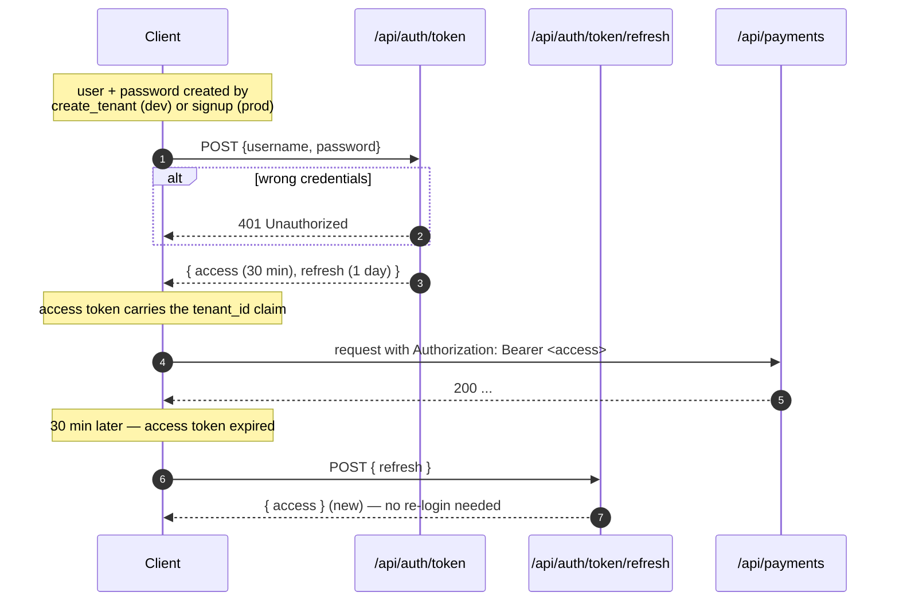
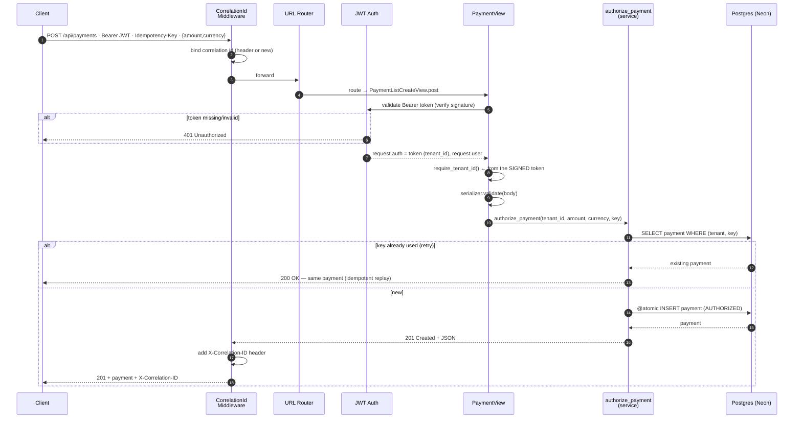
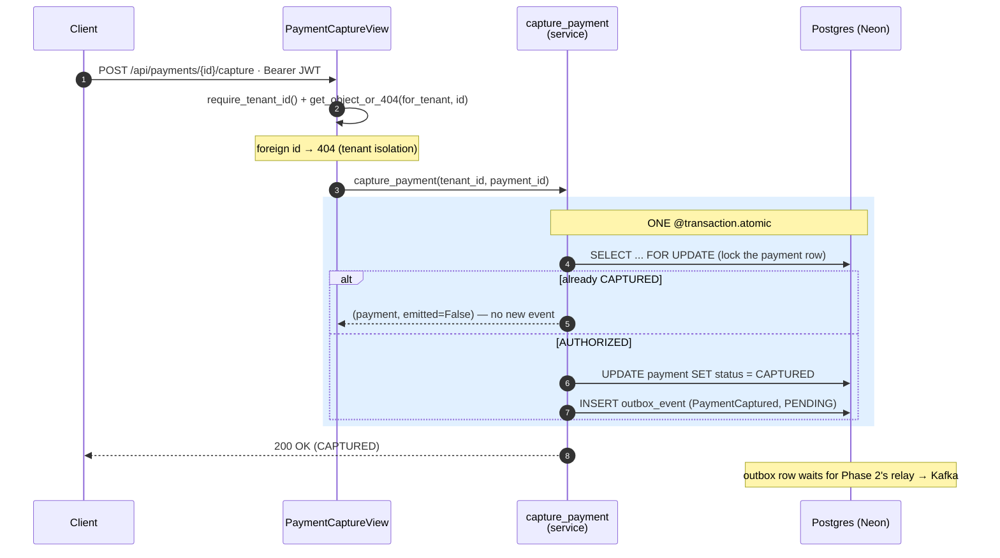

# Phase 1 — The Payment Service, explained from scratch

> **Who this is for:** you, after Phase 0. This walks through **every file** we
> added to build the Payment service — what it is, why it's there, how it works —
> then shows you how to run it end to end. Deep dives on the *patterns* (outbox,
> idempotency, multi-tenancy) live in [`docs/concepts/`](concepts/); this file is
> the *tour of the code*.

**What Phase 1 delivers:** a real, runnable **Payment service** — its own Django
project + its own Postgres (your Neon DB), multi-tenant, JWT-secured, with an
authorize→capture payment lifecycle, client **idempotency**, the **outbox** table,
health probes, and passing tests. No Kafka yet (that's Phase 2) — but the outbox
rows are already being written, ready to relay.

---

## Part 1 — The big picture: what this service does

A client (a merchant) calls the API to move money:

```
   1. POST /api/payments            → authorize a payment  (status AUTHORIZED)
   2. POST /api/payments/{id}/capture → capture it          (status CAPTURED)
                                         └─ writes a PaymentCaptured row to the OUTBOX
                                            (Phase 2's relay ships it to Kafka → Ledger)
```

Everything is **scoped to a tenant** (which merchant) and **idempotent** (safe to
retry). That's the whole service in three sentences.

---

## Part 1.5 — Getting a bearer token first (the auth flow)

Before a client can call any `/api/*` endpoint, it needs a **bearer token**. A
token has a 3-step life: **log in → use → refresh**.



**Step 1 — log in** (exchange username + password for tokens):
```bash
curl -X POST localhost:8000/api/auth/token \
  -H "Content-Type: application/json" \
  -d '{"username":"acme","password":"pw"}'
# → { "access": "eyJ...", "refresh": "eyJ..." }
```

**Step 2 — use the access token** on every protected call:
```bash
curl localhost:8000/api/payments -H "Authorization: Bearer <access>"
```

**Step 3 — refresh** when the 30-minute access token expires (no re-login):
```bash
curl -X POST localhost:8000/api/auth/token/refresh \
  -H "Content-Type: application/json" -d '{"refresh":"<refresh>"}'
# → { "access": "<new access>" }
```

### Access token vs refresh token (why there are two)

| | **Access token** | **Refresh token** |
|---|---|---|
| Lifetime | short — **30 min** (ours) | long — **1 day** (ours; often weeks in prod) |
| Sent with | **every** API request (`Bearer`) | **only** to `/api/auth/token/refresh` |
| Purpose | prove auth for *this request* | mint a **new access token** without re-login |
| Carries | the claims (`user_id`, `tenant_id`) | minimal — enough to identify + reissue |
| If leaked | small blast radius (expires in minutes) | bigger — kept carefully, and can be **revoked** |

**Why two?** A security-vs-convenience trade-off:
- *One long-lived token on every request* → if it leaks (a log, a proxy), the
  attacker has long-lived access. Risky.
- *One short-lived token* → secure, but the user re-enters their password every 30
  minutes. Annoying.
- **Two tokens split the job:** the **access** token is *disposable* and travels
  *everywhere* (cheap if leaked — dies in 30 min); the **refresh** token is
  *precious* and travels *rarely* (only to the refresh endpoint — small attack
  surface, revocable). Result: security **+** convenience (no repeated logins).

```
login ──► access(30m) + refresh(1d)
             │ use access on every call...
             │ access expires (30m) ──► POST refresh ──► new access   (no password!)
             │ ...repeat for up to 1 day...
             └ refresh expires (1d) ──► must log in again (username + password)
```

> 🧊 **In plain terms:** the **access token** is a *day pass* you flash at every
> door — if you drop it, it's expired by lunch. The **refresh token** is your
> *membership card*, kept in your wallet, shown only at the front desk to get a
> fresh day pass — lose it and they can cancel it.

**What's inside the access token** (decode the middle segment):
```json
{ "token_type": "access", "exp": 1785522307, "user_id": "1",
  "tenant_id": "4072bc99-..." }    // ← stamped at login by core/tokens.py
```
The `tenant_id` claim is why the server always knows *which tenant you are* — read
from the **signed** token, never a forgeable header (see
[multi-tenancy](concepts/multi-tenancy.md)).

**Where the credentials come from:**
- **dev:** `python manage.py create_tenant --name Acme --username acme --password pw`
  creates the user + password (and prints a token, so you can skip the login call).
- **prod:** a signup/registration flow or admin provisioning.

> **Production note (interview-worthy):** this is the OAuth2 **password grant**
> (username/password → JWT), right for a *user-facing* client. Server-to-server
> **merchant** clients typically use **API keys** or the **client-credentials
> grant** instead (no human password) — a natural addition at the API Gateway in
> Phase 4.

---

## Part 1.6 — A request's full journey (request → response)

The thing that's hard to picture: a request isn't handled by one function — it
passes **down** through layers (middleware → routing → auth → permission → view →
serializer → service → DB) and the response travels back **up** through them.
Middleware is the outermost layer, so it runs **first on the way in and last on the
way out** — which is why `CorrelationIdMiddleware` both *binds* the id on entry and
*adds the response header* on exit.

### Creating a payment — `POST /api/payments`



### Capturing a payment — `POST /api/payments/{id}/capture`

The interesting one: the status change **and** the outbox event are written in a
single atomic transaction (the outbox pattern), with a row lock so two concurrent
captures can't both emit an event.



---

## Part 2 — Django "project" vs "app" (the structure)

Recall from Phase 0: each service is its **own Django project** (its own container
+ database). *Inside* a project you have **apps** — focused modules. Ours:

```
services/payment/
├── manage.py            # the command-line entry ("python manage.py ...")
├── config/              # the PROJECT: settings, URL routing, wsgi/asgi
├── core/                # app: cross-cutting glue (health, middleware, auth, bases)
├── tenants/             # app: Tenant + Membership (who owns what)
├── payments/            # app: the Payment domain (the star of the show)
├── outbox/              # app: the outbox table
├── tests/               # the proof tests
├── requirements.txt     # runtime dependencies
├── Dockerfile           # how this service becomes a container image
└── pytest.ini / conftest.py  # test configuration
```

> 🧊 **In plain terms:** the *project* is the restaurant; the *apps* are its
> stations (grill, prep, till). Each station does one job; the project wires them
> into one working kitchen.

---

## Part 3 — `config/` (the project wiring)

- **`manage.py`** — the entrypoint for every admin command: `migrate` (create DB
  tables), `runserver` (dev server), `createsuperuser`, our custom
  `create_tenant`, etc. You'll type `python manage.py <something>` a lot.
- **`config/settings.py`** — the service's configuration. Key parts:
  - reads everything from the **environment** (12-factor) — the DB URL, the JWT
    signing key, log level — loading your repo-root `.env` for local dev.
  - **`DATABASES`** — parses `PAYMENT_DATABASE_URL` (your Neon URL) via
    `dj_database_url`; `conn_max_age` keeps connections open (basic pooling) so we
    don't pay a new TLS handshake per request against the remote DB.
  - **`REST_FRAMEWORK`** — turns on JWT auth + "must be authenticated" by default.
  - **`SIMPLE_JWT`** — the token settings (signing key from env, 30-min access
    tokens).
  - **`MIDDLEWARE`** — note `CorrelationIdMiddleware` is *first* so every log line
    gets a correlation id.
  - hands logging to the shared library's JSON formatter (`LOGGING_CONFIG = None`).
- **`config/urls.py`** — the routing table: `/health/*`, `/api/auth/*`, `/api/*`,
  `/admin/`.
- **`config/wsgi.py`** — the production entrypoint gunicorn runs. `asgi.py` is the
  async equivalent (unused for now).

---

## Part 4 — `core/` (the cross-cutting glue)

- **`apps.py`** → `ready()` calls the shared `configure_logging()` +
  `configure_tracing()` **once per process** — so logs are JSON and traces flow to
  the collector, for the web server *and* future worker processes alike.
- **`middleware.py`** — `CorrelationIdMiddleware`: reads an incoming
  `X-Correlation-ID` (or mints one), binds it for the request (so all logs/traces
  share it), and echoes it back on the response. (We saw `X-Correlation-ID` on the
  live response.)
- **`health.py`** — `liveness` ("am I alive?", dumb, no DB) and `readiness` ("can I
  serve? is the DB reachable?"). Two different checks — see
  [health-checks concept](concepts/health-checks-liveness-readiness.md).
- **`models.py`** — reusable bases: `UUIDModel` (UUID primary keys, so ids are
  unguessable and safe in URLs) and `TimestampedModel` (`created_at`/`updated_at`).
- **`tenancy.py`** — `require_tenant_id(request)`: the single choke point that
  reads the tenant from the **validated JWT** and fails closed if absent.
- **`tokens.py`** — issues JWTs with the `tenant_id` claim baked in at login.
- **`auth_urls.py`** — the `/api/auth/token` (login) and `/token/refresh` routes.
- **`exceptions.py`** — domain errors (e.g. `InvalidStateTransition` → HTTP 409)
  and a handler that renders them as clean JSON.

---

## Part 5 — `tenants/` (who owns what)

- **`models.py`** —
  - **`Tenant`** — a merchant/organization; the isolation boundary.
  - **`Membership`** — links a Django `User` to one `Tenant`. We keep auth (User)
    and tenancy (Membership) separate so we don't need a custom user model just to
    add one field.
- **`management/commands/create_tenant.py`** — a helper: creates a tenant + user +
  membership and prints a ready-to-use JWT (great for manual testing).

Full concept: [multi-tenancy](concepts/multi-tenancy.md).

---

## Part 6 — `payments/` (the domain)

- **`models.py`** — the **`Payment`** aggregate. Note:
  - money is an **integer of minor units** (`amount_minor`, e.g. 500 = $5.00) —
    never a float (floats can't represent money exactly).
  - a **UNIQUE `(tenant, idempotency_key)`** constraint — the database enforces
    idempotency so retries can't double-create.
  - a **`for_tenant()`** queryset method — the tenant-isolation choke point.
- **`services.py`** — the **business logic**, kept out of the views:
  - `authorize_payment(...)` — idempotent create (fast path + race-safe fallback on
    the unique constraint).
  - `capture_payment(...)` — `AUTHORIZED → CAPTURED`, writing the `PaymentCaptured`
    **outbox row in the same `@transaction.atomic`** (the outbox pattern), and a
    no-op if already captured (operation idempotency).
- **`serializers.py`** — the request/response shapes (validation: amount ≥ 1,
  3-letter currency).
- **`views.py`** — the endpoints; each starts with `require_tenant_id` and scopes
  via `for_tenant`, returning 404 for a foreign id.
- **`urls.py`** — routes: list/create, detail, capture.

Concept deep dives: [outbox](concepts/outbox-pattern.md) ·
[idempotency](concepts/idempotency.md).

---

## Part 7 — `outbox/` (the reliability table)

- **`models.py`** — **`OutboxEvent`**: an event stored as a *row* (status PENDING →
  PUBLISHED), with the target `topic`, a `partition_key`, and the JSON `payload`.
  Written atomically with the business change; the **relay** (Phase 2) ships PENDING
  rows to Kafka. Full concept: [outbox pattern](concepts/outbox-pattern.md).

---

## Part 8 — `tests/` (the proofs)

Run against a **local** Postgres (fast; cloud is for running the app, not the test
suite). They prove the Phase 1 guarantees:

- **`test_tenant_isolation.py`** — tenant B can't read or capture tenant A's
  payment (404), sees an empty list, and unauthenticated requests get 401.
- **`test_idempotency.py`** — same `Idempotency-Key` → one payment (201 then 200);
  no key → distinct payments; same key across tenants → independent; capture is
  atomic and emits exactly one outbox event, idempotently.
- **`conftest.py`** — forces tests onto local Postgres and provides the
  `make_tenant` fixture (creates a tenant + JWT-authenticated client).

---

## Part 9 — Hands-on: run it yourself

**Prereqs:** `.env` filled with your Neon `PAYMENT_DATABASE_URL` (cloud), and the
project `.venv` created (Phase 0 / this phase).

```bash
# from repo root — one-time: create the venv and install deps
python -m venv .venv
.venv/Scripts/pip install -e libs/shared -r services/payment/requirements-dev.txt
```
```bash
# create the service's tables in Neon
cd services/payment
../../.venv/Scripts/python manage.py migrate
```
```bash
# create a test tenant and print a JWT
../../.venv/Scripts/python manage.py create_tenant --name "Acme" --username acme --password pw
```
```bash
# run the dev server
../../.venv/Scripts/python manage.py runserver 127.0.0.1:8000
```

Then, with the printed token in `$TOKEN`:

```bash
curl -s localhost:8000/health/ready
```
```bash
curl -s -X POST localhost:8000/api/payments \
  -H "Authorization: Bearer $TOKEN" -H "Idempotency-Key: try-1" \
  -H "Content-Type: application/json" \
  -d '{"amount_minor":500,"currency":"usd","reference":"order-1"}'
```
```bash
curl -s -X POST localhost:8000/api/payments/<PAYMENT_ID>/capture \
  -H "Authorization: Bearer $TOKEN"
```

Post the same `Idempotency-Key` twice → the second returns the *same* payment
(200, not a new one). Capture, then re-capture → still one outbox row.

**Run the tests** (needs local Postgres):

```bash
docker compose --profile full up -d postgres-payment
cd services/payment
../../.venv/Scripts/python -m pytest
```

---

## Part 10 — ⚠️ Scaffolded — be ready to explain (may not fully grasp yet)

1. **`@transaction.atomic` + the outbox** — understand *why* the status change and
   the outbox insert must be in one transaction (the dual-write problem). This is
   the single most important thing in Phase 1.
2. **`SELECT ... FOR UPDATE`** (in `capture_payment`) — it locks the payment row so
   two concurrent captures can't both emit an event. Know what a row lock does.
3. **The idempotency race + UNIQUE constraint** — know why the "check then create"
   needs the DB constraint as a backstop (two retries at once).
4. **JWT `tenant_id` claim** — know why the tenant must come from the *signed token*,
   never a header the client could forge.
5. **`conn_max_age` (connection pooling)** — know why persistent connections matter
   against a *remote* DB (avoid a TLS handshake per request), and the `--reuse-db`
   test wrinkle it caused.
6. **gunicorn graceful shutdown** — know that gunicorn finishes in-flight requests
   on SIGTERM (the "graceful shutdown" requirement for the web process).

---

## Part 11 — Mini-glossary (new terms this phase)

| Term | Plain meaning |
|---|---|
| Django project vs app | Deployable unit vs a focused module inside it. |
| Migration | A versioned change to the DB schema, generated from your models. |
| JWT | A signed token carrying claims (like `tenant_id`); the client can't forge it. |
| Claim | A field inside a JWT (e.g. `tenant_id`, `user_id`). |
| Idempotency key | A client token that makes a retried create return the same result. |
| Outbox row | An event stored in your DB to be relayed to Kafka later. |
| `@transaction.atomic` | Run a block as one all-or-nothing DB transaction. |
| `SELECT FOR UPDATE` | Lock the selected rows so others wait — prevents races. |
| Minor units | Money as an integer (cents), never a float. |
| Liveness / readiness | "Am I alive?" (restart me) vs "can I serve?" (route away). |

---

*Next: `docs/phase2.md` — the Kafka backbone. The outbox rows you're writing now
get a **relay** that publishes them (as Avro) to Kafka, and the **Ledger service**
consumes them into an immutable double-entry ledger.*
