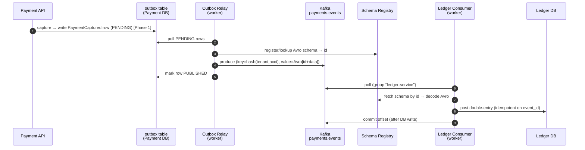
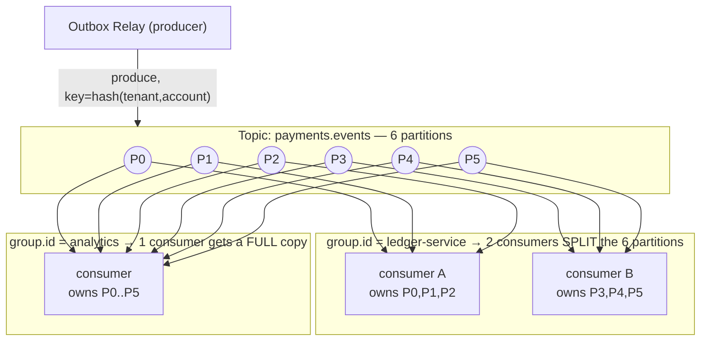
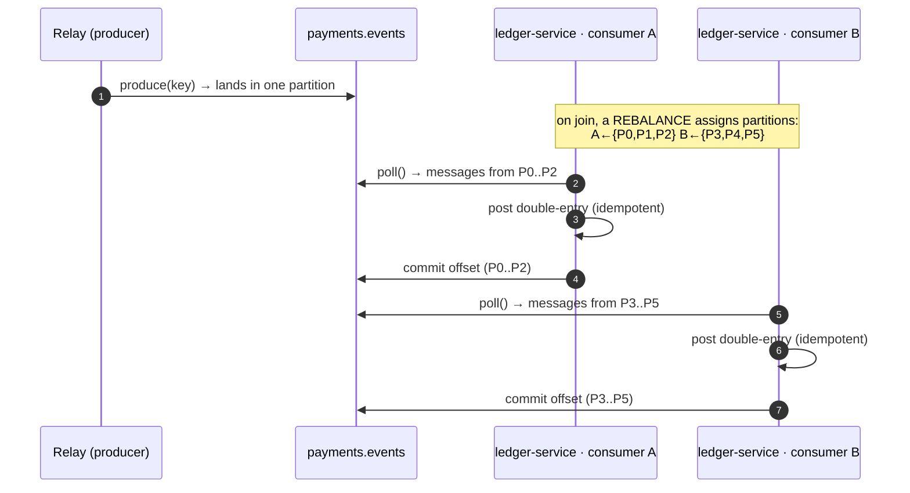

# Phase 2 — The Event Backbone + Ledger, explained from scratch

> **Who this is for:** you, after Phase 1. Phase 1 built the Payment service and
> wrote `PaymentCaptured` rows to an outbox table. **Phase 2 makes those events
> actually flow** — through Kafka — into a new **Ledger service** that records an
> immutable double-entry journal. Pattern deep-dives live in
> [`docs/concepts/`](concepts/); this is the tour of the code.

**What Phase 2 delivers:** Avro event contracts in the Schema Registry · a
topic-creation script · the **outbox relay worker** (Payment) that publishes
PENDING rows to Kafka · the **Ledger service** (own Django project + own Postgres)
with a **Kafka consumer worker** that posts an **idempotent, immutable double-entry
ledger** · a tenant-scoped balances/history read API · tests.

---

## Part 1 — The end-to-end flow (the whole point)



Payment says *"a payment happened"*; Kafka carries it; the Ledger decides *"what it
means for the money"* — completely decoupled.

---

## Part 2 — The shared Avro contract

- **`schemas/avro/payment_captured.avsc`** — the versioned event contract (a JSON
  file describing the fields). It's **shared** between the producer (Payment relay)
  and consumer (Ledger), which is why it lives at the repo root, not inside a
  service. Governed by **BACKWARD** compatibility in the registry. See
  [schema-evolution](concepts/schema-evolution-and-contracts.md) +
  [schema-registry](concepts/schema-registry.md).
- **`libs/shared/ledgerstream_shared/kafka.py`** — small shared helpers: env-driven
  bootstrap servers + Schema Registry URL, and `load_avro_schema()` which finds the
  `.avsc`. Installed via the `[kafka]` extra so non-Kafka services stay light.

---

## Part 3 — Creating the topics

- **`infra/kafka/create_topics.py`** — a standalone script that creates
  `payments.events`, `ledger.events` (6 partitions each) and the `*.dlq` topics (1
  partition, Phase 3), using the **AdminClient**. Auto-create is off on the broker
  on purpose, so partition counts are a **deliberate** choice, not accidental (see
  [Kafka §3 "broker vs topic config"](concepts/kafka.md)). Run once:
  ```bash
  python infra/kafka/create_topics.py
  ```

---

## Part 4 — The outbox relay worker (Payment producer side)

- **`services/payment/outbox/relay.py`** — the **second half** of the outbox
  pattern (the first half, the atomic write, was Phase 1). A **standalone worker
  process** (not the web cycle) that loops:
  1. read oldest PENDING outbox rows
  2. Avro-serialize each (schema auto-registered) and **produce** to its topic,
     keyed by `partition_key` (per-account ordering)
  3. after the broker acks, mark rows **PUBLISHED**
  It uses an **idempotent producer** (`enable.idempotence`, `acks=all`) and shuts
  down gracefully on SIGINT/SIGTERM. Semantics: **at-least-once** (a crash before
  marking PUBLISHED → re-publish → duplicate → consumers dedupe).
- **`.../management/commands/run_outbox_relay.py`** — runs it:
  ```bash
  python manage.py run_outbox_relay
  ```

Full concept: [outbox-pattern](concepts/outbox-pattern.md).

---

## Part 5 — The Ledger service (new Django project)

A second, independent service — its own project, own Postgres (`LEDGER_DATABASE_URL`).

```
services/ledger/
├── config/       settings (Ledger DB, stateless JWT), urls, wsgi
├── core/         health · correlation middleware · base models
│   └── authentication.py   ← STATELESS JWT (validates the shared-key token, no user DB)
├── ledger/       the double-entry domain: Account · JournalEntry · LedgerLine
│   ├── services.py         ← post_payment_captured (idempotent double-entry)
│   └── views.py            ← balances + transactions (read API)
├── consumer/     the Kafka worker
│   ├── worker.py           ← LedgerConsumer (poll → decode → post → commit)
│   └── management/commands/consume_payments.py
└── tests/
```

Key pieces:
- **`ledger/models.py`** — `Account` (with a normal-balance side), `JournalEntry`
  (UNIQUE `event_id` → idempotency), `LedgerLine` (a debit or credit). Append-only.
- **`ledger/services.py`** → `post_payment_captured(event)` — posts DEBIT CASH /
  CREDIT MERCHANT_PAYABLE in one transaction, asserts `debits == credits`, no-ops on
  a duplicate `event_id`. See [double-entry-ledger](concepts/double-entry-ledger.md).
- **`consumer/worker.py`** → `LedgerConsumer` — subscribes to `payments.events` in
  group `ledger-service`, decodes Avro (schema fetched from the registry by id),
  posts the entry, and **commits the offset only after** the DB write
  (at-least-once). Runs as a **standalone worker**, propagates the event's
  correlation id into its logs.
- **`core/authentication.py`** → `StatelessJWTAuthentication` — the Ledger validates
  JWTs signed with the **shared** `JWT_SIGNING_KEY` and reads `tenant_id` **without a
  user table** (it never issued the token). This is **service-to-service trust** —
  a downstream service trusting an upstream one's tokens statelessly.
- **`ledger/views.py`** — `/api/balances` (derived: `Σ debit − Σ credit` per
  account) and `/api/transactions` (history), tenant-scoped.

---

## Part 5.5 — Worker internals, explained (relay + consumer)

### Provenance: where did these files come from?
- **`schemas/avro/payment_captured.avsc`** is **hand-written** (the event contract).
  Avro schemas are always authored by hand; nothing generates them for you.
- **`infra/kafka/create_topics.py`** is a hand-written setup script. You **apply it
  by running it once** after Kafka is up:
  ```bash
  .venv/Scripts/python infra/kafka/create_topics.py
  ```
  It uses the Kafka **AdminClient** to create the topics; re-running is safe (it
  prints `exists` for topics already there).

### Graceful shutdown — `_install_signal_handlers()`
An OS asks a process to stop by sending a **signal**: **SIGINT** (you pressed
Ctrl+C) or **SIGTERM** (`kill`, or Kubernetes stopping the pod). By default those
**kill instantly** — which could interrupt the relay mid-publish. Instead we
register a handler that just flips a flag:

```python
def handler(signum, _frame):
    self._stop = True              # don't die now — ask the loop to finish
signal.signal(signal.SIGINT, handler)    # Ctrl+C
signal.signal(signal.SIGTERM, handler)   # kill / container stop
```

Now the `while not self._stop:` loop finishes its current cycle, **flushes**
in-flight messages, and exits cleanly. The `try/except` around SIGTERM is because
**Windows** doesn't fully support it. This is the "graceful shutdown" requirement
for a worker process.

> 🧊 The difference between yanking a worker's chair out (instant kill) and
> tapping their shoulder — "finish this one, then head home" (graceful).

### `poll()` timeouts — two different calls, same word
- **`consumer.poll(1.0)`** (Ledger worker): "wait up to **1 second** for a message;
  return `None` if none arrives." The timeout keeps the loop responsive — it checks
  `self._stop` at least once a second, so Ctrl+C takes effect within ~1s instead of
  hanging forever.
- **`producer.poll(0)`** (relay): does **not** fetch anything. `0` = don't block;
  just run any pending **delivery-report callbacks** for messages already sent. It's
  how the producer services its acks without waiting.

### The relay loop, step by step (`outbox/relay.py`)
- **`__init__`** builds two things once: an **AvroSerializer per event type** (it
  registers/looks up the schema id on first use), and an **idempotent Producer**
  (`enable.idempotence` dedupes *its own* retries; `acks="all"` waits for the broker
  + replicas).
- **`_build_value(row)`** turns an outbox DB row into the dict matching the Avro
  schema. `event_id = str(row.id)` is what the **consumer** dedupes on.
- **`run_once()`** — one cycle:
  1. read the oldest PENDING rows (`order_by("created_at")[:batch_size]`);
  2. for each: serialize to Avro bytes, `producer.produce(topic, key=partition_key,
     value=bytes, on_delivery=cb)`. The callback records the row id in `delivered`
     **only if the broker acked**;
  3. `producer.flush()` waits for all acks;
  4. **only** the `delivered` rows are marked PUBLISHED — a row that failed stays
     PENDING and is retried next cycle.
  > The key safety property: **mark PUBLISHED only after the broker confirms
  > delivery** → at-least-once, never lose an event.
- **`run()`** — the forever loop: install signal handlers, then call `run_once()`
  repeatedly. Published something? log + loop again immediately (drain fast).
  Nothing? `sleep(poll_interval)` so we don't hammer the DB. A transient error logs
  and retries instead of killing the worker. On `self._stop`, flush and exit.

---

## Part 5.6 — Consumer groups in action (see it live)

The rule (from [Kafka §6](concepts/kafka.md)): **within one group, partitions are
split** across consumers (work shared, each event handled once); **different
groups each get the full stream** (fan-out). Here's `payments.events` (6
partitions) read by two consumers in the `ledger-service` group *and* a separate
`analytics` group:



The **calls** each consumer makes (poll → process → commit), for the `ledger-service`
group split across A and B:



### Run it yourself — watch the split (two ready-made demos)

**Option 1 — one-shot proof** ([`scripts/demo_groups.py`](../scripts/demo_groups.py)):
creates 2 consumers in `demoA` + 1 in `demoB`, waits for the group to settle, and
prints who owns which partitions. Real output:

```
FINAL partition assignments:
  demoA/A1    partitions=[0, 1, 2]              (events seen: 3)
  demoA/A2    partitions=[3, 4, 5]              (events seen: 6)   ← same group → SPLIT
  demoB/B1    partitions=[0, 1, 2, 3, 4, 5]     (events seen: 9)   ← other group → FULL copy

demoA split disjoint?  A1 AND A2 overlap = []              (empty = split)
demoA covers all?      A1 OR  A2 union   = [0,1,2,3,4,5]
demoB full copy?       B1               = [0,1,2,3,4,5]
```
```bash
./.venv/Scripts/python scripts/demo_groups.py
```

**Option 2 — interactive, multi-terminal** ([`scripts/demo_consumer.py`](../scripts/demo_consumer.py)):
run each in its own terminal and watch the `ASSIGNED` logs + events live:

```bash
python scripts/demo_consumer.py --group groupA --id A1
```
```bash
python scripts/demo_consumer.py --group groupA --id A2   # same group → splits with A1
```
```bash
python scripts/demo_consumer.py --group groupB --id B1   # other group → gets everything
```

Kill one A-consumer (Ctrl-C) → the survivor logs a **REVOKED** then a new
**ASSIGNED** with all 6 partitions — a **rebalance**. Capture some payments (Part 6
/ `scripts/smoke.sh`) to push events through. The **real** ledger consumer also
logs its assignments — run `manage.py consume_payments` twice to see the same
split in the production path.

> A **second** group (e.g. an analytics service with `group.id="analytics"`) would
> receive **every** event independently — fan-out — without affecting the ledger
> group. That's how you add new reactions to `PaymentCaptured` with zero changes to
> the producer.

### In production — how these workers actually deploy

Locally we run `consume_payments` in a terminal (once, or twice for the split). In
production each consumer is its **own Kubernetes Deployment**, scaled by
**replicas**:

```
   LOCAL: run consume_payments N times   ⇄   PROD: Deployment replicas: N
   (same group.id → one consumer group → Kafka splits partitions across the pods)
```

**The rule:** *one Deployment per consumer job (group), scaled independently.* For
Ledgerstream:

| Deployment | reads | group.id | scale on |
|---|---|---|---|
| `ledger-consumer` | `payments.events` | `ledger-service` | its lag (DB-write bound) |
| `payment-saga-consumer` (Phase 3) | `ledger.events` | `payment-saga` | its lag |
| `analytics-consumer` (optional) | `payments.events` | `analytics` | usually 1 |

Each is the **same service image, a different command** (web = gunicorn, worker =
the consume command), and each scales on its own **consumer lag** (autoscaled with
KEDA), capped by the topic's partition count. A pod crash → Kafka rebalances to
survivors, k8s restarts it, no events lost (offsets commit after processing +
idempotent consumer).

> **Full, project-agnostic reference** (Deployment YAML, scaling, fan-out, fault
> tolerance, decision checklist): [Kafka §10.5 "Running & scaling consumers in
> production"](concepts/kafka.md). Encoded as real manifests in **Phase 7**.

---

## Part 6 — Hands-on: run the whole pipeline

**Prereqs:** Kafka up (`docker compose up -d --wait`), `.env` with real Neon URLs
for **both** `PAYMENT_DATABASE_URL` and `LEDGER_DATABASE_URL`, and
`KAFKA_BOOTSTRAP_SERVERS=localhost:29092` / `SCHEMA_REGISTRY_URL=http://localhost:8081`
(host addresses — native processes can't resolve the Docker names).

```bash
# 1. create the topics (once)
.venv/Scripts/python infra/kafka/create_topics.py
```
```bash
# 2. migrate the ledger DB (once)
cd services/ledger && ../../.venv/Scripts/python manage.py migrate
```
```bash
# 3. (Payment) capture a payment so there's an outbox row  — see docs/phase1.md
#    then run the relay to publish it:
cd services/payment && ../../.venv/Scripts/python manage.py run_outbox_relay
```
```bash
# 4. (Ledger, another terminal) consume events into the ledger:
cd services/ledger && ../../.venv/Scripts/python manage.py consume_payments
```
```bash
# 5. read the ledger (with a JWT scoped to your tenant):
curl localhost:8021/api/balances -H "Authorization: Bearer <token>"
```

Each worker is its **own process** — in production, its own Kubernetes Deployment
(same image, different command).

**Batch capture** (one request → many events → great for watching the pipeline):
```bash
curl -X POST localhost:8000/api/payments/capture \
  -H "Authorization: Bearer <ACCESS>" -H "Content-Type: application/json" \
  -d '{"payment_ids":["<id1>","<id2>","<id3>"]}'
```
Returns **207 Multi-Status** with per-item results (`captured` / `already_captured`
/ `not_found` / `invalid_state`) — partial success, so one bad id doesn't fail the
batch. Each captured payment emits its own `PaymentCaptured` event. The full flow
is scripted in [`scripts/smoke.sh`](../scripts/smoke.sh).

**Tests:**
```bash
docker compose --profile full up -d postgres-payment postgres-ledger
cd services/payment && ../../.venv/Scripts/python -m pytest    # 7 pass
cd services/ledger  && ../../.venv/Scripts/python -m pytest    # 4 pass
```

---

## Part 7 — ⚠️ Scaffolded — be ready to explain (may not fully grasp yet)

1. **At-least-once end-to-end** — the relay can double-publish and the consumer can
   redeliver; know *why that's OK* (idempotent consumer, UNIQUE `event_id`).
2. **The Avro wire format** — messages carry a 5-byte header (magic + schema id),
   not the schema; the consumer fetches the schema from the registry by id. See
   [schema-registry §3](concepts/schema-registry.md).
3. **Offset commit AFTER processing** — this is what makes it at-least-once (vs
   commit-before = at-most-once). Know the difference.
4. **Stateless JWT / service-to-service auth** — the Ledger trusts a token it didn't
   issue by verifying the shared-key signature, no user DB lookup.
5. **Partition key `hash(tenant, account)`** — per-account ordering without hot
   partitions; and why Kafka partition counts are hard to change (modulo). See
   [partitioning](concepts/partitioning-and-consistent-hashing.md).
6. **Consumer group `ledger-service`** — one group = one logical subscriber; scale
   by adding consumer processes (up to partition count).

---

## Part 8 — Mini-glossary (new terms this phase)

| Term | Plain meaning |
|---|---|
| Avro | Compact binary format for events; schema stored in the registry. |
| Schema Registry | Central store of event schemas + compatibility rules. |
| Producer / consumer | Writes events to Kafka / reads them. |
| Consumer group | A team of consumers sharing a `group.id`; one logical subscriber. |
| Offset | A consumer's position in a partition; committed = "processed up to here". |
| At-least-once | Never lose a message, but may deliver it twice → need idempotency. |
| Double-entry | Record each movement as equal debits + credits. |
| Journal entry / line | One balanced transaction / one debit-or-credit within it. |
| Append-only | Never update/delete; corrections are new reversing entries. |
| Stateless auth | Validate a token by signature + claims, no DB/user lookup. |

---

*Next: `docs/phase3.md` — saga hardening. The Ledger will emit `LedgerPosted` /
`LedgerRejected`; the Payment service consumes the outcome and **compensates** on
rejection; plus retries with backoff and dead-letter queues. That completes the
MVP.*
