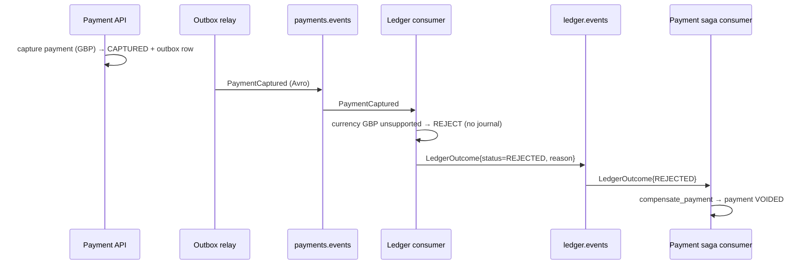
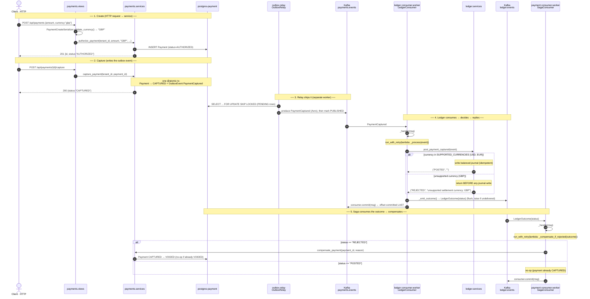
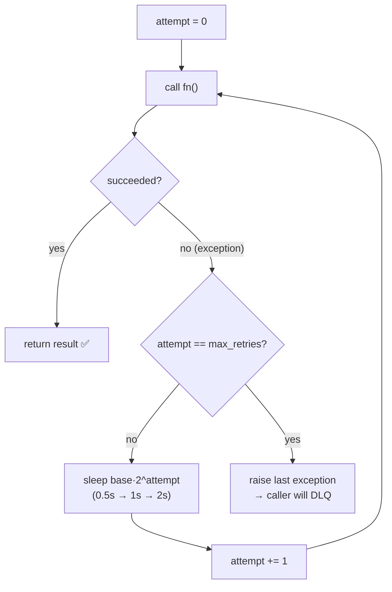
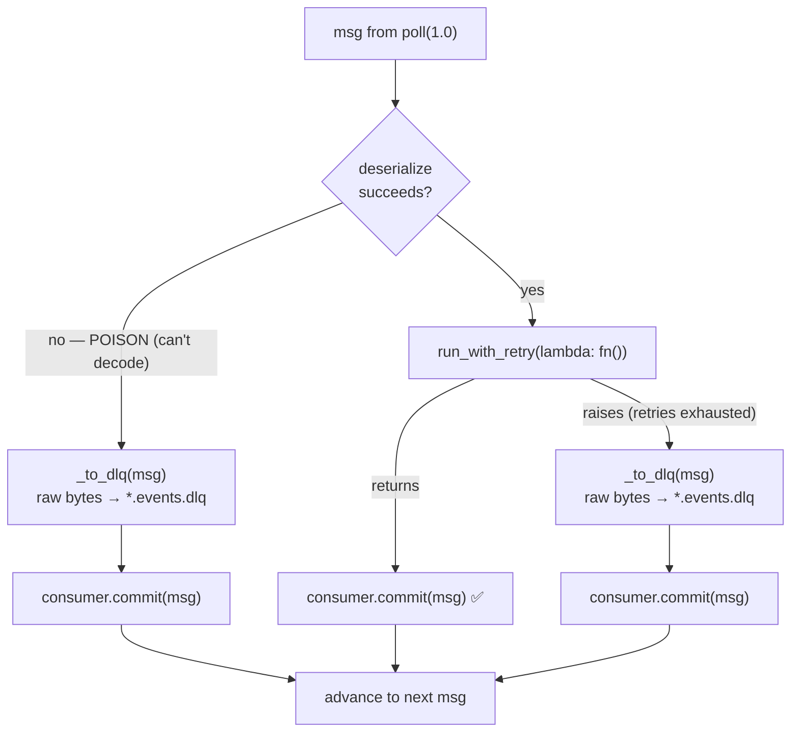

# Phase 3 — Saga Hardening (compensation + DLQ), explained from scratch

> **What Phase 3 adds, in one breath:** the *failure* half of the Payment→Ledger
> story. Until now the ledger always posted. Now the ledger can **reject** a
> payment (an unsupported settlement currency), it tells Payment by publishing a
> `LedgerOutcome` event, and Payment **undoes** the payment (VOID) — a **saga
> compensation**. And because real consumers meet messages they can't process, both
> consumers now **retry with backoff** and **dead-letter** poison messages so one
> bad event can't jam the pipeline.
>
> Read [concepts/saga-pattern.md](concepts/saga-pattern.md) and
> [concepts/dlq-and-retries.md](concepts/dlq-and-retries.md) alongside this — this
> file is the *code tour*; those are the *theory*.

If you read [docs/phase2.md](phase2.md) first, you already know the happy path
(capture → outbox → relay → Kafka → ledger posts → balances). Phase 3 bolts the
failure path onto that exact pipeline. No new infrastructure — same Kafka, same two
services — just new events and new logic.

---

## Part 1 — The end-to-end flow (the whole point)



The **happy path** is the same picture with `status=POSTED`: the ledger writes its
two-line journal (as in Phase 2), emits `LedgerOutcome{POSTED}`, and the saga
consumer sees POSTED and does **nothing** (the payment is already CAPTURED — there's
nothing to fix). The saga consumer only *acts* on the failure branch.

**Why does the ledger, not Payment, decide rejection?** Because the ledger is where
the settlement rule lives. Payment doesn't know which currencies the books support.
This is a microservice boundary: each service owns its own rules, and they
coordinate by events, not by one calling the other synchronously.

---

## Part 1.5 — Function-level call flow (every scenario)

Part 1 showed *services* passing *events*. This section zooms in to the **actual
functions** each event triggers, so you can trace any scenario end to end. Four
scenarios: **POSTED** (happy), **REJECTED** (compensation), **transient failure**
(retry), **poison** (DLQ).

### Scenarios 1 & 2 — POSTED vs REJECTED, function by function

Same call chain; the only fork is what `post_payment_captured` returns.



Read it as one chain from the wire to the end: **HTTP POST** → `PaymentListCreateView`
→ **authorize_payment** (AUTHORIZED); **HTTP POST /capture** → `PaymentCaptureView` →
**capture_payment** (CAPTURED + outbox row); **OutboxRelay.run_once** ships it to
`payments.events`; the ledger's **_handle → _process → post_payment_captured** decides
POSTED/REJECTED and **_emit_outcome** replies on `ledger.events`; the saga's **_handle →
_compensate_if_rejected** either calls **compensate_payment** (REJECTED → VOIDED) or
does nothing (POSTED). Every consumer commits its Kafka offset **after** its work.

### Scenarios 3 & 4 — what `run_with_retry` and `_handle` do on failure

Both `_process` (ledger) and `_compensate_if_rejected` (saga) run **inside**
`run_with_retry`. Here's that helper's own logic (Scenario 3 = the DB blip that
clears; the `raise` branch feeds Scenario 4):



And here's the **`_handle` wrapper that decides commit vs DLQ** — identical shape in
both consumers, only `fn` and the DLQ topic differ:



| Consumer | `fn` wrapped by `run_with_retry` | DLQ topic |
|---|---|---|
| Ledger (`LedgerConsumer`) | `_process` → `post_payment_captured` + `_emit_outcome` | `payments.events.dlq` |
| Payment saga (`SagaConsumer`) | `_compensate_if_rejected` → `compensate_payment` | `ledger.events.dlq` |

The three exits every message takes: **commit** (success), **retry→commit**
(transient, recovered), or **DLQ→commit** (poison or exhausted). There is no fourth
exit where a message silently vanishes or blocks forever — that's the property the
whole design guarantees.

---

## Part 2 — The new event contract: `LedgerOutcome`

`schemas/avro/ledger_outcome.avsc` is a brand-new Avro schema — the ledger's reply
to Payment. One event type carries **both** outcomes via a `status` field:

```
event_id       string            "outcome:<source event_id>"  ← deterministic → dedupe
occurred_at    long (millis)
correlation_id string  (default "")   ← carried from the original request
tenant_id      string
payment_id     string
status         string            "POSTED" | "REJECTED"
reason         string  (default "")   ← human-readable why, on rejection
```

Two design choices to be able to defend:

- **One event, not two** (`LedgerPosted` + `LedgerRejected`). A binary outcome is
  cleaner as one contract with a `status` than as two separate subjects to register
  and evolve. The saga consumer branches on the field.
- **Deterministic `event_id`.** We set it to `"outcome:" + <source event_id>`, not a
  fresh UUID. If the ledger redelivers and re-emits (at-least-once), the outcome
  carries the *same* id every time, so any downstream dedupe collapses the
  duplicates. (Same trick the ledger already uses to dedupe journals.)

Like every schema here, it auto-registers with the Schema Registry the first time
the ledger produces it — the consumer never needs a local copy (see
[concepts/schema-registry.md](concepts/schema-registry.md)).

---

## Part 3 — The Ledger rejects (business rule + outcome emission)

Two files change on the ledger side.

### 3a. `ledger/services.py` — `post_payment_captured` now returns `(status, reason)`

In Phase 2 this function returned `bool` (did it post?). Now it returns a
`tuple[str, str]` so the caller learns *what happened* and *why*:

```python
SUPPORTED_CURRENCIES = {"USD", "EUR"}    # ponytail: demo business rule

def post_payment_captured(event) -> tuple[str, str]:
    currency = event["currency"]
    if currency not in SUPPORTED_CURRENCIES:
        return "REJECTED", f"unsupported settlement currency: {currency}"
    # ... post the balanced double-entry, idempotently (as in Phase 2) ...
    return "POSTED", ""
```

The rejection check happens **before any journal is written** — so a rejected
payment leaves the ledger completely untouched (no reversing entry needed later).
Duplicate/ race cases still return `("POSTED", "")` because the journal already
exists — idempotent, same as before.

> `SUPPORTED_CURRENCIES` is a **demo** rule (marked `# ponytail`). Its job is to
> give us a *deterministic* reason to reject so the saga's failure path is
> demonstrable — not to be a real FX engine.

### 3b. `consumer/worker.py` — emit the outcome in the same unit

The Ledger consumer gains a **producer** (it's now both a consumer *and* a
producer — "consume-process-produce"). Per message it now:

```python
status, reason = post_payment_captured(event)   # POSTED or REJECTED
self._emit_outcome(event, status, reason)        # produce to ledger.events, confirm delivery
self.consumer.commit(msg)                         # commit the offset LAST
```

**Why no outbox here?** Phase 1 needed an outbox because the event originated from a
*non-replayable* API write — if the process died between the DB commit and the
Kafka publish, the event was lost forever. Here the source **is Kafka**, which is
**replayable**. So we don't need to durably stage the outcome; we just commit the
offset *last*:

- crash **before** `commit` → Kafka redelivers the original `PaymentCaptured` →
  `post_payment_captured` no-ops (journal already there) → `_emit_outcome` re-emits
  (same deterministic id) → converges.
- The outcome is only "forgotten" if we committed, and we commit only after a
  confirmed produce.

`_emit_outcome` produces the Avro outcome, `flush()`es, and **raises if delivery
failed** — so a failed publish leaves the offset uncommitted → redeliver → retry.
That's the whole durability argument, and it's why the ledger needs no outbox table.
(This is spelled out in [concepts/saga-pattern.md](concepts/saga-pattern.md) and the
consumer's own docstring.)

---

## Part 4 — Payment compensates: the saga consumer

### 4a. `payments/services.py` — `compensate_payment`

The compensating transaction. It's tiny and **idempotent by state**:

```python
@transaction.atomic
def compensate_payment(*, payment_id, reason="") -> bool:
    payment = Payment.objects.select_for_update().filter(id=payment_id).first()
    if payment is None or payment.status == Payment.Status.VOIDED:
        return False                       # unknown or already voided → no-op
    payment.status = Payment.Status.VOIDED
    payment.save(update_fields=["status", "updated_at"])
    return True
```

- `select_for_update()` locks the row so two concurrent rejections can't both act.
- The `already VOIDED → return False` guard is what makes redelivery safe: **the
  payment row itself is the dedupe key**, so we need no separate "have I processed
  this outcome?" table. This is *state-based idempotency*.

### 4b. `consumer/worker.py` — a second consumer, in a second group

A whole new standalone worker, `SagaConsumer`, in a new `consumer` Django app inside
the Payment service. It's a mirror of the ledger consumer's shape (poll loop,
graceful shutdown, offset-commit-after-processing) but:

- subscribes to `ledger.events`, group `payment-saga` (a **different group** from the
  ledger's, so it gets its own copy of the stream),
- on `status == "REJECTED"` calls `compensate_payment`; on POSTED it's a no-op,
- has **no producer for outcomes** (it's a terminal step) — only a DLQ producer.

It's wired to a management command so it runs as its own process:

```bash
python manage.py consume_ledger_outcomes
```

(That command, plus the empty `consumer/__init__.py` app files, plus adding
`"consumer"` to `INSTALLED_APPS` in `config/settings.py`, is all the plumbing a new
Django app needs.)

---

## Part 5 — Resilience: retry + backoff → DLQ (both consumers)

Real consumers meet messages they can't process. Phase 3 adds the standard defense.
See [concepts/dlq-and-retries.md](concepts/dlq-and-retries.md) for the full theory;
here's the code.

### 5a. The shared helper — `libs/shared/ledgerstream_shared/kafka.py`

```python
def run_with_retry(fn, *, max_retries=3, base_delay=0.5):
    for attempt in range(max_retries + 1):       # +1: first try isn't a "retry"
        try:
            return fn()
        except Exception:
            if attempt == max_retries:
                raise                             # exhausted → caller DLQs
            time.sleep(base_delay * (2 ** attempt))   # 0.5s, 1s, 2s
```

Exponential backoff (not a tight loop) so a struggling DB gets room to recover
instead of a retry storm. It **re-raises** when the budget is spent — it doesn't
swallow the error — so the *caller* decides what to do next (DLQ).

### 5b. Both consumers wrap processing + DLQ on failure

The `_handle` in each consumer now has the same shape:

```python
try:
    event = deserialize(msg)                 # poison decode? → straight to DLQ
except Exception:
    self._to_dlq(msg); self.consumer.commit(msg); return

try:
    run_with_retry(lambda: self._process(event))
    self.consumer.commit(msg)                # success → advance
except Exception:                            # retries exhausted
    self._to_dlq(msg)                        # park the RAW bytes
    self.consumer.commit(msg)                # commit so the poison can't block us
```

`_to_dlq` produces the **raw original bytes** to `payments.events.dlq` (ledger side)
or `ledger.events.dlq` (saga side) and flushes. Raw bytes because (a) a poison
message may be undecodable, and (b) raw bytes are replayable verbatim once the bug is
fixed. The DLQ topics already exist (1 partition each — declared in
`infra/kafka/create_topics.py`).

> The honest trade-off: DLQ-ing on exhaustion means a valid event caught in a long
> DB outage is skipped until someone replays the DLQ. Correct **only with**
> DLQ-depth alerting + a redrive tool (production follow-ups). The alternative —
> block forever until the DB heals — trades availability the other way. Named in
> `dlq-and-retries.md §4`.

Because retries re-run the whole unit, **both handlers must be idempotent** — and
they are (ledger dedupes on `event_id`, saga on payment state). Retry safety *is*
idempotency.

---

## Part 6 — Hands-on: run the failure path yourself

Four terminals (all workers are standalone processes, never the web cycle). Assumes
the Kafka stack is up (`docker compose up -d kafka schema-registry`) and topics
exist (`python infra/kafka/create_topics.py`).

```bash
# Terminal 1 — Payment API
cd services/payment && python manage.py runserver

# Terminal 2 — outbox relay (Payment → payments.events)
cd services/payment && python manage.py run_outbox_relay

# Terminal 3 — Ledger consumer (posts/rejects, emits LedgerOutcome)
cd services/ledger && python manage.py consume_payments

# Terminal 4 — Payment saga consumer (compensates on REJECTED)  ← NEW in Phase 3
cd services/payment && python manage.py consume_ledger_outcomes
```

Now create and capture a **GBP** payment (unsupported → will be rejected). Using the
API needs a JWT (see [docs/phase1.md](phase1.md)); the one-liner below uses the ORM
to make the demo self-contained. Then watch:

- Terminal 3 logs `emitted LedgerOutcome … status REJECTED` and posts **no journal**.
- Terminal 4 logs `payment compensated (ledger rejected)`.
- The payment ends in **VOIDED**.

A capture with **USD** instead runs the happy path: a journal is posted, the outcome
is POSTED, and the saga consumer no-ops (payment stays CAPTURED).

> `scripts/smoke.sh` **step 9** drives exactly this over the real HTTP APIs: it
> captures a GBP payment and polls until it flips to VOIDED (with all four workers
> running).

---

## Part 7 — Tests (what proves it works)

- **Ledger** (`services/ledger/tests/test_ledger.py`):
  `test_unsupported_currency_is_rejected_without_a_journal` — a GBP event returns
  `REJECTED`, `"GBP"` in the reason, and **no** `JournalEntry` exists. (Plus the
  existing balanced-double-entry and idempotency tests, updated for the new
  `(status, reason)` return.)
- **Payment** (`services/payment/tests/test_saga.py`):
  `compensate_payment` voids a CAPTURED payment (returns True), and a second call
  finds it already VOIDED and no-ops (returns False) — proving state-based
  idempotency.
- **Shared** (`libs/shared/tests/test_retry.py`): `run_with_retry` returns on first
  success, retries then succeeds, and re-raises after exhausting the budget (with
  the right number of attempts).
- **Live**: verified end-to-end against Neon + real Kafka — GBP payment →
  captured → rejected → compensated to **VOIDED**.

---

## Part 8 — ⚠️ Scaffolded — be ready to explain (may not fully grasp yet)

- **Why the Ledger needs no outbox but the Payment API did.** Replayable source
  (Kafka) vs non-replayable (an API write). Commit-offset-last + idempotency gives
  the outbox's guarantee for free.
- **Consume-process-produce.** One worker that reads from one topic and writes to
  another, committing the read offset only after the write is confirmed.
- **State-based idempotency vs a dedupe table.** The payment's own status is the
  dedupe key; no inbox table needed.
- **Poison messages & head-of-line blocking.** Why one undecodable message stalls a
  whole partition, and how DLQ+commit frees it.
- **Exponential backoff + jitter.** Why a tight retry loop is a self-inflicted DDoS.

---

## Part 9 — Mini-glossary (new terms this phase)

| Term | Meaning |
|---|---|
| **Saga** | A multi-service workflow made of local transactions, each with a **compensating** transaction for the failure path. No distributed ACID. |
| **Compensation** | A *new committed* transaction that offsets an already-committed one (VOID the payment). Not a rollback. |
| **Consume-process-produce** | A worker that reads from Kafka, does work, and produces a new event — committing the read offset last. |
| **Poison message** | A message that fails deterministically on every redelivery (bad bytes, always-throwing payload). |
| **DLQ (dead-letter queue)** | A side topic where un-processable messages are parked (raw bytes) so they don't block the partition, for later inspection/replay. |
| **Exponential backoff** | Waiting `base·2^n` between retries so a struggling dependency can recover. |
| **State-based idempotency** | Using the entity's own state (already VOIDED) as the dedupe check, instead of a separate processed-ids table. |
