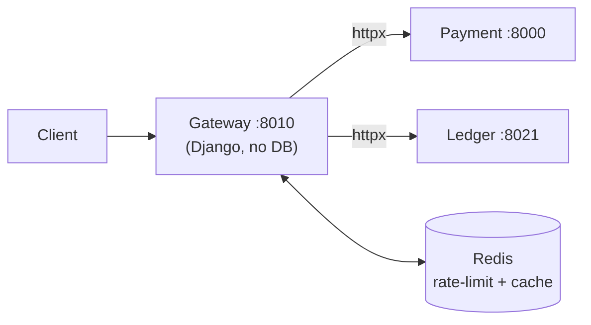
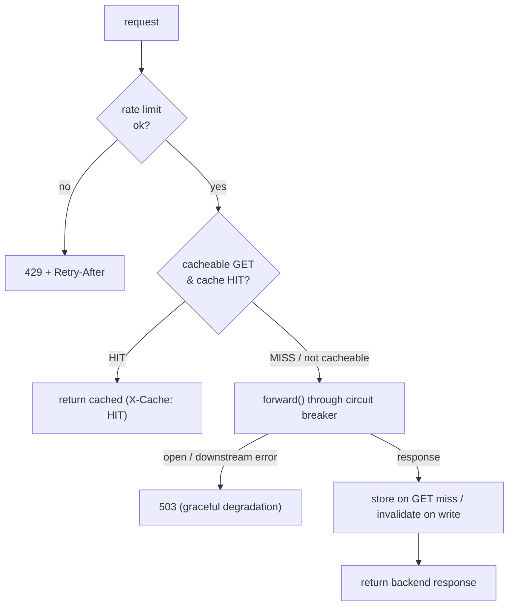
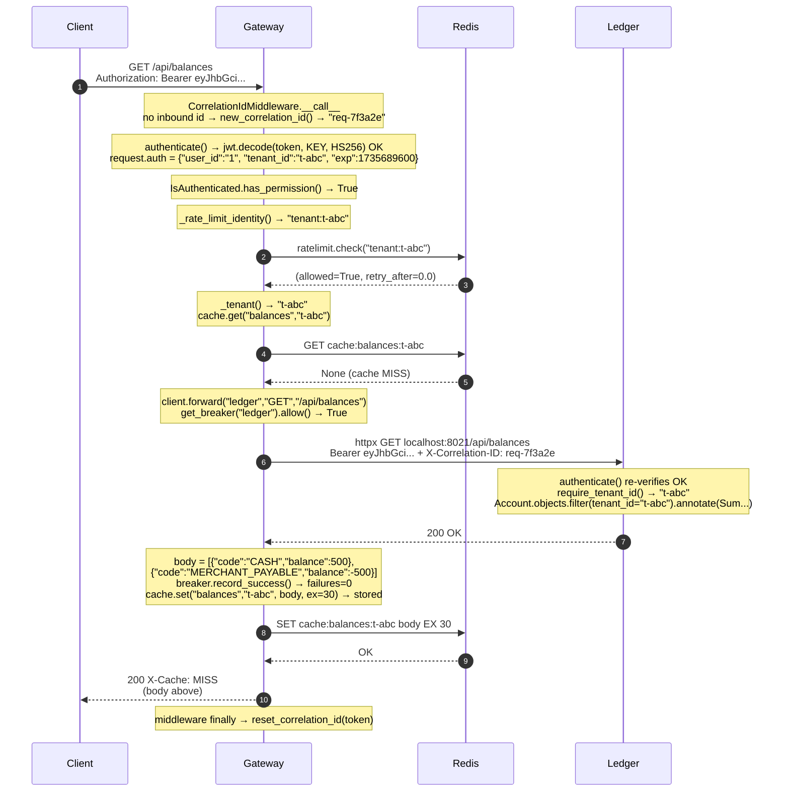
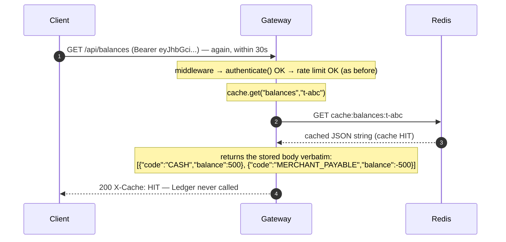

# Phase 4 — API Gateway + Resilience, explained from scratch

> **What Phase 4 adds:** a new **gateway** service — the single public front door —
> that authenticates once at the edge and reverse-proxies to Payment/Ledger, with
> four production resilience patterns layered on: **rate limiting**, **cache-aside**,
> a **circuit breaker**, and **cursor pagination**.
>
> Read the four concept docs alongside this file — this is the *code tour*, they are
> the *theory*: [rate-limiting](concepts/rate-limiting.md),
> [caching-and-invalidation](concepts/caching-and-invalidation.md),
> [circuit-breakers](concepts/circuit-breakers.md),
> [cursor-pagination](concepts/cursor-pagination.md).

Until now clients talked to Payment and Ledger directly. Phase 4 puts a **gateway**
in front: one entry point that owns cross-cutting concerns (auth, rate limits, caching,
resilience) so the backends don't each reinvent them.

---

## Part 1 — The shape: a stateless gateway



The gateway is a **new Django project** (`services/gateway`) built like Payment/Ledger,
with one deliberate difference: **it owns no database.** `config/settings.py` sets
`DATABASES = {}`. It's a stateless request router — its only backing store is **Redis**
(rate-limit counters + cache). That's an architectural statement: a gateway holds no
business state, so giving it a Postgres would be wrong. Its readiness probe checks
**Redis**, not a DB, and deliberately **not** the downstreams (a gateway must stay
"ready" even when a backend is down — that's the breaker's job, not readiness's).

**Edge authentication.** (New to how JWT auth works, or what a "tenant" is? Read
[authentication-and-jwt.md](concepts/authentication-and-jwt.md) first — the whole flow
from login to tenant scoping, from scratch.) The gateway validates the JWT itself (`core/authentication.py`,
the same stateless `StatelessJWTAuthentication` the Ledger uses — verify the shared-key
signature, read `tenant_id`, no user lookup). Protected routes require a valid token
*before* any backend is called; `/api/auth/*` (login) is public so clients can obtain a
token. The backends still validate the token too — defense in depth.

---

## Part 2 — The reverse proxy (Chunk 1)

One view class, `gateway/views.py::ProxyView`, handles every route. Each URL pattern
configures it (`gateway/urls.py`):

```python
re_path(r"^api/auth/",     ProxyView.as_view(service="payment", public=True)),
re_path(r"^api/payments",  ProxyView.as_view(service="payment", invalidates=("balances",))),
re_path(r"^api/balances",  ProxyView.as_view(service="ledger", cache_name="balances")),
re_path(r"^api/transactions", ProxyView.as_view(service="ledger")),
```

The gateway **mirrors the backends' URL scheme**, so the downstream path is just
`request.path` forwarded unchanged. `gateway/client.py::forward()` is a thin, transparent
forwarder over `httpx`: it copies the method, path, query, body, and a small header
allowlist (Authorization, Content-Type, Idempotency-Key) and **carries the correlation
id** across the hop — so one request keeps one id through the gateway → backend.

Every request flows through `_proxy()` in this order:



---

## Part 2.5 — One request, function by function (start → end)

This traces `GET /api/balances` from the wire to the response and back, naming the
**actual functions** at each step — auth, rate limit, cache, breaker, proxy, and the
backend's re-auth + tenant scoping. (`file:function` in the margin of your head:
`core/middleware.py`, `core/authentication.py`, `gateway/views.py`, `gateway/ratelimit.py`,
`gateway/cache.py`, `gateway/client.py`, `gateway/breaker.py`, then `ledger/views.py`.)



**The very next identical request (within 30s) short-circuits at the cache:**



**The three ways `_proxy()` short-circuits (which function raises what):**

| Condition | Function that trips it | Result |
|---|---|---|
| over rate budget | `_enforce_rate_limit()` → `ratelimit.check()` returns `(False, …)` → `raise Throttled` | **429** + `Retry-After` (no forward) |
| circuit already open | `client.forward()` → `get_breaker().allow()` is False → `raise CircuitOpen` | **503** (backend never called) |
| downstream down/slow | `client.forward()` → `httpx.RequestError` → `record_failure()` → `raise DownstreamError` | **503** (and a failure counted toward tripping) |
| write (capture) | after a 2xx, `_proxy()` → `cache.invalidate("balances", tenant)` | next balances read is a MISS |

So the "verify signature + exp, read tenant_id" line is really the chain
`authenticate() → get_validated_token() → AccessToken() → TokenBackend.decode() →
jwt.decode()` (the HMAC recompute + `exp` check), after which `require_tenant_id()`
just reads the now-trusted `tenant_id` claim.

---

## Part 3 — Rate limiting (Chunk 2)

`gateway/ratelimit.py` — a **token bucket in Redis**, run as an **atomic Lua script**.
Why Lua: the check is read-refill-spend, and doing that as separate commands races
(two requests both spend the "last" token). Redis runs the script atomically, so it's
one indivisible, single-round-trip step.

- Keyed **per tenant** for authenticated traffic (`tenant:<id>`), **per IP** for
  anonymous login traffic (`ip:<addr>` — brute-force protection).
- `capacity` = burst, `refill_per_sec` = sustained rate (60 + 1/s ≈ 60/min).
- Over budget → DRF `Throttled` → **`429` + `Retry-After`** (cooperative backpressure).
- Shared Redis state → the limit holds across *all* gateway replicas (an in-memory
  limiter would let N replicas allow N× the limit).

Full theory: [rate-limiting.md](concepts/rate-limiting.md).

---

## Part 4 — Cache-aside (Chunk 3)

`gateway/cache.py` — balances are a **hot, derived read**, so the gateway caches them
per tenant in Redis (`cache:balances:<tenant>`):

- **GET** balances → cache **HIT** returns instantly (`X-Cache: HIT`) without touching
  the ledger; **MISS** forwards, stores the body with a TTL (`CACHE_TTL`, 30s), returns
  (`X-Cache: MISS`).
- **Write** to payments (a capture changes balances) → **invalidate** the tenant's
  balances key so the next read re-fetches. TTL (bounded staleness) + delete-on-write
  (tight freshness) together — the standard combo.
- Keyed by tenant so no cross-tenant leakage.

Honest caveat: balances are themselves eventually consistent (the ledger consumer posts
them off Kafka), so invalidation guarantees a fresh *read of the ledger*, not that the
just-captured payment is already posted. Full theory:
[caching-and-invalidation.md](concepts/caching-and-invalidation.md).

---

## Part 5 — Circuit breaker (Chunk 4)

`gateway/breaker.py` — a hand-rolled, **per-service** breaker (one for Payment, one for
Ledger) wrapping `client.forward()`:

- **CLOSED** → calls pass, count consecutive failures; threshold → **OPEN**.
- **OPEN** → **fail fast** (don't call the backend) for `BREAKER_COOLDOWN` seconds.
- **HALF-OPEN** → one probe; success → CLOSED, failure → OPEN again.
- Connection errors/timeouts and **5xx** count as failures; a **4xx does not** (client's
  fault, not the backend's — it mustn't trip the breaker).
- When open or failing, the gateway **degrades gracefully**: a clean
  `503 {"detail": "… temporarily unavailable"}`, never a 30s hang or a stack trace.

State is in-process per gateway instance — the standard design (a breaker reacts to what
*this* instance sees). Full theory: [circuit-breakers.md](concepts/circuit-breakers.md).

---

## Part 6 — Cursor pagination (Chunk 5)

This one lives in the **backend** (the gateway just forwards `?cursor=`). The Ledger's
transaction history (`GET /api/transactions`) now uses DRF **`CursorPagination`**
(`ledger/views.py::TransactionCursorPagination`, ordered `-created_at`, page size 25).

The append-only journal is the textbook case for keyset pagination: large, growing at
the head, read newest-first — exactly where `OFFSET` pagination would re-serve rows as
new entries arrive. The response is `{next, previous, results}` with opaque cursors, and
each page is an **indexed seek** (`WHERE created_at < cursor`) — flat cost regardless of
depth. Full theory: [cursor-pagination.md](concepts/cursor-pagination.md).

---

## Part 7 — Tests (what proves it works)

All gateway tests are **hermetic** — no Docker, no live backends. Downstreams are mocked
(`gateway.client.forward`), Redis is `fakeredis` (in-memory, Lua-capable), the breaker is
in-memory.

- `tests/test_gateway.py` — edge auth rejects no-token (401, backend never called); valid
  token proxies to the right service; auth route is public.
- `tests/test_ratelimit.py` — 429 + Retry-After when over limit; the **real token-bucket
  Lua** run against fakeredis (3-burst then blocked).
- `tests/test_cache.py` — HIT is served without touching the backend; a write invalidates.
- `tests/test_breaker.py` — the state machine (open → half-open → close, and probe-fail
  reopens); downstream error and open circuit both become 503.

**12 gateway tests pass.** The token bucket was additionally verified live against the
real **Upstash** Redis. (The Ledger cursor-pagination change is covered by `manage.py
check`; its DB-backed test runs when local Postgres is up.)

---

## Part 8 — Run it yourself

The gateway is a native process like the others (port **8010**):

```bash
# backends (each in its own terminal)
cd services/payment && python manage.py runserver 127.0.0.1:8000
cd services/ledger  && python manage.py runserver 127.0.0.1:8021
# the gateway
cd services/gateway && python manage.py runserver 127.0.0.1:8010
```

Then drive everything **through the gateway** with **`scripts/smoke_gateway.sh`**:
login → create/capture → balances (watch `X-Cache: MISS` then `HIT`) → cursor-paginated
transactions → the GBP saga (auto-VOID) → a rate-limit burst (200s then `429`s). Rate
limits, caching, and the breaker all apply at the edge. Redis is your Upstash instance
(`REDIS_URL` uses `rediss://` — Upstash is TLS-only).

```bash
bash scripts/smoke_gateway.sh
```

---

## Part 9 — ⚠️ Scaffolded — be ready to explain

- **Why the gateway has no database.** Stateless router; state lives in the services +
  Redis. `DATABASES = {}` makes it explicit.
- **Edge auth + defense in depth.** The gateway validates the JWT *and* the backends do
  too; the shared signing key is the trust anchor.
- **Why the rate-limit check is a Lua script.** Atomic read-refill-spend; separate
  GET/SET would race.
- **Why readiness doesn't check downstreams.** A gateway must stay in the load-balancer
  even when a backend is down — routing to a dead backend is the breaker's job.
- **In-process breaker state.** Per-instance is standard; a shared breaker adds
  coordination cost rarely worth paying.

---

## Part 10 — Mini-glossary (new terms this phase)

| Term | Meaning |
|---|---|
| **API gateway / BFF** | A single entry point in front of several services that owns cross-cutting concerns (auth, rate limit, routing). |
| **Token bucket** | A rate-limit algorithm: a bucket of tokens refills at a fixed rate; each request spends one; empty → reject. |
| **Cache-aside** | App checks the cache; miss → fetch source, store, return; hit → return cached. |
| **Invalidation** | Removing a cached entry when the underlying data changes, so reads don't go stale. |
| **Circuit breaker** | A guard that stops calling a failing dependency (open), then probes to recover (half-open). |
| **Graceful degradation** | Returning a fallback/partial/fast-error response when a dependency is down, instead of hanging. |
| **Cursor / keyset pagination** | Paging by the last row's sort value (`WHERE col < cursor`) instead of `OFFSET` — fast and stable. |
| **Backpressure** | Signalling callers to slow down (429/503) rather than accepting more work than you can handle. |
