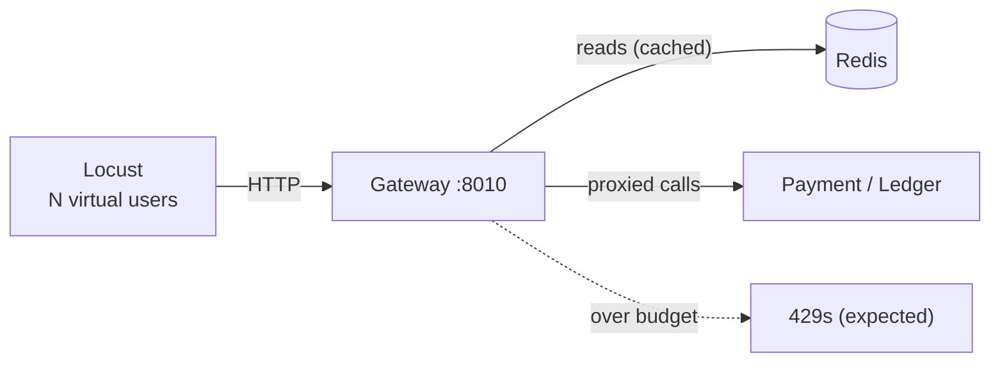

# Phase 5 — Proof, Seed & Load, explained from scratch

> **What Phase 5 adds:** the tools to *demonstrate the system holds up* — a **seed**
> command to fill it with realistic data, **proof tests** that assert the ledger's
> invariants over random data, and a **Locust load test** that pushes traffic through
> the gateway to find the limits and watch the resilience patterns work.
>
> No new services — this phase is about **evidence**: correctness proofs and performance
> numbers. Theory: [load-testing-and-performance.md](concepts/load-testing-and-performance.md).

---

## Part 1 — Seed (`services/payment/payments/management/commands/seed.py`)

You can't demo or load-test an empty system. `seed` creates the data:

```bash
cd services/payment
python manage.py seed --tenants 5 --payments 100 --capture
```

- Creates N tenants, each with one OWNER user (`load0`…`load4`, password
  `loadtestpw123`) — reusing existing ones (`get_or_create`), so it's safe to re-run.
- Authorizes `--payments` payments per tenant with **stable Idempotency-Keys**
  (`seed-<tenant>-<i>`), so re-running **tops up** instead of duplicating.
- With `--capture`, it also captures each one → writes the `PaymentCaptured` outbox
  event → (with the relay + consumer running) the ledger fills with balances/history.
- Prints the exact `locust` command with the right creds.

It reuses the real business logic (`authorize_payment` / `capture_payment`), so seeded
data goes through the *same* idempotent, outbox-writing path as real traffic — not a
backdoor `INSERT`.

---

## Part 2 — Proof tests (`services/ledger/tests/test_invariants.py`)

"Proof" = assert the guarantees that must hold **no matter the data**, over many random
inputs (a lightweight property test — no new dependency):

```python
for _ in range(50):
    amount = random.randint(1, 1_000_000)
    post_payment_captured(make_event(amount_minor=amount, currency="USD"))

# Invariant 1: every journal entry is internally balanced (debits == credits).
# Invariant 2: the TRIAL BALANCE — across ALL lines, total debits == total credits
#              == money posted. Every unit is both a debit and a credit → the book
#              nets to zero. If this fails, money was created or destroyed.
```

Plus an **idempotency proof**: replaying the same 10 events a second time leaves the
line count unchanged (at-least-once delivery can't double-post). These join the existing
per-phase tests (balanced double-entry, saga compensation, tenant isolation, rate-limit
bucket, breaker state machine) as the correctness evidence for the whole platform.

> These are DB-backed (they post real journals), so they run with the ledger's test
> Postgres up — same as the rest of `services/ledger/tests`.

---

## Part 3 — Load test (`loadtest/locustfile.py`)

A [Locust](https://locust.io) script that simulates users hitting the **gateway**:

- **`on_start`** logs each simulated user in once and reuses the token.
- **Weighted tasks** (reads ≫ writes, realistic): `GET /balances` (×5, exercises the
  cache), `GET /transactions` (×3, cursor-paginated), `POST /payments` + capture (×1,
  the write path).
- **`429`s are counted as EXPECTED** (`catch_response` → `success()`): under load the
  token bucket *should* shed traffic — that's the limiter working, not a failure.
- Load is **spread across tenants** (each Locust user picks `load{0..USERS-1}` at random)
  because the gateway rate-limits **per tenant** — one tenant would cap at the bucket
  rate and hide real throughput.

```bash
pip install -r loadtest/requirements.txt
cd services/payment && python manage.py seed --tenants 5 --payments 100 --capture && cd ../..
USERS=5 locust -f loadtest/locustfile.py -H http://localhost:8010
# open http://localhost:8089 → set users + spawn rate → watch RPS + p95/p99
```

### What the run teaches you



- **RPS + p95/p99 latency** → the system's capacity and where the **knee** is.
- **`429` rate** → the rate limiter shedding load (raise `RATE_LIMIT_CAPACITY` or add
  tenants to measure raw throughput).
- **`X-Cache` hit ratio** → the balances cache absorbing reads.
- **Consumer lag** → how far the ledger trails the write load (the async-system signal
  you watch instead of just HTTP latency).

Full method — percentiles vs averages, the knee, open vs closed models, finding the
bottleneck: [load-testing-and-performance.md](concepts/load-testing-and-performance.md).

---

## Part 4 — ⚠️ Run against full-local infra, not cloud free tiers

Hammering Neon/Upstash/Atlas free tiers hits **their** throttles — you'd be measuring the
free tier, not your architecture (and possibly running up usage). Load tests belong on
dedicated/full-local infra. The seed + proof tests are fine against any DB; only the
*load* step needs isolated infra to give honest numbers.

---

## Part 5 — Mini-glossary (new terms this phase)

| Term | Meaning |
|---|---|
| **Seed data** | Synthetic-but-realistic data loaded so the system can be demoed/tested. |
| **Property test** | A test that asserts an invariant over many random inputs, not one fixed case. |
| **Trial balance** | The accounting check that total debits == total credits across the book (nets to zero). |
| **Throughput (RPS)** | Requests completed per second. |
| **Latency percentile (p95/p99)** | The value below which 95%/99% of request latencies fall — the tail. |
| **The knee / saturation** | The load where a resource maxes out; capacity beyond which latency spikes. |
| **Consumer lag** | How far a Kafka consumer trails the latest produced offset — the async health signal. |
| **Open vs closed model** | Fixed arrival rate vs fixed concurrent users — the two ways to generate load. |
